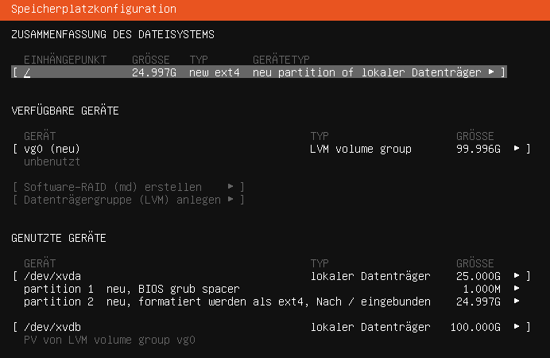
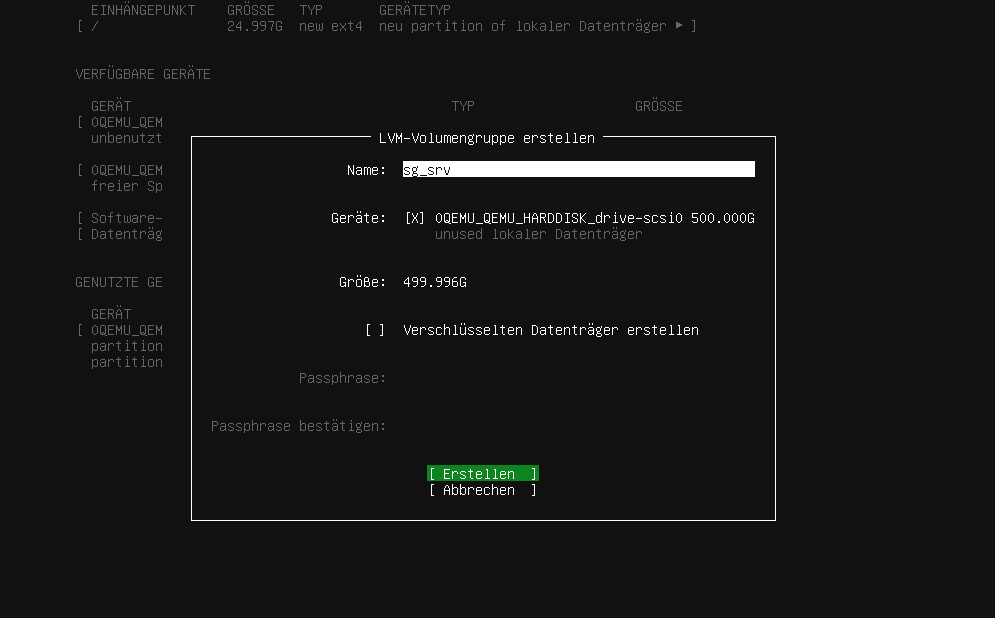
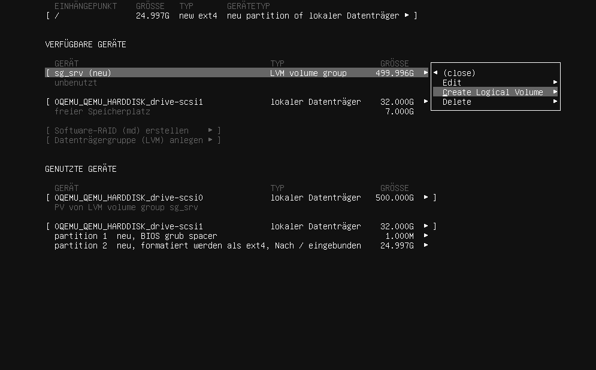
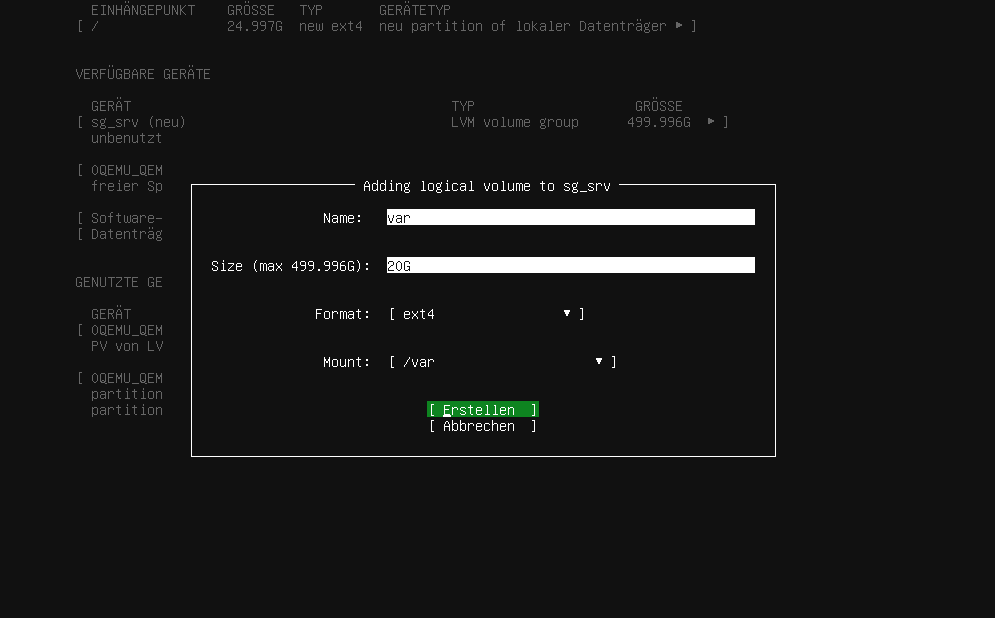
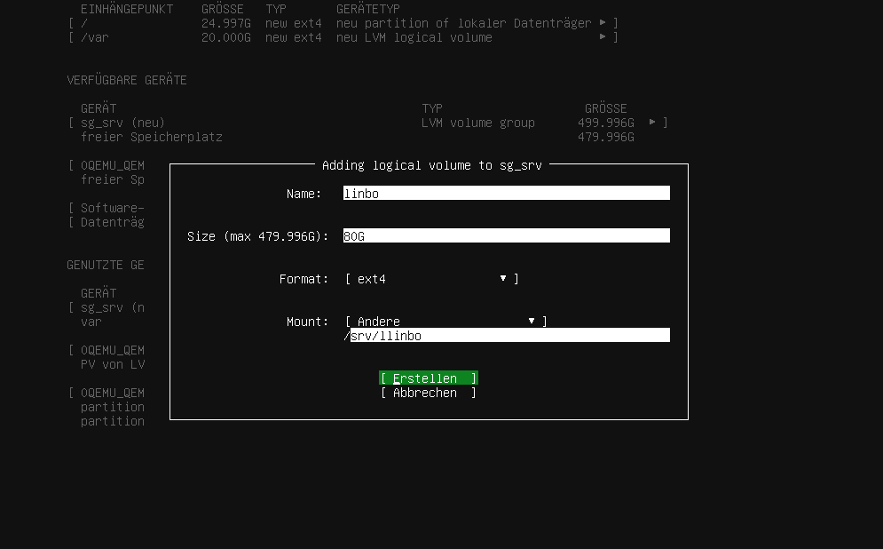
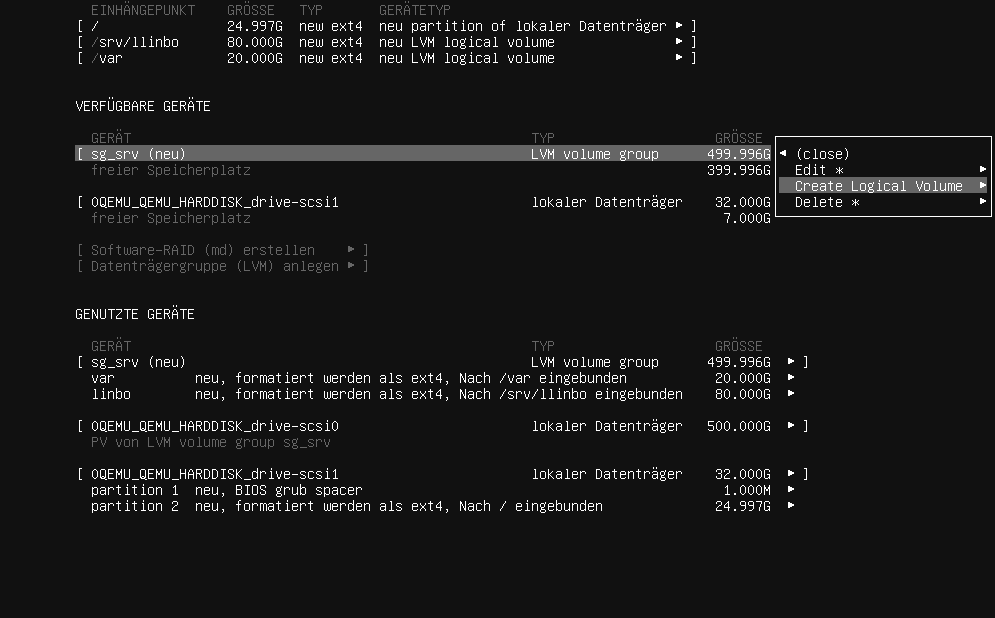
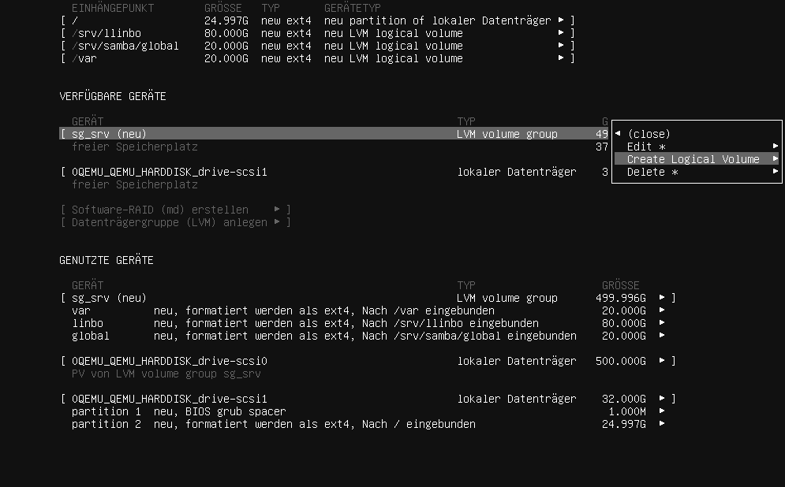
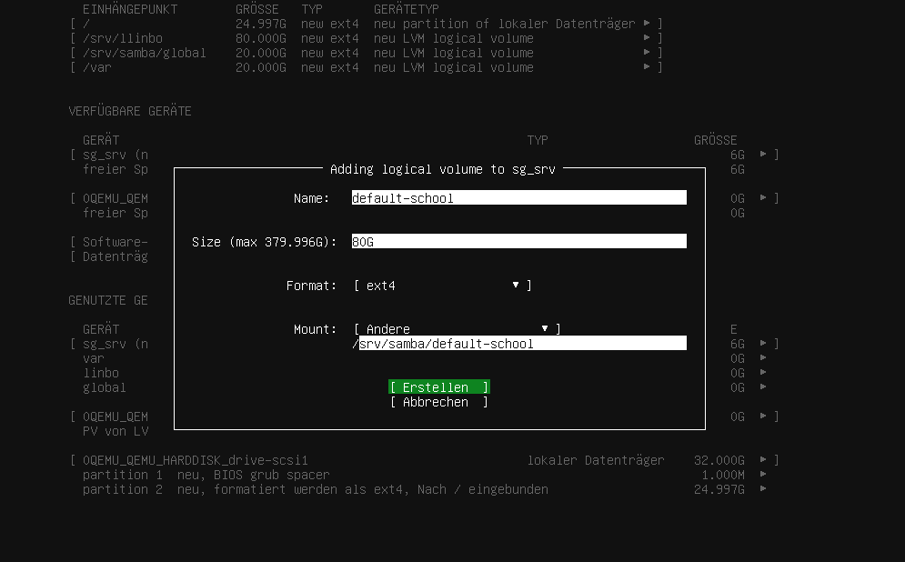
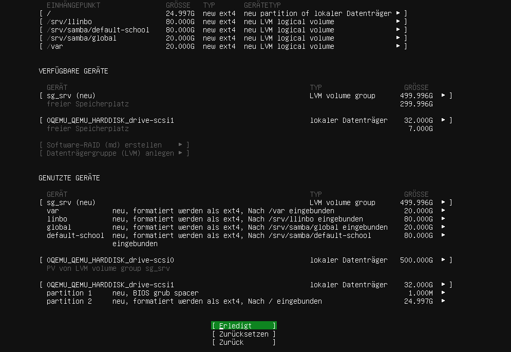
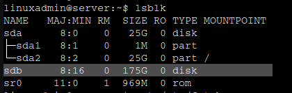

.. |zB| unicode:: z. U+00A0 B. .. Zum Beispiel 
  
.. |ua| unicode:: u. U+00A0 a. .. und andere

.. |_| unicode:: U+202F .. geschütztes Leerzeichen
   :trim:

.. |...| unicode:: U+2026 .. Auslassungszeichen

.. |copy| unicode:: 0xA9 .. Copyright-Zeichen
   :ltrim:

.. |reg| unicode:: U+00AE .. Trademark
   :ltrim:

.. include:: /guided-inst.subst

.. _basis_server-label:

Bist du zuvor der Anleitung "Proxmox vorbereiten" gefolgt, dann kannst du fortfahren mit `Erster Start des Servers vom Installationsmedium`_.

====================================
Anlegen und Installieren des Servers
====================================

.. sectionauthor:: `@rettich <https://ask.linuxmuster.net/u/rettich>`_,
                   `@cweikl <https://ask.linuxmuster.net/u/cweikl>`_
                   `@MachtDochNiX <https://ask.linuxmuster.net/u/MachtDochNiX>`_
.. hint::

   Willst du in einer VM installieren, so must du für die neue VM folgende Mindesteinstellungen angeben:
     
     - Template - Ubuntu Bionic Beaver 18.04, installation from ISO library, 
     - Boot-Mode - BIOS Boot / MBR, 
     - 2 vCPU, 
     - 3 GiB RAM, 
     - storage -> hdd1: 25 GiB -> hdd2: 100 GiB, 
     - 1 NIC mit Zuordnung zu vSwitch green.
   
   Achte darauf, dass vor dem Start der VM beide Festplatten der VM zugewiesen wurden.

   Bei der Einrichtung des Servers musst du nur einen Server mit 2 HDDs haben und Ubuntu 18.04 auf der ersten HDD installieren. Die zweite HDD bleibt frei. Auf dieser 2. HDD richtest du - wie nachstehend beschrieben -  ein LVM ein.

Erster Start des Servers vom Installationsmedium
================================================

Starte den Server via Ubuntu 18.04 Server ISO-Image (USB-Stick oder CD-ROM). Es erscheint das erste Installationsfenster mit der Abfrage zur gewünschten Sprache.

.. figure:: media/basis_server_001.png

Wähle deine bevorzugte Sprache.

.. Beantworte danach die Frage, ob auf einen neuen Installer (für 20.04) aktualisiert werden soll, mit ``Ohne Aktualisierung fortfahren``.

Danach wähle dein Tastaturlayout.

.. figure:: media/basis_server_002.png

Wähle das Tastaturlayout Deutsch und bestätige dies mit ``Erledigt``.

.. tip:: Wenn du dir nicht sicher bist, vor welcher Tastatur du gerade sitzt:

   Wähle nacheinander 
  
   ``Tastatur erkennen`` --> ``OK`` --> ``y`` --> ``Ja`` --> ``ö`` --> ``Nein`` --> ``OK``

   Da sollte zumindest für eine deutsche Tastatur das richtige Layout finden.
   Für andere einfach den Abfragen folgen

Konfiguriere danach deine Netzwerkkarte.

.. figure:: media/basis_server_003.png

In der Voreinstellung ist die Netzwerkkarte auf DHCP eingestellt. Das klappt natürlich nicht, da der DHCP-Service der Firewall deaktiviert wurde. 
Du musst also die Konfiguration von Hand einstellen.

Gehe dazu auf die Netzwerkkarte und wähle ``Edit IPv4``.

.. figure:: media/basis_server_004.png

Wähle ``Manual`` aus.

.. figure:: media/basis_server_005.png

Gib die Netzwerkkonfiguration, wie im oberen Bild, ein und übernehme sie mit ``Speichern``.

.. hint:: todo:: Namensraumbeschränkung beschreiben

.. figure:: media/basis_server_006.png

Mit ``Èrledigt`` geht es weiter.

.. figure:: media/basis_server_007.png

Lass die Proxy-Adresszeile leer. Auch diese Anfrage verlässt du mit ``Erledigt``.

.. figure:: media/basis_server_008.png

Die Mirror-Adresse übernimmst du ebenfalls mit ``Erledigt``.

.. figure:: media/basis_server_009_new-installer.png

Bei der angebotene Aktualisierung des Installers wählst du ``Ohne Akualisierung fortfahren``.

Jetzt musst du die Speichermedien einrichten.

.. figure:: media/basis_server_010_custom-storage-layout.png

Für die weitere Installation um aus einem Ubuntu-Server einen linuxmuster.net-Serer zu machen, benötigst du zwei unterschiedliche Speichermedien in deinem Server.

Dabei ist es egal ob es sich dabei um |...| 

* |...| eine reale Festplatte mit zwei Partionen.
* |...| zwei reale Festplatten.
* |...| zwei virtuelle Festplatten handelt.

In dieser Anleitung beschreiben wir die Installation auf Basis unserer Mindestanforderungen, also |...|

* |...| 25G Speichermedium für das System und
* |...| 100G Speichermedium für Daten

Wähle nun zur Einrichtung der Festplatten ``Custom Storage Layout`` aus, wie in obigen Bild dargestellt.

Es werden dir dann die verfügbaren Geräte angezeigt. 

.. figure:: media/basis_server_011_custom-storage-layout-create-partition-table.png

Wähle die erste Festplatte bzw. die erste Partition aus, auf der du das System des Servers unterbringen möchtest. Es wird ein Kontextmenü angezeigt, bei dem du mit ``Add GPT Partition`` diese erstellen musst. 

.. figure:: media/basis_server_012_custom-storage-layout-create-partition-table2.png

Wähle den gesamten Festplattenplatz und formatiere diesen mit dem ext4-Dateiformat und weise diese dem Mount Point ``/`` zu.

.. figure:: media/basis_server_013_custom-storage-layout-create-partition-table3.png

Gehe auf ``Erstellen``.

Danach gelangst Du zu nachstehendem Bildschirm.

.. figure:: media/basis_server_014_custom-storage-layout-create-partition-table-lvm-hdb-5.png

Für das Setup werden noch weitere Partitionen benötigt. Dafür haben wir uns für folgende Größenvorgabe entschieden. 

.. hint:: Für kleine Schulen oder eine Test-Installation sollten diese Vorgaben passen. 
   
   ============== ========================== ========================= ==========
   LV Name        LV Pfad                    Mountpoint                Größe
   ============== ========================== ========================= ==========
   var            /dev/sg_srv/var            /var                      10G
   linbo          /dev/sg_srv/linbo          /srv/linbo                40G
   global         /dev/sg_srv/global         /srv/samba/global         10G
   default-school /dev/sg_srv/default-school /srv/samba/default-school 40G [#f1]_
   ============== ========================== ========================= ==========

.. [#f1] Sollte deine Festplatte größer sein als die vorgeschlagene Mindestgröße so wird für diese Partition der maximal übrige freie Platz mit verwendet.

Unser Installationscript nimmt dir die nötigen vorbereitenden Aktionen ab. Du läßt also das zweite Speichermeddium unkonfiguriert.

Zum Abschluss werden dir die Partitionsierungseinstellungen gemäß deiner Eingaben angezeigt.

Wenn du es für deine Installation nutzen willst, dann kannst du die nächsten Punkte überspringen und mit `Speicherplatzkonfiguration übernehmen`_ weitermachen.

#####

Solltest du dich für eine andere Größeneinteilung oder für eine Einrichtung auf realen Festplatten entschieden haben, dann geht es hier für dich weiter.

   ============== ========================== ========================= ==========
   LV Name        LV Pfad                    Mountpoint                Größe
   ============== ========================== ========================= ==========
   var            /dev/sg_srv/var            /var                      20G
   linbo          /dev/sg_srv/linbo          /srv/linbo                80G
   global         /dev/sg_srv/global         /srv/samba/global         20G
   default-school /dev/sg_srv/default-school /srv/samba/default-school 80G
   ============== ========================== ========================= ==========

Wir beschreiben hier exemplarisch das Vorgehen für die Größen aus der obigen Tabelle für die ...

|...| Einrichtung eines LVM auf der 2. HDD nach deinen Vorgaben
---------------------------------------------------------------

.. figure:: media/basis_server_016_lvm_001.png

Wähle den Eintrag ``Datenträgergruppe (LVM) anlegen`` aus.

Hier gibst du einen Namen für die LVM Volume Group an (z.B. sg_srv) und wählst das Gerät aus wo es erstellt werden soll. ``Erstellen`` schließt dieses Fenster.

#####

Bei ``VERFÜGBARE GERÄTE`` gilt es nun in die angelegte "LVM volume group" die benötigten "Logical Volume" anzulegen.

Bei ``VERFÜGBARE GERÄTE`` findest du die von dir zuvor angelegte "LVM volume group". Diese markierst du , um dann ``Create Logical Volume`` auszuwählen.

Die benötigten Daten entnimmst du aus der obigen Tabelle.
Die Zuordnung ist folgende:

========== === ===============================
``Name``   --> LV Name
``Size``   --> Größe
``Mount``  --> Mountpoint
========== === ===============================

Bei ``Format`` wählst du, wie in der Grafik gezeigt "ext4".

Wieder schließt du diese Aktion mit ``[Èrstellen]`` ab.

#####

Die letzten zwei Schritte wiederholst du für die anderen Positionen der Tabelle |...|

|...| linbo:

.. figure:: media/basis_server_016_lvm_005.png

#####

|...| global:

#####

|...| default-school:

######

Zum Abschluss werden dir die Partitionsierungseinstellungen gemäß deiner Eingaben angezeigt.

Wenn du es für deine Installation nutzen willst, dann kannst du die nächsten Punkte überspringen und mit `Speicherplatzkonfiguration übernehmen`_ weitermachen.

|...| Einrichtung ohne LVM auf HDD nach deinen Vorgaben
-------------------------------------------------------

Ohne LVM sind die Mount Points ``/var``, ``/srv/linbo``, ``/srv/samba/global`` und ``/srv/samba/default-school`` auf die HDD(s) / einzelne Partionen zu legen.

.. todo:: Beschreibung wäre hier zu erstellen. Original Text "Die Zuordnung der Mount Points zum LVM wird später detailliert beschrieben" und der beschreibene Text in den Zeilen 203 bis 291 könnte dann entfallen, da die Erklärung hier stehen würde.

Speicherplatzkonfiguration übernehmen
-------------------------------------

Stimmen diese mit den gewünschten überein, so wähle ``Erledigt`` wie in dem zuletzt gesehen Bild aus.

Danach erhälst du die Rückfrage, ob die Installation fortgesetzt werden soll und das die Daten auf der Festplatte dabei gelöscht werden.

.. figure:: media/basis_server_016_d.png

Bestätige dies mit ``Fortfahren``.

.. figure:: media/basis_server_017.png

Nenne den Server ``server``. Der Benutzername (linuxadmin) und das Passwort (Muster!) sind frei wählbar - wie in der Abb. dargestellt.

.. figure:: media/basis_server_018.png

Solltest du eine Möglichkeit für einen Fernzugang zu dem Server wünschen, aktiviere ``OpenSSH-Server installieren``. 

.. attention:: Wenn du dies machst, mache dir auch Gedanken wie du diesen Zugang absichern kannst.
   
   Wir empfehlen das PublicKey-Verfahren.
   https://wiki.ubuntuusers.de/SSH/#Publickey-Authentifizierung (externer Link)

.. figure:: media/basis_server_019.png

Installiere keine weiteren optionalen Pakete.

Bestätige den Start des Installationsvorganges mit ``Erledigt``.

Zum Abschluß der Installation wird automatisch versucht, Updates zu installieren

.. figure:: media/basis_server_020.png

und danach gilt es den Server neu zu starten. Das veranlasst du mit ``Jetzt neustarten``, wenn es dir angeboten wird.

.. figure:: media/basis_server_021.png

Bei laufender und wie zuvor beschriebener Einrichtung der OPNsense |reg| sollte dies erfolgreich verlaufen.

.. hint::

   Bei einer Installation in eine VM achte vor dem Neustart darauf, dass du die ISO-Datei / DVD ausgeworfen hast und die Boot-Reihenfolge so unmgestellt hast, dass die VM direkt von HDD bootet.

Wann die Installation abgeschlossen ist, erkennst du daran das die Anzeige am unteren Bildschirmrand von

.. figure:: media/basis_server_022.png

auf

.. figure:: media/basis_server_023.png

gewechselt ist, dann starte den Server neu.

.. ################
.. 
.. .. figure:: media/basis_server_016_custom-storage-layout-create-partition-table-overview.png
.. 
.. 
.. .. todo:: Beschreibung anhand der ubuntu-Installationsmaske einfügen wenn das möglich sein sollte.
.. 
.. .. .. figure:: media/basis_server_015_custom-storage-layout-create-partition-table-lvm-6.png
.. 
.. .. todo:: Hier weiter beschreiben
..
.. LVM - Einrichtung 
.. -----------------
.. 
.. .. todo:: Hinweis in der obigen Hinweisbox beachten. Dann würde dieses hier anders gelöst sein.
.. 
.. Solltest du bei der Installtion unserem Partitionerungs-Vorschlag gefolgt sein, dann kannst du direkt mit `Automatische Updates abschalten`_ fortfahren.
.. 
.. 1. Hast du wie zuvor beschrieben ein LVM angelegt, gib auf der Konsole ``sudo vgscan --mknodes`` ein. Es wird dir dann die sog. ``volume group "vg0"`` angezeigt, die du während der Installation auf der 2. HDD angelegt hast.
.. 
.. 2. Führe ``sudo vgchange -ay`` aus, um das Volume zu aktivieren.
.. 
.. 3. Gib ``sudo pvdisplay`` an, um Informationen zu der Logical Volume Group auszugeben. PV = physical volume = hdd, vg = volume group. Du kannst für Kurzinformationen auch ``sudo pvs`` angeben. Die vg - volume group sollte schon vorhanden sein und wie zuvor angegeben hier ``vg0`` heißen.
.. 
.. 4. Lege nun logical volumes an. Wir gehen von 100G für die HDD aus:
.. 
.. .. code::
.. 
..    sudo lvcreate -L 10G -n /dev/vg0/var vg0
..    sudo lvcreate -L 40G -n /dev/vg0/linbo vg0
..    sudo lvcreate -L 10G -n /dev/vg0/global vg0
..    sudo lvcreate -L 38G -n /dev/vg0/default-school vg0
..    
.. 5. Um zu prüfen, ob die logical volumes angelegt wurden, gib den Befehl ``sudo lvs`` an.
.. 
.. 6. Aktiviere nun diese logical volumes wie folgt:
.. 
.. .. ode::
.. 
..    sudo lvchange -ay /dev/vg0/var
..    sudo lvchange -ay /dev/vg0/linbo
..    sudo lvchange -ay /dev/vg0/global
..    sudo lvchange -ay /dev/vg0/default-school
..    
.. 7. Formatiere die Verzeichnisse in den neu angelegten logical volume groups wie folgt:

.. .. code::

..    sudo mkfs.ext4 /dev/vg0/var
..    sudo mkfs.ext4 /dev/vg0/linbo
..    sudo mkfs.ext4 /dev/vg0/global
..    sudo mkfs.ext4 /dev/vg0/default-school
..    
.. 8. Lege nachstehende Verzeichnisse an, die wir danach auf die logical volumes mounten:
..    
.. .. code:: 
.. 
..    sudo mkdir /srv/linbo
..    sudo mkdir /srv/samba
..    sudo mkdir /srv/samba/global
..    sudo mkdir /srv/samba/schools
..    sudo mkdir /srv/samba/schools/default-school
..  
.. 9. Kopiere den Inhalt von ``/var`` zunächst in einen neuen Ordner ``/savevar``. Das Verzeichnis ``/var`` soll später auf das LVM gemountet werden.
..    Hierbei ist darauf zu achten, dass das virtuelle Dateisystem unterhalb von /var, das für die LX-Container genutzt wird, zunächst ausgehangen und der entsprechende    
..    Dienst ``lxcfs.service`` beendet wird.
.. 
.. .. code:: 
.. 
..    sudo mkdir /savevar
..    sudo systemctl stop lxcfs.service
..    sudo cp -R /var /savevar
.. 
.. 10. Rufe die Datei ``/etc/fstab`` mit dem Editor nano auf und ergänze den bisherigen Eintrag für die 1. HDD um nachstehenden Eintragungen:
.. 
.. .. code::
.. 
..    /dev/vg0/var              /var ext4 defaults 0 1
   /dev/vg0/linbo            /srv/linbo ext4 defaults 0 1
   /dev/vg0/global           /srv/samba/global ext4 user_xattr,acl,usrjquota=aquota.user,grpjquota=aquota.group,jqfmt=vfsv0,barrier=1 0 1
   /dev/vg0/default-school   /srv/samba/schools/default-school ext4 user_xattr,acl,usrjquota=aquota.user,grpjquota=aquota.group,jqfmt=vfsv0,barrier=1 0 1
.. 
.. Speichere die Einstellung mit ``Strg+w`` und verlasse den Editor mit ``Strg+x``. 
.. 
.. 11. Lade die Eintragungen aus der Datei ``/etc/fstab`` neu mit ``mount -a``. Ggf. erkennst Du auch noch Fehler, die sich aufgrund von Tippfehlern in der Datrei /etc/fstab ergeben.
..     Behebe diese zuerst bevor du fortfährst.
.. 
.. 12. Kopiere dann die gesicherten Inhalte wieder in das Verzeichnis ``/var``, das jetzt auf dem LVM gemountet ist und noch keinen Inhalt hat. Starte danach wieder   
..     das virtuelle Dateisystem oder gehe direkt zu Punkt 13, da beim Neustart dieses wieder eingehangen wird.
.. 
.. .. code::
.. 
..    cd /savevar/var
..    sudo cp -R * /var
..    sudo systemctl start lxcfs.service
.. 
.. 13. Boote danach den Server neu mit ``sudo reboot``. Startet dieser ohne Fehlermeldungen durch, kannst du nun das Verzeichnis ``savevar`` wieder löschen mit ``rm -R /savevar``.
.. 
.. .. hint::
.. 
..    Solltest Du beim Kopieren des Inhalts von ``var`` Fehler angezeigt bekommen, so hast du das virtuelle Dateisystem zuvor nicht ausgehangen. Gehe dann wie unter 9. vor.

######

Basis-Konfiguration des Servers
===============================

xterm.js für die Konsolenutzung in Proxmox aktivieren
-----------------------------------------------------

Nachdem du dich erneut als ``root`` an der ``noVNC`` Konsole angemeldet hast, gebe diese zwei Zeilen Code nacheinander ein:

.. code::

   sudo systemctl enable serial-getty@ttyS0.service

.. code::

   sudo systemctl start serial-getty@ttyS0.service

Jetzt melde dich an der ``noVNC``-Konsole ab und an der ``xterm.js`` an.

Auch wenn du keinen Prompt siehst, einfach deinen Login eingeben. Nach dem ``Enter`` wirst du zur Eingabe deines Passwortes aufgefordert.

Danach kannst du die folgenden Codezeilen einfach zwischen der Anleitung und dem Server übertragen.

Automatische Updates abschalten
-------------------------------

Der frisch installierte Ubuntu-Server hat automatische Updates aktiviert. Das solltest du abschalten, denn nur so kannst du sichern sein, dass Updates nicht während der Unterrichtszeit in deiner Einrichtung durchgeführt werden und zu eventuellen Problemen im Schulalltag führen.

Werde mit |...| 

.. code::

  sudo -i
 
|...| zum Nutzer ``root`` und editiere, beispielsweise mit nano, die Datei |...|

.. code::

  nano /etc/apt/apt.conf.d/20auto-upgrades

Ersetze bei ``APT::Periodic::Unattended-Upgrade`` die ``"1";`` durch ``"0";``.
Mit ``<Strg>+o`` speicherst du die Änderung ab. Und mit ``<Strg>+x`` verlässt du nano wieder.

Jetzt kannst du den Server updaten mit |...|

.. code:: 

   apt update && apt dist-upgrade
   
Nachdem dir neue Pakete zur Anzeige gebracht wurden, startest du den Upgrade-Prozess mit ``j``.

.. attention::

   Durch das Deaktiveren der automatischen Updates liegt jetzt natürlich die Veranwortung des zeitnahen Einspielen von Updates bei dir bzw. der Person die für die Administration verantwortlich zeichnet!

.. Nächstes Kapitel herausgenommen, da dieses Vorgehen Fehler bei lmn71-prepare erzeugt. Speicherung eines init-Scriptes network nicht möglich.
   
.. cloud-init abschalten
.. ---------------------

.. 1. Erstelle eine leere Datei um den Dienst am Start zu hindern.

.. .. code::

..       sudo touch /etc/cloud/cloud-init.disabled

.. 2. Deinstalliere alle Pakete und Ordner dieses Dienstes.

.. .. code::

..       sudo apt purge cloud-init

.. .. code::

..       sudo rm -rf /etc/cloud/ && sudo rm -rf /var/lib/cloud/

.. 4. Starte den Server neu.

.. .. code::

..       sudo reboot

Test der Verbindung zur Firewall
--------------------------------

Es folgt ein letzter Test um sicherzustellen, das die SSH-Verbindung zwischen dem Server und der Firewall funktioniert. Diese ist für das weitere Vorgehen entscheidend.

Nach dem erneuten Einloggen rufst du folgende Zeile an der Konsole des Servers auf: 

.. code::

   ssh root@10.0.0.254

Da es die erste Kontaktaufnahme zwischen dem Server und der Firewall ist,

ist es notwendig das du den Key akzeptierst. 

Anschließend sollte der Login nach der Eingabe des Passwortes ``Muster!`` erfolgreich sein.

.. figure:: media/basis_server_025.png

Mit ``0) Logout`` beendest du die Verbindung.

Weiter geht es jetzt mit :ref:`lmn_pre_install-label`

.. todo:: Hinweis des zum Releade-Termin zur erledigen Aufgaben.
   
   * Zeilen 309-410 und 467-492 in rst-File löschen, wenn das Verfahren an Ort und Stelle für gut befunden wurde.
   * Grafiken /media sind zu überprüfen ob noch benötigt und alle Benennungen den Absprache entsprechen. 
