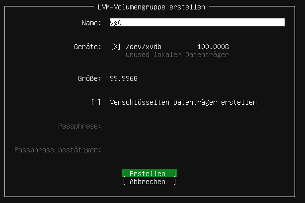

.. |zB| unicode:: z. U+00A0 B. .. Zum Beispiel 
  
.. |ua| unicode:: u. U+00A0 a. .. und andere

.. |_| unicode:: U+202F .. geschütztes Leerzeichen
   :trim:

.. |...| unicode:: U+2026 .. Auslassungszeichen

.. |copy| unicode:: 0xA9 .. Copyright-Zeichen
   :ltrim:

.. |reg| unicode:: U+00AE .. Trademark
   :ltrim:

.. include:: /guided-inst.subst

.. _basis_server-label:

Bist du zuvor der Anleitung "Proxmox vorbereiten" gefolgt, dann kannst du fortfahren mit `Erster Start des Servers`_.

====================================
Anlegen und Installieren des Servers
====================================

.. hint::

   Willst du in einer VM installieren, so must du für die neue VM folgende Mindesteinstellungen angeben:
     
     - Template - Ubuntu Bionic Beaver 18.04, installation from ISO library, 
     - Boot-Mode - BIOS Boot / MBR, 
     - 2 vCPU, 
     - 3 GiB RAM, 
     - storage -> hdd1: 25 GiB -> hdd2: 100 GiB, 
     - 1 NIC mit Zuordnung zu vSwitch green.
   
   Achte darauf, dass vor dem Start der VM beide Festplatten der VM zugewiesen wurden.

   Bei der Einrichtung des Servers musst du nur einen Server mit 2 HDDs haben und Ubuntu 18.04 auf der ersten HDD installieren. Die zweite HDD bleibt frei. Auf dieser 2. HDD richtest du - wie nachstehend beschrieben -  ein LVM ein.

Erster Start des Servers
========================

Starte den Server via Ubuntu 18.04 Server ISO-Image (USB-Stick oder CD-ROM). Es erscheint das erste Installationsfenster mit der Abfrage zur gewünschten Sprache.

.. figure:: media/basis_server_001.png

Wähle deine bevorzugte Sprache.

.. Beantworte danach die Frage, ob auf einen neuen Installer (für 20.04) aktualisiert werden soll, mit ``Ohne Aktualisierung fortfahren``.

Danach wähle dein Tastaturlayout.

.. figure:: media/basis_server_002.png

Wähle das Tastaturlayout Deutsch und bestätige dies mit ``Erledigt``.

.. hint:: Das Tastaturlayout wirkt sich während der Installation noch nicht aus! 

Konfiguriere danach deine Netzwerkkarte.

.. figure:: media/basis_server_003.png

In der Voreinstellung ist die Netzwerkkarte auf DHCP eingestellt. Das klappt natürlich nicht, da der DHCP-Service der Firewall deaktiviert wurde. 
Du musst also die Konfiguration von Hand einstellen.

Gehe dazu auf die Netzwerkkarte und wähle ``Edit IPv4``.

.. figure:: media/basis_server_004.png

Wähle ``Manual`` aus.

.. figure:: media/basis_server_005.png

Gib die Netzwerkkonfiguration, wie im oberen Bild, ein und übernehme sie mit ``Speichern``.

.. hint:: 

   Bedenke, dass das deutsche Tastaturlayout noch nicht aktiv ist. Den ``/``, den du für die Eingabe des Subnetzes brauchst, bekommst du mit der ``-``-Taste!

.. figure:: media/basis_server_006.png

Mit ``Èrledigt`` geht es weiter.

.. figure:: media/basis_server_007.png

Lass die Proxy-Adresszeile leer. Auch diese Anfrage verlässt du mit ``Erledigt``.

.. figure:: media/basis_server_008.png

Die Mirror-Adresse übernimmst du ebenfalls mit ``Erledigt``.

.. figure:: media/basis_server_009_new-installer.png

Bei der angebotene Aktualisierung des Installers wählst du ``Ohne Akualisierungi fortfahren``.

Jetzt must du die Festplattten einrichten. Bei einer bare metal Installation hast du zwei physikalische Festplatten installiert (also /dev/sda und /dev/sdb) 
alternativ richtest du zwei Partitionen ein. Die erste Partition mit mind. 25 GiB (/dev/sda1) und die zweite mit der restlichen Größe der Festplatte (/dev/sda2).

.. figure:: media/basis_server_010_custom-storage-layout.png

Wähle nun zur Einrichtung der Festplatten ``Custom Storage Layout`` aus.

.. figure:: media/basis_server_011_custom-storage-layout-create-partition-table.png

Es werden dir dann die verfügbaren Geräte angezeigt. 

Wähle die erste Festplatte bzw. die erste Partition aus. Es wird ein Kontextmenü angezeigt, bei der du eine ``GPT/Partition`` erstellen musst. 

.. figure:: media/basis_server_012_custom-storage-layout-create-partition-table2.png

Wähle den gesamten Festplattenplatz und formatiere diesen mit dem ext4-Dateiformat und weise diese dem Mount Point ``/`` zu.

.. figure:: media/basis_server_013_custom-storage-layout-create-partition-table3.png

Gehe auf ``Erstellen``.

Danach gelangst Du zu nachstehendem Bildschirm.

.. figure:: media/basis_server_014_custom-storage-layout-create-partition-table-lvm-hdb-5.png

Für das Setup werden noch weitere Partitionen benötigt. Dafür haben wir uns für folgende Größenvorgabe entschieden. 

.. hint:: Für kleine Schulen oder eine Test-Installation sollten diese Vorgaben passen. 
   
   ============== ========================== ========================= =====
   LV Name        LV Pfad                    Mountpoint                Größe
   ============== ========================== ========================= =====
   var            /dev/sg_srv/var            /var                      10G
   linbo          /dev/sg_srv/linbo          /srv/linbo                40G
   global         /dev/sg_srv/global         /srv/samba/global         10G
   default-school /dev/sg_srv/default-school /srv/samba/default-school 40G
   ============== ========================== ========================= =====

Wenn du für deine Installation unsere Vorgaben nutzen willst, dann kannst du den nächsten Punkt überspringen. Unser Installationscript nimmt dir die nötigen vorbereitenden Aktionen ab. Für dich geht es weiter mit `Übernahme der Partitionierung`_, ansonsten hier weiter mit der |...|

|...| Einrichtung eines LVM auf der 2. HDD nach deinen Vorgaben.
   
Wähle den Eintrag ``Datenträgergruppe (LVM) anlegen`` aus.

Hier gibst du einen eigenen Namen für die LVM Volume Group an (z.B. vg0).

.. hint::

   Ohne LVM sind die Mount Points ``/var`` und ``/srv`` auf die 2. HDD zu legen. Die Zuordnung der Mount Points zum LVM wird später detailliert beschrieben.

.. _Übernahme der Partitionierung: 

Zum Abschluss werden dir die Partitionsierungseinstellungen gemäß deiner Eingaben angezeigt.

.. figure:: media/basis_server_016_custom-storage-layout-create-partition-table-overview.png

Stimmen diese mit den gewünschten überein, so wähle ``Erledigt`` aus.

Danach erhälst du die Rückfrage, ob die Installation fortgesetzt werden soll und die Daten auf der Festplatte gelöscht werden sollen.

Bestätige dies.

.. figure:: media/basis_server_017.png

Nenne den Server ``server``. Der Benutzername (linuxadmin) und das Passwort (Muster!) sind frei wählbar - wie in der Abb. dargestellt.

.. figure:: media/basis_server_018.png

Installiere OpenSSH **nicht**

und installiere keine weiteren optionalen Pakete.

.. figure:: media/basis_server_019.png

Bestätige die Installation mit ``Fortfahren``.

Zum Abschluß der Installation wird automatisch versucht, Updates zu installieren

.. figure:: media/basis_server_020.png

und danach den Server neu zu starten.

.. figure:: media/basis_server_021.png

Bei laufender und wie zuvor beschriebener Einrichtung der OPNsense |reg| sollte dies erfolgreich verlaufen.

.. hint::

   Bei einer Installation in eine VM achte vor dem Neustart darauf, dass du die ISO-Datei / DVD ausgeworfen hast und die Boot-Reihenfolge so unmgestellt hast, dass die VM direkt von HDD bootet.

Wenn die Installation abgeschlossen und der Server neu gestartet ist, meldest du dich mit den zuvor angegeben Login-Daten an.

LVM - Einrichtung 
-----------------

Solltest du bei der Installtion unserem Partitionerungs-Vorschlag gefolgt sein, dann kannst du direkt mit `Automatische Updates abschalten`_ fortfahren.

1. Hast du wie zuvor beschrieben ein LVM angelegt, gib auf der Konsole ``sudo vgscan --mknodes`` ein. Es wird dir dann die sog. ``volume group "vg0"`` angezeigt, die du während der Installation auf der 2. HDD angelegt hast.

2. Führe ``sudo vgchange -ay`` aus, um das Volume zu aktivieren.

3. Gib ``sudo pvdisplay`` an, um Informationen zu der Logical Volume Group auszugeben. PV = physical volume = hdd, vg = volume group. Du kannst für Kurzinformationen auch ``sudo pvs`` angeben. Die vg - volume group sollte schon vorhanden sein und wie zuvor angegeben hier ``vg0`` heißen.

4. Lege nun logical volumes an. Wir gehen von 100G für die HDD aus:

.. code::

   sudo lvcreate -L 10G -n /dev/vg0/var vg0
   sudo lvcreate -L 40G -n /dev/vg0/linbo vg0
   sudo lvcreate -L 10G -n /dev/vg0/global vg0
   sudo lvcreate -L 38G -n /dev/vg0/default-school vg0
   
5. Um zu prüfen, ob die logical volumes angelegt wurden, gib den Befehl ``sudo lvs`` an.

6. Aktiviere nun diese logical volumes wie folgt:

.. code::

   sudo lvchange -ay /dev/vg0/var
   sudo lvchange -ay /dev/vg0/linbo
   sudo lvchange -ay /dev/vg0/global
   sudo lvchange -ay /dev/vg0/default-school
   
7. Formatiere die Verzeichnisse in den neu angelegten logical volume groups wie folgt:

.. code::

   sudo mkfs.ext4 /dev/vg0/var
   sudo mkfs.ext4 /dev/vg0/linbo
   sudo mkfs.ext4 /dev/vg0/global
   sudo mkfs.ext4 /dev/vg0/default-school
   
8. Lege nachstehende Verzeichnisse an, die wir danach auf die logical volumes mounten:
   
.. code:: 

   sudo mkdir /srv/linbo
   sudo mkdir /srv/samba
   sudo mkdir /srv/samba/global
   sudo mkdir /srv/samba/schools
   sudo mkdir /srv/samba/schools/default-school
 
9. Kopiere den Inhalt von ``/var`` zunächst in einen neuen Ordner ``/savevar``. Das Verzeichnis ``/var`` soll später auf das LVM gemountet werden.
   Hierbei ist darauf zu achten, dass das virtuelle Dateisystem unterhalb von /var, das für die LX-Container genutzt wird, zunächst ausgehangen und der entsprechende    
   Dienst ``lxcfs.service`` beendet wird.

.. code:: 

   sudo mkdir /savevar
   sudo systemctl stop lxcfs.service
   sudo cp -R /var /savevar

10. Rufe die Datei ``/etc/fstab`` mit dem Editor nano auf und ergänze den bisherigen Eintrag für die 1. HDD um nachstehenden Eintragungen:

.. code::

   /dev/vg0/var              /var ext4 defaults 0 1
   /dev/vg0/linbo            /srv/linbo ext4 defaults 0 1
   /dev/vg0/global           /srv/samba/global ext4 user_xattr,acl,usrjquota=aquota.user,grpjquota=aquota.group,jqfmt=vfsv0,barrier=1 0 1
   /dev/vg0/default-school   /srv/samba/schools/default-school ext4 user_xattr,acl,usrjquota=aquota.user,grpjquota=aquota.group,jqfmt=vfsv0,barrier=1 0 1

Speichere die Einstellung mit ``Strg+w`` und verlasse den Editor mit ``Strg+x``. 

11. Lade die Eintragungen aus der Datei ``/etc/fstab`` neu mit ``mount -a``. Ggf. erkennst Du auch noch Fehler, die sich aufgrund von Tippfehlern in der Datrei /etc/fstab ergeben.
    Behebe diese zuerst bevor du fortfährst.

12. Kopiere dann die gesicherten Inhalte wieder in das Verzeichnis ``/var``, das jetzt auf dem LVM gemountet ist und noch keinen Inhalt hat. Starte danach wieder   
    das virtuelle Dateisystem oder gehe direkt zu Punkt 13, da beim Neustart dieses wieder eingehangen wird.

.. code::

   cd /savevar/var
   sudo cp -R * /var
   sudo systemctl start lxcfs.service

13. Boote danach den Server neu mit ``sudo reboot``. Startet dieser ohne Fehlermeldungen durch, kannst du nun das Verzeichnis ``savevar`` wieder löschen mit ``rm -R /savevar``.

.. hint::

   Solltest Du beim Kopieren des Inhalts von ``var`` Fehler angezeigt bekommen, so hast du das virtuelle Dateisystem zuvor nicht ausgehangen. Gehe dann wie unter 9. vor.

Automatische Updates abschalten
-------------------------------

Der frisch installierte Ubuntu-Server hat automatische Updates aktiviert. Das solltest du abschalten.

Werde mit ``sudo -i`` root und editiere, beispielsweise mit nano, die Datei ``/etc/apt/apt.conf.d/20auto-upgrades``:

.. code::

  nano /etc/apt/apt.conf.d/20auto-upgrades

Ersetze bei ``APT::Periodic::Unattended-Upgrade`` die ``"1";`` durch ``"0";``. Mit ``<Strg>+o`` speicherst du die Änderung ab. Und mit ``<Strg>+x`` verlässt du nano wieder.

Jetzt kannst du den Server mit ``apt-get update`` und anschließendem ``apt-get dist-upgrade`` updaten.

.. hint::

   Es kann passieren, das sonst durch ein Update zur Unzeit unvorgesehene Probleme auftreten.

cloud-init abschalten
---------------------

1. Erstelle eine leere Datei um den Dienst am Start zu hindern.

.. code::

      sudo touch /etc/cloud/cloud-init.disabled

2. Deaktiviere alle Dienste.

.. code::

      sudo dpkg-reconfigure cloud-init

3. Deinstalliere alle Pakete und Ordner, auch wenn o.g. Befehl nicht ausgeführt werden konnte !

.. code::

      sudo apt-get purge cloud-init
      sudo rm -rf /etc/cloud/ && sudo rm -rf /var/lib/cloud/

4. Starte den Server neu.

.. code::

      sudo reboot

