.. include:: ../../guided-inst.subst

.. _basis_server-label:

====================================
Anlegen und Installieren des Servers
====================================

.. sectionauthor:: `@cweikl <https://ask.linuxmuster.net/u/cweikl>`_
                   `@MachtDochNiX <https://ask.linuxmuster.net/u/MachtDochNiX>`_

.. note:: 

   Bist Du zuvor der Anleitung "Proxmox vorbereiten" gefolgt, dann kannst Du fortfahren mit `Erster Start des Servers vom Installationsmedium`_.

.. hint::

   Willst Du in einer VM installieren, so must Du für die neue VM folgende Mindesteinstellungen angeben:
     
     - Installation von Local/ISO, 
     - Gast OS: Linux, 6.X - 2.6 Kernel
     - BIOS: Boot / MBR / SeaBIOS, 
     - 2 vCPU, 
     - 3 GiB RAM, 
     - storage -> hdd1: 25 GiB -> hdd2: 100 GiB, 
     - 1 NIC mit Zuordnung zu vSwitch green.
   
   Achte darauf, dass vor dem Start der VM beide Festplatten der VM zugewiesen wurden.

   Bei der Einrichtung des Servers musst Du nur einen Server mit 2 HDDs haben und Ubuntu auf der ersten HDD installieren. Die zweite HDD bleibt frei. Auf dieser 2. HDD richtest Du - wie nachstehend beschrieben -  ein LVM ein.

Erster Start des Servers vom Installationsmedium
================================================

Sprachauswahl
-------------

Starte den Server Ubuntu 22.04 LTS Server ISO-Image. Es erscheint das erste Installationsfenster mit der Abfrage zur gewünschten Sprache.

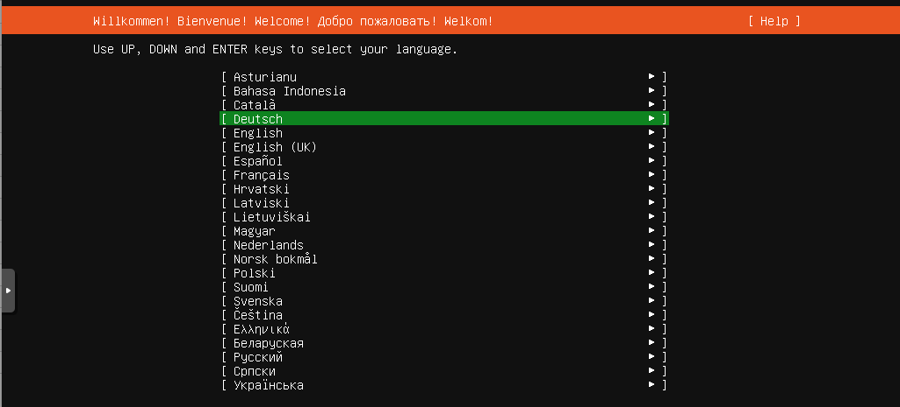

   Wähle Deine bevorzugte Sprache

Wähle Deine bevorzugte Sprache.

Tastaturlayout
--------------

Danach wähle Dein Tastaturlayout.

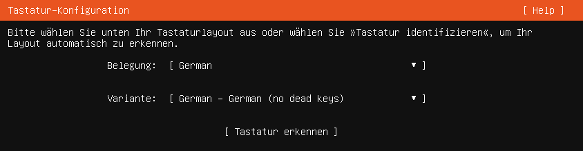

   Wähle Dein Tastaturlayout

Wähle das Tastaturlayout ``Deutsch`` und bestätige dies mit ``Erledigt``.

.. tip:: Wenn Du Dir nicht sicher bist, vor welcher Tastatur Du gerade sitzt:

   Wähle nacheinander 
  
   ``Tastatur erkennen`` --> ``OK`` --> ``y`` --> ``Ja`` --> ``Shift`` + ``*`` --> ``q`` --> ``z`` --> ``OK``

   Da sollte zumindest für eine deutsche Tastatur das richtige Layout finden.
   Für andere einfach den Abfragen folgen
   
Installationsart wählen
-----------------------

Wähle die Art der Installation für den Ubuntu Server aus. Es reicht die minimale Installation.

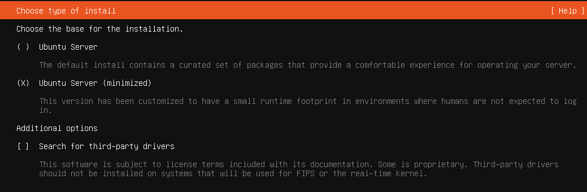

   Installationsart wählen

Netzwerk
--------

Konfiguriere danach Deine Netzwerkkarte.

.. figure:: media/basis_server_003.png
   :align: center
   :scale: 80%
   :alt: configure your nic

   Konfiguriere Deine Netzwerkkarte

In der Voreinstellung ist die Netzwerkkarte auf DHCP eingestellt. Das klappt natürlich nicht, da der DHCP-Service der Firewall deaktiviert wurde. Du musst also die Konfiguration manuell vornehmen.

Gehe dazu auf die Netzwerkkarte und wähle ``Edit IPv4``.

.. figure:: media/basis_server_004.png
   :align: center
   :scale: 80%
   :alt: change IPv4 configuration

   Ändere die IPv4 Konfiguration

Wähle ``Manual`` aus.

.. figure:: media/basis_server_005.png
   :align: center
   :scale: 80%
   :alt: insert IPv4 configuration 

   Trage die IPv4 Einstellungen ein

Gib die Netzwerkkonfiguration, wie im oberen Bild ein beziehungsweise |...|

.. hint:: |...| passe sie Deinen Bedürfnissen an und übernehme diese mit ``Speichern``. 

.. attention::

   Die Länge des ersten Teils der Domäne darf maximal 15 Zeichen betragen. Die Domäne "muster-gymnasium.de" überschreitet diese Grenze um ein Zeichen, da "muster-gymnasium" 16 Zeichen lang ist.
 
   Eine gute Wahl ist beispielsweise ``linuxmuster.lan``. Beim späteren Setup von linuxmuster.net wird diese ggf. für alle Server-Dienste angepasst.

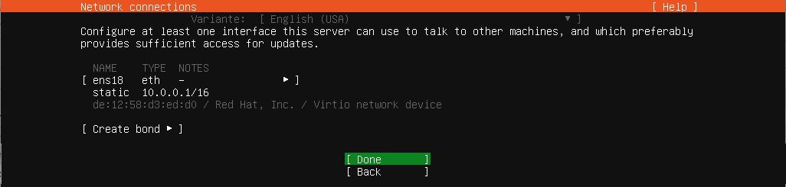

   Bestätige Deine Einstellungen

Mit ``Erledigt`` geht es weiter.

.. figure:: media/basis_server_007.png
   :align: center
   :scale: 60%
   :alt: confirm empty proxy

   Bestätige die Proxy-Einstellungen

Lass die Proxy-Adresszeile leer. Auch diese Anfrage verlässt Du mit ``Erledigt``.

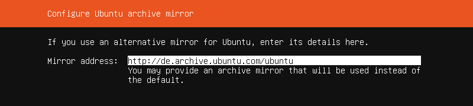

   Bestätige den Ubuntu Mirror Server

Die Mirror-Adresse übernimmst Du ebenfalls mit ``Erledigt``.

Aktualisierung des Installers
-----------------------------

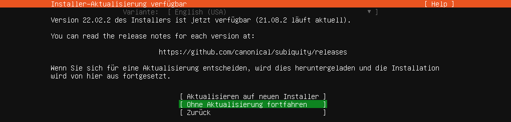

   Installer aktualisieren

Bei der angebotenen Aktualisierung wählst Du ``Aktualisieren auf neuen Installer``.

Speichermedien
--------------

Für die weitere Installation benötigst Du zwei unterschiedliche Speichermedien in Deinem Server.

Dabei ist es egal ob es sich dabei um |...| 

* |...| eine reale Festplatte mit zwei Partionen.
* |...| zwei reale Festplatten.
* |...| zwei virtuelle Festplatten handelt.

In dieser Anleitung beschreiben wir zunächst die Installation auf Basis unserer Mindestanforderungen, also |...|

* |...| 25G Speichermedium für das System und
* |...| 100G Speichermedium für Daten

Wobei anzumerken ist, dass die Installation des Speicherplatzes für das System ``/`` für alle Varianten identisch ist.

Speicher des Systems
^^^^^^^^^^^^^^^^^^^^

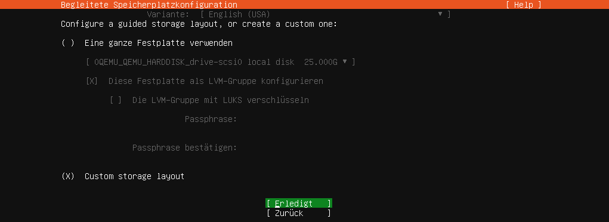

   Eigenes Festplattenlayout wählen
   
Wähle nun zur Einrichtung der Festplatten ``Custom Storage Layout`` aus, wie in obigen Bild dargestellt.

Es werden Dir dann die verfügbaren Geräte angezeigt. 

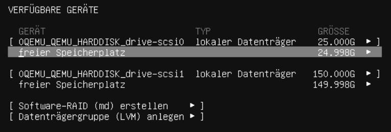

   Anzeige der verfügbaren Geräte - andere HDD-Größen als zuvor genannt

Wähle die erste Festplatte bzw. die erste Partition aus, auf der Du das System des Servers unterbringen möchtest. Es wird ein Kontextmenü angezeigt, bei dem Du mit ``Add GPT Partition`` diese erstellen musst. 

.. figure:: media/basis_server_012_custom-storage-layout-create-partition-table2.png
   :align: center
   :scale: 60%
   :alt: add gpt partition

   Füge eine GPT Partition hinzu

Wähle den gesamten Festplattenplatz (einfach das Eingabefeld leer lassen) und formatiere diesen mit dem ext4-Dateiformat und weise diese dem Mount Point ``/`` zu.

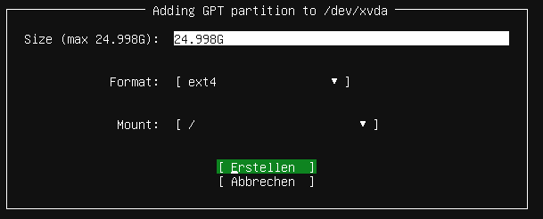

   Lege die Partitionsgröße fest

Gehe auf ``Erstellen``.

Danach gelangst Du zu nachstehendem Bildschirm.

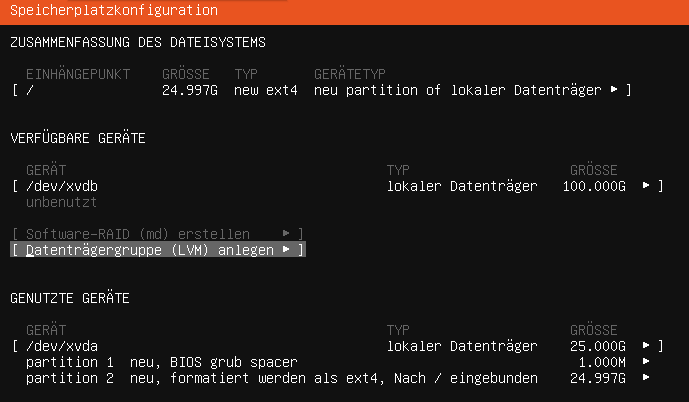

   Speicherplatzkonfiguration

Lasse das `zweite Speichermedium unkonfiguriert`.

Für das Setup werden noch weitere Partitionen benötigt, die so ohne weitere Angabe von dem später beschriebenen Skript ``lmn-prepare`` genutzt werden.

.. hint:: Für kleine Schulen oder eine Test-Installation sollten diese Vorgaben passen. 
   
   ============== ========================== ================================= ==========
   LV Name        LV Pfad                    Mountpoint                        Größe
   ============== ========================== ================================= ==========
   var            /dev/sg_srv/var            /var                              10G
   linbo          /dev/sg_srv/linbo          /srv/linbo                        40G
   global         /dev/sg_srv/global         /srv/samba/global                 10G
   default-school /dev/sg_srv/default-school /srv/samba/schools/default-school 40G [#f1]_
   ============== ========================== ================================= ==========

.. [#f1] Sollte Deine Festplatte größer sein als die vorgeschlagene Mindestgröße, so wird für diese Partition der maximal übrige freie Platz verwendet. Du kannst zudem eigene Größenangaben vornehmen, sofern Deine Voraussetzungen abweichen.

.. attention::

   Unser lmn-prepare nimmt Dir die nötigen vorbereitenden Aktionen ab. Du läßt also das `zweite Speichermedium unkonfiguriert`.

Speicherplatzkonfiguration übernehmen
-------------------------------------

Übernehme die Speicherplatzkonfiguration und wähle ``Erledigt`` aus.

Danach erhälst Du die Rückfrage, ob die Installation fortgesetzt werden soll und die Daten auf der Festplatte hierbei gelöscht werden.

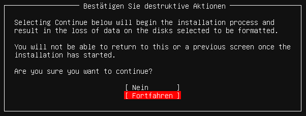

   Bestätige die Partitionseinstellungen

Bestätige dies mit ``Fortfahren``.

Benutzerprofil anlegen
----------------------

.. figure:: media/basis_server_017.png
   :align: center
   :scale: 60%
   :alt: profile setup

   Lege ein Benutzerprofil an
      
Nenne den Server ``server``. Der Benutzername (linuxadmin) und das Passwort (Muster!) sind frei wählbar - wie in der Abb. dargestellt.

Abfrage Ubuntu Pro
------------------

Danach wirst Du gefragt, ob Die ``Ubuntu Pro`` aktiviert werden soll. Überspringe dies.

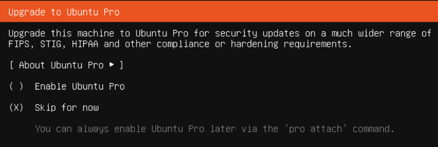

   Überspringe die Aktivierung von Ubuntu Pro

Abfrage OpenSSH-Zugang
----------------------

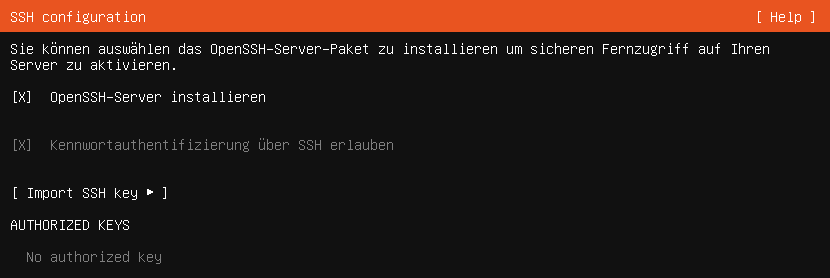

   Aktiviere den SSH-Server
   
Solltest Du eine Möglichkeit für einen Fernzugang zu dem Server wünschen, aktiviere ``OpenSSH-Server installieren``. 

.. attention:: Wenn Du dies machst, mache Dir auch Gedanken wie Du diesen Zugang absichern kannst.
   
   Wir empfehlen das PublicKey-Verfahren.
   https://wiki.ubuntuusers.de/SSH/#Publickey-Authentifizierung (externer Link)

Optionale Server-Pakete
-----------------------

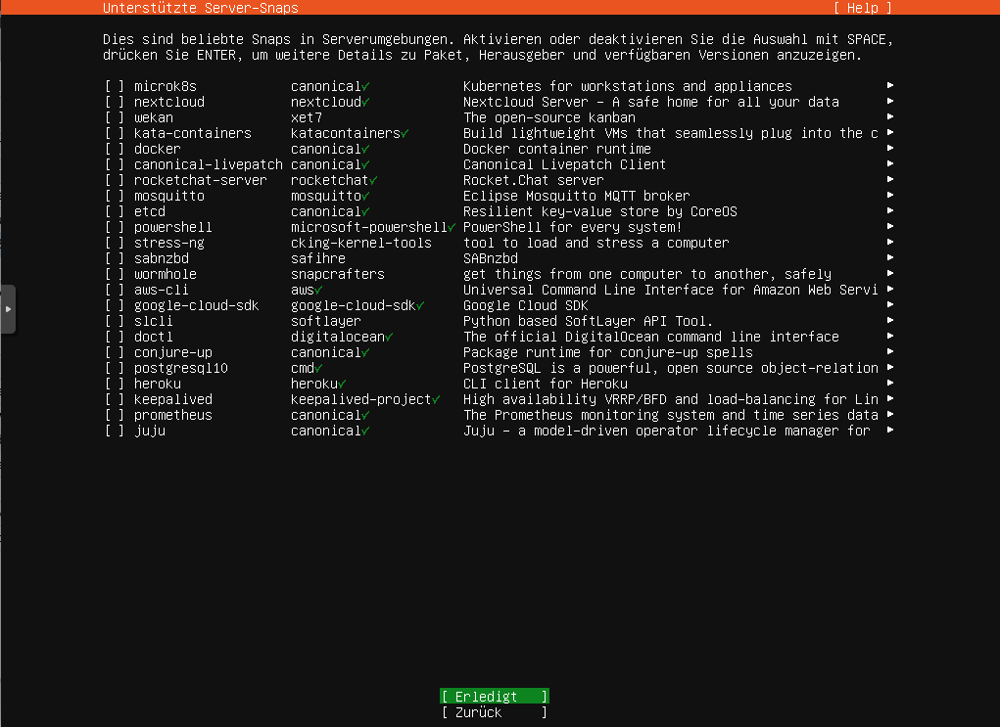

   Deaktiviere alle Server Snaps

Installiere keine weiteren optionalen Pakete.

Bestätige den Start des Installationsvorganges mit ``Erledigt``.

Zum Abschluß der Installation wird automatisch versucht, Updates zu installieren |...|

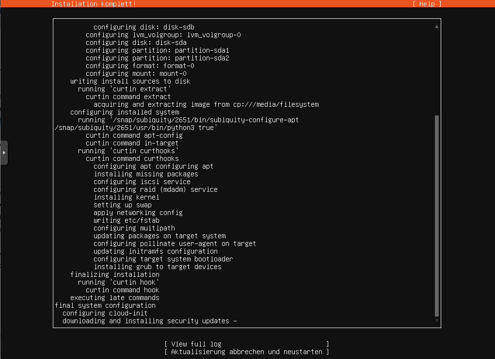

   Schließe die Installation ab

|...| und danach gilt es den Server neu zu starten.

.. hint::

   Bei einer VM achte vor dem Neustart darauf, dass Du die ISO-Datei / DVD ausgeworfen hast und die Boot-Reihenfolge so umgestellt hast, dass die VM direkt von HDD bootet.

Wann die Installation abgeschlossen ist, erkennst Du daran, dass die Anzeige am unteren Bildschirmrand von

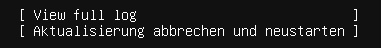

   Server-Aktualisierungen

auf

   ... abgeschlosse

gewechselt ist.

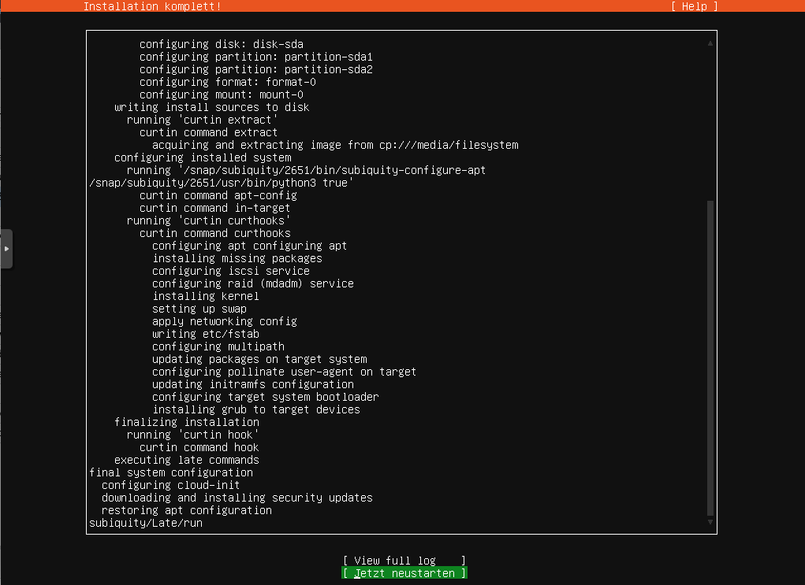

   Starte den Server neu

Den Neustart veranlasst Du mit ``Jetzt neustarten``, wenn es Dir angeboten wird.

.. tip::

   Folgendes Vorgehen bietet sich an, wenn der Server virtualisiert betrieben wird und der Hypervisor so schnell den Neustart einleitet, dass Du keine Chance hast, das Installationsmedium zu entfernen.

   Alternative zum ``Jetzt Neustarten`` gehe zum Punkt ``Hilfe`` oben rechts. Dort wählst Du den Menüpunkt ``Enter Shell`` aus, wo Du dann den Server gezielt mit ``init 0`` herunterfährst. Es folgt noch ein Hinweis, dass Du die Entfernung des Installationsmediums mit ``Enter`` bestätigen sollst. Im Anschluss daran fährt der Server herunter und Du kannst ihn von neuem starten.

Bei laufender und wie zuvor beschriebener Einrichtung der OPNsense |reg| sollte dies erfolgreich verlaufen.

Basis-Konfiguration des Servers
===============================

term.js für die Konsolen-Nutzung in Proxmox aktivieren
------------------------------------------------------

Nachdem Du Dich erneut als ``linuxadmin`` beziehungsweise mit dem von Dir angelegten Nutzer an der ``noVNC`` Konsole angemeldet hast, gib diese zwei Zeilen Code nacheinander ein:

.. code::

   sudo systemctl enable serial-getty@ttyS0.service

.. code::

   sudo systemctl start serial-getty@ttyS0.service

Fahre nun die virtuelle Maschine (VM) herunter und starte sie erneut.

Wähle jedoch oben rechts ``>_ Console -> xterm.js``.
Es öffnet sich das Terminal-Fenster der VM und es erscheint folgender Hinweis:

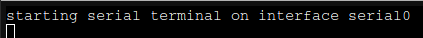

   Starte die serielle Schnittstelle

Nach einem ``Enter`` wirst Du zur Eingabe Deines Passwortes aufgefordert.

Nach erfolgter Anmeldung mit Deinem Account kannst Du die ab jetzt folgenden Codezeilen einfach zwischen der Anleitung und dem Server mittels ``Copy-and-paste`` übertragen. Abhängig von dem Betriebssystem Deines Administration-PCs klappt vielleicht auch ``Drag-and-drop``. Einfach mal testen.

.. code::

   stty cols 120 rows 60

.. note:: Der Befehl sorgt dafür, dass die Zeilenumbrüche hoffentlich zu Deiner Konsolen-Anzeige passen. Ansonsten musst Du die Angaben für die Zeichen (cols) und Zeilen (rows) anpassen.    

Proxmox Guest-Agent installieren
--------------------------------

Um mit Proxmox die Server VM herunterfahren zu können, oder für den Snapshot diese vorher korrekt "einzufrieren", ist die Installation eines Gast-Agenten unter Ubuntu Server 22.04 erforderlich. Zudem musst Du noch dem Agenten unter Proxmox aktivieren.

Gehe dabei wie folgt vor:

1. Installiere auf der Server-Konsole die benötigten Pakete für den QEMU-Gast-Agenten:

.. code::

   sudo apt update
   sudo apt install qemu-guest-agent

2. Aktiviere auf Ubuntu Server den QEMU-Gast-Agenten als Daemon via Konsole:

.. code::

   sudo systemctl enable qemu-guest-agent
   
3. Fahre die virtuelle Maschine herunter: ``sudo shutdown -h now``
4. Wähle in der Proxmox WebUI die virtuelle Maschine für den Ubuntu Server aus. Gehe dort zu ``Options``

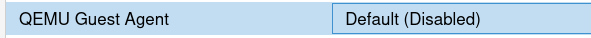

   Proxmox QEMU Guest Agent aufrufen

5. Wähle den QEMU Guest Agent aus und klicke dann oben auf ``Edit``.
6. Aktiviere den QEMU Guest Agent, indem Du den Haken setzt und dies mit ``OK`` bestätigst.

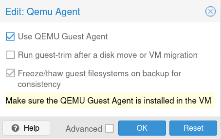

   Aktiviere den QEMU Guest Agent 

7. Starte danach die VM neu.

Automatische Updates abschalten
-------------------------------

Der frisch installierte Ubuntu-Server hat automatische Updates aktiviert. Das solltest Du abschalten, denn nur so kannst Du sichern sein, dass Updates nicht während der Unterrichtszeit in Deiner Einrichtung durchgeführt werden und zu eventuellen Problemen im Schulalltag führen.

Werde mit |...| 

.. code::

  sudo -i

|...| zum Nutzer ``root`` und editiere, beispielsweise mit nano, die Datei |...|

.. code::

  apt install nano
  nano /etc/apt/apt.conf.d/20auto-upgrades

Ersetze bei ``APT::Periodic::Unattended-Upgrade`` die ``"1";`` durch ``"0";``.
Mit ``<Strg>+o`` und anschließendem ``Enter`` speicherst Du die Änderung ab. Und mit ``<Strg>+x`` verlässt Du nano wieder.

Jetzt kannst Du den Server updaten, mit |...|

.. code:: 

   apt update && apt dist-upgrade
   
Nachdem Dir neue Pakete zur Anzeige gebracht wurden, startest Du den Upgrade-Prozess mit ``j``.
Du erhälst die Rückfrage, welche Dienste, die noch mit alten Bibliotheken arbeiten, neu gestartet werden sollen.

Hier spielt es keine Rolle, welche Dienste Du angibst, denn zum Abschluss startest Du den Server einmal neu mit dem Befehl ``reboot``.
Danach sind alle Dienste mit den jeweils neu installierten Bibliotheken neu gestartet.

.. attention::

   Durch das Deaktivieren der automatischen Updates liegt jetzt natürlich die Verantwortung des zeitnahen Einspielen von Updates bei Dir bzw. der Person, die für die Administration verantwortlich zeichnet!

Test der Verbindung zur Firewall
--------------------------------

Es folgt ein letzter Test, um sicherzustellen, dass die SSH-Verbindung zwischen dem Server und der Firewall funktioniert. Diese ist für das weitere Vorgehen entscheidend.

Nach dem erneuten Einloggen rufst Du folgende Zeile an der Konsole des Servers auf: 

.. code::

   ssh root@10.0.0.254

Da es die erste Kontaktaufnahme zwischen dem Server und der Firewall ist,

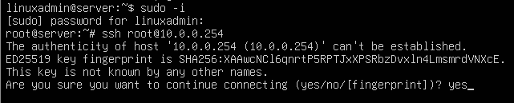

   Akzeptiere den ECDSA Schlüssel der OPNsense

ist es notwendig, dass Du den Key akzeptierst.

Anschließend sollte der Log-in nach der Eingabe des Passwortes ``Muster!`` erfolgreich sein.

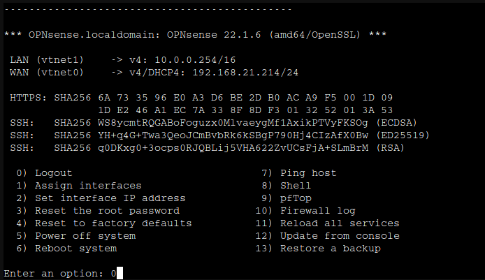

   OPNsense Login Bildschirm

Mit ``0) Logout`` beendest Du die Verbindung.

.. hint:: Für Anwender einer Virtualisierungslösung empfehlen wir an dieser Stelle einen Snapshot zu erstellen!

Weiter geht es jetzt mit :ref:`lmn_pre_install-label`
