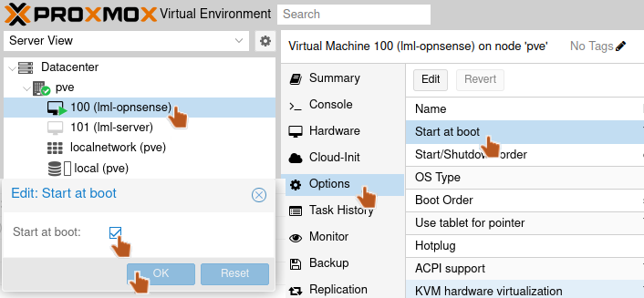

.. include:: ../../guided-inst.subst

.. _proxmox_internes_netz-label:

===================================
Proxmox in das interne Netz bringen
===================================

.. sectionauthor:: `@cweikl <https://ask.linuxmuster.net/u/cweikl>`_
                   `@MachtDochNiX <https://ask.linuxmuster.net/u/MachtDochNiX>`_
                  

Du hast bis hiering bereits folgende Schritte absolviert:

- Du hast die Firewall installiert,
- eine Erstkonfiguration der Firewall erstellt,
- Du hast einen Snapshot der Firewall-VM erstellt,
- Du hast die Server-VM erstellt
- Du hast Ubuntu-Server installiert und vorkonfiguriert
- Du hast den Server mit ``lmn-prepare`` für das spätere linuxmuster-setup vorbereitet,
- Du hast von der Server-VM einen Snapshot erstellt.

Hast Du diese Schritte erfolgreich durchlaufen, gilt es jetzt, die Netzwerk-Konfiguration des Proxmox-Host umzukonfigurieren.

Ziel ist es, dass der Proxmox-Host nunmehr ``nur noch im internen Netzwerk (green)`` erreichbar ist. Der Host wird dann durch die OPNsense - Firewall geschützt. Die OPNsense ist zugleich das neue Gateway für den Proxmox-Host, um Zugriffe in das externe Netz zu ermöglichen.

Um dies umzusetzen, sind die Bridges umzukonfigurieren.

1. vmbr0 - red - externes Netzwerk   (IP im Beispiel 192.168.0.20/24 bzw. IP via DHCP)
2. vmbr1 - green - internes Netzwerk (IP im LAN: 10.0.0.20/16)

Rufe auf dem Proxmox-Host eine Eingabekonsole auf und ändere die Datei ``/etc/network/interfaces`` wie folgt:

.. code::

   auto lo
   iface lo inet loopback
   
   iface eno1 inet manual
   
   iface eno2 inet manual
   
   auto vmbr0
   iface vmbr0 inet dhcp       #holt dynamisch eine IP-Adresse
        bridge-ports eno1
        bridge-stp off
        bridge-fd 0
   #red
   
   auto vmbr1
   iface vmbr1 inet manual
        address 10.0.0.20/16
        gateway 10.0.0.254
        bridge-ports eno2
        bridge-stp off
        bridge-fd 0
   #green

Danach must Du noch die Datei ``/etc/hosts`` anpassen:

.. code::

   127.0.0.1 localhost.localdomain localhost
   10.0.0.20 proxmox.mydomain.local proxmox
   
   # The following lines are desirable for IPv6 capable hosts
   
   ::1     ip6-localhost ip6-loopback
   fe00::0 ip6-localnet
   ff00::0 ip6-mcastprefix
   ff02::1 ip6-allnodes
   ff02::2 ip6-allrouters
   ff02::3 ip6-allhosts

Diese Einstellungen werden mit dem nächsten Start des Proxmox-Hosts aktiv.

Daher gilt es sicherszustellen das die OPNSense |reg| automatisch startet. Dafür bei (``Proxmox-Host`` --> ``VM`` --> ``Options`` --> ``Start on boot``) die Aktivierung setzen.

   Autostart der OPNSense |reg|

Hast Du dies erfolgreich umgesetzt, dann starte den Proxmox-Host neu.

.. figure:: media/proxmox_internes_netz_002.svg
   :align: center
   :scale: 80%
   :alt: Netzwerk für die Proxmox Installation

   Proxmox Netzwerk

Du musst den Admin-PC an den internen Switch des grünen Netzes nach dem Neustart des Proxmox-Host, wie dargestellt, anschließen. Der Admin-PC benötigt nun eine manuell vergebene IP:

-  IP Address: 10.0.0.10/16
-  Subnetzmaske: 255.255.0.0
-  Gateway: 10.0.0.254
-  DNS: 10.0.0.254,8.8.8.8
   
Danach solltest Du vom Admin-PC aus folgende Hosts erreichen können:

1. 10.0.0.20 - Proxmox-Host
2. 10.0.0.254 - OPNsense
3. 8.8.8.8 - externer DNS-Server
4. linuxmuster.net - externe URL

Der Proxmox-Host ist nun "hinter" der OPNsense |reg| und kann über diese auf das Internet zugreifen. Dafür muss die virtuelle Maschine der OPNsense |reg| aktiv sein, was Du mit dem vorherigen Schritt sichergestellt hast.
