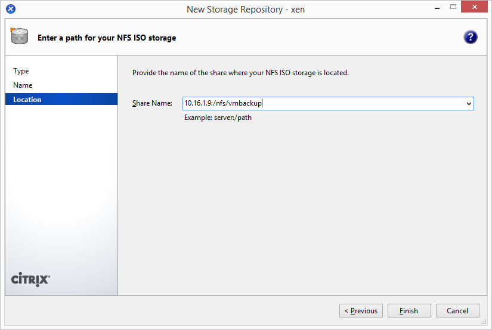
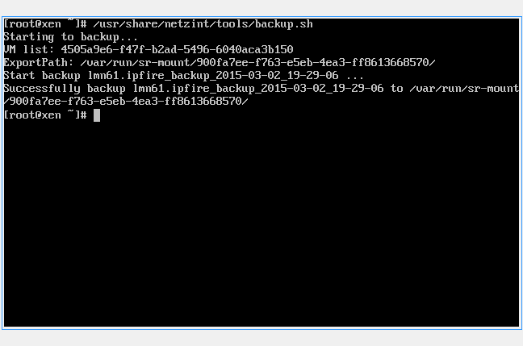

Konfiguration automatisches Backup
==================================

Um Ihre Server zu sichern, ist in den ``linuxmuster-hv-tools`` ein Skript enthalten, welches Snapshots erstellt und auf einen Datenträger Ihrer Wahl verschiebt. Beachten Sie dabei, dass die Backups nicht inkrementell abgelegt werden und dadurch viel Speicherplatz in Anspruch nehmen. Es können daher meist nur einige Vollbackups gespeichert werden. In der Datei main.cfg können Sie mit dem Parameter ``Maxage`` beeinflussen, wieviele Backups auf dem Datenträger beibehalten werden. Diese Backups werden hauptsächlich im Desaster-Fall genutzt. Für versionssichere Backups über längeren Zeitraum empfehlen wir spezielle Software.

Sie können jeden Storage verwenden, den Sie möchten (NAS, USB-Disk, interne Disk, ...). Den Speicherort für das Backup kann in der Datei ``/usr/share/netzint/etc/main.cfg`` eingetragen werden. Sofern nichts eingetragen ist, wird nach einem SR gesucht, welches als BackupStore
beschriftet ist. Dieses wird dann als Target verwendet. In unserem *Beispiel* verbinden wir uns mit einer NFS-Freigabe auf einer NAS mit
der IP 10.16.1.9.

Konfiguration XenCenter
-----------------------

Öffnen Sie XenCenter und klicken Sie mit der rechten Maustaste auf ``xen``, wählen Sie ``New SR``.

.. figure:: media/configuration/image115.png
   :align: center
   :alt: Konfiguration Schritt 55

Wählen Sie einen Punkt unter ISO library.

.. figure:: media/configuration/image116.png
   :align: center
   :alt: Konfiguration Schritt 56

Bennen Sie Ihren Storage. Sofern Sie den Namen "BackupStore" verwenden, müssen Sie später die main.cfg nicht anpassen. Dieser Name wird automatisch als Target erkannt.

.. figure:: media/configuration/image117.png
   :align: center
   :alt: Konfiguration Schritt 57

Tragen Sie den Pfad zur Freigabe ein, welchen Sie verwenden wollen und klicken auf ``Finish``.

Sie haben den Storage erfolgreich eingerichtet, wenn er links in der Übersicht angezeigt wird.

.. figure:: media/configuration/image119.png
   :align: center
   :alt: Konfiguration Schritt 59

Um einzustellen, welche VMs gesichert werden sollen, genügt es bei den zu sichernden VMs einen bestimmten Tag zu setzen. Klicken Sie dazu mit der rechten Maustaste auf die gewünschte VM und wählen ``Properties``.

.. figure:: media/configuration/image120.png
   :align: center
   :alt: Konfiguration Schritt 60

Im Feld ``General`` klicken Sie unten auf ``Edit tags...``.

.. figure:: media/configuration/image121.png
   :align: center
   :alt: Konfiguration Schritt 61

Tragen Sie als Tag ``ni-backup`` ein. Klicken Sie auf ``Create`` und dann auf ``OK``. Durch diesen Tag wird die Maschine in die Sicherung mit aufgenommen. Bei allen weiteren Maschinen wird der Tag bereits aufgelistet und es muss nur noch die Checkbox aktiviert werden.

.. figure:: media/configuration/image122.png
   :align: center
   :alt: Konfiguration Schritt 62

.. figure:: media/configuration/image123.png
   :align: center
   :alt: Konfiguration Schritt 63

Konfiguration XenServer
-----------------------

Um ein Backup zu starten, wechseln Sie auf die Konsole des XenServers und geben folgenden Befehl ein:

.. code-block:: console

   $ /usr/share/netzint/tools/backup.sh

und bestätigen mit ``Enter``.

Nach Abschluss finden Sie in Ihrer Freigabe einen Snapshot, den Sie im Notfall wiederherstellen können.

.. figure:: media/configuration/image125.png
   :align: center
   :alt: Konfiguration Schritt 65

Automatische Backups
--------------------

Um Backups automatisch zu bestimmten Zeitpunkten auszuführen, können Sie einen Cronjob anlegen. Geben Sie dazu in der XenServer-Konsole den Befehl

.. code-block:: console

   $ nano /etc/crontab

ein und bestätigen Sie mit ``Enter``.

.. figure:: media/configuration/image126.png
   :align: center
   :alt: Konfiguration Schritt 66

Tragen Sie für ein wöchentliches Backup, dass jeden Freitag um 20:00 Uhr startet, folgende Zeile in die Datei ein:

.. code-block:: console

   0 20 \* \* 5 /usr/share/netzint/tools/backup.sh

.. figure:: media/configuration/image127.png
   :align: center
   :alt: Konfiguration Schritt 67

Verlassen Sie den Editor und speichern Sie die Datei. Die Zeit für das Backup folgt dieser Zeitangabe die als Filter gelesen wird:

+--------------------+---------------------+------------------------+-------------------------+-----------------------+
| Nur bei Minute 0   | Nur bei Stunde 20   | Nur bei Tag \*         | Nur bei Monat \*        | Nur bei Wochentag 5   |
| [0-60]             | [0-20]              | (Jeder Tag im Monat)   | (Jeder Monat im Jahr)   | [0-7] 0,7=Sonntag     |
|                    |                     | [1-31]                 | [1-12]                  |                       |
+====================+=====================+========================+=========================+=======================+
| 0                  | 20                  | \*                     | \*                      | 5                     |
+--------------------+---------------------+------------------------+-------------------------+-----------------------+