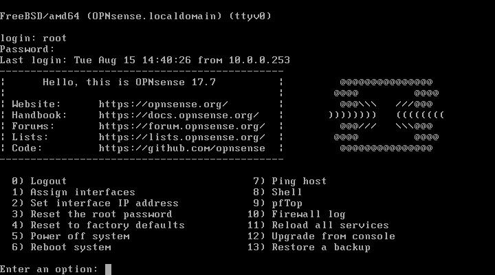

.. include:: /guided-inst.subst

.. _modify-net-label:

====================
Netzbereich anpassen
====================

.. sectionauthor:: `@cweikl <https://ask.linuxmuster.net/u/cweikl>`_

Sollte es erforderlich sein, dass der Netzbereich von den Vorgaben im Setup (``10.0.0.0/16``) abweicht, dann 
sind nachstehende Schritte zur Anpassung vor Aufruf des Setups mit der WebUI oder des Setups auf der Konsole 
auf dem Server auszuführen.

Dies ist ebenfalls der Fall, wenn du eine ``from scratch`` Installation durchgeführt hast.

.. hint::
   Die Anpassung des Netzbereichs ist vor Aufruf des eigentlichen Setups auszuführen. Die ausgelieferten VMs
   sind bereits auf den voreingestellten Netzbereich konfiguriert, so dass jede dieser VMs mithilfe des Skript
   ``linuxmuster-prepare`` an den gewünschten Netzbereich vorab anzupassen ist.

Vorgehen
========

Die OPNsense® ist im gewünschten Zielnetz einzurichten (z.B. 10.17.0.254/16). 
Diese muss für alle Server / Ubuntu-VMs als Gateway angegeben werden. Dies kann mithilfe 
des linuxmuster-prepare Skripts (https://github.com/linuxmuster/linuxmuster-prepare) für den gewünschten 
neuen Netzbereich (z.B. 10.17.0.0/16) vorbereitet werden.

Gleiches gilt für die Vorbereitung der ``from scratch`` installierten Server.

Das Skript lmn7-appliance
-------------------------

Das Skript lmn7-appliance installiert für dich das Paket linuxmuster-base7 mit all seinen Abhängigkeiten und es 
richtet die zweite Festplatte für den Serverbetrieb ein.

* Lade dazu das Skript mit ``wget https://archive.linuxmuster.net/lmn7/lmn7-appliance`` herunter.
* Mach es mit ``chmod +x lmn7-appliance`` ausführbar und
* führe ``./lmn7-appliance -p server -u -l /dev/sdb`` aus. Hierbei wird auf dem angegebenen Device ein LVM eingerichtet.
* für weitere Hinweise zum linuxmuster-prepare Skript siehe: https://github.com/linuxmuster/linuxmuster-prepare

.. hint:: 

   Falls Du dich für das Netz der linuxmuster.net V6.2 entschieden hast, führst du statt 
   ``./lmn7-appliance -p server -u -l /dev/sdb`` Folgendes aus: ``./lmn7-appliance -p     server -u -l /dev/sdb -n 10.16.1.1/12 -f 10.16.1.254``

Im Anschluss kann das Setup ausgeführt werden, das dann den Netzbereich ausliest und für die weitere 
Einrichtung verwendet. 

Download/Import der VMs
-----------------------

Folgendes Vorgehen ist zu wählen:

* Templates herunterladen
* Maschinen importieren und einschalten
* mithilfe des linuxmuster-prepare Skripts, das bereits in den VMs enthalten ist, den gewünschten Netzbereich anpassen. 

linuxmuster-prepare
===================

Das Skript lmn7-appliance bereitet eine Applicance (VM) für das Rollout vor:

* Es bringt das Betriebssystem auf den aktuellen Stand,
* installiert das Paket linuxmuster-prepare und
* startet dann das Vorbereitungsskript linuxmuster-prepare, das die für das jeweilige Appliance-Profil benötigten Pakete installiert,
  das Netzwerk konfiguriert, das root-Passwort auf Muster! setzt und im Falle des Serverprofils LVM einrichtet.

Der linuxmuster-prepare Befehl kennt beim Aufruf folgende Übergabeparameter:

Optionen
--------

+----------+---------------------------------------+--------------------------------------------------+
| Parameter| Wert                                  | Bedeutung                                        |
+==========+=======================================+==================================================+
| -t,      | --hostname=<hostname>                 | Hostname der Appliance,                          |
|          |                                       | falls weggelassen wird der Profilname verwendet. |
+----------+---------------------------------------+--------------------------------------------------+
| -n,      | --ipnet= <ip/bitmask>                 | IP-Adresse und Bitmaske des Hosts (Standardwert  |
|          |                                       | ist 10.0.0.[1,2,3]/16, abhängig vom Profil).     |
+----------+---------------------------------------+--------------------------------------------------+
| -p,      | --profile=<server,opsi,docker,ubuntu> | appliance-Profil, wurde -n nicht angegeben, wird |
|          |                                       | die IP-Adresse automatisch gesetzt:              |
|          |                                       | server 10.0.0.1, opsi 10.0.0.2, docker 10.0.0.3. |
|          |                                       | Bei "ubuntu" muss mit -n eine                    |
|          |                                       | Adresse/Bitmaske angegeben werden.               |
+----------+---------------------------------------+--------------------------------------------------+
| -l,      | --pvdevice=<device>                   | Pfad zum LVM-Device (nur bei Serverprofil).      |
+----------+---------------------------------------+--------------------------------------------------+
| -f,      | --firewall=<ip>                       | Firewall-/Gateway-/Nameserver-Adresse            |
|          |                                       | (Standard x.x.x 254).                            |
+----------+---------------------------------------+--------------------------------------------------+
| -d,      | --domain= <domain>                    | Domänenname (Standard: linuxmuster.lan).         |
+----------+---------------------------------------+--------------------------------------------------+
| -u,      | --unattended                          | Keine Abfragen, verwende Standardwerte.          |
+----------+---------------------------------------+--------------------------------------------------+
| -h,      | --help                                | Hilfe anzeigen.                                  |
+----------+---------------------------------------+--------------------------------------------------+

Profilvorgaben
--------------

**server:**

Paket linuxmuster-base7 mit allen seinen Abhängigkeiten wird installiert. Ist eine zweite Festplatte definiert 
und wird der Parameter ``-l, --pvdevice=<device>`` angegeben, wird diese wie folgt mit LVM eingerichtet 
(Werte beziehen sich auf eine Festplattengröße von 100G. 
Für das LV default-school wird immer der verbleibende Rest genommen. 
Festplattengröße muss daher mindestens 70G betragen.):

+---------------+----------------------------+---------------------------+-------+ 
| LV Name       | LV Pfad                    | Mountpoint                | Größe |
+===============+============================+===========================+=======+
|var            | /dev/vg_srv/var            | /var                      |  10G  |
+---------------+----------------------------+---------------------------+-------+
|linbo          | /dev/vg_srv/linbo          | /srv/linbo                |  40G  |
+---------------+----------------------------+---------------------------+-------+
|global 	| /dev/vg_srv/global         | /srv/samba/global         |  10G  |
+---------------+----------------------------+---------------------------+-------+
|default-school | /dev/vg_srv/default-school | /srv/samba/default-school |  40G  |
+---------------+----------------------------+---------------------------+-------+

**opsi:** 

Das Paket linuxmuster-opsi mit allen seinen Abhängigkeiten wird installiert.

**docker:**

Die Pakete docker und docker-compose werden mit allen ihren Abhängigkeiten installiert.

**ubuntu:**

Es werden keine zusätzliche Pakete installiert, Hostname mit Parameter ``-t, --hostname=<hostname>`` und 
``IP/Netzmaske mit -n, --ipnet=<ip/bitmask>`` müssen zwingend angegeben werden.

Beispiele
---------

.. code::

   lmn7-appliance -u -p server -l /dev/sdb

Richtet Serverprofil mit LVM auf 2. Festplatte mit Standardwerten ein:
 - Hostname server,
 - IP/Bitmask 10.0.0.1/16,
 - Domänenname linuxmuster.lan
 - Gateway/DNS 10.0.0.254

.. code::  

   lmn7-appliance -p opsi -u
        
Richtet Opsiprofil mit Defaultwerten ein:
 - Hostname: opsi
 - IP/Bitmask: 10.0.0.2/16
 - Domänenname linuxmuster.lan
 - Gateway/DNS 10.0.0.254

.. code::  

   lmn7-appliance -p docker -n 10.16.1.3/12 -d meineschule.de -u
  
Richtet Dockerhostprofil wie folgt ein:
  - Hostname docker,
  - IP/Bitmask 10.16.1.3/12,
  - Domänenname meineschule.de,
  - Gateway/DNS 10.16.1.254
 
.. code::  

   lmn7-appliance -p ubuntu -t testhost -n 10.16.0.10/12

Richtet die Appliance wie folgt ein:
 - Hostname testhost,
 - IP/Bitmask 10.16.0.10/12,
 - Domänenname linuxmuster.lan,
 - Gateway/DNS 10.16.1.254

Server-Appliance vorbereiten
----------------------------

Appliance mit 2 Festplatten einrichten, zum Beispiel:
 - HD 1: 25G (Root-Dateisystem)
 - HD 2: 100G (LVM)
    
  * Ubuntu Server 18.04 Minimalinstallation durchführen.
  * System in eine Partition auf HD 1 installieren (keine Swappartition),
  * HD 2 unkonfiguriert lassen.
  * Nach dem ersten Boot als root einloggen und Prepare-Skript herunterladen:
  
.. code::

   # wget https://archive.linuxmuster.net/lmn7/lmn7-appliance
    
   * Skript ausführbar machen und starten:

.. code::    

   ./lmn7-appliance.py -p server -u -l /dev/sdb
    
   * Appliance herunterfahren und Snapshot erstellen.

Weitere Appliances vorbereiten
------------------------------

Opsi-, Docker- und weitere Appliances werden mit jeweils nur einer Festplatte erstellt. 
Die Vorgehensweise ist ansonsten analog zu derjenigen des Servers. 
Beispiele für Skriptaufrufe siehe oben.

Anwendung auf die Appliances
============================

Zuerst ist die OPNsense® Firewall anzupassen.

OPNsense® Firewall
------------------

Nach dem ersten Start als Benutzer ``root`` mit dem Passwort ``Muster!`` anmelden. Danach erscheint 
nachstehendes Konsolenmenü der OPNsense®:

Zunächst müssen die Netzwerk-Interfaces unter Mneüpunkt 1 neu zugordnet werden. Je nach Hypervisor
werden unterschiedliche Namen für die Netzwerkinterfaces verwendet - z.B. em0 / vtnet0 

 * emo/vtnet0 --> LAN
 * em1/vtnet1 --> WAN
 * em2/vtnet2 --> OPT1

Um nun die vorgegebene Netzwerkkonfiguration anzupassen, ist das Menü 2 zu wählen. In nachstehendem 
Beispiel wird das LAN-Interface auf die IP-Adresse 10.16.1.254/12 (``do-it-like-babo``) geändert.

.. figure:: media/02_opnsense-lan-interface.png
   :align: center
   :alt: OPNsense® LAN Interface

Der DHCP-Dient auf der OPNsense® sollte in jedem Fall ausgeschaltet bleiben. Sollte der Domänenname 
geändert werden, kann dies später via OPNsense®-GUI erfolgen. 

Anschließend muss die OPNsense® neu gestartet werden.

Im zweiten Schritt muss der Netzbereich der Server-Appliance angepasst werden.

Server-Applicance
-----------------

Nach dem ersten Start der Server-Appliance als ``root`` einloggen (Passwort: Muster!).
Danach ist die Netzwerkverbindung für den gewünschten Bereich anzupassen. Das Netzwerkinterface des Server muss sich 
im gleichen Netzsegment wie die LAN-Schnittstelle der OPNsense® befinden. 

.. code::

    # ip -4 -br -a addr show | grep -v ^lo

O.g. Befehl gibt einen Überblick über alle gefundenen Interfaces. 

Das entsprechende Interface ist unter Ubuntu 18.04 nun anzupassen.
Dies erfolgt in der Datei ``/etc/netplan/01-netcfg.yaml`` (z.B. ens33):

.. code::

        network:  
          ethernets:  
            ens33:  
              ...

Änderungen in der Datei speichern und danach wie folgt übernehmen:

.. code::

        # netplan apply

Mithilfe eines Ping-Test wird zuerst geprüft, ob der Server das Gateway erreicht.
Im o.g. Beispiel müste dies wie folgt überprüft werden:

.. code::

   ping 10.16.1.254

Ist dies erfolgreich, muss die Appliance mit dem Skript ``linuxmuster-prepare`` für das Setup vorbereitet werden. 
Netzwerkadressen und Domänenname werden damit gesetzt. 

Eine eigene IP-/Netzwerkonfiguration übergibt man mit dem Parameter -n:

.. code::

   linuxmuster-prepare -s -u -n 192.168.0.1/16 oder
   linuxmuster-prepare -s -u -n 192.168.0.1/255.255.0.0

Einen eigenen Domänennamen übergibt man mit -d:

.. code::

   linuxmuster-prepare -s -u -d schule.lan
        
Eine abweichende Firewall-IP setzt man mit -f:

.. code::

   linuxmuster-prepare -s -u -f 192.168.0.10

Das alles kann in einem Schritt erfolgen:

.. code::

   linuxmuster-prepare -s -u -d schule.lan -n 192.168.0.1/16 -f 192.168.0.10

Minimaler Aufruf, wenn die Standard-Netzwerkeinstellungen (10.0.0.0/12) verwendet werden sollen:

.. code::

   linuxmuster-prepare -e|--default -p <Profil>

Gesetzt wird damit:
 * Server: IP 10.0.0.1, Hostname server
 * OPSI: IP 10.0.0.2, Hostname opsi
 * Docker: IP 10.0.0.3, Hostname docker
 * Firewall-IP: 10.0.0.254, Hostname firewall
 * Domänename: linuxmuster.lan
  
Minimaler Aufruf, wenn die Netzwerkeinstellungen wie beim ``Babo-Release (10.16.0.0/12)`` verwendet werden sollen:

.. code::
       
   linuxmuster-prepare -o|--do-it-like-babo -p <Profil>
  
Gesetzt wird damit:
 * Server: IP 10.16.1.1, Hostname server
 * OPSI: IP 10.16.1.2, Hostname opsi
 * Docker: IP 10.16.1.3, Hostname docker
 * Firewall-IP: 10.16.1.254, Hostname firewall
 * Domänename: linuxmuster.lan

Einen Überblick über alle Optionen erhält man mit dem Parameter -h.

.. hint::

   Das Default-Rootpasswort Muster! darf nicht geändert werden, da die Setuproutine dieses voraussetzt.
   Nach der Vorbereitung mit linuxmuster-prepare muss die Appliance neu gestartet werden.
   
Im letzten Vorbereitungsschritt muss die Appliance noch aktualisiert werden:

.. code::

    # apt update && apt -y dist-upgrade

O.g. Anpassungsschritte sind für die Docker- und OPSI-Appliance in gleicher Weise durchzuführen.

Danach kann das Setup mit der WebUI oder auf der Konsole auf dem Server aufgerufen werden.

======================================== ===================
Weiter geht es mit der Erstkonfiguration  |follow_me2setup|
======================================== ===================

