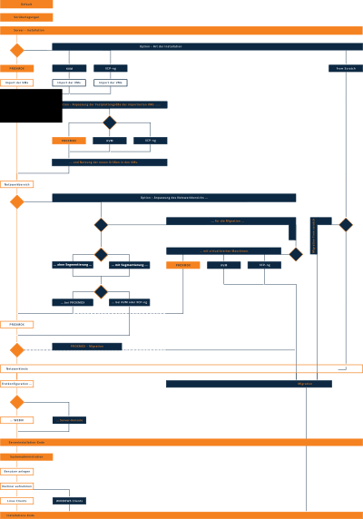

.. _install-overview-label:

Installation: Übersicht
=======================

.. sectionauthor:: `@cweikl <https://ask.linuxmuster.net/u/cweikl>`_,
                   `@MachtDochNix <https://ask.linuxmuster.net/u/MachtDochNix>`_

Installationsübersicht
++++++++++++++++++++++

Nachstehende Grafik bietet dir einen Gesamtüberblick über den Installationablauf der linuxmuster.net v7.1.

Nachstehend kannst du den Installationsablauf als Übersicht im PDF-Format herunterladen:

:download:`Übersicht als PDF-Datei <media/overview-installation-process.pdf>`

Ablauf
++++++

Um linuxmuster.net v7.1 zu installieren solltest du folgende Schritte durchlaufen:

1. Planung der Infrastruktur (Server und Netzwerk)
2. ggf. Vorbereitung / Setup der Netzkomponenten
3. Einrichtung einer Hypervisors (z.B. Proxmox, KVM oder XCP-ng)
4. Vorbereitung der benötigten Virtuellen Maschinen (VM) in der Virtualisierungslösung
5. Installation from Scratch in die vorbereiteten VMs - oder alternativ direkt auf zwei Hardware-Maschinen
6. Test der Netzwerkfunktionen
7. Ersteinrichtung (Setup) der Server
8. Einrichtung der Clients
9. Anlegen der Benutzer und Gruppen
10. Tests

Checkliste
++++++++++

Nutzen Sie die *still missing*, um alle während der Installation gemachten Einstellungen festzuhalten. Es handelt sich um ein PDF-Formular, Sie können es also auch am PC ausfüllen. Halten Sie diese Checkliste bereit, wenn Sie den Telefon-Support in Anspruch nehmen wollen.

.. todo::
   
   to be written
