.. _install-on-kvm-label:

=======================
Virtualisierung mit KVM
=======================

.. sectionauthor:: `@cweikl <https://ask.linuxmuster.net/u/cweikl>`_,
                   `@morbweb <https://ask.linuxmuster.net/u/morpweb>`_,
		           `@Tobias <https://ask.linuxmuster.net/u/Tobias>`_,
		           `@MachtDochNix (pics) <https://ask.linuxmuster.net/u/MachtDochNix>`_

KVM steht für Kernel-based Virtual Machine. Dieses ist ein Modul des Linux-Kernels, das aktiviert werden kann und dann den Hypervisor bereitstellt.
Jede Linux-Distribution kann daher genutzt werden, um mit KVM einen Hypervisor bereitzustellen. Um virtualisierten Gastsystemen eine Infrastruktur bereitzustellen, wird QEMU als Emulator genutzt. Weiterführende Hinweise zu KVM findest du z.B. unter https://www.linux-kvm.org/page/Main_Page.

In diesem Dokument findest du eine "Schritt für Schritt" Anleitungen zur Installation des KVM Virtualisierungs-Hosts auf Basis eines Ubuntu Server 20.04 LTS Servers. 

Systemvoraussetzungen
=====================

In der unten aufgeführten Tabelle findest du die Systemvoraussetzungen zum Betrieb der virtuellen Maschinen. Die Systemanforderungen für die Installation von KVM selbst finden sich im Web für Ubuntu hier: https://wiki.ubuntuusers.de/KVM/.

Die Werte bilden die Mindestvoraussetzungen zur Planung. Für die Installation mit KVM und linuxmuster v7.1 wird als Standard der ``IP-Bereich 10.0.0.0/16`` genutzt.

============ ============= ================ =====
VM           IP            HDD              RAM 
============ ============= ================ =====
OPNsense®    10.0.0.254/16 10 GiB           4 GiB
Server       10.0.0.1/16   25 GiB u 100 GiB 4 GiB
KVM-Host     10.0.0.10/16  500 GiB          4 GiB
============ ============= ================ =====

Die Festplattengröße sowie der genutzte RAM der jeweiligen VMs kann ggf. vor deren Einrichtung einfach an die Bedürfnisse der Schule angepasst werden.

Bevor du dieses Kapitel durcharbeitest, lese bitte zuerst die Abschnitte
  + :ref:`what-is-linuxmuster.net-label`,
  + (:ref:`what-is-new-label`),
  +  :ref:`install-overview-label` und
  +  :ref:`prerequisites-label`.

Für den Betrieb des Hypervisors selbst (KVM) sollten ca. 2 bis 4 GB Arbeitsspeicher eingeplant werden. Um nach Anleitung installieren zu können, sollte der Server mit mindestens 2 Netzwerkkarten bestückt sein. Durch VLANs kann der Betrieb aber auch bereits mit nur einer NIC erfolgen, bsp. 10 Gbit-Karte an einem Core-VLAN-Switch (L3).

Der KVM-Host sollte gemäß o.g. Minimalanforderungen folgende Merkmale aufweisen:

  * RAM gesamt: mind. 16 GiB (besser: 32 GiB)
  * HDD: mind. 500 GB Kapazität (besser: 1 TiB oder 2 TiB)
  * Zwei Netzwerkkarten
  * Der Internetzugang des KVM-Hosts sollte zunächst gewährleistet sein, d.h. dieser wird z.B. an einen (DSL-)Router angeschlossen, der den Internet-Zugang sicherstellt. Sobald alles eingerichtet ist, bekommt der KVM-Host eine IP-Adresse im Schulnetz und die Firewall OPNsense® stellt den Internet-Zugang für alle VMs und den Proxmox-Host bereit.

.. hint:: 

   Virtualisierungs-Hosts sollten grundsätzlich niemals im gleichen Netz wie andere Geräte sein, damit dieser nicht von diesen angegriffen werden kann. In dieser Dokumentation wird zur Vereinfachung der Fall dokumentiert, dass der KVM-Host zu Beginn im externen Netz mit Internet-Zugriff und nach Abschluss der Installation im internen Schulnetz mit Internet-Zugriff via OPNsense®-Firewall befindet.

Bereitstellen des KVM-Hosts
===========================

.. hint:: 

   Der KVM-Host bildet das Grundgerüst für die Firewall *OPNsense®* und den Schulserver *server*. Die Virtualisierungsfunktionen der CPU sollten zuvor im BIOS aktiviert worden sein.

Die folgende Anleitung beschreibt die *einfachste* Implementierung ohne Dinge wie VLANs, Teaming oder RAID. Diese Themen werden in zusätzlichen Anleitungen betrachtet.

* :ref:`Anleitung Netzwerksegmentierung <subnetting-basics-label>` 

.. _preface-usb-stick-label:

Erstellen eines USB-Sticks für den KVM-Host
-------------------------------------------

Es wird für die Installation auf dem KVM-Host ein Ubuntu Server 64 Bit in der Version 20.04 LTS verwendet. Lade dazu das ISO-Image für Ubuntu Server herunter: https://ftp.halifax.rwth-aachen.de/ubuntu-releases/focal/ubuntu-20.04.3-live-server-amd64.iso

Erstelle mit dem ISO-Image einen bootfähigen USB-Stick. Unter Linux musst du den Namen des USB-Sticks vorher herausfinden. Dies kannst du in der Eingabekonsole mit dem Befehl ``lsblk`` ermitteln. Es wird dann z.B. ein Gerätals ``sdb`` dargestellt. Dieses kannst du dann mit ``/dev/sdb`` ansprechen. Nachstehend wird immer sdX angegeben. X ersetzt du durch den Buchstaben für deinen USB-Stick.

Löschen des MBRs des USB-Sticks

.. code::

     # sudo dd if=/dev/zero of=/dev/sdX bs=1M count=10

Größe des ISOs herausfinden

.. code::

     # du -b ubuntu-18.04.1-server-amd64.iso
     749731840	ubuntu-18.04.1-server-amd64.iso

Kopieren des ISOs auf den Stick

.. code::

     # sudo dd if=ubuntu-18.04.1-server-amd64.iso | sudo pv -s 749731840 | sudo dd of=/dev/sdX bs=1M && sync
     [sudo] Passwort für linuxadmin: 
     715MiB 0:00:09 [73,1MiB/s] [====================================================================>] 100%
     0+168504 Datensätze ein
     0+168504 Datensätze aus
     749731840 bytes (750 MB, 715 MiB) copied, 9,78505 s, 76,6 MB/s

Es können auch alle anderen gängigen Tools zur Erstellung genutzt werden.

Verkabelungshinweise
--------------------

Es ist für linuxmuster.net ein internes Netz (grün) und ein externes Netz (rot) am KVM-Host zu unterscheiden. Sind zwei Netzwerkkarten im Proxmox-Host vorhanden, so ist die erste Netzwerkkarte (z.B. eth0, eno1 oder enp7s0), die zu Beginn eine IP aus dem bestehenden lokalen Netz (z.B. via DSL-Router) erhalten soll, mit dem Switch zu verbinden, der an den (DSL-)Router angeschlossen ist.

Die zweite Netzwerkkarte (z.B. eth1 oder enp7s1) ist dann an einen eigenen Switch anzuschließen, ebenso wie alle Clients, die im internen Netz eingesetzt werden.

Um zu Beginn den Proxmox-Host zu administrieren, ist ein Laptop mit dem Switch zu verbinden, der an den lokalen (DSL-)Router angeschlossen ist. Der Laptop erhält ebenfalls eine IP aus dem lokalen (DSL-)Netz und kann sich dann auf die zu Beginn eingerichtete IP-Adresse des KVM-Host verbinden.

.. figure:: media/install-on-kvm-image-01.png
   :align: center
   :alt: Overview KVM

Installieren von KVM
====================

.. hint::

   * Achte auf die Auswahl der korrekten Netzwerkschnittstelle für einen Internetzugang
   * Erstelle einen Nutzer ``linuxadmin`` mit einem sicheren Passwort
   * Richte ein LVM auf deiner Festplatte/RAID mit ``25GB`` für das Betriebssystem des KVM-Hosts ein
   * Wähle das Paket *OpenSSH server* 
   * Nach Reboot, Update des Systems und Installation von ``qemu-kvm`` und ``libvirt-bin``

Basis-Installation
------------------

Vom USB-Stick booten, danach erscheint folgender Bildschirm:

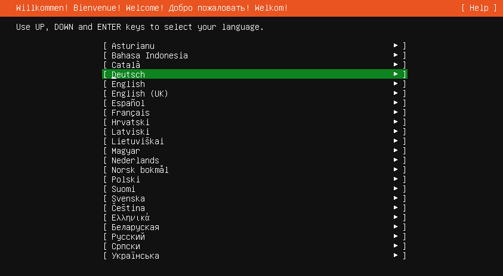

Danach wirst du nach der Installer-Aktualisierung gefragt. Führe diese aus. Dies funktioniert nur, wenn du mit der zuvor eingerichteten Verkabelung auch Internet-Zugang hast. Sollte die Aktualisierung nicht durchgeführt werden können, kannst du dennoch fortfahren mit der Installation.

Wähle danach das Tastatur-Layout aus.

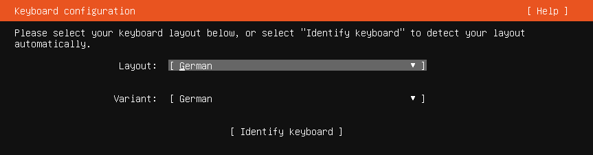

Danach musst du die Netzwerk-Verbindung konfigurieren. Sollte die automatische Netzwerkkonfiguration per DHCP nicht erfolgreich sein, kannst du auch manuell IP-Adresse, Gateway und DNS-Server einstellen. Wichtig ist die richtige Schnittstelle auszuwählen.

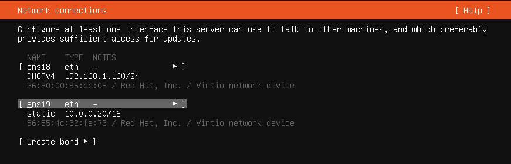

Danach bestätigst du, dass keine Proxy-Adresse genutzt wird.

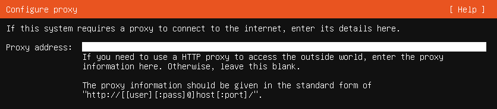

Bestätige die Mirror Adresse.

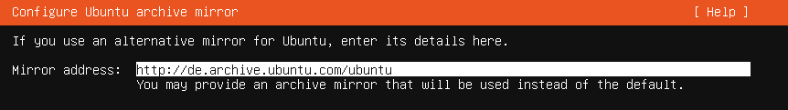

Danach musst du festlegen, wie der Festplattenplatz des KVM-Hosts genutzt werden soll. Gebe hier den gesamten Festplattenplatz an, auf dem dann ein LVM eingerichtet werden soll.

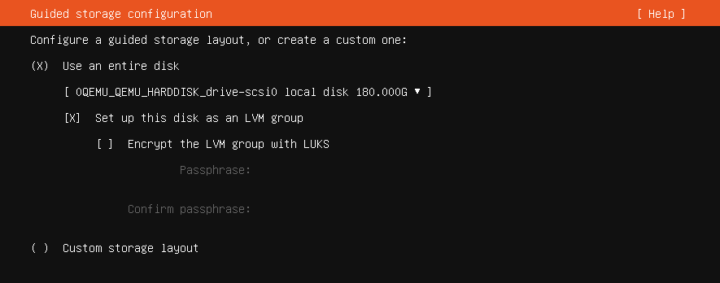

Danach werden dir die Schritte zur Einrichtung der Festplatte in der Übersicht dargestellt. Hier kannst du ggf. noch Anpassungen vornehmen.

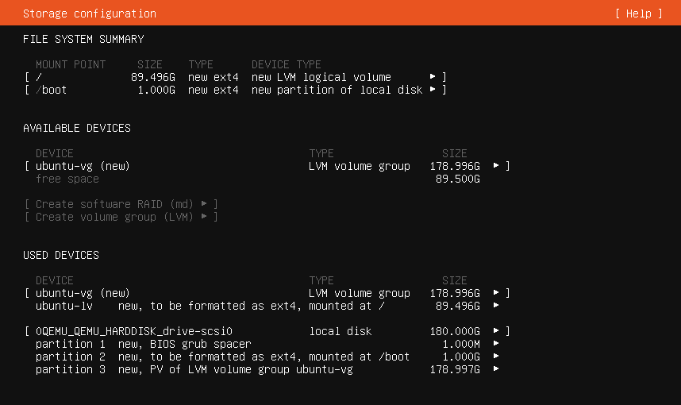

Bestätige zur anschliessenden Einrichtung dieses mit ``Done``. 

du erhältst erneut eine Rückfrage, ob dies so durchgeführt werden soll, da der Inhalt der gesamten HDD gelöscht wird.

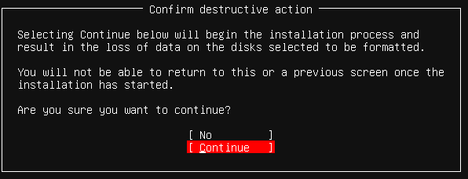

Danach gibst du einen Benutzernamen, Host-Namen etc wie in der Abb. an:

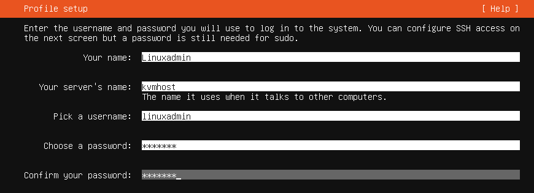

Bestätige, dass der SSH Server ebenfalls installiert wird.

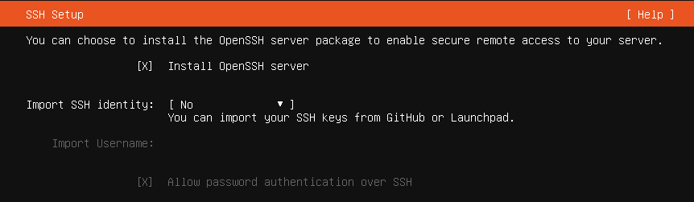

Installiere zunächst keine weiteren Pakete.

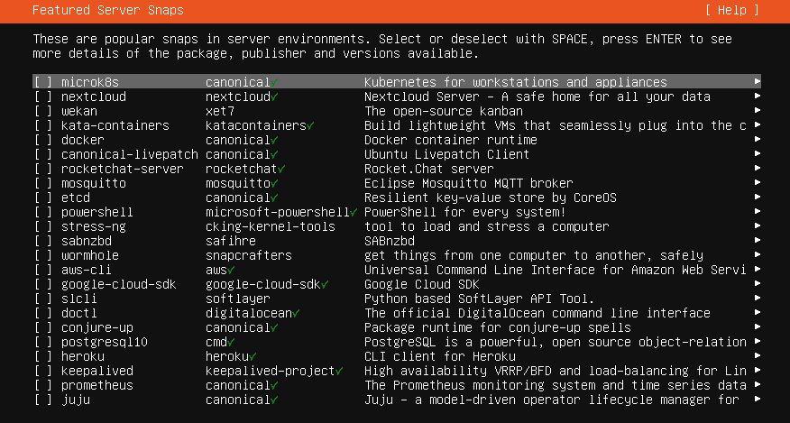

Danach startet die Installation. Siehst du den Hinweis, dass die Installation abgeschlossen wurde, starte den Rechner neu.

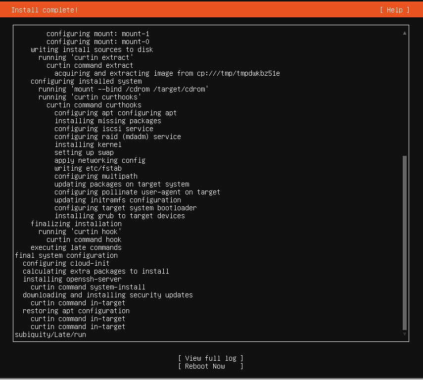

Boote neu und melde dich nun als Benutzer ``linuxadmin`` an.

Update und Softwareinstallation des KVM-Hosts
---------------------------------------------

Führe zunächst ein Update des Systems aus. Der erste Befehl zeigt dir, ob und welche IP-Adresse du auf einem Netzwerk hast. Im folgenden Beispiel wird als externe IP-Adresse immer die IP ``192.168.1.2/16`` verwendet, die per DHCP von einem Router zugeordnet wurde.

.. code::

   $ ip -br addr list
   lo               UNKNOWN        127.0.0.1/8 ::1/128 
   enp0s8           DOWN        
   enp0s17          UP             192.168.1.2/16 fe80::ae1c:ba12:6490:f75d/64
   $ sudo apt update
   $ sudo apt dist-upgrade -y

Unter Umständen werden Dialoge erneut abgefragt, die schon bei der Installation beantwortet wurden (z.B. Tastaturkonfiguration).

Installiere danach die ``qemu/KVM-Pakete``:

.. code::

   $ sudo apt install install qemu-kvm qemu-utils libvirt-daemon-system libvirt-clients bridge-utils kpartx net-tools virt-top
   $ sudo apt install virtinst virt-viewer

Prüfe nun, ob KVM auf dem System aktiv ist.

.. code::

   kvm-ok
  
   INFO: /dev/kvm exists
   KVM acceleration can be used

Damit ein normaler Benutzer die libvirt-Werkzeuge nutzen kann, musst du diesen den Gruppen kvm und libvirt hinzufügen.

.. code::

   usermod -a -G kvm <username>
   usermod -a -G libvirt <username>

Automatische Updates abschalten
-------------------------------

Der frisch installierte Ubuntu-Server, hat das automatische Update aktiviert. Das solltest du abschalten.

Werde mit ``sudo -i`` root und editiere, beispielsweise mit nano, die Datei ``/etc/apt/apt.conf.d/20auto-upgrades``:

``nano /etc/apt/apt.conf.d/20auto-upgrades``

Ersetze bei ``APT::Periodic::Unattended-Upgrade`` die ``"1";`` durch ``"0";``. Mit ``<Strg>+o`` speicherst du die Änderung ab. Und mit ``<Strg>+x`` verlässt du nano wieder.

Jetzt kannst du den Server mit ``apt-get update`` und anschließendem ``apt-get dist-upgrade`` updaten. 

cloud-init abschalten
---------------------

1. Erstelle eine leere Datei, um den Dienst am Start zu hindern.

.. code::

      sudo touch /etc/cloud/cloud-init.disabled

2. Deaktiviere alle Dienste.

.. code::

      sudo dpkg-reconfigure cloud-init

3. Deinstalliere alle Pakete und Ordner, auch wenn o.g. Befehl nicht ausgeführt werden konnte !

.. code::

      sudo dpkg-reconfigure cloud-init
      sudo apt-get purge cloud-init
      sudo rm -rf /etc/cloud/ && sudo rm -rf /var/lib/cloud/

4. Starte den Server neu.

.. code::

      sudo reboot

NTP-Client einrichten
---------------------

Um die korrekte Zeit auf dem KVM-Host sicherzustellen, erfolgt die Konfiguration eines NTP-Clients.

.. code::

   Installieren von ntpdate
   $ sudo apt install ntpdate

   Einmaliges Stellen der Uhrzeit
   $ sudo ntpdate 0.de.pool.ntp.org

   Installieren des NTP-Daemons
   $ sudo apt install ntp

   Anzeigen der Zeitsynchronisation
   $ sudo ntpq -p

Netzwerkkonfiguration des KVM-Hosts
-----------------------------------

Die Netzwerkkonfiguration des KVM-Host ist nun anzupassen.

Prüfe, ob der Daemon für libvirtd läuft:

.. code:: 

   sudo systemctl status libvirtd

Solle kein ``active (running)`` dargestellt werden, so beende die Ansicht mit ``q`` und gebe folgenden Befehl ein:

.. code::

   sudo systemctl enable --now libvirtd

Nach Installation der KVM-Software wurde eine sog. Bridge hinzugefügt, die einem vSwitch entspricht.
``virbr0*`` wurde automatisch hinzugefügt:

.. code::

   $ ip -br addr list
   lo               UNKNOWN        127.0.0.1/8 ::1/128 
   enp0s8           DOWN        
   enp0s17          UP             192.168.1.2/16 fe80::ae1c:ba12:6490:f75d/64
   virbr0           DOWN           192.168.122.1/24 
   virbr0-nic       DOWN           

In diesem Schritt wird die direkte Verbindung des KVM-Hosts mit dem Internet gekappt und eine virtuelle Verkabelung über sogenannte ``bridges`` erstellt. Zunächst werden die Brücken ``br-red`` (Internetseite) und ``br-green`` (Schulnetzseite) definiert. Zuletzt kann der KVM-Host auch über die Brücke ``br-red`` eine IP-Adresse in das Internet bekommen.

Mit folgendem Befehl werden alle Netzwerkkarten (auch nicht-physische) gefunden:

.. code::
     
     # ip -brief link show

Notiere dir die Bezeichnung der physischen Netzwerkkarten und deren MAC-Adressen. Dies können z. B. folgende sein:

.. code::

   ens18    UP   36:80:00:aa:bb:cc 
   eth1     down 35:81:01:bb:cc:dd

Anpassen der Netzwerkkonfiguration

.. code::

     $ sudo nano /etc/netplan/01-installer-config.yaml

Die Netzwerkkonfiguration enthält standardmäßig die Schnittstelle, die bei der Installation mit dem Internet verbunden war. Diese Schnittstelle wird dann auch mit der Brücke ``br-red`` verbunden.

.. code::

   network:
     ethernets:
       ens18:
	     dhcp4: false
         dhcp6: false
	   ens19:
	     dhcp4: false
         dhcp6: false
     version: 2
     bridges:
       br-red:
          interfaces: [ens18]
	      dhcp4: true

Diese Netzwerkkonfiguration kann nun ausprobiert und angewandt werden.

.. code::

   $ sudo netplan try

.. hint::

   Potenzielle Fehlerquellen sind nicht konsequent eingerückte Zeilen oder TABs, die in der YAML-dati nicht zulässig sind.

.. code::

   Invalid YAML at /etc/netplan/01-installer-config.yaml line 6 column 0: found character that cannot start any token

Bei fehlerhaften Versuchen lohnt es sich, den KVM-Host neu zu starten und die Netzwerkkonfiguration erneut zu testen.

Wirft o.g. Test keine Fehler aus, so kann die Konfiguration mit folgendem Befehl übernommen werden:

.. code::

   sudo netplan apply

Es sollte nun die o.g. NIC ens18 als UP gekennzeichnet werden und die Bridge br-red sollte eine IPv4 Adresse erhalten haben.

.. code::

   ip -br addr list

   ens18   UP
   ...
   br-red  UP  192.168.1.2/16 ....

Nun stellst du die IP der br-red auf eine statische IP um, gibst Gateway und DNS-Server sowie ein Routing an. Zudem richtest du die weiteren Bridges ein. Wenn du mehrere Bridges hast, musst du bei jeder Bridge definieren, über welchen Weg die Pakete weitergeleitet werden sollen.

.. code::

   network:
     ethernets:
       ens18:
	     dhcp4: false
         dhcp6: false
	   ens19:
	     dhcp4: false
         dhcp6: false
     version: 2
     bridges:
       br-red:
          interfaces: [ens18]
	      dhcp4: false
          dhcp6: false
          addresses: [192.168.1.166/24]
          gateway4: 192.168.1.1
          nameservers:
              addresses: [192.168.1.1, 9.9.9.9]
          routes:
           - to: 0.0.0.0./0
             via: 192.168.1.1
       br-green:
          interfaces: [ens19]
          dhcp4: false
          dhcp6: false
          addresses: [10.0.0.20/16]
          gateway4: 10.0.0.254
          nameservers:
              addresses: [10.0.0.254, 10.0.0.1]
          routes:
           - to: default
             via: 10.0.0.254

Führe einen Reboot des KVM-Hosts durch. Lasse dir danach die Netzwerkkonfiguration und die Routen des KVM-Hosts ausgeben mit:

.. code::

   ip -br addr list
   ifconfig
   route -n

Führe danach nochmals ein Update auf dem KVM-Host. Bei korrekter Konfiguration des Netzwerks sollten die Inhalte der Paketserver aktualisiert werden können.

Vorbereiten des ISO-Speichers
=============================

Um die v7.1 zu installieren, müssen zwei virtuelle Maschinen angelegt werden. OPNSense und Ubuntu Server 18.04 LTS werden in die VMs installiert.
Dazu ist es erforderlich, dass du die ISO-Images für OPNSense und Ubuntu Server 18.04 LTS auf den KVN-Hypervisor bereitstellst. Bei KVM ist es hinreichend, wenn du die ISO-Images herunterlädst und in einem ISO-Verzeichnis bereitstellst.

OPNsense
--------

Lade daher die Datei zunächst auf deinen PC/Laptop herunter, entpacke die Datei und lade diese dann auf den ISO-Datenspeicher von Proxmox hoch.

Lade ``OPNSense`` herunter und entpacke die Datei: 

.. code::

   cd /tmp/
   sudo -i
   wget https://mirror.informatik.hs-fulda.de/opnsense/releases/21.7/OPNsense-21.7.1-OpenSSL-dvd-amd64.iso.bz2

Als Prüfsumme kannst du zur Überprüfung nach dem Download folgenden Befehl nutzen:

.. code:: 

   sha256sum OPNsense-21.7.1-OpenSSL-dvd-amd64.iso

Es muss folgende SHA256-Prüfsumme errechnet werden:

.. code::

  d9062d76a944792577d32cdb35dd9eb9cec3d3ed756e3cfaa0bf25506c72a67b

Stimmen diese überein, entpackst du die bz2 Datei mit folgendem Befehl:

.. code::

   tar xfvj OPNsense-21.7.1-OpenSSL-dvd-amd64.iso.bz2

Ubuntu Server
-------------

Lade nun Ubuntu Server in das zuvor angelegte Verzeichnis für ISO-Images des KVM-Hosts.

Lade dazu die ISO-Datei für Ubuntu Server 18.04.6 LTS lokal auf deinen KVM-Host:

.. code::

   cd /tmp/
   sudo -i
   wget https://releases.ubuntu.com/bionic/ubuntu-18.04.6-live-server-amd64.iso

Nach dem Download überprüfst du die SHA256-Prüfsumme:

.. code:: 

   sha256sum ubuntu-18.04.6-live-server-amd64.iso

Es muss folgende SHA256-Prüfsumme errechnet werden:

.. code::

  6c647b1ab4318e8c560d5748f908e108be654bad1e165f7cf4f3c1fc43995934

Stimmen diese überein, hast du nun beide ISO-Images im Verzeichnis ``/opt/iso-images`` bereitgestellt.

Richte nun die VMs ein.

Virtuelle Maschinen vorbereiten
===============================

Du musst nun für die OPNsense und den linuxmuster Server die virtuellen Maschinen (VMs) vorbereiten.

Prüfe zunächst, ob du den libvirtd-Daemon erreichst:

.. code::

   sudo virsh version

   bei Fehler:
   sudo systemctl enable --now libvirtd

Lasse die aktuell verfügbaren virtuellen Maschinen auf dem KVM-Host ausgeben:

.. code::

   virsh -c qemu:///system list --all

Anlegen der VM für OPNsense
---------------------------

Um für die OPNsense Firewall eine virtuelle Maschine anzulegen, nutzt du den Konsolenbefehl ``virt-install`` mit vielen Parametern, die deine neu anzulegende VM konfigurieren.

Folgende Parameter sind relevant:

1. name: Name der virtuellen Machine
2. description: Beschreibung für deine VM
3. os-type: Betriebssystemart. Es kann Linux, Solaris, Unix der Windows angegeben werden.
4. os-variant: Für die Betriebssysteme können die Varianten angegeben werden. Für Linux-Distributionen können z.B. rhel6, centos6, ubuntu14, suse11, fedora6, etc. und für Windows z.B. win10, win8, win7 angegeben werden.
5. ram: Der Arbeitsspeicher der VM angegeben in MiB
6. vcpu: Gesamtzahl der virtuellen CPUs für die VM
7. disk path=/var/lib/libvirt/images/myRHELVM1.img,bus=virtio,size=10 - Path: Speicherort der VM, size: Größe in GiB. In dem Beispiel ist die VM Image Datei 10 GiB groß.
8. graphics none: Dies gibt an, dass eine Text-Konsole auf der VM als serieller Port anstelle eines graphischen VNC Fensters genutzt wird. Hast du einen xmanager/virt-manager installiert, kannst du die Option weglassen.
9. cdrom: Gibt den Ort an, wo das ISO-Image zur Installation zu finden ist. Dies kann ein lokales Verzeichnis des KVM-Hosts als auch ein Netzwerkverzeichnis via NFS sein.
10. network bridge:br0: In diesem Beispiel nutzt die VM nach Installation die Brdige br0.

Lege nun die VM für OPNsense wie folgt an. Dies ist ein einzeiliger Befehl.

.. code::

   virt-install \
   --name lmn71.opnsense \
   --description "Firewall OPNsense for lmn71" \
   --os-type=freebsd12.0 \
   --memory 2048 \
   --vcpus=2 \
   --disk path=/var/lib/libvirt/images/opnsense4lmn71.qcow2,device=disk,bus=virtio,size=10,format=qcow2 \
   --graphics=vnc \
   --console pty,target_type=serial \
   --location=/tmp/OPNsense-21.7.1-OpenSSL-dvd-amd64.iso \
   --network bridge:br-red \
   --network bridge:br-green \
   -v

.. hint::

   Nach dem Anlegen der VM startet direkt die Installation der VM und die Ausgabe wird auf den virt-viewer im Konsolenfenster umgelenkt. :ref:`install-from-scratch-label`

Anlegen der VM für linuxmuster server
-------------------------------------

Um für die den linuxmuster.net Server v7.1 ein VM anzulegen, gibst du folgenden Befehl ein. Dies ist ein einzeiliger Befehl.

.. code::

   virt-install \
   --name lmn71.server \
   --description "Server for lmn71" \
   --os-type=ubuntu18.04 \
   --memory 4096 \
   --vcpus=4 \
   --disk path=/var/lib/libvirt/images/server4lmn71-hdd1.qcow2,device=disk,bus=virtio,size=25,format=qcow2 \
   --disk path=/var/lib/libvirt/images/server4lmn71-hdd2.qcow2,device=disk,bus=virtio,size=100,format=qcow2 \
   --graphics=vnc \
   --console pty,target_type=serial \
   --location=/tmp/ubuntu-18.04.6-live-server-amd64.iso \
   --network bridge:br-green \
   -v

.. hint::

   Nach dem Anlegen der VM startet direkt die Installation der VM und die Ausgabe wird auf den virt-viewer im Konsolenfenster umgelenkt. :ref:`install-from-scratch-label`

Appendix: Videos als Hilfestellung
==================================

Nachstehend findest du einige Videos, die Bestandteile der Anleitung als Kurzvideos z.T. für ältere Versionen darstellen. Diese dienen als ergänzende Hilfestellung.

USB-Stick erstellen
-------------------

Im folgenden Video ist die Prozedur anhand einer älteren ISO-Datei dargestellt, verläuft aber äquivalent mit jeder aktuellen Ubuntu-Version:

.. raw:: html

   

   <iframe width="696" height="392" src="https://www.youtube.com/embed/7NIoQpSSVQw?rel=0" frameborder="0" allow="autoplay; encrypted-media" allowfullscreen></iframe>
   

KVM-Eirichtung
--------------

Im folgenden Video wird der Vorgang zur Einrichtung von KVM auf dem Ubuntu Server dargestellt.

.. raw:: html

	
 <iframe width="696" height="392"
	src="https://www.youtube.com/embed/tHqFTfS99xo?rel=0"
	frameborder="0" allow="autoplay; encrypted-media"
	allowfullscreen></iframe> 

