.. _install-on-xen-label:

============================
 Virtualisierung mit XCP-ng
============================

.. sectionauthor:: `@cweikl <https://ask.linuxmuster.net/u/cweikl>`_,
		           `@MachtDochNix (pics) <https://ask.linuxmuster.net/u/MachtDochNix>`_

XCP-ng ist eine reine OpenSource-Virtualisierungslösung, die auf Basis von XEN arbeitet. XCP-ng bietet sog. Enterprise-Features wie Replikation, automatisierte Backups, Verschieben von VMs im laufenden Betrieb und weitere Funktionen. Daher eignet sie sich besonders für den virtuellen Betrieb von linuxmuster.net, da diese recht einfach skalierbar ist, mehrere Virtualisierungs-Hosts und Speichereinheiten in einem sog. ``Resource-Pool`` zusammengeführt und verwaltet werden können.

Der Betrieb wird auf jeglicher Markenhardware und auf einer Vielzahl an NoName-Hardware unterstützt.

Systemvoraussetzungen
=====================

In der unten aufgeführten Tabelle findest du die Systemvoraussetzungen zum Betrieb der virtuellen Maschinen. Die Systemanforderungen für die Installation von XCp-ng selbst finden sich im Web unter https://xcp-ng.org/docs/requirements.html#xcp-ng-system-requirements.

Die Werte bilden die Mindestvoraussetzungen zur Planung. Für die Installation mit XCP-ng und linuxmuster v7.1 wird als Standard der ``IP-Bereich 10.0.0.0/16`` genutzt.

============ ============= ================ =====
VM           IP            HDD              RAM
============ ============= ================ =====
OPNsense®    10.0.0.254/16 10 GiB           4 GiB
Server       10.0.0.1/16   25 GiB u 100 GiB 4 GiB
XCP-ng       10.0.0.10/16  500 GiB          4 GiB
============ ============= ================ =====

Die Festplattengröße sowie der genutzte RAM der jeweiligen VMs kann ggf. - vor deren Einrichtung einfach an die Bedürfnisse der Schule angepasst werden.

Bevor du dieses Kapitel durcharbeitest, lese bitte zuerst die Abschnitte
  + :ref:`what-is-linuxmuster.net-label`,
  + (:ref:`what-is-new-label`),
  +  :ref:`install-overview-label` und
  +  :ref:`prerequisites-label`.

Für den Betrieb des Hypervisors selbst (XCP-ng) sollten ca. 2 bis 4 GiB Arbeitsspeicher eingeplant werden. Um nach Anleitung installieren zu können, sollte der Server mit mindestens 2 Netzwerkkarten bestückt sein. Durch VLANs kann der Betrieb aber auch bereits mit nur einer NIC erfolgen, bsp. 10 Gbit-Karte an einem Core-VLAN-Switch (L3).

Der XCP-ng-Host sollte gemäß o.g. Minimalanforderungen folgende Merkmale aufweisen:

  * RAM gesamt: mind. 16 GiB (besser: 32 GiB)
  * HDD: mind. 500 GB Kapazität (besser: 1 TiB oder 2 TiB)
  * Zwei Netzwerkkarten
  * Der Internetzugang des XCP-ng-Hosts sollte zunächst gewährleistet sein, d.h. dieser wird z.B. an einen (DSL-)Router angeschlossen, der den Internet-Zugang sicherstellt. Sobald alles eingerichtet ist, bekommt der Proxmox-Host eine IP-Adresse im Schulnetz und die Firewall OPNsense® stellt den Internet-Zugang für alle VMs und den Proxmox-Host bereit.

.. hint::

   Virtualisierungs-Hosts sollten grundsätzlich niemals im gleichen Netz wie andere Geräte sein, damit dieser nicht von diesen angegriffen werden kann. In dieser Dokumentation wird zur Vereinfachung der Fall dokumentiert, dass der Proxmox-Host zu Beginn im externen Netz mit Internet-Zugriff und nach Abschluss der Installation im internen Schulnetz mit Internet-Zugriff via OPNsense®-Firewall befindet.

Bereitstellen des XCP-ng-Hosts
==============================

.. hint::

   Der XCP-ng-Host bildet das Grundgerüst für die Firewall *OPNsense®* und
   den Schulserver *server*. Die Virtualisierungsfunktionen der CPU sollten
   zuvor im BIOS aktiviert worden sein.

Die folgende Anleitung beschreibt die *einfachste* Installation. Komplexere Einsatzszenarien, die VLANs, Teaming oder RAID berücksichtigen, werden in zusätzlichen Anleitungen betrachtet.

.. hint::

   :ref:`Anleitung Netzwerksegmentierung <subnetting-basics-label>` 

**Download**

Für die Installation von XCPng benötigst du die ISO-Instalationsdatei. Nach der Installation benötigst du zur Ersteinrichtung und Verwaltung des XCP-ng Hosts das sog. XCP-ng Center, ein Windows Programm, das du z.B. auf einem Laptop mit dem Betriebssystem Windows installierst.

Lade beide herunter:

+--------------------+----------------------------------------------------------------------+
| Programm           | Beschreibung                                                         | 
+====================+======================================================================+
| XCP-ng             | `Installationsdatenträger <https://xcp-ng.org/#easy-to-install>`_    | 
+--------------------+----------------------------------------------------------------------+
| XCP-ng Center      | Windows-Programm zur Verwaltung der Virtualisierungsumgebung         |                             
+--------------------+----------------------------------------------------------------------+

.. _XCP-ngCenter: https://github.com/cocoon/xenadmin/releases/download/20.11.00.3/XCP-ng-Center_20.11.00.3.msi

Erstellen eines USB-Sticks zur Installation des XCP-ng-Host
-----------------------------------------------------------

Herunterladen von XCP-ng
^^^^^^^^^^^^^^^^^^^^^^^^

Diese Anleitung bezieht sich auf die Version 8.2 von XCP-ng. Für nachfolgende Versionen ist dieses Vorgehen entsprechend anzuwenden.

Die ISO-Datei muss heruntergeladen und ein bootfähiger USB-Stick erstellt werden.

Herunterladen: XCP-Webseite_

.. _XCP-Webseite: https://xcp-ng.org/#easy-to-install

Erstellen des Boot-Sticks
^^^^^^^^^^^^^^^^^^^^^^^^^

USB-Stick erstellen: In das Download-Verzeichnis wechseln, Buchstaben für USB-Stick unter Linux ermitteln, X durch den korrekten Buchstaben ersetzen und dann nachstehenden Befehl eingeben:

.. code::
 
   dd if=XCP-ng_8.2.0.iso of=/dev/sdX bs=8M status=progress oflag=direct

Verkabelungshinweise
--------------------

Es ist für linuxmuster.net ein internes Netz (grün) und ein externes Netz (rot) am XCP-ng-Host zu unterscheiden.  Sind zwei Netzwerkkarten im XCP-ng-Host vorhanden, so ist die erste Netzwerkkarte (z.B. eth0, eno1 oder enp7s0), die zu Beginn eine IP aus dem bestehenden lokalen Netz (z.B. via DSL-Router) erhalten soll, mit dem Switch zu verbinden, der an den (DSL-)Router angeschlossen ist.

Die zweite Netzwerkkarte (z.B. eth1 oder enp7s1) ist dann an einen eigenen Switch anzuschließen, ebenso wie alle Clients, die im internen Netz eingesetzt werden.

Um zu Beginn den XCP-ng-Host zu administrieren, ist ein Laptop mit dem Switch zu verbinden, der an den lokalen (DSL-)Router angeschlossen ist. Der Laptop erhält ebenfalls eine IP aus dem lokalen (DSL-)Netz und kann sich dann mithilfe des Verwaltungsprogramms XCP-ng Center auf die zu Beginn eingerichtete IP-Adresse des XCP-ng-Hosts verbinden.

In nachstehender Abbildung wird der schematische Netzaufbau der anstehenden v7.1-Installation unter XCP-ng dargestellt.

.. figure:: media/01_install-on-xcp-ng_network-sketch.png
   :align: center
   :alt: Netzwerkübersicht

Installieren von XCP-ng
=======================

Basis-Installation
------------------

Vom USB-Stick booten, danach erscheint folgender Bildschirm:

.. figure:: media/02_install-on-xcp-ng_boot-screen.png
   :align: center
   :alt: Schritt 1 der Installation des XCP-ng Servers

Starte die Installtion mit ``ENTER``.

Wähle dein Tastaturlayout.

.. figure:: media/03_install-on-xcp-ng_select-keymap.png
   :align: center
   :alt: Schritt 2 der Installation des XCP-ng Servers

Wir verwenden ``[qwerz] de``.

Solltest du zusätzliche Treiber benötigen, kannst du diese nun laden, indem du ``F9`` drückst. Starte das XCP-ng Setup mit ``Ok``.

.. figure:: media/04_install-on-xcp-ng_welcome-setup.png
   :align: center
   :alt: Schritt 3 der Installation des XCP-ng Servers

Akzeptiere danach die Lizenzbedingungen mit ``Accept EULA``.

.. figure:: media/05_install-on-xcp-ng_license-agreement.png
   :align: center
   :alt: Schritt 4 der Installation des XCP-ng Servers

XCP-ng prüft, ob bereits eine vorherige Version entweder von XenServer oder ggf. auch von XCP-ng installiert war. Falls ja, bietet die Installationsroutine an, die bestehende Installation zu aktualisieren oder eine Neuinstallation vorzunehmen. Wähle das gewünschte Vorgehen aus. Bei einer Aktualisierung legt XCP-ng zuvor eine Sicherheitskopie der bereits bestehenden Installation an, um ggf. wieder auf diese Version zurückkehren zu können. 

.. figure:: media/06_install-on-xcp-ng_upgrade-or-clean-installation.png
   :align: center
   :alt: Schritt 5 der Installation des XCP-ng Servers

Danach musst du den Datenträger auswählen, der verwendet werden soll. Setze den Haken bei ``USE EXT ... -> Thin provisioning``. Bestätige mit ``Ok``.

.. figure:: media/07_install-on-xcp-ng_virtual-machine-storage.png
   :align: center
   :alt: Schritt 6 der Installation des XCP-ng Servers

Bei einer Neuinstallation werden für das gewählte Medium dann die Partitionen erstellt, das Dateisystem erzeugt und alle Daten auf dem Medium gelöscht. Bei einem Upgrade bleiben die Daten erhalten.

Danach wirst du nach der Installationsquelle gefragt.

.. figure:: media/08_install-on-xcp-ng_installation-source.png
   :align: center
   :alt: Schritt 7 der Installation des XCP-ng Servers

Gebe hier ``Local Media`` an.

Danach must du entscheiden, ob das Installationsmedium vor der Installation überprüft werden soll.

.. figure:: media/09_installation-on-xcp-ng_verify-installation-source.png
   :align: center
   :alt: Schritt 8 der Installation des XCP-ng Servers

Bestätige dies mit ``Verfy installation source``.

Nach Abschluss der erfolgreichen Überprüfung des Installationsmediums wird dies bestätigt.

.. figure:: media/10_installation-on-xcp-ng_verification.png
   :align: center
   :alt: Schritt 9 der Installation des XCP-ng Servers

Lege danach das Kennwort für den Administrator (user: root) fest und bestätige dieses.

.. figure:: media/11_installation-on-xcp-ng_set-password.png
   :align: center
   :alt: Schritt 10 der Installation des XCP-ng Servers

Solltest du kein Upgrade einer bestehenden Installation durchführen, so must du noch die Netzwerkeinstellungen festlegen.

Zuerst musst du festlegen, welche Netzwerkkarte (NIC) das Management-Interface darstellt. Wähle hierzu zum jetzigen Zeitpunkt die NIC mit der MAC-Adresse aus, die an den DSL-Router angeschlossen ist.

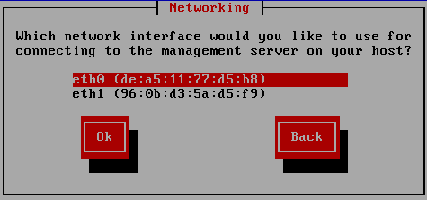

Da diese NIC an den DSL-Router angeschlossen ist, wird dieser via DHCP eine IP-Adresse vergeben. Wähle daher DHCP als Netzwerkeinstellung aus.

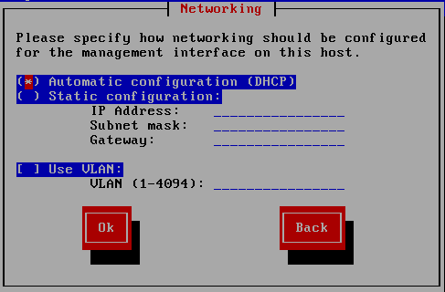

Lege dann eine Hostnamen für den XCP-ng-Host fest und wähle als DNS-Konfuiguration ``Automatically set via DHCP``.

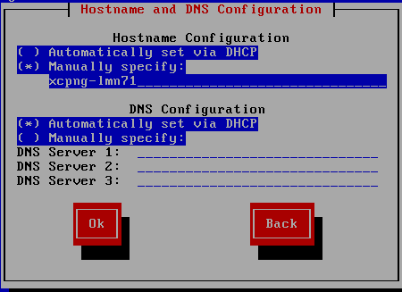

Wähle danach die Zeitzone aus.

Erst die Region wählen.

.. figure:: media/14_install-on-xcp-ng_select-time-zone-area.png
   :align: center
   :alt: Schritt 14 der Installation des XCP-ng Servers

Danach die Stadt auswählen.

.. figure:: media/15_install-on-xcp-ng_select-time-zone.png
   :align: center
   :alt: Schritt 15 der Installation des XCP-ng Servers

Lege danach fest, ob die lokale Zeit manuell oder automatisch mit NTP ermittelt werden soll.

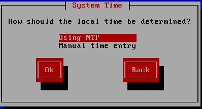

Bestätige, dass NTP über den DHCP-server festgelegt wird.

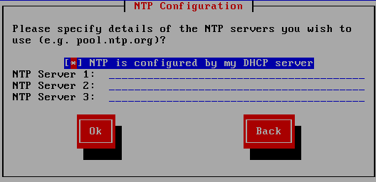

Bestätige danach die Frage nach der Installation von XCP-ng.

.. figure:: media/17_install-on-xcp-ng_confirm-installation.png
   :align: center
   :alt: Schritt 18 der Installation des XCP-ng Servers

Danach startet die Installation

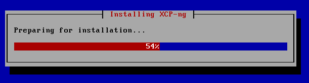

Die Frage nach Installation eines ``Supplemental Pack`` ist mit ``No`` zu beantworten.

.. figure:: media/19_install-on-xcp-ng_supplemental-packs.png
   :align: center
   :alt: Schritt 20 der Installation des XCP-ng Servers

Nach erfolgreicher Installation kannst du mit ``Ok`` den Server neu starten.
Achte darauf, dass der USB-Stick nicht mehr für den Bootvorgang aktiv ist.

.. figure:: media/20_install-on-xcp-ng_installation-completion.png
   :align: center
   :alt: Schritt 21 der Installation des XCP-ng Servers

Beim Startvorgang erscheint folgende Auswahl:

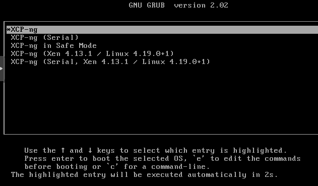

XCP-ng wird nach einigen Sekunden automatisch gestartet.

.. figure:: media/22_install-on-xcp-ng_boot-screen.png
   :align: center
   :alt: Schritt 23 der Installation des XCP-ng Servers

Nach erfolgreichem Start bootet XCP-ng in folgende Konsole des Hypervisors, in der dann der Hinweis auf die installierte Version (hier: 8.2) erscheinen sollte:

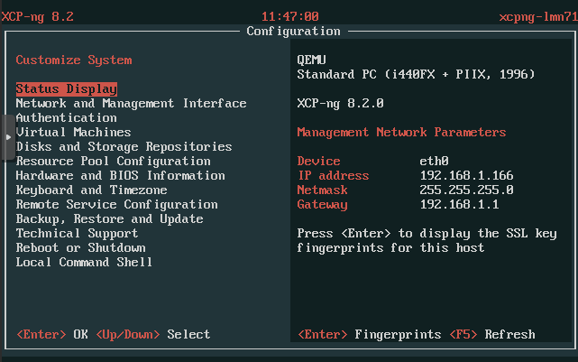

Du solltest nun mit dem XCP-ng Host eine Internet-Verbindung haben. Aktualisiere den Host zunächst. Rufe dazu in der Konsole den Menüpunt ``Local Command Shell`` auf.

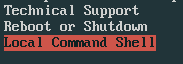

Du gelangst zur Eingabekonsole. Gebe das Kennwort des Benutzers ``root`` an. Danach gibst du folgenden Befehl ein:

.. code::

  yum update

Liegen Aktualisierungen vor, so werden diese aufgelistet und zur Aktualisierung bestätigst du die Rückfrage mi t ``y``.

Starte den XCP-ng-Host danach einmal neu, indem du in der Konsole folgenden Befehl angibst:

.. code::

   reboot

XCP-ng einrichten
-----------------

Für die Administration deines XCP-ng-Hosts benötigst du nun, einen Windows-Rechner lokalen Netzwerk auf dem das Programm ``XCP-ng Center`` installiert ist. Hiermit kannst du die gesamte Virtualisierungsumgebung administrieren und linuxmuster v7.1 installieren.

XCP-ng Center unter Windows installieren
^^^^^^^^^^^^^^^^^^^^^^^^^^^^^^^^^^^^^^^^

Installiere das Programm (siehe ``Downloads-Links``) durch einen Rechtsklick auf die MSI-Datei auf dem Windows-Rechner und  wähle dann ``Als Administrator ausführen`` aus.

.. figure:: media/25_xcp-ng-admin_execute-as-administrator.png
   :align: center
   :alt: Installation XCP-ng Center

Bestätige die Rückfrage mit ``Ja``

.. figure:: media/26_xcp-ng-admin_confirm.execution-of-xcp-ng-center.png
   :align: center
   :alt: 2. Teil: Installation XCP-ng Center

Rufe nach erfolgreicher Installation das Programm ``XCP-ng Center`` auf.

Wähle hier den Menüpunkt ``Add New Server`` und gebe die bei der Installation vergebene IP-Adresse des XCP-Hosts sowie die Benutzerdaten an.

.. figure:: media/27_xcp-ng-admin_add_new_server.png
   :align: center
   :alt: 3. Teil: Hinzufügen des XCP-ng-Hosts

Netzwerk einrichten
^^^^^^^^^^^^^^^^^^^

Jetzt muss das Netzwerk eingerichtet werden. Notiere dir hierzu die Bezeichnungen und MAC-Adressen der eingebauten Netzwerkkarten. Diese findest du unter der Reiterkarte ``NICs``. Die Netzwerkkarte, die die Verbindung zum Internet übernehmen soll, wird später dem Netzwerk ``Red``, diejenige für das interne Schulungsnetz dem Netzwerk ``Green`` und die dritte Netzwerkkarte (sofern vorhanden) für das WLAN - dem Netzwerk ``Blue`` zugeordnet.

Damit dies korrekt erfolgt, ist es wichtig zu wissen, wie NIC 0,1,2 physikalisch angeschlossen sind
und welche MAC-Adressen diese aufweisen. Anhand der Informationen erfolgt dann im folgenden Schritt
die Zuordnung der Netze (vSwitche).

Wähle nun für den XCP-ng-Host die Reiterkarte ``Networking`` aus.

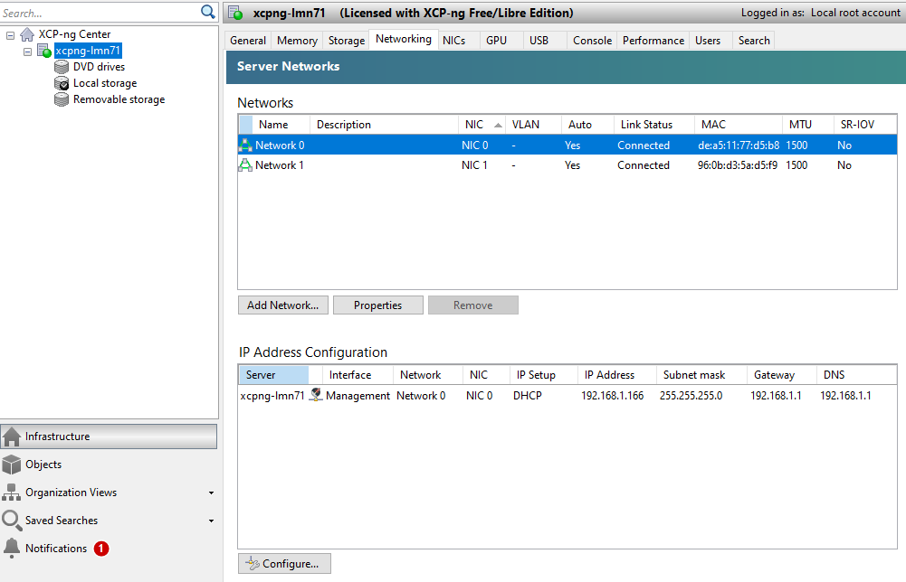

Wähle das erste Netwerk ``Network 0`` aus, prüfe die Zuordnung der Netzwerkkarte (MAC-Adresse und physikalische Verkabelung beachten). Es sollte diejenige NIC diesem vSwitch zugewiesen sein, die die Verbindung in das externe Netz steuert. In der Abb. ist dies NIC0, die dem Network0 zugeordnet ist. Der Name des vSwitches Network0 wird nun geändert. Klicke dazu auf ``Properties`` und ändere den Namen für das Netzwerk in ``RED``.

Führe diese Schritte ebenfalls für die weiteren Netze (BLUE - WLAN Netz und GRENN - internes Netz) aus und ändere die Namen auf ``BLUE`` und ``GREEN``. In der Abb. ist NIC1 dem vSwitch Network1 zugeordnet und so verkabelt, dass hiermit das interne Netzwerk angesteuert wird, so dass dieses nun mit dem Namen ``GREEN`` anzugeben ist.

Vorbereiten des ISO-Speichers
=============================

Um die v7.1 zu installieren, müssen zwei virtuelle Maschinen angelegt werden. OPNSense und Ubuntu Server 18.04 LTS werden in die VMs installiert.
Dazu ist es erforderlich, dass du die ISO-Images für OPNSense und Ubuntu Server 18.04 LTS auf den Windows-PC, mit dem du den XCP-ng-Hypervisor verwaltest, lädst. Im Anschluss erstelst du einen ISO Speicher (ISO SR) auf dem XCP-ng Host und lädst die beiden ISO-Dateien dorthin.

OPNsense
--------

Lade daher die Datei zunächst auf deinen PC/Laptop herunter, entpacke die Datei und lade diese ann auf den ISO-Datenspeicher von Proxmox hoch.

Lade mit dem Windows PC die ``OPNSense`` herunter und entpacke die Datei: 

.. code::

  https://mirror.informatik.hs-fulda.de/opnsense/releases/21.7/OPNsense-21.7.1-OpenSSL-dvd-amd64.iso.bz2

Entpacke die Datei, so dass eine ISO-Datei vorliegt.

Ubuntu Server
-------------

Lade die ISO-Datei für Ubuntu Server 18.04.6 LTS lokal auf deinen PC/Laptop:

.. code::
   
   https://releases.ubuntu.com/bionic/ubuntu-18.04.6-live-server-amd64.iso

Sind beide ISO Images lokal auf dem Windows-PC verfügbar, nun richtest du den ISO-SR auf dem XCP-ng-Host ein.

ISO SR anlegen
--------------

Für XCP-ng benötigst du einen externen Speicher z.B. ein NAS, auf dem eine NFS-Freigabe oder eine SMB-Freigabe für den XCP-ng Host erstellt wurde und auf die der Host zugreifen kann.

Als Beispiel wird nachstehend die Einbindung eines NFS-Share als ISO-Repository beschrieben.
Du richtest vorab auf dem NAS-Speicher eine NFS-Freigabe ein, so dass der XCP-ng Host hierauf zugreifen kann.

Dies kann auf dem NFS-Speicher so umgesetzt werden, wie z.B. nachstehend dargestellt (am Beispiel eines NAS von Qnap):

1. NFS-Share einrichten

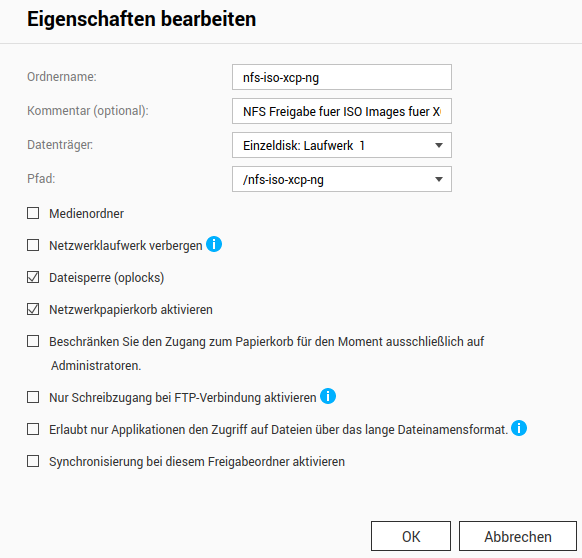

2. Rechts für das NFS-Share festlegen

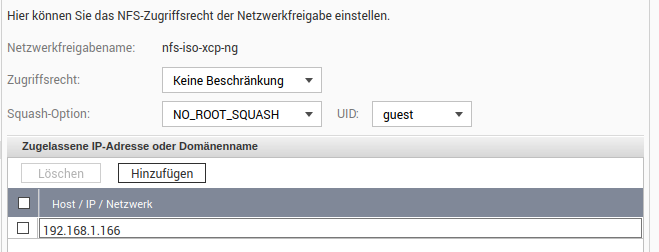

Jetzt bindest du diesen NFS-ISO Speicher in XCP-ng ein. Um den Speicher für ISO-Images in XCP-ng anzulegen, klickst du auf den XCP-ng Host und klickst den Button ``New Storage``.

Danach wählst du in dem Fenster ``ISO Library -> NFS ISO``.

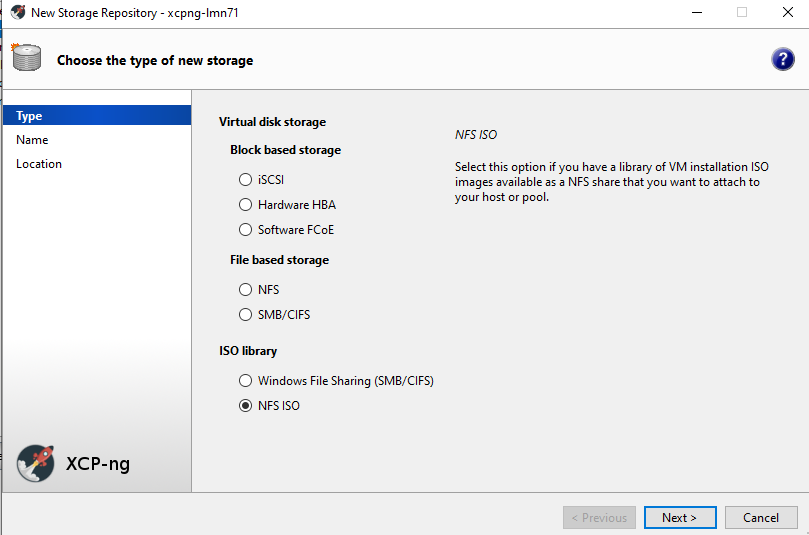

Lege eine Bezeichnung für das ISO-Repository fest:

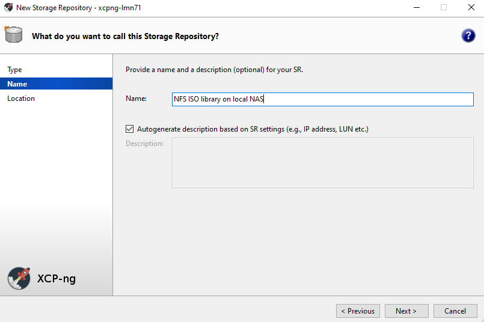

Nachdem du ``Next`` gewählt hast, gibst du die IP-Adresse und deen Freigabename des NFS-Share sowie das unterstützte NFS-Protokoll an:

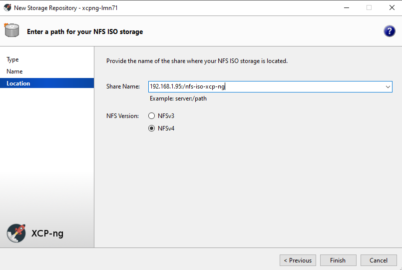

Nachdem du mit ``Finish`` den vorgang bestätigst hast, erscheint der neue NFS ISO Speicher link in der Liste:

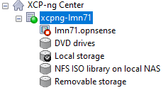

ISO Images auf den SR legen
---------------------------

Die heruntergeladenen ISO Images musst du nun auf den NFS ISO Speicher hinzufügen.

Rufe im Browser die Adresse deines NAS-Geräts auf und lade die beiden ISO-Dateien in das Verzeichnis, das du zuvor für diese NFS-Freigabe angelegt hast.

Nach Abschluss des Uploads markierst du links im Menü des XCP-ng Center die ISO library und rechts klickst du oben auf die Reiterkarte ``Storage``. Es werden die dann die bereitgestellten ISO-Dateien angezeigt.

Wie z.B. hier:

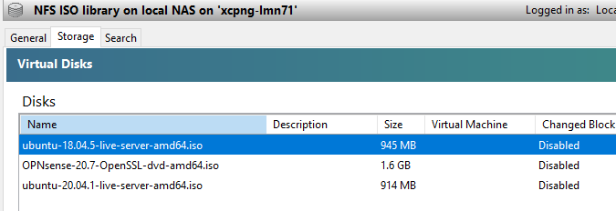

Jetzt kannst du die VMs vorbereiten.

Vorbereiten der Virtuellen Maschinen
====================================

Anlegen der VM für OPNsense
---------------------------

Um für die OPNsense Firewall eine VM anzulegen, wählst du im XCP-ng Center oben im Menü den Button ``New VM``.

Danach wählst als Template ``Other Instal Media``.

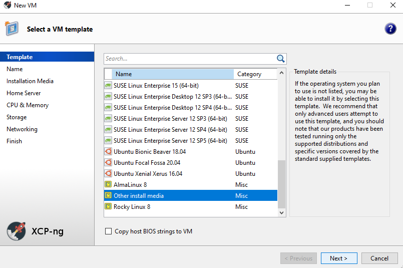

Lege einen Namen für die neue VM fest.

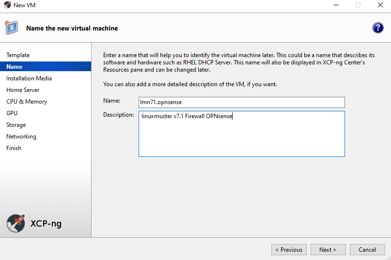

Wähle danach das Installations-Medium aus ``DVD Drive 0``

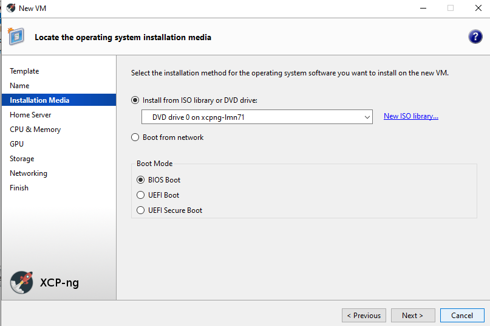

Mit ``Next`` gelangst du zur Angabe, auf welchem Virtualisierungs-Host die VM laufen soll. Dies ist der zuvor eingerichtete Host.

.. figure:: media/32_xcp-ng-_new-vm-opnsense4.png
   :align: center
   :alt: New VM: OPNsense 4

Danach gibst du die vCPUs an sowie den Speicher, der der VM zugeordnet werden soll.

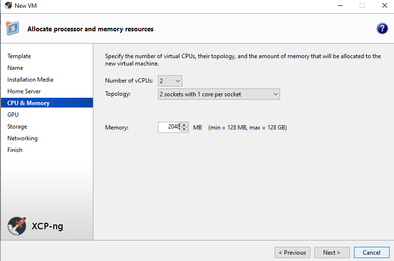

Danach wird die Grafikeinheit abgefragt und dann kommst du zur Angabe des Festplattenspeichers. Füge hier mit ``Add`` eine HDD mit 10 GiB für OPNsense hinzu.

.. figure:: media/34_xcp-ng-_new-vm-opnsense6.png
   :align: center
   :alt: New VM: OPNsense 6

Danach gibst zu mind. zwei Netzwerkkarten an. Welchem Netzwerk diese zugeordnet sind, siehst Du in der Spalte Network. Hier escheinen die Bezeichnungen, die die zuvor bei der Einrichtung des XCP-ng Hosts angepasst hast.

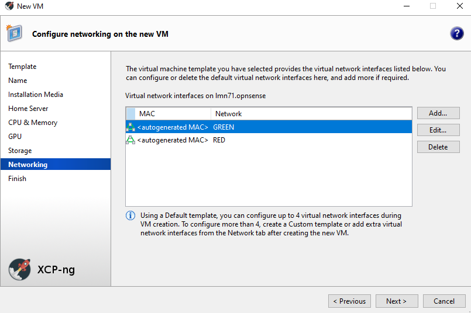

Zum Abschluss siehst du alle Einstellungen nochmals im Überblick und kannst ggf. bei erforderlichen Änderungen nochmals zurückgehen.

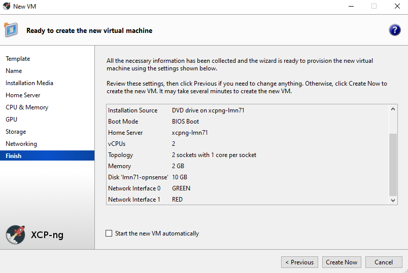

Deaktiviere die Option ``Start the new VM automatically`` bevor du die Anlage der neuen VM mit dem Button ``Create Now`` bestätigst.

Nach erfolreicher Anlage der neuen VM siehst du diese im XCP-ng Center dem Host zugeordnet.

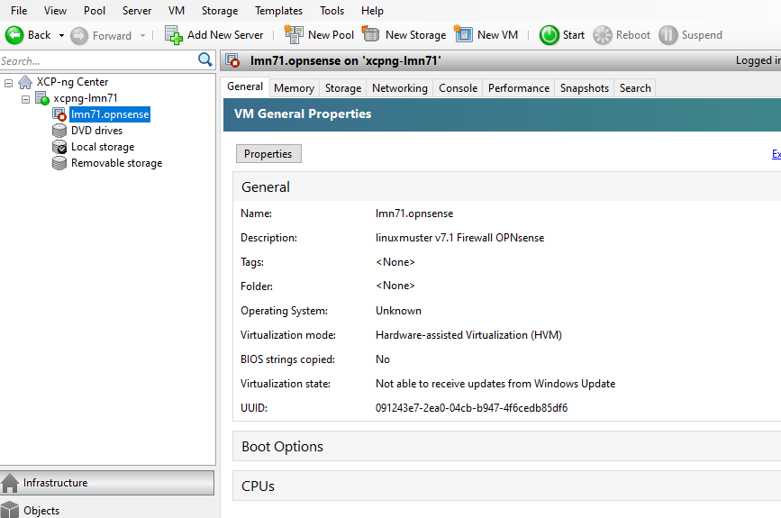

Kontrolliere die Einstellungen für die VM nochmals anhand der Reiterkarten ``Memory``, ``Storage`` und ``Networking``. 

Für die Installation von OPNsense must du noch die ISO-Datei, die auf dem NFS ISO Repository liegt als DVD einbinden und die Boot-Reihenfolge so ändern, dass die VM von CD/DVD bootet.

Markiere die VM und klicke auf die Reiterkarte ``Console``. Klicke auf das Drop-down menü des ``DVD Drive 1``.

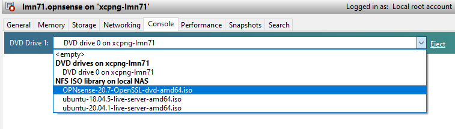

Um die Boot-Reihenfolge zu ändern, klickst du auf die Reiterkarte ``General``. Danach klickst du auf ``Properties`` und wählst links in der Liste den Eintrag ``Boot Options`` aus. Rechts im Fenster änderst du die Boot order so, dass DVD-Drive an oberster Stelle steht.

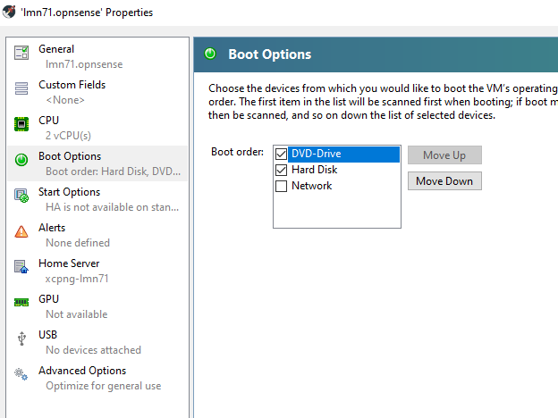

Mit ``Ok`` bestätigst du den Vorgang.

Die eigentliche Installation von OPNsense in der VM folgt später und ist hier dokumentiert :ref:`install-from-scratch-label`

Anlegen der VM für linuxmuster server
-------------------------------------

Um für die den linuxmuster.net Server v7.1 eine VM anzulegen, wählst du im XCP-ng Center oben im Menü den Button ``New VM``.

1. Danach wählst du als Template ``Ubuntu Bionic Beaver 18.04`` aus.
2. Lege einen Namen für die neue VM fest (z.B. lmn71.server.
3. Wähle danach das Installations-Medium aus. Klicke auf das Dropdown-Menü von ``DVD Drive 0`` und wähle hier aus dem vorher angelegten NFS ISO library die Ubuntu Server 18.04 LTS ISO-Datei aus.
4. Mit ``Next`` gelangst du zur Angabe, auf welchem Virtualisierungs-Host die VM laufen soll. Dies ist der zuvor eingerichtete Host.
5. Danach gibst du die vCPUs an sowie den Speicher, der der VM zugeordnet werden soll.
6. Danach wird die Grafikeinheit abgefragt. Danach kommst du zur Angabe des Festplattenspeichers. Füge hier mit ``Add`` zwei HDDs hinzu: Eine mit 25 GiB und eine mit 100 GiB.

.. figure:: media/40_xcp-ng-_new-vm-server-hdd.png
   :align: center
   :alt: New VM: Server HDDs

7. Danach gibst eine Netzwerkkarten an. Welchem Netzwerk diese zugeordnet sind, siehst Du in der Spalte Network. Hier escheinen die Bezeichnungen, die die zuvor bei der Einrichtung des XCP-ng Hosts angepasst hast. Für den Server muss hier ``GREEN`` stehen.

Zum Abschluss siehst du alle Einstellungen nochmals im Überblick und kannst ggf. bei erforderlichen Änderungen nochmals zurückgehen.

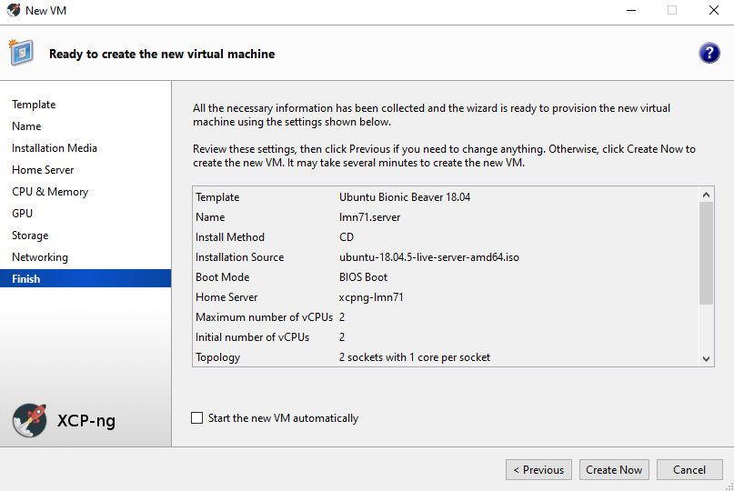

Deaktiviere die Option ``Start the new VM automatically`` bevor du die Anlage der neuen VM mit dem Button ``Create Now`` bestätigst.

Nach erfolreicher Anlage der neuen VM siehst du diese im XCP-ng Center dem Host zugeordnet.

Kontrolliere die Einstellungen für die VM nochmals anhand der Reiterkarten ``Memory``, ``Storage`` und ``Networking``.

Um die Boot-Reihenfolge zu ändern, klickst du auf die Reiterkarte ``General``. Danach klickst du auf ``Properties`` und wählst links in der Liste den Eintrag ``Boot Options`` aus. Rechts im Fenster änderst du die Boot order so, dass DVD-Drive an oberster Stelle steht.

Mit ``Ok`` bestätigst du den Vorgang.

Die eigentliche Installation des Servers in der VM ist hier dokumentiert :ref:`install-from-scratch-label`

