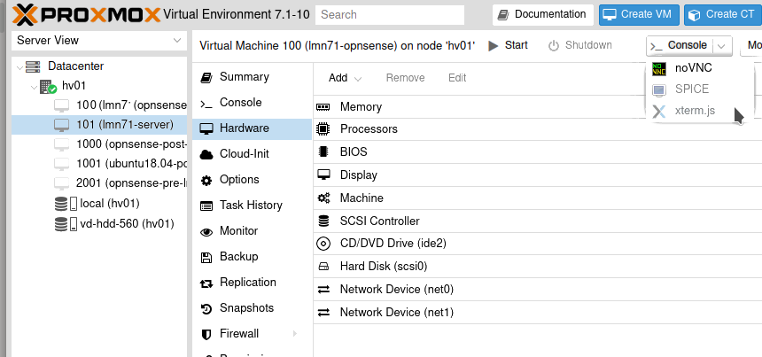
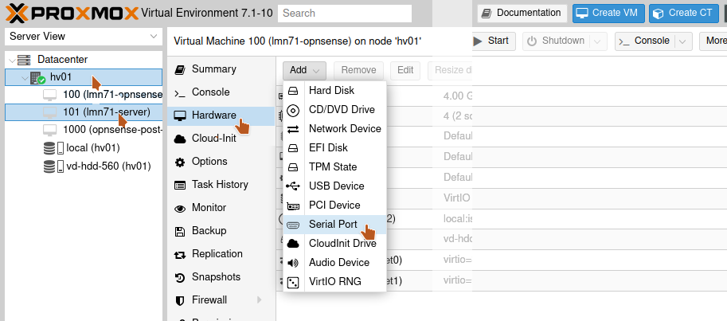

.. |zB| unicode:: z. U+00A0 B. .. Zum Beispiel

.. |dh| unicode:: d. U+00A0 h. .. das heisst
  
.. |ua| unicode:: u. U+00A0 a. .. und andere

.. |_| unicode:: U+202F .. geschütztes Leerzeichen
   :trim:

.. |...| unicode:: U+2026 .. Auslassungszeichen
   :trim:

.. |copy| unicode:: 0xA9 .. Copyright-Zeichen
   :ltrim:

.. |reg| unicode:: U+00AE .. Trademark
   :ltrim:

.. include:: /guided-inst.subst

.. _install-on-proxmox-label:

===================
Proxmox vorbereiten
===================

.. sectionauthor:: `@cweikl <https://ask.linuxmuster.net/u/cweikl>`_,
                   `@MachtDochNix <https://ask.linuxmuster.net/u/MachtDochNix>`_

Hinweise
--------

Für diese Anleitung haben wir uns entschieden, Proxmox als Virtualisierungslösung einzusetzen.

Alternativ installierst du von Grund auf die Serverbetriebssysteme
*Ubuntu Server* und *OPNsense®* direkt auf der Hardware oder innerhalb
deiner Virtualisierungslösung. Hinweise auf andere Virtualisierungslösungen finden sich im Anwenderwiki von linuxmuster.net:

1. XCP-ng: https://wiki.linuxmuster.net/community/anwenderwiki:virtualisierung:xcpng:xcpng4lmn71
2. KVM:  https://wiki.linuxmuster.net/community/anwenderwiki:virtualisierung:kvm:kvm4lmn71

Proxmox ist eine Open Source-Virtualisierungsplattform. Diese kombiniert KVM- und Container-basierte Virtualisierung und verwaltet virtuelle Maschinen, Container, Storage, virtuelle Netzwerke und Hochverfügbarkeit-Cluster übersichtlich über die zentrale Managementkonsole.

Das web-basierte Verwaltungs-Interface läuft direkt auf dem Server. Zudem kann die Virtualisierungsumgebung via SSH administriert werden.

Proxmox
-------

Proxmox VE eignet sich für den virtuellen Betrieb von linuxmuster.net besonders, da dieser Hypervisor dem Open-Source-Konzept entspricht. Der Einsatz wird auf jeglicher Markenhardware unterstützt und es gibt zahlreiche professionelle 3rd-Party Software für Backup-Lösungen und andere Features. „No-Name-Hardware“ kann hiermit ebenfalls meist verwendet werden.

Diese Anleitung beinhaltet Angaben zu den notwendigen Systemanforderungen und Festplattenkonfigurationen sowie der anschließenden Installation von Proxmox.

Systemvoraussetzungen
=====================

In der unten aufgeführten Tabelle findest du die Systemvoraussetzungen zum Betrieb der virtuellen Maschinen. Die Systemanforderungen für die Installation von Proxmox selbst finden sich im Web unter https://www.proxmox.com/de/proxmox-ve/systemanforderungen. 

Die Werte bilden die Mindestvoraussetzungen zur Planung. Für die Installation mit Proxmox und linuxmuster v7.1 wird als Standard der ``IP-Bereich 10.0.0.0/16`` genutzt.

============ ============= ================= =====
VM           IP            HDD               RAM 
============ ============= ================= =====
OPNsense®    10.0.0.254/16 10 GiB            4 GiB
Server       10.0.0.1/16   25 GiB u. 100 GiB 4 GiB
Proxmox-Host 10.0.0.10/16  500 GiB           4 GiB
============ ============= ================= =====

Die Festplattengröße sowie der genutzte RAM der jeweiligen VMs kann ggf. vor deren Einrichtung einfach an die Bedürfnisse der Schule angepasst werden.

Bevor du dieses Kapitel durcharbeitest, lese bitte zuerst die Abschnitte
  + :ref:`what-is-linuxmuster.net-label`
  + (:ref:`what-is-new-label`)
  +  :ref:`install-overview-label`
  +  :ref:`prerequisites-label`

Für den Betrieb des Hypervisor selbst (Proxmox VE) sollten ca. 2 bis 6 GB Arbeitsspeicher eingeplant werden. Um nach Anleitung installieren zu können, sollte der Server mit mindestens zwei Netzwerkkarten bestückt sein. Durch VLANs kann der Betrieb aber auch bereits mit nur einer NIC erfolgen, bspw. 10 Gbit-Karte an einem Core-VLAN-Switch (L3).

Der Proxmox-Host sollte gemäß o.g. Minimalanforderungen folgende Merkmale aufweisen:

  * RAM gesamt: min. 16 GiB (besser: 32 GiB)
  * Erste HDD: min. 100 GiB für Proxmox selbst
  * Zweite HDD: für die VMs mit mind. 500 GB Kapazität (besser: 1 TiB oder 2 TiB)
  * Zwei Netzwerkkarten
  * Der Internetzugang des Proxmox-Hosts sollte zunächst gewährleistet sein, |dh| dieser wird |zB| an einen (DSL-)Router angeschlossen, der den Internetzugang sicherstellt. Sobald alles eingerichtet ist, bekommt der Proxmox-Host eine IP-Adresse im Schulnetz und die Firewall OPNsense® stellt den Internetzugang für alle VMs und den Proxmox-Host bereit.

.. hint:: 

   Virtualisierungs-Hosts sollten grundsätzlich niemals im gleichen Netz wie andere Geräte sein, damit dieser nicht von diesen angegriffen werden kann. In dieser Dokumentation wird zur Vereinfachung der Fall dokumentiert, dass der Proxmox-Host zu Beginn im externen Netz mit Internet-Zugriff und nach Abschluss der Installation im internen Schulnetz mit Internet-Zugriff via OPNsense®-Firewall befindet. 

Bereitstellen des Proxmox-Hosts
===============================

.. hint:: 

   Der Proxmox-Host bildet das Grundgerüst für die Firewall *OPNsense®* und
   den Schulserver *server*. Die Virtualisierungsfunktionen der CPU sollten 
   zuvor im BIOS aktiviert worden sein.

Die folgende Anleitung beschreibt die *einfachste* Implementierung ohne Dinge wie VLANs, Teaming oder RAID. Diese Themen werden in zusätzlichen Anleitungen betrachtet.

* :ref:`Anleitung Netzwerksegmentierung <subnetting-basics-label>` 

Die Download-Quellen für den Proxmox-Host selbst finden sich hier:

https://www.proxmox.com/de/downloads/category/iso-images-pve/

Dort findet sich das ISO-Image zur Installation von Proxmox.

Lade dir dort das aktuellste Image herunter und erstelle dir einen bootfähigen USB-Stick zur weiteren Installation.

Erstellen eines USB-Sticks zur Installation des Proxmox-Host
------------------------------------------------------------

Nachdem du die ISO-Datei für Proxmox heruntergeladen hast, wechselst du in das Download-Verzeichnis. Danach ermittel du den korrekten Buchstaben für den USB-Stick unter Linux. X ist durch den korrekten Buchstaben zu ersetzen und dann ist nachstehender Befehl als Benutzer *root* oder mit einem *sudo* vorangestellt einzugeben:

.. code-block:: console
 
   dd if=proxmox-ve_7.1-2.iso of=/dev/sdX bs=1M status=progress conv=fdatasync
   
Verkabelungshinweise
--------------------

Es ist für linuxmuster.net ein internes Netz (grün) und ein externes Netz (rot) am Proxmox-Host zu unterscheiden. 
Sind zwei Netzwerkkarten im Proxmox-Host vorhanden, so ist die erste Netzwerkkarte (|zb| eth0, eno1 oder enp7s0), die zu 
Beginn eine IP aus dem bestehenden lokalen Netz (|zb| via DSL-Router) erhalten soll, mit dem Switch zu verbinden, der an den (DSL-)Router angeschlossen ist.

Die zweite Netzwerkkarte (|zb| eth1 oder enp7s1) ist dann an einen eigenen Switch anzuschließen, ebenso wie alle Clients, die im internen Netz eingesetzt werden. 

Um zu Beginn den Proxmox-Host zu administrieren, ist ein Laptop mit dem Switch zu verbinden, der an den lokalen (DSL-)Router angeschlossen ist. Der Laptop erhält ebenfalls eine IP aus dem lokalen (DSL-)Netz und kann sich dann auf die zu Beginn eingerichtete IP-Adresse des Proxmox-Host auf die grafische Verwaltungsoberfläche verbinden. 

.. figure:: media/install-on-proxmox_01_network-4-proxmoc-installation.svg
   :align: center
   :alt: Netzwerk für die Proxmox Installation

Installieren von Proxmox
========================

Basis-Installation
------------------

Vom USB-Stick booten, danach erscheint folgender Bildschirm:

.. figure:: media/install-on-proxmox_02_boot-menu.png
   :align: center
   :alt: Proxmox Boot-Menu 

Wähle ``Install Proxmox VE`` und starte die Installation mit ``ENTER``.

.. figure:: media/install-on-proxmox_03_eula.png
   :align: center
   :alt: Proxmox Nutzervereinbarung

Bestätige das ``End-User Agreement`` mit ``Enter``.

.. figure:: media/install-on-proxmox_04_target-harddisk.png
   :align: center
   :alt: Proxmox Installation Wahl der Festplatten

Wähle die gewünschte Festplatte auf dem Server zur Installation aus. Hast du mehrere einzelne Festplatten im Server verbaut und kein RAID-Verbund definiert, so kannst du auf dieser Stelle mithilfe der Schaltfläche `Optionen` weitere Einstellungen aufrufen. Hier kannst du |zb| mehrere Festplatten angeben, die in einem sog. ZFS-Pool definiert werden sollen. Dies ist für das Erstellen von sog. Snapshots von Vorteil. Soll aber an dieser Stelle nicht vertieft werden. 
(siehe hierzu |ua|: https://pve.proxmox.com/pve-docs/pve-admin-guide.html)

Nun bei den ``Location- and Time-Settings``, nachdem du Germany ausgewählt hast, `Next` wählen:

.. figure:: media/install-on-proxmox_05_location-and-time-zone.png
   :align: center
   :alt: Proxmox Installation Zeitzone 

Lege ein Kennwort für den Administrator des Proxmox-Host und eine E-Mail-Adresse fest. Klicke auf `Weiter`.

.. figure:: media/install-on-proxmox_06_admin-password.png
   :align: center
   :alt: Proxmox Installation Admin-Passwort

Lege die IP-Adresse des Proxmox-Host im internen Netz fest. Solltest du intern |zb| auf dem (DSL-)Router einen
DHCP-Server laufen haben, dann erhältst du hier bereits eine vorausgefüllte Konfigurationsseite. Passe diese Werte nun den gewünschten Werten an. Der Hostname des Proxmox-Host ist hier in gewünschter Form - hier `hv01.linuxmuster.lan` -
anzugeben.

.. hint::

   Diese muss zu diesem Zeitpunkt der Installation diejenige Adresse sein, die ebenfalls Zugriff auf das Internet hat.
   In einem lokalen Netz mit DSL-Router wäre dies eine IP-Adresse aus dem internen Netz, die der Router für die internen Clients 
   verteilt - also |zb| 192.168.199.20/24. DNS- und Gateway-Adressen entsprechen der Router-IP.

Hier wurde die interne IP-Adresse `192.168.199.20/24` festgelegt.

.. figure:: media/install-on-proxmox_07_network-configuration.png
   :align: center
   :alt: Proxmox Installation Netzwerk Konfiguration

Überprüfe auf der Übersichtsseite, dass alle Angaben korrekt sind und fahre anschließend fort.

.. figure:: media/install-on-proxmox_08_install-summary.png
   :align: center
   :alt: Proxmox Installation Übersicht

Warte den Abschluss der Installation ab.

.. figure:: media/install-on-proxmox_09_install-success.png
   :align: center
   :alt: Proxmox Installation erfolgreich beendet

Nach erfolgreicher Installation lasse Proxmox über `Reboot` neu starten.

Proxmox Einrichtung
-------------------

Nach dem Neustart von Proxmox kannst du dich über einen PC, welcher sich im selben Netz befindet, via Browser auf das grafische Webinterface zur Verwaltung des Proxmox-Hosts aufschalten. Hierzu gibst du die URL https://192.168.199.20:8006 ein. Du erhältst ein "Warning", da ein mögliches Sicherheitsrisiko erkannt wurde. Dies ist auf das selbst ausgestellte SSL-Zertifikat des Proxmox-Host zurückzuführen. 

Klicke auf ``Erweitert ...``, es erscheint ein weiterer Hinweis auf das "self-signed certificate". Dieses nimmst du nun mit dem Button ``Risiko akzeptieren und fortfahren`` an.

Es erscheint die Anmeldemaske des Proxmox-Webinterface. Melde dich als User ``root`` und dem vorher gesetzten Passwort an:

.. figure:: media/install-on-proxmox_10_proxmox-login.png
   :align: center
   :alt: Proxmox Web-UI Login

Im Fenster `No valid subscription` wählst du `OK` um das Fenster schließen:

.. figure:: media/install-on-proxmox_11_no-valid-subscription.png
   :align: center
   :alt: Proxmox No valid subscription

Updates ermöglichen
-------------------

Um Proxmox Updates installieren zu können, müssen in der Shell des Nodes hv01 folgende Änderungen an den Repositorien vorgenommen werden. Dafür den Node im Datacenter auswählen und eine Shell öffnen.

.. figure:: media/install-on-proxmox_12_open-shell.png
   :align: center
   :alt: Proxmox Open Shell

Folgende vier Befehle müssen der Reihe nach ausgeführt werden:

.. code::

   sed -i -e 's/^/#/' /etc/apt/sources.list.d/pve-enterprise.list

.. code::

   echo "deb http://download.proxmox.com/debian/pve bullseye pve-no-subscription" >> /etc/apt/sources.list.d/pve-no-subscription.list

.. hint:

   Falls du die beiden Befehl via copy&paste übernimmst, prüfe, ob in der Eingabekonsole die Hochkommata erhalten bleiben.

.. code::

   apt update

.. code::

   apt upgrade -y
   
Netzwerkbrücken einrichten
--------------------------

Für eine funktionierende Umgebung müssen ``zwei Netzwerkbrücken/Bridge (vSwitch)`` auf dem Hypervisor eingerichtet werden.

Eine für das ``interne Netz (green, 10.0.0.0/16)`` und eine für das ``externe Netz (red, externes Netz, Internetzugriff)``. 

Nach der zuvor beschriebenen Erstinstallation von Proxmox wurde bislang nur eine sogenannte Bridge (vmbr0) eingerichtet. Diese ist mit der ersten Netzwerkschnittstelle (NIC) des Proxmox-Hosts verbunden. Das Ethernet-Kabel der 1. NIC ist mit dem (DSL)-Router verbunden. Verlief der vorherige Befehl zur Aktualisierung von Proxmox erfolgreich, so weißt du, dass diese Bridge bereits funktioniert und für die weitere Nutzung für das ``externe Netz (red) - vmbr0`` genutzt werden kann.

Für die internen virtuellen Netze ist also eine zweite Bridge zu erstellen, die an die zweite Netzwerkkarte direkt gebunden wird. Dieser wird allerdings keine IP-Adresse zugeordnet. 

Ausgangspunkt: ``Host hv01`` --> ``Network``

Die bisherige Netzwerkkonfiguration stellt sich wie folgt dar:

.. figure:: media/install-on-proxmox_13_network.png
   :align: center
   :alt: Proxmox-Übersicht hv01 - Network

Für die folgende Überprüfung öffnest du nochmals die Konsole auf dem Hypervisor hv01, falls sie nicht geöffnet sein sollte, wie oben beschrieben und lässt dir den Inhalt der Konfigurationsdatei anzeigen mittels:

.. code:: 

   cat /etc/network/interfaces
   
Dort befinden sich bisher folgende Eintragungen:

.. code::

  auto lo
  iface lo inet loopback

  iface eno1 inet manual

  auto vmbr0
  iface vmbr0 inet static
        address 192.168.199.20
        netmask 255.255.255.0
        gateway 192.168.199.1
        bridge_ports eno1
        bridge_stp off
        bridge_fd 0

  iface eno2 inet manual

.. hint::

   Die Bezeichnungen für die Netzwerkkarten eno1, eno2 können je nach eingesetztem System von der dargestellten Bezeichnung abweichen.

Für das weitere Vorgehen ist es hilfreich, die Funktion der Kommentierung der Netzwerkbrücken zu nutzen.
Diese ist für die vmbr0 bisher noch nicht gesetzt.

.. figure:: media/install-on-proxmox_13_network-vmbr0.png
   :align: center
   :alt: Proxmox-Übersicht hv01 - Network-vmbr0-edit

Markiere wie gezeigt ``vmbr0`` und betätige den ``Edit``-Button, um das Konfigurationsfenster zu öffnen. 

.. figure:: media/install-on-proxmox_13_network-vmbr0-comment.png
   :align: center
   :alt: Proxmox-Übersicht hv01 - Network-vmbr0-comment

Trage unter ``Comment`` einen Kommentar ein, der veranschaulicht, dass diese Brücke die Verbindung zum Internet stellt. Zum Beispiel wie hier gezeigt ``red``, den bei uns historisch gewachsenen Begriff für dieses Interface.

Mit `OK` wird der Kommentar übernommen.

####

Nun erstellst du die zweite Bridge ``vmbr1``:

Dazu wähle das Menü ``Datacenter`` --> ``hv01`` --> ``Network`` -->  ``Create`` --> ``Linux Bridge``

.. figure:: media/install-on-proxmox_14_network-add-bridge.png
   :align: center
   :alt: Proxmox-Übersicht hv01 - Network - Create - Linux Bridge

Es öffnet sich ein neues Fenster. Dort sind folgende Einträge nötig:

.. figure:: media/install-on-proxmox_15_create-linux-bridge.png
   :align: center
   :alt: Proxmox Create:Linux-Bridge

Mit `Create` wird die Brücke erstellen.

Anschließend Proxmox über den Button ``Reboot`` oben rechts neu starten, um die neue Netzwerkkonfiguration zu laden. Node hv01 muss dafür im Menü ``Datacenter`` links ausgewählt sein:

.. figure:: media/install-on-proxmox_16_reboot.png
   :align: center
   :alt: Proxmox reboot

Die Netzwerkkonfiguration des Proxmox-Host kannst du, nach dem Neustart mit ``cat /etc/network/interfaces`` wie oben gezeigt in der Konsole überprüfen.

Dort sollten sich nun nachstehende Eintragungen befinden. Bei der Bridge ``vmbr0`` muss die IP-Adresse derjenigen entsprechen, die bei der Installation eingetragenen wurde.

.. code::

  auto lo
  iface lo inet loopback

  iface eno1 inet manual

  iface eno2 inet manual

  auto vmbr0
  iface vmbr0 inet static
        address 192.168.199.20/24
        gateway 192.168.199.1
        bridge-ports eno1
        bridge-stp off
        bridge-fd 0
  #red  

  auto vmbr1
  iface vmbr1 inet manual
        bridge-ports eno2
        bridge-stp off
        bridge-fd 0
  #green

Zur Veranschaulichung eine Grafik, die den Status der Konfiguration zeigt.

.. figure:: media/install-on-proxmox_17_network-eno2.svg
   :align: center
   :alt: eno2 Schnittstelle hinzugefügt

(Optional) Festplatten anpassen
-------------------------------

*Zweiten Datenträger als Speicher einbinden*

In diesem Schritt wird die zweite Festplatte in Proxmox eingebunden, um diese als Storage für die virtuellen Maschinen zu nutzen.

.. note::

   Die folgenden Schritte bitte nur dann ausführen, wenn nicht auf einem einzigen Volume Proxmox eingerichtet werden soll!

*local-lvm(hv01)-Partition entfernen und Speicher freigeben*

Während der Proxmox-Installation wurden die Storages „local“ und „local-lvm“ automatisch auf der ersten Festplatte erstellt. Da anfangs für die Linuxmuster-Maschinen eine zweite Festplatte als „Storage“ eingerichtet wurde, wird „local-lvm“ nicht benötigt. Deshalb wird nun „local-lvm“ entfernt und „local“ durch den freigewordenen Speicher vergrößert, sodass auf der ersten Festplatte der gesamte Speicher dem Hypervisor zur Verfügung steht.

1. auf hv01 oben rechts Shell anklicken:

.. figure:: media/install-on-proxmox_12_open-shell.png
   :align: center
   :alt: Shell aufrufen

2. ``lsblk`` eingeben und mit der Enter-Taste bestätigen; folgende Ausgabe sollte erscheinen:

.. figure:: media/install-on-proxmox_18_console-lsblk-default.png
   :align: center
   :alt: Proxmox Konsole Output lsblk default

Es ist zu sehen, dass die Festplatten sda (931.5G) und sdb (111.8G) vorhanden sind. Die erste Festplatte sda ist eine HDD mit 1 TByte Kapazität und soll nun für die VMs genutzt werden. Die zweite Festplatte ist eine SSD, auf der Proxmox selbst installiert wurde. Von dieser zweiten Platte startet dieses System automatisch Proxmox. Zudem findet sich auf `sdb3` ein sog. `LVM`. Bei der Erstinstallation wurde hier automatisch ein Bereich für die VMs eingerichtet.

Dieser Bereich wird im Folgenden gelöscht und der frei werdende Platz auf `sdb` wird vollständig dem Proxmox-Host zugeordnet. Danach wird die Festplatte `sda` als LVM für die VM eingerichtet.

3. Vorhandene local-lvm entfernen:

.. code::

   lvremove /dev/pve/data

.. figure:: media/install-on-proxmox_19_console-lvremote-question.png
   :align: center
   :alt: Proxmox Konsole Output lvremote question

Bestätige die Nachfrage mit ``y``

.. figure:: media/install-on-proxmox_20_console-lvremote-success.png
   :align: center
   :alt: Proxmox Konsole Output lvremote

4. Speicherbereich von local erweitern:

.. code::

   lvresize -l +100%FREE /dev/pve/root

.. figure:: media/install-on-proxmox_21_console-lvresiz-success.png
   :align: center
   :alt: Proxmox Konsole Output lvresize 

5. Filesystem anpassen:

.. code::

   resize2fs /dev/mapper/pve-root

.. figure:: media/install-on-proxmox_22_console-resize2fs.png
   :align: center
   :alt: Proxmox Konsole Output  

6. Über ``lsblk`` sollte nun zu sehen sein, dass pve-data-Partitionen entfernt wurden:

.. figure:: media/install-on-proxmox_23_console-lsblk-ready.png
   :align: center
   :alt: Proxmox Konsole Output lsblk 

Es ist zu erkennen, dass auf ``/dev/sdb3`` nur noch ``pve-swap`` und ``pve-root`` vorhanden sind. 

7. Auf der Weboberfläche von Proxmox ist der local-lvm Eintrag noch über ``Datacenter → Storage local-lvm (hv01)`` mit dem ``Remove``-Button grafisch zu entfernen:

.. figure:: media/install-on-proxmox_24_storage-default.png
   :align: center
   :alt:  Proxmox-Übersicht Festplatten default

Danach findest du noch folgenden Speicher:

.. figure:: media/install-on-proxmox_25_storage-after-remove.png
   :align: center
   :alt: Proxmox-Übersicht nach Löschung local-lvm

Die SSD ``/dev/sdb`` steht für den Proxmox-Host zur Verfügung.

*Zweiten Datenträger vorbereiten*

Die erste Festplatte heißt hier sda und ersetzt die pve-data-Partition, die im vorigen Schritt entfernt wurde. Um diese für Proxmox vorzubereiten, stellt man über Konsolenbefehle einige Konfigurationen ein. Falls die Shell noch nicht geöffnet ist, wie oben beschrieben, öffnen und folgende Befehle eingeben:

.. hint::

  Für folgende Schritte: Die Bezeichnungen vg-xxx & lv-xxx Namen solltest du auf deine Festplattengrößen 
  entsprechend anpassen, die folgenden Grafiken dienen zur Orientierung: `vg-hdd-1000` eignet sich 
  beispielsweise für ein Volume aus einer HDD mit 1 TByte Kapazität.

1. Datenträger vorher partitionieren, |zb| mit ``fdisk /dev/sda → g → n → w`` (über lsblk den richtigen Datenträgernamen herausfinden; in diesem Fall sda)

.. figure:: media/install-on-proxmox_26_console-fdisk.png
   :align: center
   :alt: Proxmox Konsole Output fdisk 

2. Jetzt eine neue Partition auf der Festplatte anlegen - ``pvcreate /dev/sd<xy>1``

Beispiel: 

.. code::

   pvcreate /dev/sda1

und anschließend mit ``y`` bestätigen:

.. figure:: media/install-on-proxmox_27_console-pvcreate.png
   :align: center
   :alt: Proxmox Konsole Output vgcreate 

3. Nun wird eine virtuelle Gruppe auf der ersten Partition der zweiten Festplatte eingerichtet: ``vgcreate vg-<disk>-<size> /dev/sd<xy>1``

Beispiel:

.. code::

   vgcreate vg-hdd-1000 /dev/sda1

.. figure:: media/install-on-proxmox_28_console-vgcreate.png
   :align: center
   :alt: Proxmox Konsole Output vgcreate vg-hdd

4. mit ``lvcreate -l 99%VG -n lv-<disk>-<size> vg-<disk>-<size>`` nun das logical volume erstellen. Hier ist die virtuelle Festplatte eine HDD mit 1 TByte Speicher, weshalb die Namen im Befehl so angepasst werden: 

Beispiel: 

.. code:: 

   lvcreate -l 99%VG -n lv-hdd-1000 vg-hdd-1000

.. figure:: media/install-on-proxmox_29_console-lvcreate.png
   :align: center
   :alt: Proxmox Konsole Output lvcreate

5. ``lvconvert --type thin-pool vg-<disk>-<size>/lv-<disk>-<size>`` konvertiert den Speicherbereich der erstellten virtual group als „thin-pool“:

Beispiel: 

.. code:: 

   lvconvert --type thin-pool vg-hdd-1000/lv-hdd-1000

.. figure:: media/install-on-proxmox_30_console-lvconvert.png
   :align: center
   :alt: Proxmox Konsole Output lvconvert

*Datenträger grafisch als Storage in Proxmox anbinden*

1. Im Menü `Datacenter > Storage > Add` wählt man „LVM-Thin“ aus. Im ID-Feld wird der Name des virtuellen Datenträgers angegeben. In diesem Fall ist es eine HDD mit 1 TByte Speicherkapazität, weshalb die Bezeichnung vd-hdd-1000 gewählt wird. Unter Volume Group die erstellte virtuelle Gruppe auswählen, welche hier vg-hdd-1000 ist:

.. figure:: media/install-on-proxmox_31_add-lvm-thin.png
   :align: center
   :alt: Hinzufügen von LVM-Thin 

2. Nun sollte im linken Menü der zweite Storage zu sehen sein, auf welchem die Maschinen für Linuxmuster installiert werden können:

.. figure:: media/install-on-proxmox_32_storage-ready.png
   :align: center
   :alt: Proxmox-Übersicht hv01 zweite Festplatte

Vorbereiten des ISO-Speichers
=============================

Um die v7.1 zu installieren, müssen zwei virtuelle Maschinen angelegt werden. OPNsense und Ubuntu Server 18.04 LTS werden in die VMs installiert.
Dazu ist es erforderlich, dass du die ISO-Images für OPNsense und Ubuntu Server 18.04 LTS auf den Proxmox-Hypervisor in den Datenspeicher für ISO-Images lädst.

.. figure:: media/proxmox-download-iso_01.png
   :align: center
   :alt: Proxmox way to folder ISO Images

Gehe dazu auf ``Datacenter`` --> ``<proxmox-host>`` --> ``Datenspeicher (auf local oder zfsfile)`` --> ``ISO Images`` --> ``Download from URL``

Ubuntu Server
-------------

In dem nun geöffneten Fenster trägst du die URL

.. code::
   
   https://releases.ubuntu.com/bionic/ubuntu-18.04.6-live-server-amd64.iso

ein (copy&paste). Anschließend betätigst du dann den Button ``Query URL``.

.. figure:: media/proxmox-iso-download-ubuntu_01.png
   :align: center
   :alt: Proxmox Download from URL

Wenn die Abfrage der URL positiv war, sollten sich die Felder ausgefüllt haben.

Zum Überprüfen der Datei-Integrität aktiviere ``Verify certificates``.

Wähle wie dargestellt: ``SHA-256`` und trage die Checksumme ein

.. code:: 
  
  6c647b1ab4318e8c560d5748f908e108be654bad1e165f7cf4f3c1fc43995934

Das Herunterladen des ISOs beginnt mit ``Download``.

.. figure:: media/proxmox-iso-download-ubuntu_02.png
   :align: center
   :alt: Proxmox download status

Zum Abschluss erfolgt die Überprüfung der Checksumme, die mit ``OK, checksum verified`` enden muss.

.. figure:: media/proxmox-iso-download-ubuntu_03.png
   :align: center
   :alt: Proxmox ISO Images verified

Nach dem Schließen des Fensters,

.. figure:: media/proxmox-iso-download-ubuntu_04.png
   :align: center
   :alt: Proxmox ISO Images folder view

befindet sich das heruntergeladene Ubuntu-ISO nun in dem ``ISO Images`` und steht dir für die weitere Verwendung zur Verfügung.

OPNsense
--------

Die zuvor gezeigte Möglichkeit des einfachen Importes mittels den Bordmitteln von Proxmox steht dir für die OPNsense |reg| leider nicht zur Verfügung, da nur der Download einer bz2-Datei möglich ist. Dir steht der Weg des Downloads auf einen lokalen PC, der Umwandlung des bz2-File in eine iso-Datei und dann der Upload über den dir im Abschnitt Ubuntu frei. Dabei wählst du dann nicht ``URL``, sondern ``Upload``.

Um dir den Upload zu ersparen, beschreiben wir hier den Weg, um die benötigten Dateien direkt in deine Proxmox-Maschine zu bringen:

Als Erstes startest du die Konsole ``xterm.js`` wie dargestellt

.. figure:: media/proxmox-shell-xterm_01_start.png
   :align: center
   :alt: Proxmox open xterm shell

Mit ihr hast du jetzt die Möglichkeit, mit Copy&Paste die folgenden Bash-Zeilen direkt zu übernehmen.

.. figure:: media/proxmox-shell-xterm_02_open_shell.png
   :align: center
   :alt: Proxmox xterm shell

Als Nächstes musst du in das Verzeichnis wechseln, wo Proxmox die ISO-Dateien sucht. Dazu kopierst du diese Zeile in das gezeigte Fenster. 

.. code::

   cd /var/lib/vz/template/iso

Mit ``[Enter]`` wechselt du dann in das Verzeichnis.

Dann musst du die folgenden vier Dateien herunterladen:
   
Prüfsummendatei (<filename>.sha256)

.. code::

   wget https://mirror.informatik.hs-fulda.de/opnsense/releases/22.1/OPNsense-22.1.2-OpenSSL-checksums-amd64.sha256

Signatur Datei (<filename>.sig)
	
.. code:: 

   wget https://mirror.informatik.hs-fulda.de/opnsense/releases/22.1/OPNsense-22.1.2-OpenSSL-dvd-amd64.iso.bz2.sig

Der öffentliche Schlüssel von OPNsense |reg| (<filename>.pub)

.. code::

   wget https://mirror.informatik.hs-fulda.de/opnsense/releases/22.1/OPNsense-22.1.pub

Die komprimierte ISO Datei (<filename>.iso.bz2)

.. code::

   wget https://mirror.informatik.hs-fulda.de/opnsense/releases/22.1/OPNsense-22.1.2-OpenSSL-dvd-amd64.iso.bz2

Überprüfen der heruntergeladenen Dateien auf deren Integrität:

.. code::
   
   openssl base64 -d -in OPNsense-22.1.2-OpenSSL-dvd-amd64.iso.bz2.sig -out /tmp/image.sig

.. code::

   openssl dgst -sha256 -verify OPNsense-22.1.pub -signature /tmp/image.sig OPNsense-22.1.2-OpenSSL-dvd-amd64.iso.bz2

Der letzte Befehl sollte dir ein ``Verified OK`` liefern.

Nun gilt es, die ISO-Datei auszupacken. Das machst du mit folgendem Befehl:

.. code::

   bunzip2 OPNsense-22.1.2-OpenSSL-dvd-amd64.iso.bz2

Das Entpacken kann einige Zeit in Anspruch nehmen. Anschließend sollte sich in dem Verzeichnis die OPNsense-ISO-Datei befinden. Die daneben befindlichen anderen OPNsense-Datei kannst du nun wieder löschen.

.. code::

   rm OPNsense*.sha256 OPNsense*.pub OPNsense*.sig

Somit hast du nun alle nötigen ISO-Dateien für die weitere Installation zusammen.

.. figure:: media/proxmox-download-iso_02.png
   :align: center
   :alt: Proxmox ISO Images folder view

Es sind  beide ISO Images auf den ISO-Speicher in Proxmox verfügbar, du richtest nun die VMs ein.

Vorbereiten der virtuellen Maschinen
====================================

Anlegen der VM für OPNsense
---------------------------

Um für die OPNsense Firewall eine VM anzulegen, wählst du in der Proxmox - Verwaltungsoberfläche den Button ``Create VM``.

.. figure:: media/proxmox-create-vm.png
   :align: center
   :alt: Proxmox Create VM

Es erscheint nun das Fenster zur Anlage der neuen VM. Trage hier einen Namen für die VM ein, anhand der du Version und Funktion erkennst.

.. figure:: media/proxmox-create-vm-opnsense-01.png
   :align: center
   :alt: Proxmox Create VM

Klicke dann auf ``Next``.

Wähle nun den ISO-Datenspeicher unter ``Storage`` aus. Das ist der Speicher, auf den du vorher die ISO-Images abgelegt hast.
Wähle dann das ISO image der OPNsense aus.

.. figure:: media/proxmox-create-vm-opnsense-02.png
   :align: center
   :alt: Proxmox Create VM: ISO image

Klicke dann auf ``Next``.

Belasse hier zunächst alle Voreinstellungen für Grafikkarte und Festplatten-Controller wie angezeigt.

.. figure:: media/proxmox-create-vm-opnsense-03.png
   :align: center
   :alt: Proxmox Create VM: System

Klicke dann auf ``Next``.

Wähle nun hier unter ``Storage`` den geeigneten Datenspeicher auf, um die Festplatte der VM dort abzulegen. In der Abb. wird der Datenspeicher ``Dataset`` verwendet.
In dem Drop-down Menü siehst du alle in deinem System verfügbaren Datenspeicher.

.. figure:: media/proxmox-create-vm-opnsense-04.png
   :align: center
   :alt: Proxmox Create VM: Disks

Klicke dann auf ``Next``.

Gebe nun für die CPU Sockel und Kerne an.

.. figure:: media/proxmox-create-vm-opnsense-05.png
   :align: center
   :alt: Proxmox Create VM: CPU

Klicke dann auf ``Next``.

Gebe nun für die Firewall die gewünschte Größe des Arbeitsspeichers an.

.. figure:: media/proxmox-create-vm-opnsense-06.png
   :align: center
   :alt: Proxmox Create VM: RAM

Klicke dann auf ``Next``.

Gebe danach die ``Bridge vmbr0`` für die einzurichtende Netzwerkkarte an. Die zweite Netzwerkkarte fügst du nach Anlage der VM hinzu. Dies muss noch vor der eigentlichen Installation erfolgen.

.. figure:: media/proxmox-create-vm-opnsense-07.png
   :align: center
   :alt: Proxmox Create VM: NIC

Klicke dann auf ``Next``.

Zum Abschluss siehst du nochmals alle Einstellungen für die VM. Überprüfe diese. Solltest du Änderungen vornehmen wollen, kannst du auf die entsprechende Reiterkarte klicken, Änderungen durchführen und wieder zur Reiterkarte ``Confirm`` wechseln.

.. figure:: media/proxmox-create-vm-opnsense-08.png
   :align: center
   :alt: Proxmox Create VM: Confirm

Achte darauf, dass die Option ``Start after created`` unbedingt ``deaktiviert`` ist. 

Klicke dann auf ``Finish``.

Hinzufügen einer weiteren Netzwerkbrücke
----------------------------------------

Nachdem die VM angelegt wurde, wähle diese aus und klicke auf den Eintrag ``Hardware``.

.. figure:: media/proxmox-create-vm-opnsense-09.png
   :align: center
   :alt: Proxmox Create VM: Hardware

Füge nun die zweite Netzwerkkarte hinzu oder ggf. weitere NICs.
Klicke hierzu oben auf die Reiterkarte ``Add``. Es erscheint ein Drop-down Menü. Wähle hier den Eintrag ``Network Device``.

.. figure:: media/proxmox-create-vm-opnsense-10.png
   :align: center
   :alt: Proxmox Create VM: Add 2nd NIC

Wähle als Bridge die zweite zuvor eingerichtete Bridge - hier ``vmbr1``. 

Achte für die weitere Installation darauf, wie du die Bridges zugeordnet hast:

1. vmbr 0 - externes Netzwerk: red
2. vmbr 1 - internes Netzwerk: green

Klicke auf ``Add``.

.. _xterm-label:

Hinzufügen einer Seriellen Schnittstelle
----------------------------------------

Damit dir copy&paste in der Oberfläche von Proxmox bei der Auswahl unter ``Console`` zur Verfügung steht, muss du die Nutzung von xterm.js ermöglichen.

.. figure:: media/xterm-opnsense_001.png
   :align: center
   :alt: xterm.js before activation

Das ist der Zustand vor der Aktivierung.

.. figure:: media/xterm-opnsense_002.png
   :align: center
   :alt: xterm.js before activation

Gehe auf ``hv01`` --> ``lmn71-opnsense`` --> ``Hardware`` --> ``Serial Port``

.. figure:: media/xterm-opnsense_003.png
   :align: center
   :alt: xterm.js before activation

Lege einen Seriellen Port mit der Bezeichnung ``0`` an.

.. figure:: media/xterm-opnsense_004.png
   :align: center
   :alt: xterm.js before activation

Klicke auf ``Add`` und kontrolliere dann nochmals alle Einstellungen der neu angelegten VM.

.. hint:: Für die weitere Nutzung von xterm.js ist allerdings noch eine Anpassung bei der laufenden OPNsense |reg| nötig. Die nehmen wir zu einem geeigneten Zeitpunkt vor.

Die eigentliche Installation von OPNsense in der VM folgt später.

Anlegen der VM für linuxmuster server
-------------------------------------

Um für den linuxmuster.net Server v7.1 die VM anzulegen, wählst du erneut in der Proxmox - Verwaltungsoberfläche den Button ``Create VM``.

.. figure:: media/proxmox-create-vm.png
   :align: center
   :alt: Proxmox Create VM

Es erscheint nun das Fenster zur Anlage der neuen VM. Trage hier einen Namen für die VM ein, anhand der du Version und Funktion erkennst.

.. figure:: media/proxmox-create-vm-ubuntu-server-01.png
   :align: center
   :alt: Proxmox Create VM

Klicke dann auf ``Next``.

Wähle nun den ISO-Datenspeicher unter Storage aus. Das ist der Speicher, auf den du vorher die ISO-Images abgelegt hast.
Wähle dann das ISO image der OPNsense aus.

.. figure:: media/proxmox-create-vm-ubuntu-server-02.png
   :align: center
   :alt: Proxmox Create VM: ISO image

Klicke dann auf ``Next``.

Belasse hier zunächst alle Voreinstellungen für Grafikkarte und Festplatten-Controller wie angezeigt.

.. figure:: media/proxmox-create-vm-ubuntu-server-03.png
   :align: center
   :alt: Proxmox Create VM: System

Klicke dann auf ``Next``.

Wähle nun hier unter ``Storage`` den geeigneten Datenspeicher aus, um die Festplatte der VM dort abzulegen. In der Abb. wird der Datenspeicher ``Dataset`` verwendet.
In dem Drop-down Menü siehst du alle in deinem System verfügbaren Datenspeicher.

.. figure:: media/proxmox-create-vm-ubuntu-server-04.png
   :align: center
   :alt: Proxmox Create VM: Disks

Für die erste Festplatte wählst du wie in obiger Abb. |zb| 25 GiB.

Füge dann mit dem Button unten links ``Add`` eine weitere Festplatte hinzu. Wähle hierbei wieder den geeigneten Datenspeicher aus und gebe nun die Größe |zb| 100 GiB, oder direkt für deine Schule die gewünschte Größe |zb| 500 GiB aus.

.. figure:: media/proxmox-create-vm-ubuntu-server-05.png
   :align: center
   :alt: Proxmox Create VM: Disks

Klicke dann auf ``Next``.

Gebe nun für die CPU Sockel und Kerne an.

.. figure:: media/proxmox-create-vm-ubuntu-server-06.png
   :align: center
   :alt: Proxmox Create VM: CPU

Klicke dann auf ``Next``.

Gebe nun für den Server die gewünschte Größe des Arbeitsspeichers an.

.. figure:: media/proxmox-create-vm-ubuntu-server-07.png
   :align: center
   :alt: Proxmox Create VM: RAM

Klicke dann auf ``Next``.

Gebe danach die Bridge vmbr1 für die einzurichtende Netzwerkkarte an. Dies muss die Bridge für das interne Netz (green) sein.

.. figure:: media/proxmox-create-vm-ubuntu-server-08.png
   :align: center
   :alt: Proxmox Create VM: NIC

Klicke dann auf ``Next``.

Zum Abschluss siehst du nochmals alle getroffenen Einstellungen. Überprüfe diese. Solltest du Änderungen vornehmen wollen, kannst du auf die entsprechende Reiterkarte klicken, Änderungen durchführen und wieder zur Reiterkarte ``Confirm`` wechseln.

.. figure:: media/proxmox-create-vm-ubuntu-server-09.png
   :align: center
   :alt: Proxmox Create VM: Confirm

Achte darauf, dass die Option ``Start after created`` unbedingt ``deaktiviert`` ist. 

Klicke dann auf ``Finish``.

Nachdem die VM angelegt wurde, siehst du diese links im Verzeichnisbaum deines Proxmox-Host, in dem alle VMs dargestellt werden.

.. figure:: media/proxmox-create-vm-ubuntu-server-10.png
   :align: center
   :alt: Proxmox VMs: Overview

Hinzufügen einer Seriellen Schnittstelle
----------------------------------------

Damit dir copy&paste ebenfalls für den Server zur Verfügung steht, muss du die Nutzung von xterm.js auch für ihn wie oben beschrieben ermöglichen. Hier erneut die Beschreibung

Das ist der Zustand vor der Aktivierung.

Gehe auf ``hv01`` --> ``lmn71-server`` --> ``Hardware`` --> ``Serial Port``

.. figure:: media/xterm-opnsense_003.png
   :align: center
   :alt: xterm.js before activation

Lege einen Seriellen Port mit der Bezeichnung ``0`` an.

.. figure:: media/xterm-opnsense_004.png
   :align: center
   :alt: xterm.js before activation

Die eigentliche Installation des Servers in der VM folgt später.

Klicke auf ``Add`` und kontrolliere dann nochmals alle Einstellungen der neu angelegten VM.

Boot-Optionen
-------------

Um bei der from Scratch Installation von CD zu starten, wählst du die VM aus, klickst auf ``Options`` und klickst oben auf den Menüeintrag ``Edit``.

.. figure:: media/proxmox-vm-boot-order-01.png
   :align: center
   :alt: Proxmox VM: Boot order

Markiere mit der Maus den Eintrag ide2 (CD) und ziehe diesen an Position 1.

vorher:

.. figure:: media/proxmox-vm-boot-order-02.png
   :align: center
   :alt: Proxmox VM: Boot order start

nachher:

.. figure:: media/proxmox-vm-boot-order-03.png
   :align: center
   :alt: Proxmox VM: Boot order changed

Dies führst du für die OPNsense VM und für die Ubuntu Server VM durch.

.. hint:: 
   
   Nach abgeschlossener Installation musst du daran denken, die CD wieder auszuwerfen und in den VMs die Boot-Reihenfolge wieder so zu ändern, dass zuerst von Festplatte gebootet wird.

######

Installiere nun gemäß der Anleitung: :ref:`install-from-scratch-label`
