.. include:: ../../guided-inst.subst

.. _install-on-proxmox-label:

===================
Proxmox vorbereiten
===================

.. sectionauthor:: `@cweikl <https://ask.linuxmuster.net/u/cweikl>`_,
                   `@MachtDochNix <https://ask.linuxmuster.net/u/MachtDochNix>`_

Hinweise
========

Für diese Anleitung haben wir uns entschieden, Proxmox als Virtualisierungslösung einzusetzen.

Proxmox ist eine Open Source-Virtualisierungsplattform. Diese kombiniert KVM- und Container-basierte Virtualisierung und verwaltet virtuelle Maschinen, Container, Storage, virtuelle Netzwerke und Hochverfügbarkeit-Cluster übersichtlich über ein web-basierte Managementkonsole.

Die zentrale Managementkonsole läuft direkt auf dem Server. Zudem kann die Virtualisierungsumgebung via SSH administriert werden.

Proxmox
-------

Proxmox VE eignet sich für den virtuellen Betrieb von linuxmuster.net besonders, da dieser Hypervisor dem Open-Source-Konzept entspricht. Der Einsatz wird auf jeglicher Markenhardware unterstützt und es gibt zahlreiche professionelle 3rd-Party Software für Sicherungskopien und andere Features. „No-Name-Hardware“ kann hiermit ebenfalls meist verwendet werden.

Diese Anleitung beinhaltet Angaben zu den notwendigen Systemanforderungen und Festplattenkonfigurationen sowie der anschließenden Installation von Proxmox.

Systemvoraussetzungen
---------------------

In der unten aufgeführten Tabelle findest Du die Systemvoraussetzungen zum Betrieb der virtuellen Maschinen. Die Systemanforderungen für die Installation von Proxmox selbst finden sich im Web unter https://www.proxmox.com/de/proxmox-ve/systemanforderungen. 

Die Werte bilden die Mindestvoraussetzungen zur Planung. Für die Installation mit Proxmox und linuxmuster v7.2 wird als Standard der ``IP-Bereich 10.0.0.0/16`` genutzt.

============ ============= ================= =====
VM           IP            HDD               RAM 
============ ============= ================= =====
OPNsense®    10.0.0.254/16 10 GiB            4 GiB
Server       10.0.0.1/16   25 GiB u. 100 GiB 4 GiB
Proxmox-Host 10.0.0.10/16  500 GiB           4 GiB
============ ============= ================= =====

Die Festplattengröße sowie der genutzte RAM der jeweiligen VMs kann ggf. vor deren Einrichtung einfach an die Bedürfnisse der Schule angepasst werden.

Bevor Du dieses Kapitel durcharbeitest, lese bitte zuerst die Abschnitte
  +  :ref:`what-is-linuxmuster.net-label`
  +  :ref:`what-is-new-label`
  +  :ref:`install-overview-label`
  +  :ref:`prerequisites-label`

Für den Betrieb des Hypervisor selbst (Proxmox VE) sollten ca. 2 bis 6 GB Arbeitsspeicher eingeplant werden. Um nach Anleitung installieren zu können, sollte der Server mit mindestens zwei Netzwerkkarten bestückt sein. Durch VLANs kann der Betrieb aber auch bereits mit nur einer NIC erfolgen - |zB| eine 10 Gbit-Karte an einem Core-VLAN-Switch (L3).

Der Proxmox-Host sollte gemäß o.g. Minimalanforderungen folgende Merkmale aufweisen:

  * RAM gesamt: min. 16 GiB (besser: 32 GiB oder 64 GiB)
  * Erste HDD: min. 100 GiB für Proxmox selbst
  * Zweite HDD: für die VMs mit mind. 500 GB Kapazität (besser: 1 TiB oder 2 TiB)
  * Zwei Netzwerkkarten
  * Der Internetzugang des Proxmox-Hosts sollte zunächst gewährleistet sein, |dh| dieser wird |zB| an einen (DSL-)Router angeschlossen, der den Internetzugang sicherstellt. Sobald alles eingerichtet ist, bekommt der Proxmox-Host eine IP-Adresse im Schulnetz und die Firewall OPNsense® stellt den Internetzugang für alle VMs und den Proxmox-Host bereit.

.. hint::

   Virtualisierungs-Hosts sollten grundsätzlich niemals im gleichen Netz wie andere Geräte sein, damit dieser nicht von diesen angegriffen werden kann. In dieser Dokumentation wird zur Vereinfachung der Fall dokumentiert, dass der Proxmox-Host zu Beginn im externen Netz mit Internet-Zugriff und nach Abschluss der Installation im internen Schulnetz mit Internet-Zugriff via OPNsense®-Firewall befindet.

Bereitstellen des Proxmox-Hosts
===============================

.. hint::

   Der Proxmox-Host bildet das Grundgerüst für die Firewall *OPNsense®* und den Schulserver *server*. Die Virtualisierungsfunktionen der CPU sollten zuvor im BIOS aktiviert worden sein.

Die folgende Anleitung beschreibt die *einfachste* Implementierung ohne Dinge wie VLANs, Teaming oder RAID. Diese Themen werden in zusätzlichen Anleitungen betrachtet.

* :ref:`Anleitung Netzwerksegmentierung <subnetting-basics-label>` 

Die Download-Quellen für den Proxmox-Host selbst finden sich hier:

https://www.proxmox.com/de/downloads/category/iso-images-pve/

Dort findet sich das ISO-Image zur Installation von Proxmox.

Lade Dir dort das aktuellste Image herunter und erstelle Dir einen bootfähigen USB-Stick zur weiteren Installation.

Erstellen eines USB-Sticks zur Installation des Proxmox-Host
------------------------------------------------------------

Nachdem Du die ISO-Datei für Proxmox heruntergeladen hast, wechselst Du in das Download-Verzeichnis. Danach ermittel Du den korrekten Buchstaben für den USB-Stick unter Linux. Das X bei sdX ist durch den korrekten Buchstaben für den USB-Stick zu ersetzen (z.B. /dev/sda). Nachstehender Befehl als Benutzer *root* oder mit einem *sudo* vorangestellt einzugeben:

.. code-block:: console

   dd if=proxmox-ve_8.1-2.iso of=/dev/sdX bs=1M status=progress conv=fdatasync

Verkabelungshinweise
--------------------

Es ist für linuxmuster.net ein internes Netz (grün) und ein externes Netz (rot) am Proxmox-Host zu unterscheiden.
Sind zwei Netzwerkkarten im Proxmox-Host vorhanden, so ist die erste Netzwerkkarte (|zb| eth0, eno1 oder enp7s0), die zu Beginn eine IP aus dem bestehenden lokalen Netz (|zb| via DSL-Router) erhalten soll, mit dem Switch zu verbinden, der an den (DSL-)Router angeschlossen ist. Bei einem Home-DSL-Router ist der Switch i.d.R. Regel bereits eingebaut. DSL-Router mit Switch angeschlossen an die erste Netwzerkkarte stellen hier das rote / externe Netz dar. Der Admin-PC ist zu Beginn ebenfalls hier anzuschliessen.

Die zweite Netzwerkkarte (|zb| eth1 oder enp7s1) ist dann an einen eigenen Switch anzuschließen, ebenso wie alle Clients, die im internen Netz (grün) eingesetzt werden.

Um zu Beginn den Proxmox-Host zu administrieren, ist ein Laptop/PC mit dem Switch zu verbinden, der an den lokalen (DSL-)Router angeschlossen ist (rotes Netz). Der Laptop/PC erhält ebenfalls eine IP aus dem lokalen (DSL-)Netz und kann sich dann auf die zu Beginn eingerichtete IP-Adresse des Proxmox-Host auf die grafische Verwaltungsoberfläche verbinden.

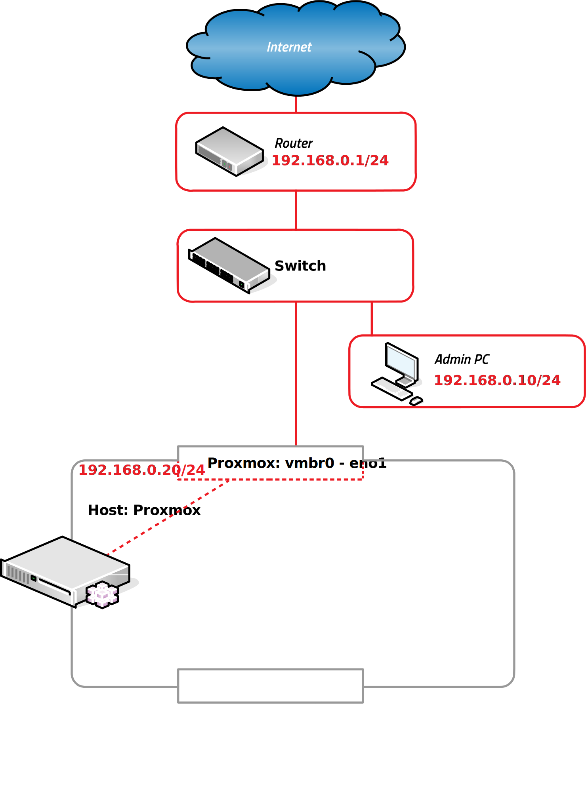

   Aufbau des Netzwerkes zur Proxmox Installation

Es werden zunächst alle Aktualisierungen durchgeführt und die benötigten ISO-Images auf den Proxmox-Host heruntergeladen. Erst danach wird die Konfiguration des Proxmox-Host so geändert wird, dass dieser nur noch im grünen Netz erreichbar ist.

Installieren von Proxmox
========================

Basis-Installation
------------------

Vom USB-Stick booten, danach erscheint folgender Bildschirm:

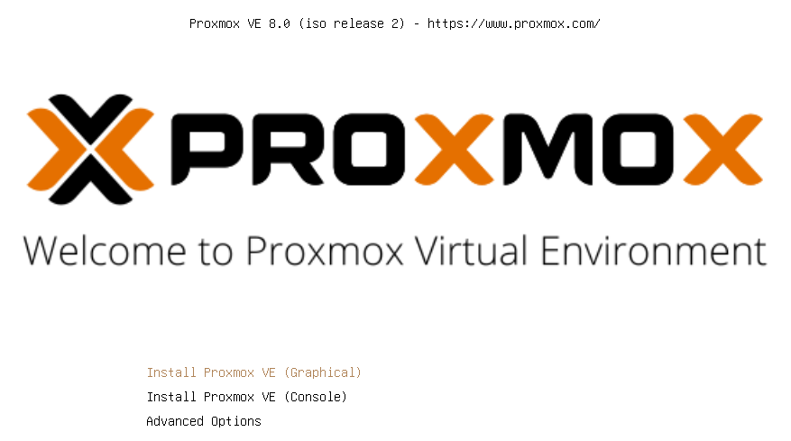

   Proxmox Boot Menue
   
Wähle ``Install Proxmox VE (Graphical)`` und starte die Installation mit ``ENTER``.

.. figure:: media/install-on-proxmox_03_eula.png
   :align: center
   :scale: 60%
   :alt: Proxmox Nutzervereinbarung

   Proxmox End-User-Agreement

Bestätige das ``End-User-Agreement`` mit ``Enter``.

.. figure:: media/install-on-proxmox_04_target-harddisk.png
   :align: center
   :scale: 80%
   :alt: Proxmox Installation Wahl der Festplatten

   Proxmox Festplattenauswahl

Wähle die gewünschte Festplatte auf dem Server zur Installation aus. Hast Du mehrere einzelne Festplatten im Server verbaut und kein RAID-Verbund definiert, so kannst Du hier mit der Schaltfläche `Optionen` weitere Einstellungen aufrufen. Hier kannst Du |zb| mehrere Festplatten angeben, die in einem sog. ZFS-Pool definiert werden sollen. Dies ist für das Erstellen von sog. Snapshots von Vorteil. Soll aber an dieser Stelle nicht vertieft werden.
(siehe hierzu |ua|: https://pve.proxmox.com/pve-docs/pve-admin-guide.html)

Für unsere beispielthafte Installation wählen wir hier die kleinere der beiden angezeigten aus, also die SSD.

Gib bei ``Location and Time Zone selection`` als Land und Keyboard Layout  ``Germany`` an. Wähle als Zeitzone Europe/Berlin.

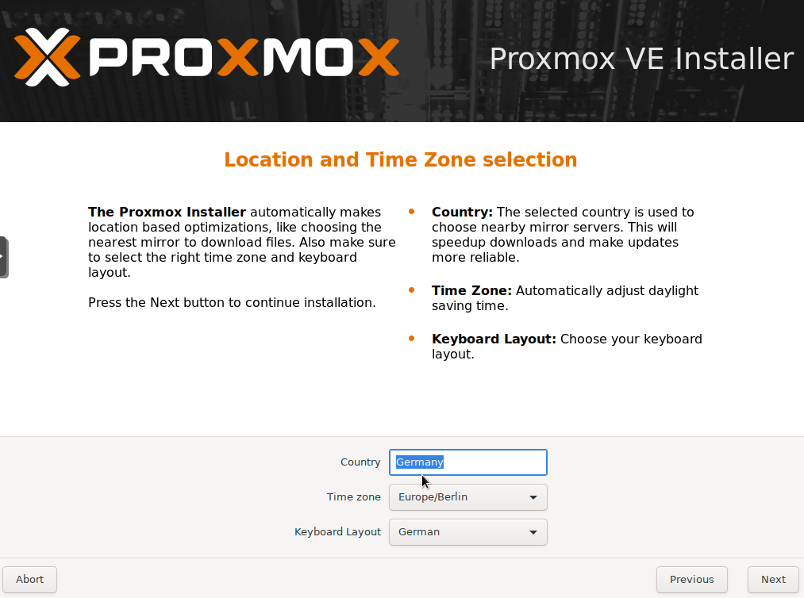

   Proxmox Zeitzone

Lege ein Kennwort für den Administrator des Proxmox-Host fest und gib eine E-Mail-Adresse an. Klicke auf ``Weiter``.

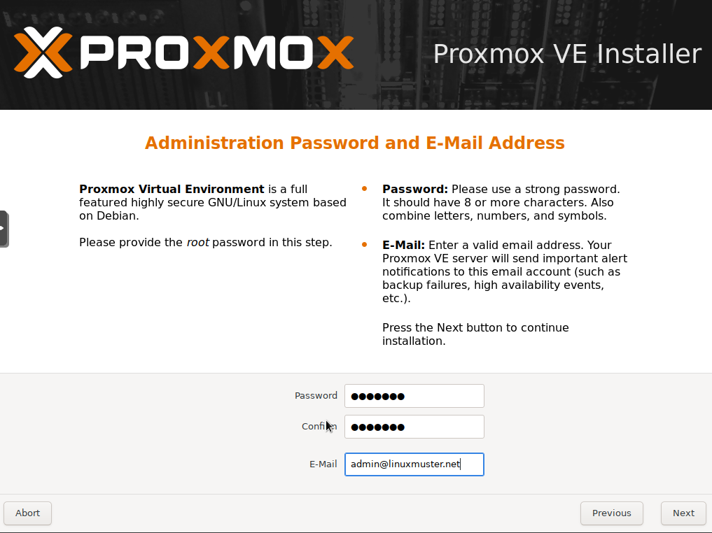

   Admin Password festelegen

Lege die IP-Adresse des Proxmox-Host fest. Solltest Du intern |zb| auf dem (DSL-)Router einen DHCP-Server laufen haben, dann erhältst Du hier bereits eine vorausgefüllte Konfigurationsseite. Passe diese Werte nun den gewünschten Werten an. Der Hostname des Proxmox-Host ist hier in gewünschter Form |-| hier `<hostename> (z.B. pve).linuxmuster.lan` |-| anzugeben.

.. hint::

   Die IP muss zu diesem Zeitpunkt der Installation diejenige Adresse sein, die ebenfalls Zugriff auf das Internet hat.
   In einem lokalen Netz mit DSL-Router wäre dieses eine aus dem internen Netz, die der Router für die internen Clients verteilt - also |zb| 192.168.199.20/24. DNS- und Gateway-Adressen entsprechen der Router-IP.

Hier wurde die interne IP-Adresse `192.168.199.20/24` festgelegt.

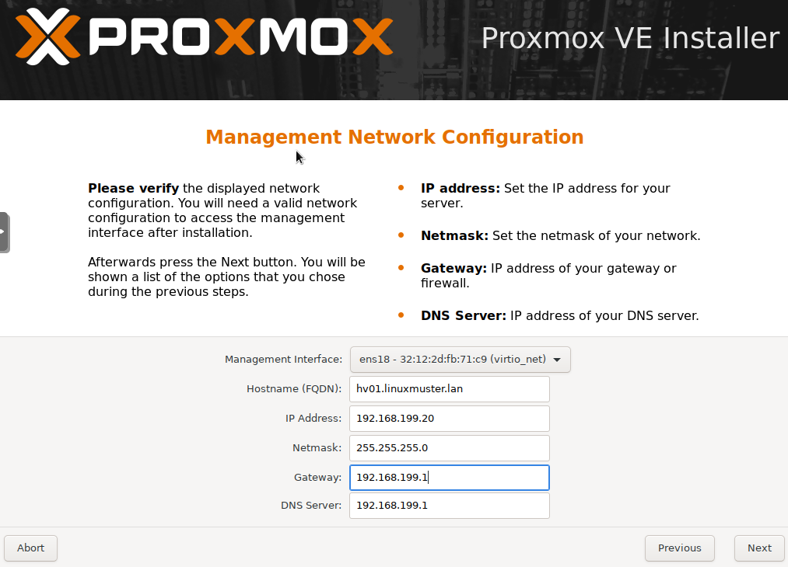

   Netwerk Konfiguration

Überprüfe auf der Übersichtsseite, dass alle Angaben korrekt sind und fahre anschließend fort.

.. figure:: media/install-on-proxmox_08_install-summary.png
   :align: center
   :scale: 60%
   :alt: Proxmox Installation Übersicht

   Zusamenfassung der Installationsoptionen

Warte den Abschluss der Installation ab.

.. figure:: media/install-on-proxmox_09_install-success.png
   :align: center
   :scale: 60%
   :alt: Proxmox Installation erfolgreich beendet

   Installation beendet

Nach erfolgreicher Installation lasse Proxmox über `Reboot` neu starten.

Proxmox Einrichtung
-------------------

Nach dem Neustart von Proxmox kannst Du Dich über einen PC, der sich im selben Netz befindet, via Browser auf das grafische Webinterface zur Verwaltung des Proxmox-Hosts aufschalten. Hierzu gibst Du die URL https://192.168.199.20:8006 ein. Du erhältst ein ``Warning``, da ein mögliches Sicherheitsrisiko erkannt wurde. Dies ist auf das selbst ausgestellte SSL-Zertifikat des Proxmox-Host zurückzuführen.

Klicke auf ``Erweitert ...``, es erscheint ein weiterer Hinweis auf das ``self-signed certificate``. Dieses nimmst Du nun mit dem Button ``Risiko akzeptieren und fortfahren`` an.

Es erscheint die Anmeldemaske des Proxmox-Webinterface. Melde Dich als User ``root`` und dem vorher gesetzten Passwort an:

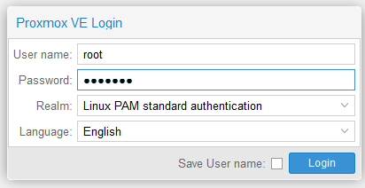

   Proxmox WebUI Login

Im Fenster `No valid subscription` wählst Du `OK` um das Fenster schließen:

.. figure:: media/install-on-proxmox_11_no-valid-subscription.png
   :align: center
   :scale: 80%
   :alt: Proxmox No valid subscription

   Proxmox No valid subscription

Updates ermöglichen
-------------------

Um Proxmox Updates installieren zu können, müssen in der Shell des Nodes <hostename> (z.B. pve) folgende Änderungen an den Repositorien vorgenommen werden. Dafür den Node im Datacenter auswählen und eine Shell öffnen.

.. figure:: media/install-on-proxmox_12_open-shell.png
   :align: center
   :scale: 80%
   :alt: Proxmox Open Shell

   Proxmox Shell

Kommentiere zuerst die Paketquellen für die Enterprise-Pakete aus, die nach der Erstinstallation automatisch eingerichtet wurden:

.. code::

   sed -i -e 's/^/#/' /etc/apt/sources.list.d/pve-enterprise.list
   sed -i -e 's/^/#/' /etc/apt/sources.list.d/ceph.list

.. hint:

   Falls Du die beiden Befehl via copy&paste übernimmst, prüfe, ob in der Eingabekonsole die Hochkommata erhalten bleiben.

Füge dann für Proxmox VE eine neu Paketquelle für die No-Subscription-Pakete hinzu.

.. code::

  echo "deb http://download.proxmox.com/debian/pve bookworm pve-no-subscription" >> /etc/apt/sources.list.d/pve-no-subscription.list

Aktualisiere danach die Paketquellen und die Pakete:

.. code::

   apt update

.. code::

   apt upgrade -y

Netzwerkbrücken einrichten
--------------------------

Für eine funktionierende Umgebung müssen ``zwei Netzwerkbrücken/Bridges (vSwitch)`` auf dem Hypervisor eingerichtet werden.

Eine für das ``interne Netz (green, 10.0.0.0/16)`` und eine für das ``externe Netz (red, externes Netz, Internetzugriff)``. 

Nach der zuvor beschriebenen Erstinstallation von Proxmox wurde bislang **nur eine Bridge (vmbr0)** eingerichtet (rotes Netz). Diese ist mit der ersten Netzwerkschnittstelle (NIC) des Proxmox-Hosts verbunden. Das Ethernet-Kabel der 1. NIC ist mit dem (DSL)-Router verbunden. Verlief der vorherige Befehl zur Aktualisierung von Proxmox erfolgreich, so weißt Du, dass diese Bridge bereits funktioniert und für die weitere Nutzung für das ``externe Netz (red) - vmbr0`` genutzt werden kann.

Für die internen virtuellen Netze ist also eine **zweite Bridge** zu erstellen, die an die zweite Netzwerkkarte direkt gebunden wird. Dieser wird allerdings **keine** IP-Adresse zugeordnet.

Ausgangspunkt: ``<hostename>`` --> ``Network`` (in u.g. Bild: ``pve`` --> ``Network``)

Die **bisherige** Netzwerkkonfiguration stellt sich wie folgt dar:

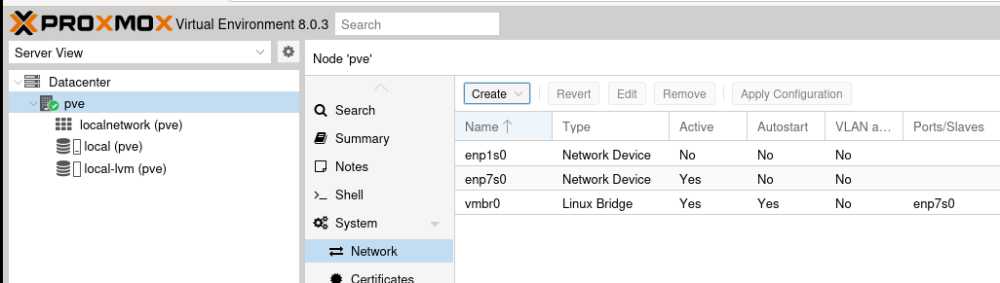

   Proxmox Network

Für die folgende Überprüfung öffnest Du nochmals die Konsole auf dem Hypervisor, falls sie nicht geöffnet sein sollte - wie zuvor beschrieben - und lässt Dir den Inhalt der Konfigurationsdatei anzeigen mittels:

.. code::

   cat /etc/network/interfaces

Dort befinden sich bisher folgende Eintragungen:

.. code::

  auto lo
  iface lo inet loopback

  # erste physikalische NIC
  iface eno1 inet manual

  # erste Netzwerkbrücke (bridge) 
  auto vmbr0
  iface vmbr0 inet static
        address 192.168.199.20
        netmask 255.255.255.0
        gateway 192.168.199.1
        bridge_ports eno1
        bridge_stp off
        bridge_fd 0

  # zweite physikalische NIC
  iface eno2 inet manual

.. hint::

   Die Bezeichnungen für die Netzwerkkarten eno1, eno2 können je nach eingesetztem System von der dargestellten Bezeichnung abweichen (z.B. enp1s0, enp7s0).

Für das weitere Vorgehen ist es hilfreich, die Funktion der Kommentierung der Netzwerkbrücken zu nutzen. Diese ist für die vmbr0 bisher noch nicht gesetzt.

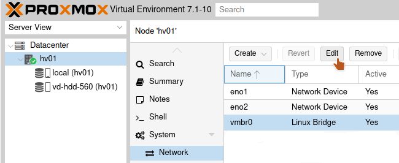

   Änderung der Bridge vmbr0

Markiere wie gezeigt ``vmbr0`` und betätige den ``Edit``-Button, um das Konfigurationsfenster zu öffnen.

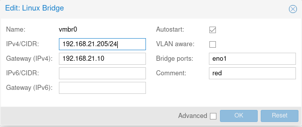

   Kommentar für vmbr0

Trage unter ``Comment`` einen Kommentar ein, der veranschaulicht, dass diese Brücke die Verbindung zum Internet stellt. Zum Beispiel wie hier gezeigt ``red``.

Mit `OK` wird der Kommentar übernommen.

Nun erstellst Du die zweite Bridge ``vmbr1``:

Dazu wähle das Menü ``Datacenter`` --> ``<hostname> (z.B. pve)`` --> ``Network`` -->  ``Create`` --> ``Linux Bridge``

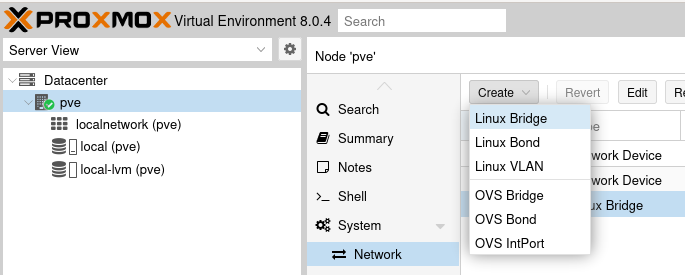

   Linux Bridge erstellen

Es öffnet sich ein neues Fenster. Dort sind folgende Einträge nötig:

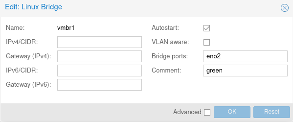

   Linux Bridge erstellen

Mit ``Create`` wird die Brücke erstellen.

Anschließend startest Du Proxmox über den Button ``Reboot`` oben rechts neu, um die neue Netzwerkkonfiguration zu laden. Node <hostename> (z.B. pve) muss dafür im Menü ``Datacenter`` links ausgewählt sein:

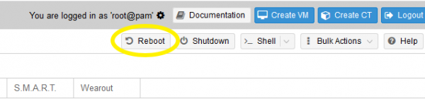

   Proxmox Neustart

Die Netzwerkkonfiguration des Proxmox-Host kannst Du, nach dem Neustart mit ``cat /etc/network/interfaces`` wie oben gezeigt in der Konsole überprüfen.

Dort sollten sich nun nachstehende Eintragungen befinden. Bei der Bridge ``vmbr0`` muss die IP-Adresse derjenigen entsprechen, die bei der Installation eingetragen wurde.

.. code::

  auto lo
  iface lo inet loopback

  iface eno1 inet manual

  iface eno2 inet manual

  auto vmbr0
  iface vmbr0 inet static
        address 192.168.199.20/24
        gateway 192.168.199.1
        bridge-ports eno1
        bridge-stp off
        bridge-fd 0
  #red  

  auto vmbr1
  iface vmbr1 inet manual
        bridge-ports eno2
        bridge-stp off
        bridge-fd 0
  #green

Zur Veranschaulichung eine Grafik, die den Status der Konfiguration zeigt.

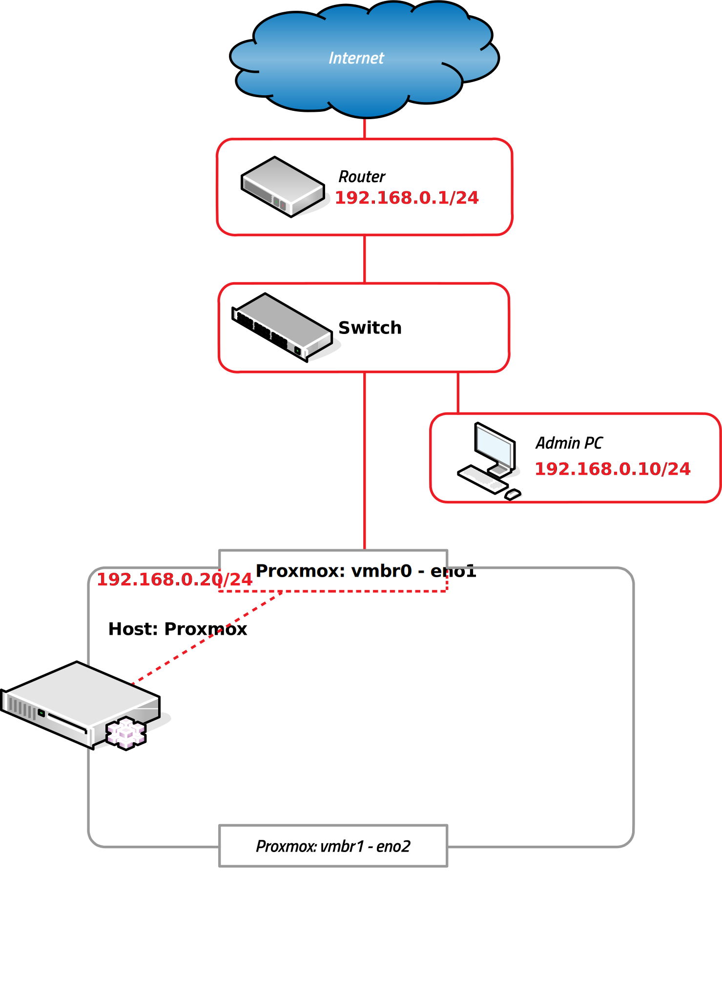

   Neue Netzwerkschnittstelle eno2 an vmbr1 erzeugt

Festplatten anpassen
--------------------

In diesem Schritt wird die erste Festplatte angepasst und die zweite in Proxmox eingebunden, um diese als Storage für die virtuellen Maschinen zu nutzen.

.. note::

   Gemäß der oben genannten Minimalanforderungen gehen wir davon aus, dass in deinem Proxmox-Host zwei Festplatten verbaut sind. 
   
   Solltest Du bei der Installation von Proxmox nur einen Speicher nutzen, kannst Du direkt weitergehen zu: `Vorbereiten des ISO-Speichers`_

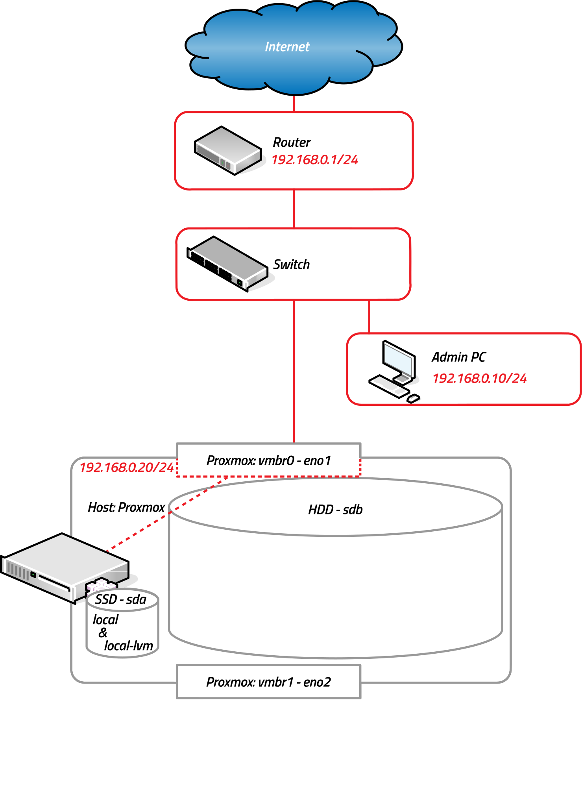

   Aufteilung der Festplatten nach der Proxmox Installation

local-lvm(<hostename> (z.B. pve))-Partition entfernen und Speicher freigeben
++++++++++++++++++++++++++++++++++++++++++++++++++++++++++++++++++++++++++++

Während der Proxmox-Installation wurden die Storages ``local`` und ``local-lvm`` automatisch auf der ersten Festplatte erstellt. Da anfangs für die Linuxmuster-Maschinen eine zweite Festplatte als ``Storage`` eingerichtet wurde, wird ``local-lvm`` nicht benötigt. Deshalb wird nun ``local-lvm`` entfernt und ``local`` durch den freigewordenen Speicher vergrößert, sodass auf der ersten Festplatte der gesamte Speicher dem Hypervisor zur Verfügung steht.

1. auf <hostename> (z.B. pve) oben rechts Shell anklicken:

.. figure:: media/install-on-proxmox_12_open-shell.png
   :align: center
   :scale: 80%
   :alt: Shell aufrufen

   Shell aufrufen

2. ``lsblk`` eingeben und mit der Enter-Taste bestätigen; folgende Ausgabe sollte erscheinen:

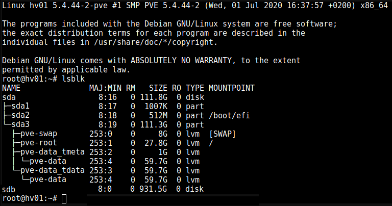

   lsblk Befehl

Es ist zu sehen, dass die Festplatten sda (111.8G) und sdb (931.5G) vorhanden sind. 

Die zweite Festplatte `sdb` ist eine HDD mit 1 TB Kapazität und soll für die VMs genutzt werden.

Die erste Festplatte ist eine SSD, auf der Proxmox selbst installiert wurde. Von dieser zweiten Platte startet dieses System automatisch Proxmox. Zudem befindet sich auf `sda3` ein sog. `LVM`. Bei der Erstinstallation wurde hier automatisch ein Bereich für die VMs eingerichtet. Dieser Bereich wird im Folgenden gelöscht und der frei werdende Platz auf `sda` wird vollständig dem Proxmox-Host zugeordnet.

Danach wird die Festplatte `sdb` als LVM für die VM eingerichtet.

3. Vorhandene local-lvm entfernen:

.. code::

   lvremove /dev/pve/data

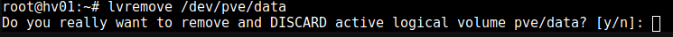

   lvmremote Frage

Bestätige die Nachfrage mit ``y``

.. figure:: media/install-on-proxmox_20_console-lvremote-success.png
   :align: center
   :scale: 80%
   :alt: Proxmox Konsole Output lvremote

   lvmremote Ausgabe

4. Speicherbereich von local erweitern:

.. code::

   lvresize -l +100%FREE /dev/pve/root

.. figure:: media/install-on-proxmox_21_console-lvresiz-success.png
   :align: center
   :scale: 80%
   :alt: Proxmox Konsole Output lvresize 

   lvmresize

5. Filesystem anpassen:

.. code::

   resize2fs /dev/mapper/pve-root

.. figure:: media/install-on-proxmox_22_console-resize2fs.png
   :align: center
   :scale: 80%
   :alt: Proxmox Konsole Output  

   Konsolenausgabe

6. Über ``lsblk`` sollte nun zu sehen sein, dass pve-data-Partitionen entfernt wurden:

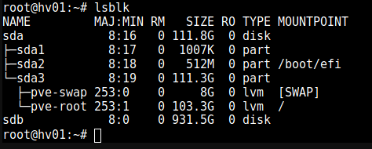

   lsblk Konsolenausgabe

Es ist zu erkennen, dass auf ``/dev/sda3`` nur noch ``pve-swap`` und ``pve-root`` vorhanden sind. 

7. Auf der Weboberfläche von Proxmox ist der local-lvm Eintrag noch über ``Datacenter → Storage local-lvm (<hostename> (z.B. pve))`` mit dem ``Remove``-Button grafisch zu entfernen:

.. figure:: media/install-on-proxmox_24_storage-default.png
   :align: center
   :scale: 80%
   :alt:  Proxmox-Übersicht Festplatten default

   Festplatten Default-Einstellungen

Danach findest Du noch folgenden Speicher in der Weboberfläche:

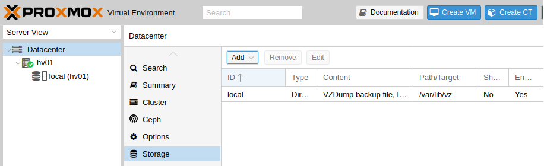

   Zustand nach Löschung des local-lvm

In der schematischen Darstellung ergibt sich nun folgendes Bild:

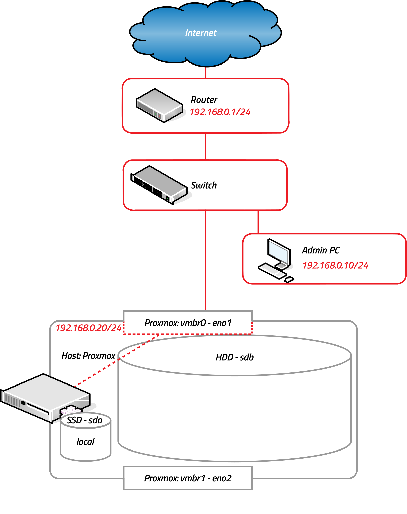

   Aufteilung der Festplatten nach der Anpassung

Zweiten Datenträger als Speicher einbinden
++++++++++++++++++++++++++++++++++++++++++

Die SSD ``/dev/sda`` steht für den Proxmox-Host zur Verfügung.

*Zweiten Datenträger vorbereiten*

Die zweite Festplatte heißt sdb und ersetzt die pve-data-Partition, die im vorigen Schritt entfernt wurde. Um diese für Proxmox vorzubereiten, stellt man über Konsolenbefehle einige Konfigurationen ein. Falls die Shell noch nicht geöffnet ist, wie oben beschrieben, öffnen und folgende Befehle eingeben:

.. hint::

  Für folgende Schritte: Die Bezeichnungen vg-xxx & lv-xxx Namen solltest Du auf Deine Festplattengrößen 
  entsprechend anpassen, die folgenden Grafiken dienen zur Orientierung: `vg-hdd-1000` eignet sich 
  beispielsweise für ein Volume aus einer HDD mit 1 TiB Kapazität.

1. Datenträger vorher partitionieren, |zb| mit ``fdisk /dev/sdb → g → n → w`` (über lsblk den richtigen Datenträgernamen herausfinden; in diesem Fall sdb)

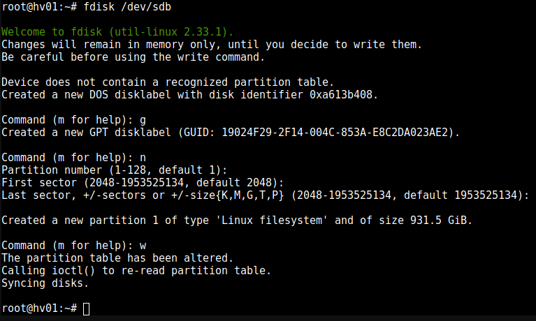

   fdisk

2. Jetzt eine neue Partition auf der Festplatte anlegen - ``pvcreate /dev/sd<xy>1``

Beispiel: 

.. code::

   pvcreate /dev/sdb1

und anschließend mit ``y`` bestätigen:

.. figure:: media/install-on-proxmox_27_console-pvcreate.png
   :align: center
   :scale: 80%
   :alt: Proxmox Konsole Output vgcreate 

   vgcreate

3. Nun wird eine virtuelle Gruppe auf der ersten Partition der zweiten Festplatte eingerichtet: ``vgcreate vg-<disk>-<size> /dev/sd<xy>1``

Beispiel:

.. code::

   vgcreate vg-hdd-1000 /dev/sdb1

.. figure:: media/install-on-proxmox_28_console-vgcreate.png
   :align: center
   :scale: 80%
   :alt: Proxmox Konsole Output vgcreate vg-hdd

   vgcreate

4. mit ``lvcreate -l 99%VG -n lv-<disk>-<size> vg-<disk>-<size>`` nun das logical volume erstellen. Hier ist die virtuelle Festplatte eine HDD mit 1 TiB Speicher, weshalb die Namen im Befehl so angepasst werden: 

Beispiel: 

.. code:: 

   lvcreate -l 99%VG -n lv-hdd-1000 vg-hdd-1000

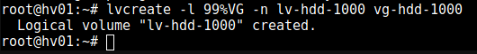

   output lvcreate

5. ``lvconvert --type thin-pool vg-<disk>-<size>/lv-<disk>-<size>`` konvertiert den Speicherbereich der erstellten virtual group als „thin-pool“:

Beispiel: 

.. code:: 

   lvconvert --type thin-pool vg-hdd-1000/lv-hdd-1000

.. figure:: media/install-on-proxmox_30_console-lvconvert.png
   :align: center
   :scale: 80%
   :alt: Proxmox Konsole Output lvconvert

   lvconvert

Datenträger grafisch als Storage in Proxmox anbinden
++++++++++++++++++++++++++++++++++++++++++++++++++++

1. Im Menü `Datacenter > Storage > Add` wählt man „LVM-Thin“ aus. Im ID-Feld wird der Name des virtuellen Datenträgers angegeben. In diesem Fall ist es eine HDD mit 1 TiB Speicherkapazität, weshalb die Bezeichnung vd-hdd-1000 gewählt wird. Unter Volume Group die erstellte virtuelle Gruppe auswählen, welche hier vg-hdd-1000 ist:

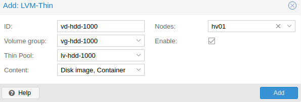

   LVM-Thin hinzugefügt

2. Nun sollte im linken Menü der zweite Storage zu sehen sein, auf welchem die Maschinen für Linuxmuster installiert werden können:

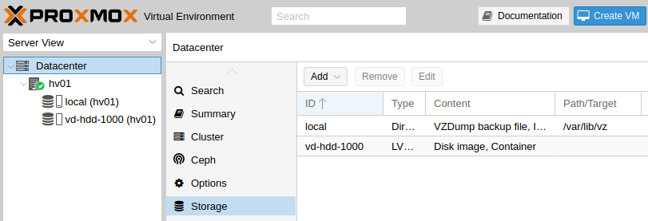

   Zweite HDD

Hier noch der Vollständigkeitshalber die schematische Darstellung, wie sie sich jetzt zeigt:

   Aufteilung der Festplatten nach der Anpassung

Vorbereiten des ISO-Speichers
=============================

Um die v7.2 zu installieren, müssen zwei virtuelle Maschinen angelegt werden. OPNsense und Ubuntu Server LTS werden in diesei VMs installiert. Dazu ist es erforderlich, dass Du die ISO-Images für OPNsense und Ubuntu Server LTS auf den Proxmox-Hypervisor in den Datenspeicher für ISO-Images lädst.

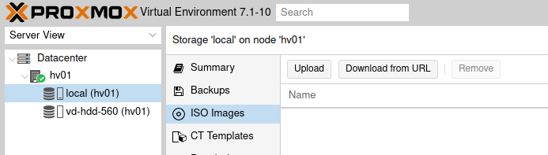

   ISO-Images

Gehe dazu auf ``Datacenter`` --> ``<proxmox-host>`` --> ``Datenspeicher (auf local oder zfsfile)`` --> ``ISO Images`` --> ``Download from URL``

Ubuntu Server
-------------

.. hint:: 

   Beachte für den Download des Ubuntu Servers, dass du immer die Version verwendest, die in den Systemvoraussetzungen genannt wurde. Gehe auf https://releases.ubuntu.com/jammy/ und überprüfe die dort zum Herunterladen angebotene Version für 22.04.-live-server-amd64 und deren Checksumme.

   Zum jetzigen Zeitpunkt ist dies in der Angabe der URL berücksichtigt, muss also eventuell angepasst werden.

In dem nun geöffneten Fenster trägst Du die URL

.. code::
   
   https://releases.ubuntu.com/jammy/ubuntu-22.04.5-live-server-amd64.iso

ein (copy&paste). Anschließend betätigst Du dann den Button ``Query URL``.

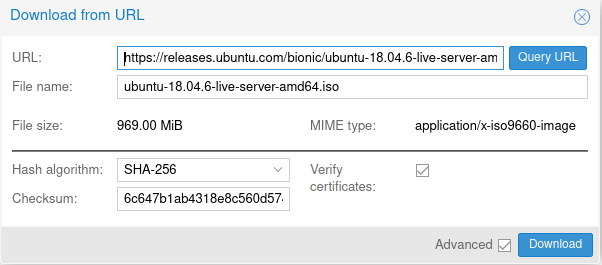

   Proxmox Download via URL

Wenn die Abfrage der URL positiv war, sollten sich die Felder ausgefüllt haben.

Zur Überprüfung der Integrität der Datei aktiviere ``Verify certificates``, das sich unter den ``Advanced`` Optionen befindet.

Wähle wie dargestellt: ``SHA-256`` und trage die Checksumme ein:

.. hint:: 

   Sollte sich nach der Erstellung dieser Beschreibung eine Änderung der herunterzuladen Image-Datei ergeben haben, wirst du die Checksumme anpassen müssen. 

.. code:: 
  
  9bc6028870aef3f74f4e16b900008179e78b130e6b0b9a140635434a46aa98b0

Das Herunterladen des ISOs beginnt mit ``Download``.

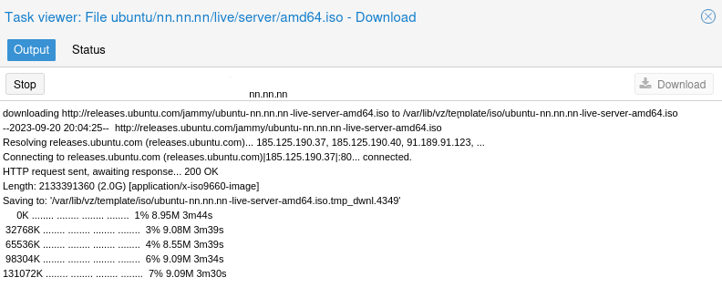

   Download Status

Zum Abschluss erfolgt die Überprüfung der Checksumme, die mit ``OK, checksum verified`` enden muss.

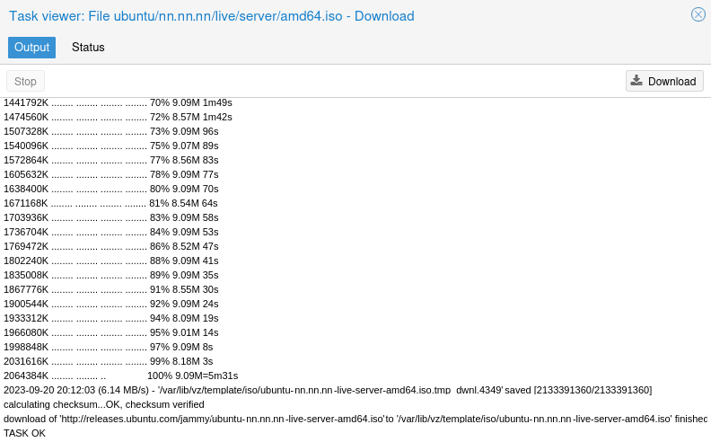

   Prüfsummen bestätigt

Nach dem Schließen des Fensters,

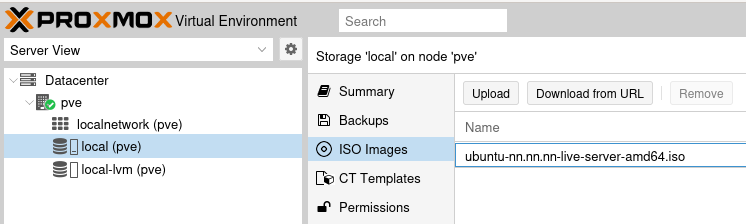

   ISO-Images

befindet sich das heruntergeladene Ubuntu-ISO nun in dem ``ISO Images`` und steht Dir für die weitere Verwendung zur Verfügung.

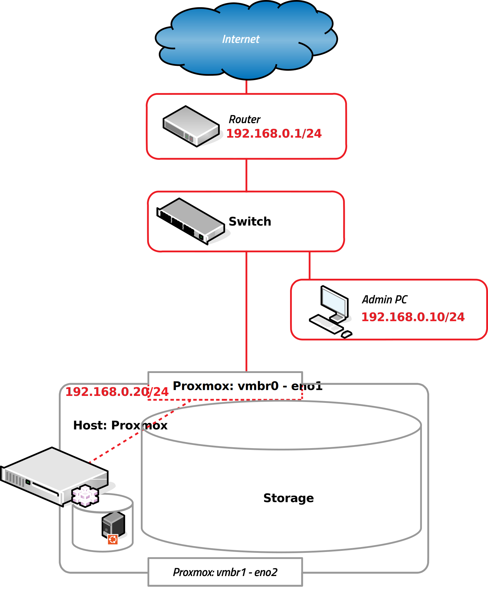

   Nach der Bereitstellung des Ubuntu Installationsmediums 

OPNsense
--------

Die zuvor gezeigte Möglichkeit des einfachen Imports mit den Bordmitteln von Proxmox steht Dir für die OPNsense |reg| leider nicht zur Verfügung, da nur der Download einer bz2-Datei möglich ist. Dir steht der Weg des Downloads auf einen lokalen PC, der Umwandlung des bz2-File in eine iso-Datei und dann der Upload über den Dir im Abschnitt Ubuntu aufgezeigten Ablauf frei. Dabei wählst Du dann nicht ``URL``, sondern ``Upload``.

Um Dir den Upload zu ersparen, beschreiben wir hier den Weg, um die benötigten Dateien direkt in Deine Proxmox-Maschine zu bringen:

Als Erstes startest Du die Konsole ``xterm.js`` wie dargestellt, falls sie nicht sowieso gestartet ist.

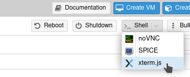

   xterm shell öffnen

Mit ihr hast Du jetzt die Möglichkeit, mit ``Copy&Paste`` die folgenden bash-Zeilen direkt zu übernehmen.

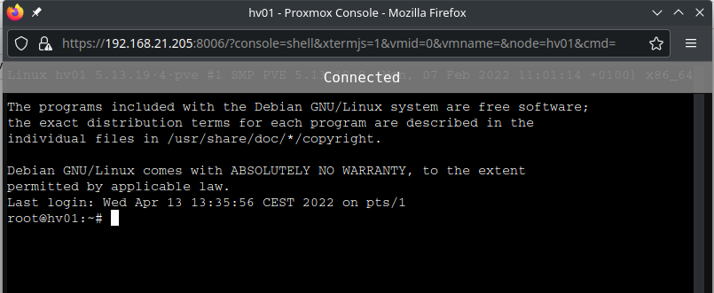

   xterm shell

Als Nächstes musst Du in das Verzeichnis wechseln, wo Proxmox die ISO-Dateien sucht. Dazu kopierst Du diese Zeile in das gezeigte Fenster. 

.. code::

   cd /var/lib/vz/template/iso

Mit ``[Enter]`` wechselt Du dann in das Verzeichnis.

Dann musst Du die folgenden vier Dateien herunterladen:
   
Prüfsummendatei (<filename>.sha256)

.. code::

   wget https://mirror.informatik.hs-fulda.de/opnsense/releases/24.1/OPNsense-24.1-checksums-amd64.sha256
   
Signatur Datei (<filename>.sig)
	
.. code:: 

   wget https://mirror.informatik.hs-fulda.de/opnsense/releases/24.1/OPNsense-24.1-dvd-amd64.iso.sig

Der öffentliche Schlüssel von OPNsense |reg| (<filename>.pub)

.. code::

   wget https://mirror.informatik.hs-fulda.de/opnsense/releases/24.1/OPNsense-24.1.pub

Die komprimierte ISO Datei (<filename>.iso.bz2)

.. code::

   wget https://mirror.informatik.hs-fulda.de/opnsense/releases/24.1/OPNsense-24.1-dvd-amd64.iso.bz2

Nun gilt es, die ISO-Datei auszupacken. Das machst Du mit folgendem Befehl:

.. code::

   bunzip2 OPNsense-24.1-dvd-amd64.iso.bz2

Das Entpacken kann einige Zeit in Anspruch nehmen. Anschließend sollte sich in dem Verzeichnis die OPNsense-ISO-Datei befinden.

Überprüfen der heruntergeladenen Dateien auf deren Integrität:

.. code::
   
   openssl base64 -d -in OPNsense-24.1-dvd-amd64.iso.sig -out /tmp/image.sig

.. code::

   openssl dgst -sha256 -verify OPNsense-24.1.pub -signature /tmp/image.sig OPNsense-24.1-dvd-amd64.iso

Der letzte Befehl sollte Dir ein ``Verified OK`` liefern.

Somit hast Du nun alle nötigen ISO-Dateien für die weitere Installation zusammen.  Die daneben befindlichen anderen OPNsense-Datei kannst Du nun wieder löschen.

.. code::

   rm OPNsense*.sha256 OPNsense*.pub OPNsense*.sig

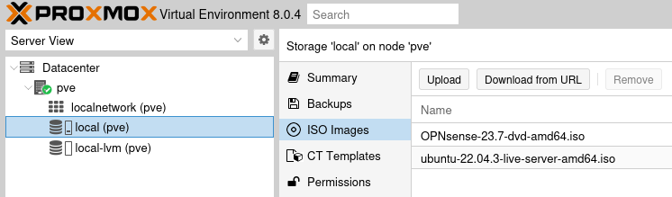

   ISO-Images

Es sind beide ISO Images auf den ISO-Speicher in Proxmox verfügbar, Du richtest nun die VMs ein.

.. figure:: media/proxmox-iso-download-opnsense_03.svg
   :align: center
   :alt: Nach der Bereitstellung des OPNsense Installationsmediums 

   Nach der Bereitstellung des OPNsense Installationsmediums 

Vorbereiten der virtuellen Maschinen
====================================

Anlegen der VM für OPNsense
---------------------------

Um für die OPNsense Firewall eine VM anzulegen, wählst Du in der Proxmox - Verwaltungsoberfläche den Button ``Create VM``.

.. figure:: media/proxmox-create-vm.png
   :align: center
   :scale: 80%
   :alt: Proxmox Create VM

   VM anlegen

Es erscheint nun das Fenster zur Anlage der neuen VM. Trage hier einen Namen für die VM ein, anhand der Du Version und Funktion erkennst.

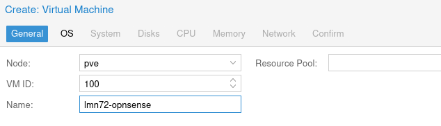

   VM erstellen

Klicke dann auf ``Next``.

Wähle nun den ISO-Datenspeicher unter ``Storage`` aus. Das ist der Speicher, auf den Du vorher die ISO-Images abgelegt hast.
Wähle dann das ISO image der OPNsense aus.

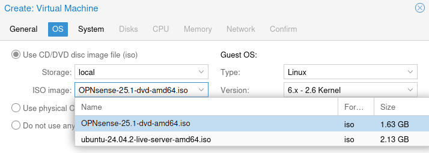

   VM ISO Image

Klicke dann auf ``Next``.

Belasse hier zunächst alle Voreinstellungen für Grafikkarte und Festplatten-Controller wie angezeigt.

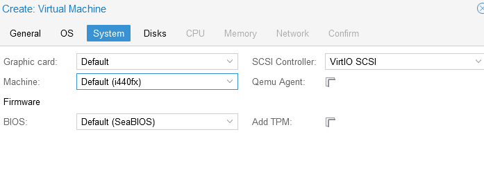

   VM OS

Klicke dann auf ``Next``.

Wähle nun hier unter ``Storage`` den geeigneten Datenspeicher auf, um die Festplatte der VM dort abzulegen. In der Abb. wird der Datenspeicher ``Dataset`` verwendet.
In dem Drop-down Menü siehst Du alle in Deinem System verfügbaren Datenspeicher.

.. hint:: Folgende Größenangaben beziehen sich, wie schon geschrieben, auf eine Testumgebung.  
   Wie in der Dokumentation schon ausgeführt, solltest Du hier für den produktiven Einsatz - **mindestens 8 GiB RAM und 50 GiB für die Festplatte** wählen, um alle OPNsense |reg| Standardfunktionen auszuführen. 
   
   Damit funktioniert jede Funktion, aber vielleicht nicht bei einer großen Anzahl von Benutzern oder hoher Last. Für andere Einsatzszenarien solltest Du Dich unbedingt mit den `Hardware-Anforderungen <https://docs.opnsense.org/manual/hardware.html#hardware-requirements>`_ gemäß der OPNsense |reg| -Dokumentation auseinandersetzen.

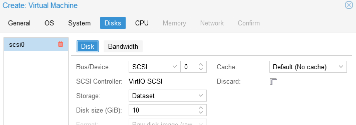

   VM Festplatte

Klicke dann auf ``Next``.

Gib nun für die CPU Sockel und Kerne an.

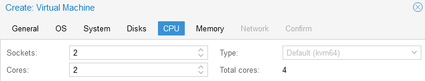

   VM CPU

Klicke dann auf ``Next``.

Gib nun für die Firewall die gewünschte Größe des Arbeitsspeichers an.

.. figure:: media/proxmox-create-vm-opnsense-06.png
   :align: center
   :scale: 80%
   :alt: Proxmox Create VM: RAM

   VM Arbeitsspeicher

Klicke dann auf ``Next``.

Gib danach die ``Bridge vmbr0`` für die einzurichtende Netzwerkkarte an. Die zweite Netzwerkkarte fügst Du nach Anlage der VM hinzu. Dies muss noch vor der eigentlichen Installation erfolgen.

.. figure:: media/proxmox-create-vm-opnsense-07.png
   :align: center
   :scale: 80%
   :alt: Proxmox Create VM: NIC

   VM Netzwerkkarte

Klicke dann auf ``Next``.

Zum Abschluss siehst Du nochmals alle Einstellungen für die VM. Überprüfe diese. Solltest Du Änderungen vornehmen wollen, kannst Du auf die entsprechende Reiterkarte klicken, Änderungen durchführen und wieder zur Reiterkarte ``Confirm`` wechseln.

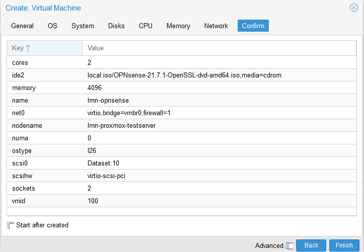

   VM Erstellung bestätigen

Achte darauf, dass die Option ``Start after created`` unbedingt ``deaktiviert`` ist. 

Klicke dann auf ``Finish``.

Hinzufügen einer weiteren Netzwerkbrücke
++++++++++++++++++++++++++++++++++++++++

Nachdem die VM angelegt wurde, wähle diese aus und klicke auf den Eintrag ``Hardware``.

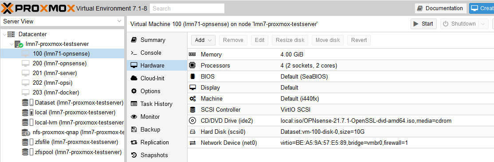

   VM Hardware

Füge nun die zweite Netzwerkkarte hinzu oder ggf. weitere NICs.
Klicke hierzu oben auf die Reiterkarte ``Add``. Es erscheint ein Drop-down Menü. Wähle hier den Eintrag ``Network Device``.

.. figure:: media/proxmox-create-vm-opnsense-10.png
   :align: center
   :scale: 80%
   :alt: Proxmox Create VM: Add 2nd NIC

   VM zweite NIC anlegen

Wähle als Bridge die zweite zuvor eingerichtete Bridge |-| hier ``vmbr1``. 

Achte für die weitere Installation darauf, wie Du die Bridges zugeordnet hast:

1. vmbr 0 - externes Netzwerk: red
2. vmbr 1 - internes Netzwerk: green

Klicke auf ``Add``.

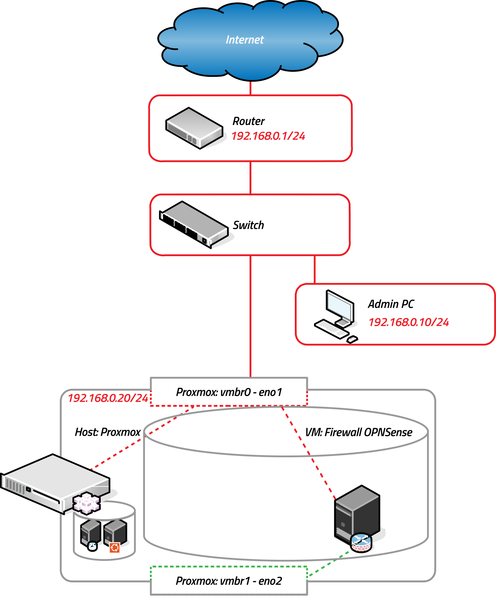

   Stand nach der Erzeugung der Virtuellen Maschine OPNsense 

.. _xterm-label:

Anlegen der VM für linuxmuster server
-------------------------------------

Um für den linuxmuster.net Server v7.2 die VM anzulegen, wählst Du erneut in der Proxmox - Verwaltungsoberfläche den Button ``Create VM``.

.. figure:: media/proxmox-create-vm.png
   :align: center
   :scale: 80%
   :alt: Proxmox Create VM

   VM anlegen

Es erscheint nun das Fenster zur Anlage der neuen VM. Trage hier einen Namen für die VM ein, anhand der Du Version und Funktion erkennst.

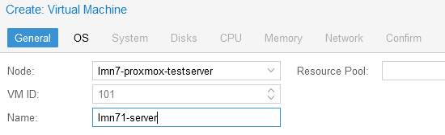

   VM erstellen

Klicke dann auf ``Next``.

Wähle nun den ISO-Datenspeicher unter Storage aus. Das ist der Speicher, auf den Du vorher die ISO-Images abgelegt hast.
Wähle dann das ISO image des Ubuntu Server aus.

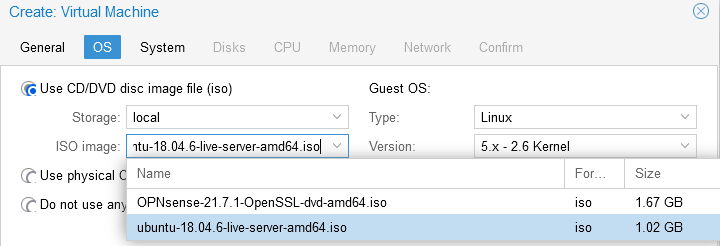

   VM ISO Image

Klicke dann auf ``Next``.

Belasse hier zunächst alle Voreinstellungen für Grafikkarte und Festplatten-Controller wie angezeigt.

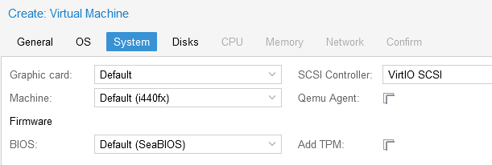

   VM OS

Klicke dann auf ``Next``.

Wähle nun hier unter ``Storage`` den geeigneten Datenspeicher aus, um die Festplatte der VM dort abzulegen. In der Abb. wird der Datenspeicher ``Dataset`` verwendet.
In dem Drop-down Menü siehst Du alle in Deinem System verfügbaren Datenspeicher.

.. figure:: media/proxmox-create-vm-ubuntu-server-04.png
   :align: center
   :scale: 80%
   :alt: Proxmox Create VM: Disks

   VM Festplatten

Für die erste Festplatte wählst Du wie in obiger Abb. |zb| 25 GiB.

Füge dann mit dem Button unten links ``Add`` eine weitere Festplatte hinzu. Wähle hierbei wieder den geeigneten Datenspeicher aus und die Größe von |zb| 100 GiB, oder direkt für Deine Schule die gewünschte Größe |zb| 500 GiB aus.

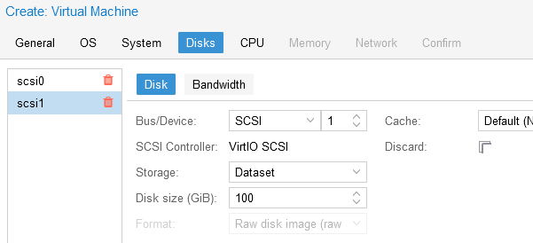

   Vm Festplatten

Klicke dann auf ``Next``.

Gib nun für die CPU Sockel und Kerne an.

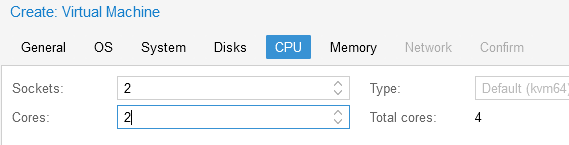

   VM CPU

Klicke dann auf ``Next``.

Gib nun für den Server die gewünschte Größe des Arbeitsspeichers an.

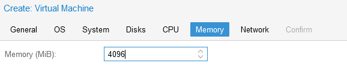

   VM Arbeitsspeicher

Klicke dann auf ``Next``.

Gib danach die Bridge ``vmbr1`` für die einzurichtende Netzwerkkarte an. Dies muss die Bridge für das interne Netz (green) sein.

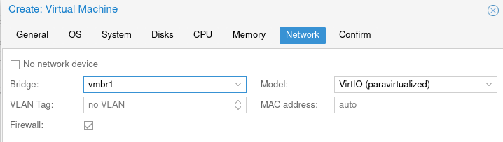

   VM Netzwerkkarte

Klicke dann auf ``Next``.

Zum Abschluss siehst Du nochmals alle getroffenen Einstellungen. Überprüfe diese. Solltest Du Änderungen vornehmen wollen, kannst Du auf die entsprechende Reiterkarte klicken, Änderungen durchführen und wieder zur Reiterkarte ``Confirm`` wechseln.

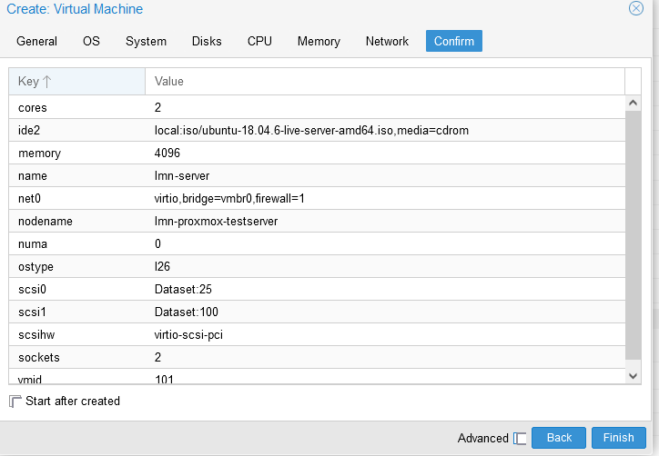

   VM erstellen

Achte darauf, dass die Option ``Start after created`` unbedingt ``deaktiviert`` ist. 

Klicke dann auf ``Finish``.

Nachdem die VM angelegt wurde, siehst Du diese links im Verzeichnisbaum Deines Proxmox-Host, in dem alle VMs dargestellt werden.

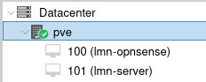

   VMs

Welches sich auch in der schematischen Übersicht zeigt:

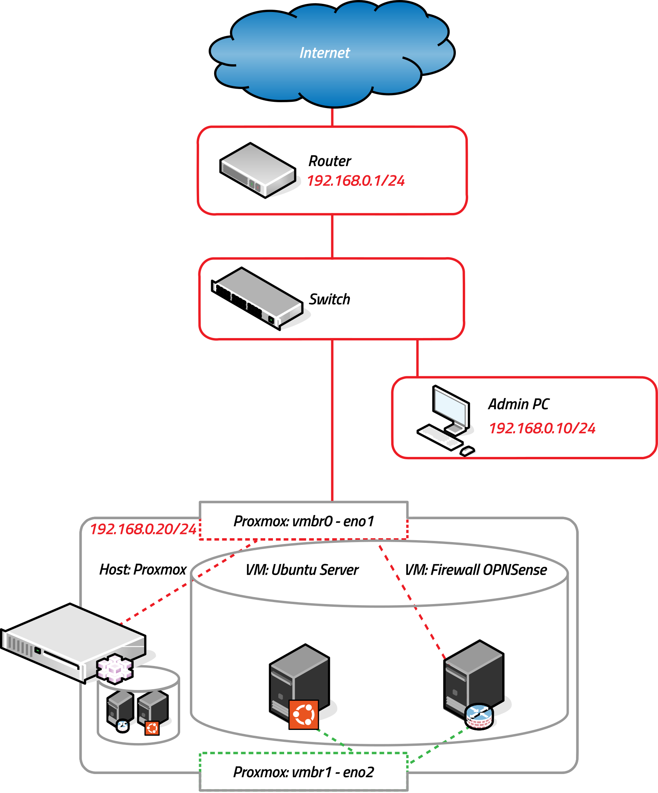

   Stand nach der Erzeugung der Virtuellen Maschine Ubuntu 

Abschließende Konfiguration der virtuellen Maschinen
----------------------------------------------------

Die nächsten beiden Einstellungen musst Du sowohl für die **Firewall als auch für den Server** vornehmen. Wir beschreiben es hier jetzt exemplarisch für die Firewall. 

Boot-Optionen
+++++++++++++

Um bei der from Scratch Installation von CD zu starten, wählst Du die jeweilige VM (z.B. 100 (lmn7-opnsense) aus, klickst auf ``Options`` und klickst oben auf den Menüeintrag ``Edit``.

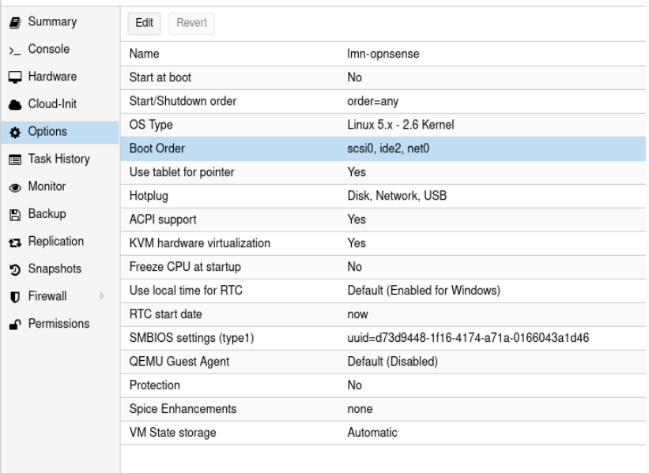

   Bootreihenfolge festlegen

Markiere mit der Maus den Eintrag ide2 (CD) und ziehe diesen an Position 1.

Vorher:

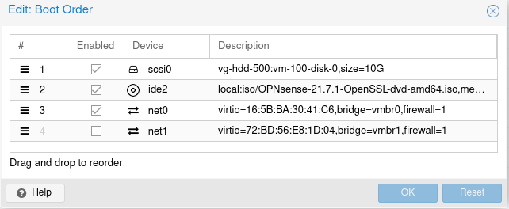

   vorher

Nachher:

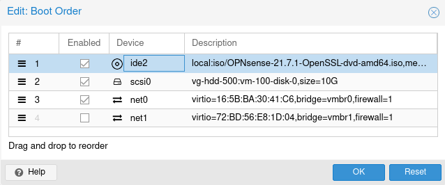

   nachher

Hinzufügen einer seriellen Schnittstelle
++++++++++++++++++++++++++++++++++++++++

Damit Dir `copy-and-paste` in der Oberfläche von Proxmox bei der Auswahl unter ``>_ Console`` zur Verfügung steht, musst Du die Nutzung von `xterm.js` ermöglichen. Als vorbereitende Maßnahme musst Du eine serielle Schnittstelle für die jeweilige VM aktivieren.

Wähle zuerst die gewünschte VM aus (z.B. `100 (lmn-opnsense)`, wähle danach den Eintrag ``Hardware`` für die VM aus und klicke dann oben rechts auf das Icon ``>_ Console``.

Nachstehende Abb. zeigt den Zustand vor der Aktivierung.

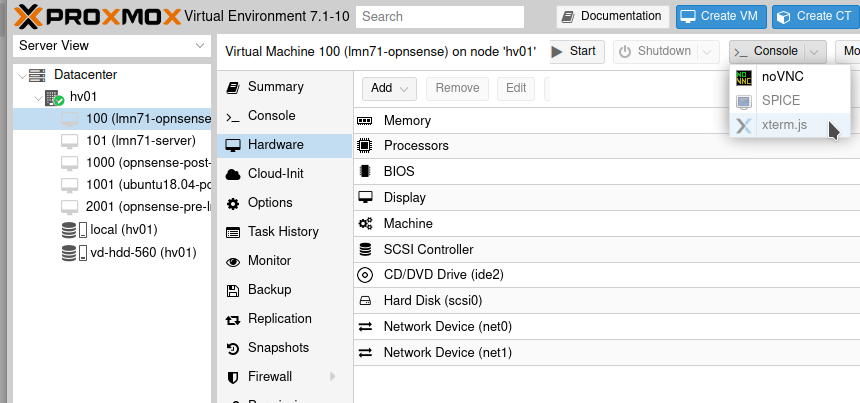

   Zustand vor der Aktivierung

Wähle die gewünschte VM ``lmn-opnsense`` aus, klicke dann --> ``Add`` --> ``Hardware`` --> ``Serial Port``.

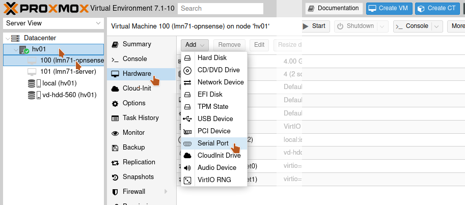

   Serial Port hinzufügen

Lege einen Seriellen Port mit der Bezeichnung ``0`` an. Klicke danach auf ``Add``.

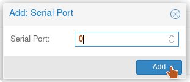

   Serielle Schnittstelle 0 hinzufügen

Danach siehst Du den seriellen Port in der Hardware-Übersicht der VM. Klickst Du oben rechts auf ``>_ Console``. Der der gezeigte Menüpunkt ``xterm.js`` sollte nun nicht mehr ausgegraut sein.

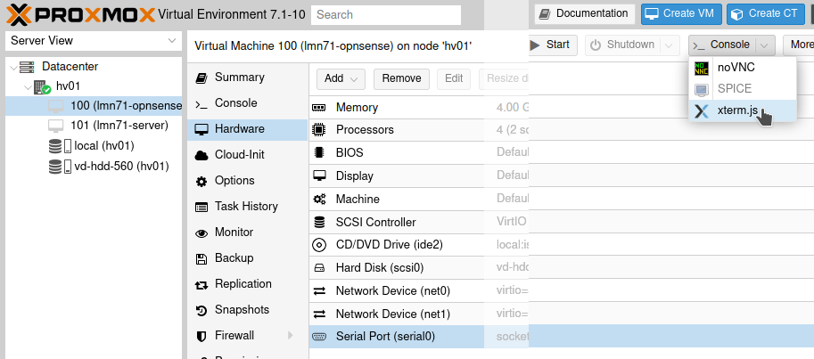

   Zustand nach der Aktivierung

Kontrolliere nochmals alle Einstellungen der neu angelegten VM.

Die beiden letzten Einstellungen musst Du **nochmals für den linuxmuster.net Server (2. VM)** einrichten.

.. hint:: Für die weitere Nutzung von xterm.js ist allerdings noch eine Anpassung bei der laufenden OPNsense |reg| bzw. dem Server nötig. Die nimmst Du zu einem geeigneten späteren Zeitpunkt vor, bis dahin musst Du noch die Konsole ``noVNC`` nutzen.

Die virtuellen Maschinen sind jetzt für die weitere Installation vorbereitet. Du kannst gemäß der Anleitung: :ref:`first_start_firewall` mit der Installation fortfahren.

.. hint:: Jetzt wäre auch ein guter Zeitpunkt für ein Snapshoting und/oder dem Klonen der bisher erstellen VMs. 
