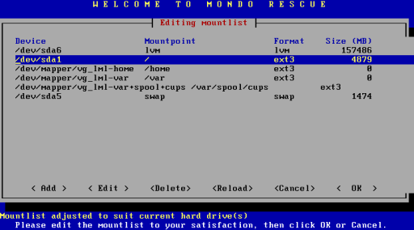

Interaktiver Restore
````````````````````

Geben Sie am Bootprompt **interactive** ein. Die CD bootet dann direkt in das Startmenü von *mondorestore*.

Wählen Sie im Startmenü die Option **Interactively**:

.. image:: media/restore/restore14.png

Wählen Sie im nächsten Schritt das Backupmedium aus:

.. image:: media/restore/restore2.png

Geben Sie den Präfix für die ISO-Dateien nun ein (in unserem Fall "server"):

.. image:: media/restore/restore4.png

Geben Sie das Backupgerät ebenfalls ein (in unserem Beispiel eine Festplattenpartition):

.. image:: media/restore/restore15.png

Das Dateisystem der Backup-Partition wird automatisch erkannt, das Eingabefeld kann also leer bleiben:

.. image:: media/restore/restore16.png

Geben Sie den Pfad zum gewünschten Backupset ein. Vorgegeben wird der Pfad zum Vollbackup. Wenn Sie ein differentielles oder inkrementelles Backupset zurückspielen möchten, müssen Sie den Pfad anpassen.

.. image:: media/restore/restore17.png

Jetzt können Sie noch die Partitionierung der Festplatte(n) anpassen. Das ist jedoch nur in Spezialfällen notwendig, wenn Sie zum Beispiel ein Vollbackup interaktiv restaurieren und die Partitionierung auf dem Zielsystem anders sein soll als auf dem System, das gesichert wurde. Um weiter zu gelangen, navigieren Sie mit der **TAB-Taste** auf **OK** und drücken Sie **ENTER**.



Bestätigen Sie noch die Sicherheitsabfrage bezüglich der Mountliste.

.. image:: media/restore/restore19.png

Nachdem die Zieldateisysteme gemountet wurden, werden Sie noch gefragt, ob Sie alle Dateien des Backupsets restaurieren wollen. Wählen Sie **Yes**, um den Backupset komplett zu restaurieren. Mit **No** erhalten Sie die im Abschnitt :doc:`restore-interactive` beschriebene Möglichkeit, einzelne Dateien und Verzeichnisse für die Restauration auszuwählen.

.. image:: media/restore/restore20.png

Schließlich startet der Restaurationsvorgang.

.. image:: media/restore/restore11.png

Sind alle Dateien restauriert kann der Bootloader initialisiert werden. Wählen Sie **Yes**.

.. image:: media/restore/restore21.png

In einem weiteren Schritt muss noch angegeben werden, ob die Mountliste geändert wurde.

.. image:: media/restore/restore22.png

Sollen die Partitionen mit einem Label versehen werden? Hier kann mit **Yes** geantwortet werden.

.. image:: media/restore/restore23.png

Bestätigen Sie abschließend noch den Start des post-nuke scripts.

.. image:: media/restore/restore24.png

Nun ist die Restauration des Backupsets abgeschlossen und die Mondo-Rescue-Konsole erscheint. Wenn Sie weitere Backupsets zurückspielen müssen, starten Sie mondorestore auf der Konsole. Um das System neu zu starten, geben Sie exit ein.
