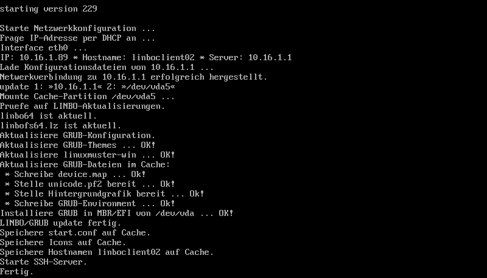

=========================
Boot-Bildschirme in LINBO
=========================

Beim Booten in LINBO sind folgende Bildschirme sichtbar:

* Bootvorgang via Netzwerk

.. figure:: ./media/linbo-bootscreen/linbo-tftp.png
   :alt: Initialmeldungen beim Bootvorgang via Netzwerk (PXE)

   Initialmeldungen beim Bootvorgang via Netzwerk (PXE)
   
* Egal ob über die lokale Festplatte gebootet wurde oder nach dem
  Bootvorgang via Netzwerkkarte (PXE) wird mit der
  Gruppenkonfiguration der Kernel geladen.

.. figure:: ./media/linbo-bootscreen/linbo-group.png
   :alt: Bootbildschirm: Laden des Kernels

   Bootbildschirm: Laden des Kernels

* Der gebootete LINBO-Kernel erscheint als ASCII-Art.

.. figure:: ./media/linbo-bootscreen/linbo-ascii.png
   :alt: LINBO-Kernelboot ASCII-Art

   LINBO-Kernelboot ASCII-Art

* Die Grub-Konfiguration wird aktualisiert.

   LINBO-Grub Installation

Darauf folgt der reguläre :ref:`LINBO Startbildschirm <linbo-startbildschirm-label>`.
