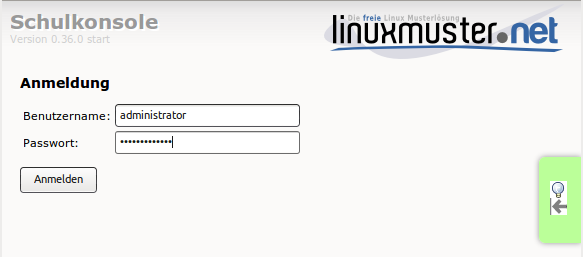

Einstellungen über die Schulkonsole
===================================

Aufgerufen wird die *Schulkonsole* mittels `<https://server:242>`_ in
einem Webbrowser.

Nach der Anmeldung als ``administrator`` findet man im Hauptmenü
folgende Einstellungsmöglichkeiten

.. toctree::
   :caption: Die Schulkonsole aus Sicht des Administrators
   :maxdepth: 1

   settings

