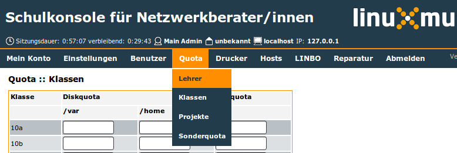

===========
Menü: Quota
===========

Für alle folgenden Einstellungen gilt:

* Leere Felder bedeuten, dass in dem Fall die Standardeinstellungen
  gelten.
* Alle Werte sind in Megabyte (MB) einzugeben.
* Eine der Spalten gehört immer zu der Partition, die nach ``/home``
  gemountet wird, die andere Spalte gehört immer zu der Partition, die
  nach ``/var`` gemountet wird.

Lehrer	   
------

Hier können Sie die Disk- und Mailquota für Lehrer/innen individuell
anpassen. Die Darstellung der Diskquota hängt von Ihrer
Partitionierung ab.

Klassen
-------

Hier ändern Sie die Quotawerte aller Schüler/innen einer Klasse.

Projekte
--------

Hier können Sie den Mitgliedern eines Projekts zusätzliche Quota
zuweisen.

Sonderquota
-----------

Hier ändern Sie die Quotawerte spezieller Benutzer und einzelner
Schüler/innen.

Unter „Neu anlegen“ können Sie einem bisher hier nicht aufgeführten
Benutzer Sonderquota zuweisen. Geben Sie dazu den Login ein und passen
Sie die Quotawerte entsprechend an.

Unter „Webspace“ legen Sie fest, wieviel Platz alle veröffentlichten
Webseiten insgesamt belegen dürfen. Ändern Sie hierzu den Quotawert
für „www-data“ auf „/var“.

