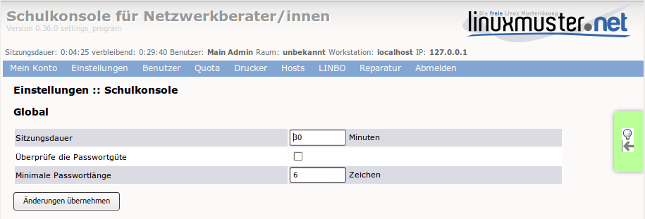
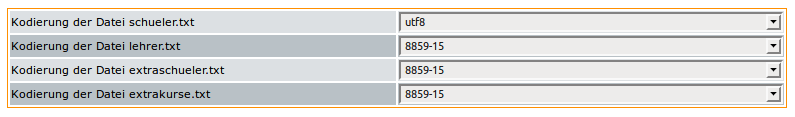
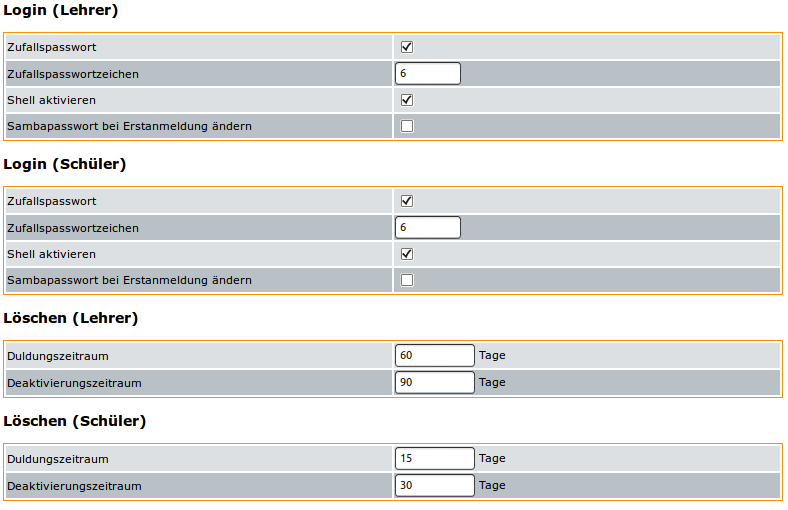
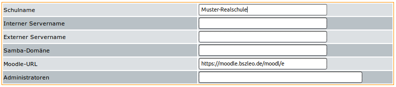
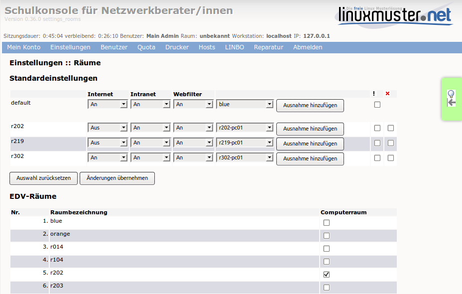
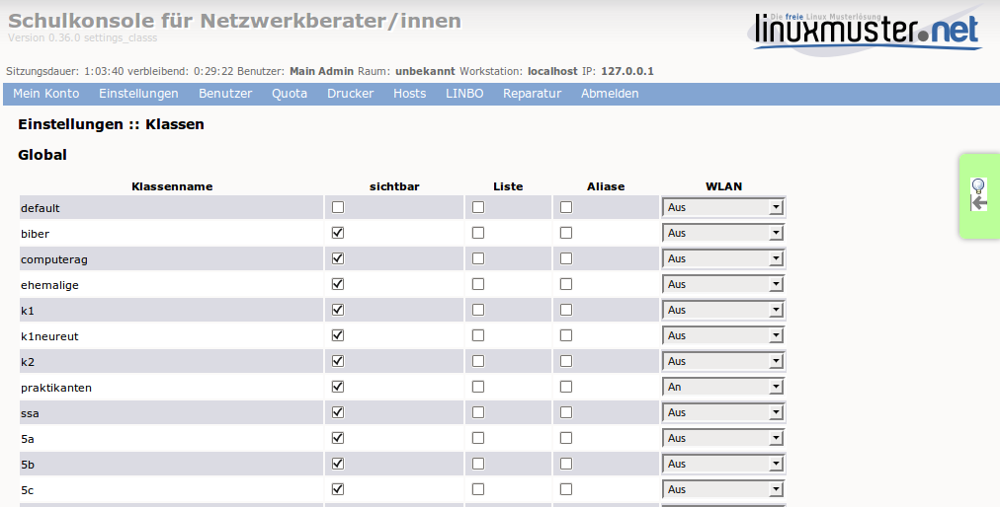
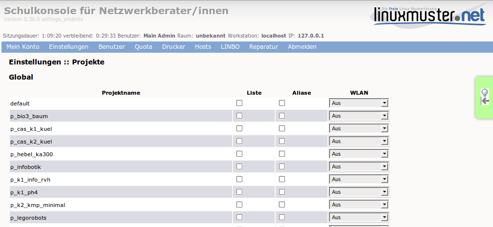
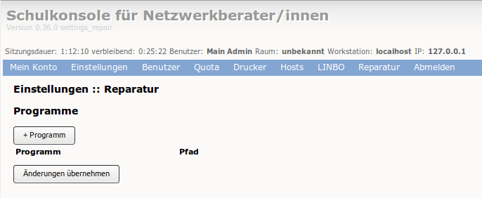

=====================
 Menü: Einstellungen
=====================

.. _schulkonsole-einstellungen:

Schulkonsole
============

Sitzungsdauer:
 Zeit bis zum automatischen Logout aus der Schulkonsole

Überprüfe die Passwortgüte:
 Soll das Passwort auf eine minimale Länge, der zwingenden Verwendung zweier unterschiedlicher Zeichenarten und auf verbotene Sonderzeichen überprüft werden?

Minimale Passwortlänge:
 Diese Anzahl an Zeichen muss ein Passwort mindestens haben.

.. _manual-sk-admin-settings-user-label:

Benutzerverwaltung
==================

Global
------

.. image:: media/schulkonsole-settings-usermanagement-global.png

Logmeldungen:
 Mit dieser Angabe stellen Sie ein, wie ausführlich *Sophomorix* Informationen über die aktuellen Aktionen ausgibt.

Anzahl der Schüler pro Klasse:
 Mit diesen Angaben werden die Schülerzahlen aus der Schulverwaltung auf Gültigkeit geprüft.

Geburtsjahreszahl für Schüler:
 Mit diesen Angaben werden die Geburtsdaten aus der Schulverwaltung auf Gültigkeit geprüft.

Sternchenklassen filtern:
 Im Schulverwaltungsprogramm *Splan* werden vor die neuen Eingangsklassen für das nächste Schuljahr Sternchen gemacht. Diese Schüler können heraus gefiltert werden, damit sie in den anderen Report-Dateien nicht stören.                        

Quota aktivieren:
 Hier können Sie angeben, ob die Benutzer nur begrenzten Plattenplatz zur Verfügung gestellt bekommen sollen.

Standardquota Lehrer/Schüler:
 Die Werte müssen für die einzelnen Partitionen getrennt eingegeben werden. Wie viele das sind hängt von der Partitionierung ihrer Serverplatte ab. Der letzte Eintrag ohne Partition bezieht sich auf Mailquota. Bei Übernahme der Änderungen werden die Quota-Einstellungen der entsprechenden Benutzer angepasst.

Schulweites Tauschen aktivieren:
 Damit stellen Sie ein, ob allen Benutzer der Ordner ``T:\tausch-Schule`` (in einem Windows-Client) bzw. ``Tausch_auf_Server/tausch-Schule`` (in einem Linux-Clientd) zur Verfügung steht. 

Kodierung
---------

+---------------------------+-----------------------------------------------------------------------------------------------------------+
| **Abschnitt Kodierungen** | **Erläuterungen**                                                                                         |
|                           |                                                                                                           |
+===========================+===========================================================================================================+
| *schueler.txt*            | Bestimmt die Kodierung, die diese Textdatei im System hat. Das spielt für die Interpretation der Zeichen  |
|                           | eine entscheidende Rolle. Bei Windows ist es meistens win1252, bei Linux utf8.                            |
+---------------------------+-----------------------------------------------------------------------------------------------------------+
| *lehrer.txt*              | Bestimmt die Kodierung der Datei, in der die Lehrer gespeichert werden.                                   |
|                           |                                                                                                           |
+---------------------------+-----------------------------------------------------------------------------------------------------------+
| *extraschueler.txt*       | Bestimmt die Kodierung der Datei, in der zusätzliche Schüler gespeichert werden, die nicht aus der        |
|                           | Schulverwaltung übernommen werden.                                                                        |
+---------------------------+-----------------------------------------------------------------------------------------------------------+
| *extrakurse.txt*          | Bestimmt die Kodierung der Datei, in der zusätzliche Kurse mit zusätzlichen Benutzern gespeichert werden, |
|                           | die nicht als Benutzer in Klassen der Schulverwaltung entnommen wurden.                                   |
+---------------------------+-----------------------------------------------------------------------------------------------------------+

E-Mail
------

.. image:: media/schulkonsole-settings-usermanagement-email.png

+--------------------------+------------------------------------------------------------------------------------------------------+
| **Abschnitt E-Mail**     | **Erläuterungen**                                                                                    |
|                          |                                                                                                      |
+==========================+======================================================================================================+
| *Mail-Alias*             | Der Mail-Alias ist eine alternative Mailadresse, die aussagekräftiger ist.                           |
|                          |                                                                                                      |
+--------------------------+------------------------------------------------------------------------------------------------------+
| *Mailquota-Warnungen*    | Bestimmt, ob Benutzern bei Überschreitungen eines bestimmten Kontingents Warnungen zugestellt werden |
|                          | sollen.                                                                                              |
+--------------------------+------------------------------------------------------------------------------------------------------+
| *Warnungen bei ...*      | Grenzen, ab wann Warnungen zugestellt werden sollen. Die Grenze kann einmal absolut und einmal       |
|                          | relativ festgelegt werden, da unterschiedliche Benutzer unterschiedliche Quoten haben können.        |
+--------------------------+------------------------------------------------------------------------------------------------------+
| *Überschreitung an root* | Hier kann bestimmt werden, ob root eine Kopie der Quota-Warnungen erhält.                            |
| *melden*                 |                                                                                                      |
+--------------------------+------------------------------------------------------------------------------------------------------+

Login und Löschen
-----------------

Den Abschnitt gibt es je einmal für *Schüler* und *Lehrer*, da man für diese Benutzergruppen sicherlich teilweise unterschiedliche Werte
festlegen möchte. Für den Abschnitt *Löschen* gilt das ebenfalls.

+--------------------------+--------------------------------------------------------------------------------------------------------------------+
| **Abschnitt Login**      | **Erläuterungen**                                                                                                  |
|                          |                                                                                                                    |
+==========================+====================================================================================================================+
| *Zufallspasswort*        | Mit einem Haken an dieser Stelle wird für jeden neu angelegten Benutzer ein                                        |
|                          | Zufallspasswort generiert. Andernfalls wird jedem neuen Benutzer das Passwort                                      |
|                          | *linux*                                                                                                            |
|                          | vergeben, was eine Sicherheitslücke darstellt, wenn die Benutzer ihr Passwort                                      |
|                          | nicht ändern. Die Loginkärtchen der neu angelegten Schüler können von jedem Lehrer ausgedruckt werden.             |
|                          |                                                                                                                    |
+--------------------------+--------------------------------------------------------------------------------------------------------------------+
| *Zufallspasswortzeichen* | Bestimmt die Länge der Zufallspasswörter                                                                           |
|                          |                                                                                                                    |
+--------------------------+--------------------------------------------------------------------------------------------------------------------+
| *Shell aktivieren*       | Der Benutzer benötigt eine Shell, wenn er sich auf einem Linux-System mit                                          |
|                          | *gnome-*                                                                                                           |
|                          | Oberfläche anmelden will.                                                                                          |
|                          |                                                                                                                    |
+--------------------------+--------------------------------------------------------------------------------------------------------------------+
| *Sambapasswort ändern*   | Ist das gewählt, müssen Benutzer bei der ersten Anmeldung ihr Passwort ändern. Das bezieht sich nur auf Windows.   |
|                          |                                                                                                                    |
+--------------------------+--------------------------------------------------------------------------------------------------------------------+
| **Abschnitt Löschen**    | **Erläuterungen**                                                                                                  |
|                          |                                                                                                                    |
+--------------------------+--------------------------------------------------------------------------------------------------------------------+
| *Duldungszeitraum*       | Das ist der Zeitraum, in dem sich ein Benutzer nach Löschung in der Schulverwaltung                                |
|                          | noch am System anmelden kann, dann aber keinen Zugriff mehr auf das Klassentauschverzeichnis hat.                  |
|                          |                                                                                                                    |
+--------------------------+--------------------------------------------------------------------------------------------------------------------+
| *Deaktivierungs­zeitraum*| In dieser Zeit ist keine Anmeldung mehr möglich, allerdings kann der Netzwerkbetreuer                              |
|                          | den Benutzer mit all seinen Daten wieder aktivieren und ins System zurückholen.                                    |
|                          |                                                                                                                    |
+--------------------------+--------------------------------------------------------------------------------------------------------------------+

Druckdaten
++++++++++

Die folgenden Daten werden z.B. für die Erstellung von Passwortzetteln mit Informationen genutzt, die neue Benutzer erhalten.

+--------------------------+----------------------------------------------------------------------------------------------------+
| **Abschnitt Druckdaten** | **Erläuterungen**                                                                                  |
|                          |                                                                                                    |
+==========================+====================================================================================================+
| *Schulname*              | So erscheint der Schulname auf Ausdrucken wie z.B. Passwortlisten.                                 |
|                          |                                                                                                    |
+--------------------------+----------------------------------------------------------------------------------------------------+
| *Interner Servername*    | Das ist der Name des Servers, unter dem er im Schulnetz angesprochen wird. Dieser Ausdruck dient   |
|                          | den Benutzern zur Orientierung.                                                                    |
+--------------------------+----------------------------------------------------------------------------------------------------+
| *Externer Servername*    | Hiermit ist ein Name, wie er z.B. über einen Service wie *dyndns* vergeben wird, gemeint.          |
|                          |                                                                                                    |
+--------------------------+----------------------------------------------------------------------------------------------------+
| *Samba-Domäne*           | Hier sollte der Wert eingestellt werden, den man bei der Installation für die Domäne der Schule    |
|                          | angegeben hat.                                                                                     |
+--------------------------+----------------------------------------------------------------------------------------------------+
| *Moodle-URL*             | Da ein eventuell betriebenes Moodle nicht unbedingt über den eigenen Server zu erreichen ist, kann |
|                          | diese URL hier explizit eingegeben werden.                                                         |
+--------------------------+----------------------------------------------------------------------------------------------------+
| *Administratoren*        | Die Namen der Administratoren können angegeben werden, damit neue Benutzer leichter einen          |
|                          | Ansprechpartner bei Problemen finden.                                                              |
+--------------------------+----------------------------------------------------------------------------------------------------+

Alle Änderungen werden erst wirksam, wenn ganz unten auf ``Änderungen übernehmen`` geklickt wird.

Räume
=====

Legen Sie hier die Standardeinstellungen für den Zugang zu *Internet*,
*Intranet* und *Webfilter* für die Workstations in den Räumen fest.

* Aus der "default"-Zeile kann für einen gesamten Raum eine Ausnahme
  hinzugefügt werden.
 
* Um eine Ausnahme für eine Workstation anzulegen, muss ein Eintrag für
  den Raum hinzugefügt worden sein.

* Um einen Eintrag zu löschen, setzen Sie das Häkchen in der
  entsprechenden Checkbox am Zeilenende.
 
* Um die Rechner in einem Raum oder einzelne Rechner zurückzusetzen,
  setzen Sie das Häkchen in der entsprechenden Checkbox und wählen die
  Aktion „Auswahl zurücksetzen“.
 
* Legen Sie außerdem fest, welche Räume von der Schulkonsole als
  Computerraum unter „aktueller Raum“ verwaltbar sein sollen.

* Schliessen Sie die Aktion mit „Änderungen übernehmen“ ab.
 

Klassen
=======

Nehmen Sie hier einige Einstellungen für Klassen vor.

sichtbar:
 Ausgewählte Klassen sind die Klassen, in die sich der Lehrer in der Schulkonsole eintragen kann.

Liste:
 Für ausgewählte Klassen wird Server-intern ein Mailverteiler eingerichtet.

Aliase:
 Für ausgewählte Klassen werden Server-intern Mailaliase für die jeweiligen Mitglieder erstellt.

WLAN:
 Für ausgewählte Klassen wird *permanent* den jeweiligen Mitgliedern
 die Berechtigung zum Login über WLAN gegeben. Zeitgesteuerte
 Einstellungen können eingetragene Lehrer bei ihren Klassen vornehmen.

Projekte
========

Nehmen Sie hier einige Einstellungen für Projekte vor.

Liste:
 Für ausgewählte Projekte wird Server-intern ein Mailverteiler eingerichtet.

Aliase:
 Für ausgewählte Projekte werden Server-intern Mailaliase für die jeweiligen Mitglieder erstellt.

WLAN:
 Für ausgewählte Projekte wird *permanent* den jeweiligen Mitgliedern
 die Berechtigung zum Login über WLAN gegeben. Zeitgesteuerte
 Einstellungen können eingetragene Lehrer bei ihren Klassen vornehmen.

Reparaturen
===========

Nehmen Sie hier spezielle Reparatureinstellungen vor.

