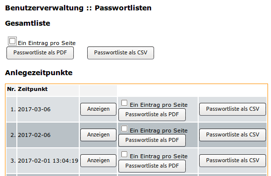

.. _schulkonsole-admin-user-label:

==========================
 Menü: Benutzerverwaltung
==========================

.. image:: media/schulkonsole-user.png

Im Menüpunkt "Benutzerverwaltung" können die verschiedenen
Benutzerlisten gepflegt, Änderungen überprüft und übernommen werden.
Die genaue Funktionsweise wird in der Anleitung
:ref:`howto-user-management` beschrieben.

Darüber hinaus können Lehrerpasswörter zurückgesetzt werden, siehe :ref:`howto-change-teacher-passwords`.

Passwortlisten
--------------

Der Administrator kann hier einsehen, zu welchen Zeitpunkten Benutzer
neu angelegt wurden.

Sie können entweder eine **Gesamtliste** aller Benutzer mit deren
Passwörtern erhalten oder aber einen bestimmten Zeitpunkt heraussuchen
und dann die Liste der zu diesem Zeitpunkt angelegten Benutzer
erhalten.  

Dabei können Sie jeweils entweder eine Liste als *PDF*-Datei
oder als *CSV*-Datei erhalten. Die *PDF*-Datei enthält Anmeldekärtchen
der Benutzer.

.. figure:: media/schulkonsole-benutzer-passwortlisten-pdf.png

   Anmeldekärtchen der Benutzer

Alternativ können Sie sich über die Option **Ein Eintrag pro Seite**
Seiten mit ausführlichen Anmeldeinformationen ausgeben lassen.

.. figure:: media/schulkonsole-benutzer-passwortlisten-pdf-detailiert.png
 
   Ausführliche Anmeldeinformationen für den Benutzer

	   
Berichte
--------

Hier rufen Sie die Berichte der jeweils letzten Aktion ab.

Unter „Administrator-Report“ erhalten Sie ein Protokoll des letzten
Durchlaufs von „anlegen/versetzen/löschen“.

Unter „Report für das Sekretariat“ finden Sie Angaben zu Datensätzen,
die nicht den Vorgaben von Sophomorix entsprechen und evtl. im
Schulverwaltungsprogramm korrigiert werden müssen.
