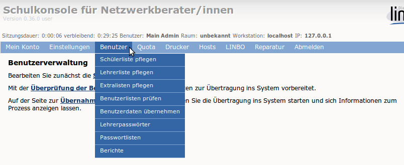

==========================
 Menü: Benutzerverwaltung
==========================

Im Menüpunkt "Benutzerverwaltung" können die verschiedenen
Benutzerlisten gepflegt, Änderungen überprüft und übernommen werden.
Die genaue Funktionsweise wird in der Anleitung
:ref:`howto-user-management` beschrieben.

Darüber hinaus können Lehrerpasswörter zurückgesetzt werden, siehe :ref:`howto-change-teacher-passwords`.

Passwortlisten
--------------

Auf dieser Seite können Sie Benutzerlisten als PDF oder CSV von zu
einem bestimmten Zeitpunkt hinzugefügten oder allen Benutzern
erzeugen lassen.
	   
Berichte
--------

Hier rufen Sie die Berichte der jeweils letzten Aktion ab.

Unter „Administrator-Report“ erhalten Sie ein Protokoll des letzten
Durchlaufs von „anlegen/versetzen/löschen“.

Unter „Report für das Sekretariat“ finden Sie Angaben zu Datensätzen,
die nicht den Vorgaben von Sophomorix entsprechen und evtl. im
Schulverwaltungsprogramm korrigiert werden müssen.
