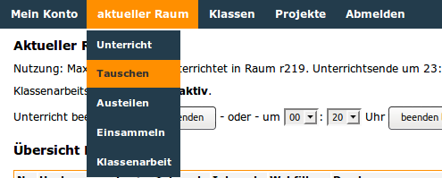

================
 Aktueller Raum
================

Unterricht
==========

.. image:: media/schulkonsole-room.png

Auf dieser Seite können Sie den Unterricht steuern: Unterricht
beginnen und beenden, die Verbindung zu Internet, Intranet, den
Druckern steuern, den Webfilter ein- oder ausschalten.

Sobald der Unterricht begonnen wurde, kann man im Menü weitere pädagogische Funktionen nutzen:

Tauschen
========

Steuern Sie hier den Zugriff auf das globale Tauschverzeichnis, indem
Sie entweder einzelne Arbeitsplätze über die Checkboxen auswählen oder
über die `Schnellauswahl` für alle.  Mit `Änderungen übernehmen`
aktivieren Sie Ihre Auswahl.

Austeilen
=========

Auszuteilende Dateien müssen in Ihrem Heimatverzeichnis unter
``_auszuteilen -> auszuteilen-aktueller_raum`` abgelegt sein. Der Inhalt
dieses Ordners wird hier aufgelistet.  Nachträglich dorthin abgelegte
Dateien können Sie über die Schaltfläche `Ansicht aktualiseren`
sichtbar machen.

Die Schüler/innen finden die ausgeteilten Dateien in ihrem
Heimatverzeichnis unter ``__austeilen -> austeilen-aktueller_raum``.

Einsammeln
==========

Einzusammelnde Dateien müssen im Heimatverzeichnis der Schüler/innen
im Ordner ``__einsammeln`` abgelegt sein, damit sie hier aufgelistet
werden.  Nachträglich von den Schüler/innen dorthin abgelegte Dateien
können Sie über `Ansicht aktualisieren` sichtbar machen.

Wählen Sie aus, ob die Originaldateien auf Schülerseite gelöscht
werden oder erhalten bleiben sollen.

Sie finden die eingesammelten Dateien in Ihrem Heimatverzeichnis unter
``_eingesammelt -> eingesammelt-aktueller_raum``.

Klassenarbeit
=============

Übernehmen Sie entweder das vorgegebene Zufallspasswort oder geben Sie
ein eigenes Passwort ein.

Mit Betätigung der Schaltfläche `Klassenarbeit starten` wird das neue
Passwort an alle Arbeitsstationen im Raum verteilt, und die
Schüler/innen können sich mit dem Namen der Arbeitsstation und dem
eben vergebenen Passwort anmelden.
