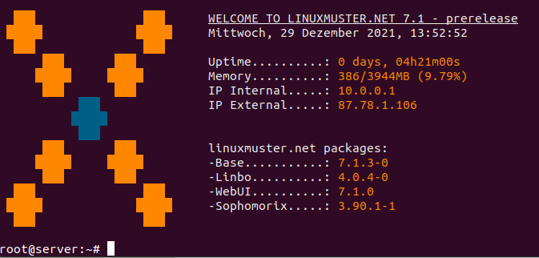

============================
 Migration lmn7.0 --> lmn7.1
============================

.. sectionauthor:: `@cweikl <https://ask.linuxmuster,net/u/cweikl>`_

Voraussetzungen
===============

Bestehendes System
------------------

Du hat linuxmuster.net bereits in der Version 7.0 installiert und du verfügst über ein lauffähiges System bestehend aus OPNsense® und linuxmuster.net Server basierend auf Ubuntu 18.04 LTS.

Vom Server aus hast du Internet-Zugriff.

Aktualisierung der Apt-Sources
------------------------------

Es müssen in den Paketquellen die ``linuxmuster.net sources`` für die neue lmn 7.1 eingetragen und der Schlüssel des Paketservers importiert werden.

Füge das neue repository auf dem Server in der Konsole wie folgt hinzu:

.. code::

   sudo -i
   wget -qO - "https://deb.linuxmuster.net/pub.gpg" | sudo apt-key add -
   sudo sh -c 'echo "deb https://deb.linuxmuster.net/ lmn71 main" > /etc/apt/sources.list.d/lmn71.list'
   sudo apt update
   
Danach löscht du die bisherigen Paketquellen für die Version lmn 7.0. 
Gebe hierzu im Terminal auf dem Server folgendes an:

.. code::

   sudo rm /etc/apt/apt.sources.d/lmn7.list
   
Alternativ kannst du die Einträge in der Datei ``/etc/apt/apt.sources.d/lmn7.list`` wie folgt auskommentieren:

.. code::

   # deb https://archive.linuxmuster.net lmn7/
   # deb-src https://archive.linuxmuster.net lmn7/
   
Aktualisiere die Paketquellen auf dem Server und migriere / aktualisiere deinen Server nun auf die Version lmn 7.1 mit:

.. code::

   sudo apt update && apt-dist-upgrade
   
Bestätige die Rückfragen zur Installation mit y / j.
Nach Abschluss der Aktualisierung starte das System einmal neu mit ``sudo reboot``.

Hat alles erfolgreich funktioniert wirst Du nach der Anmeldung auf der Konsole des Servers mit folgendem Bildschirm begrüßt:

Danach kannst Du wir bisher auch weiterarbeiten.

