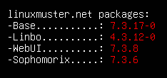

.. include:: /guided-inst.subst

.. _upgrade-from-7.2-label:

=====================
Upgrade v7.2 auf v7.3
=====================

.. attention::

   Vor dem Upgrade auf linuxmuster.net v7.3 solltest Du unbedingt Snapshots Deiner VMs anlegen (Server und Firewall).

Ablauf
------

1. Bringe zuerst den lmn7.2 Server auf den aktuellsten Paketstand.

Führe dazu in der Konsole folgende Befehle aus:

.. code::

   sudo apt update
   sudo apt dist-upgrade

2. Falls Du OPNsense |reg| als Firewall einsetzt, aktualisiere diese zunächst auf eine Version > 25.1.

3. Führe das Upgrade auf die linuxmuster.net v7.3 - wie nachstehend beschrieben - durch.

Upgrade
-------

Nachdem Du als Benutzer ``linuxadmin`` angemeldet bist, wechselst Du nun zum Benutzer root mit:

.. code::

   sudo -i

**a) Upgrade auf lmn73 durchführen**

Für das Upgrade von linuxmuster.net v7.2 auf die Version v7.3 findest Du ein Upgrade Skript, das Ubuntu Server von 22.04 auf 24.04 LTS aktualisiert, neue Paketquellen für linuxmuster.net einträgt und danach linuxmuster.net auf die Version 7.3 bringt.

Rufe das Skript wie folgt auf:

.. code::

   /usr/sbin/linuxmuster-release-upgrade | tee /root/migration-to-lmn73.log

Auf diese Weise siehst Du die Rückmeldungen des Upgrade Skriptes und es wird parallel eine Log-Datei mitgeschrieben.

Das Upgrade dauert eine ganze Zeit. Du erhälst zu Beginn auf der Konsole den Hinweis, dass Du vor dem Upgrade einen Snapshot Deiner VM anlegen solltest. Zum Start des Upgrades musst Du dann den in der Konsole angezeigten Text eingeben und dies mit ENTER bestätigen. Danach startet das Upgrade.

Prüfe während des Upgrades, ob Fehler ausgegeben werden. Im Nachgang kannst Du zudem in der mitgeschriebenen Log-Datei ggf. nach Fehlern suchen.

.. code::

   less /root/migration-to-lmn73.log

**b) Firewall & Server neu starten** 

Starte nach dem Upgrade sowohl die Firewall als auch den Server neu.

Melde Dich am Server an, Du solltest den Hinweis auf linuxmuster.net 7.3 sehen:

   linuxmuster.net v7.3

Prüfe nun, ob alle Dienste korrekt gestartet wurden.

.. code::

   sudo systemctl list-units --state=failed
   
Du siehst ggf. einen Hinweis auf `quotaon.service`, der sich allerdings nur auf die Root-Partition bezieht, für keine Quota gesetzt werden kann. Dies ist das erwartete Verhalten.

.. hint::

   Falls Du das Upgrade ohne Rückmeldungen und manuellen Reboot durchführen möchtest, nutze `/usr/sbin/linuxmuster-release-upgrade --force --reboot`. Achte darauf, dass nach dem Reboot des Servers ebenfalls die Firewall neu zu starten ist.

