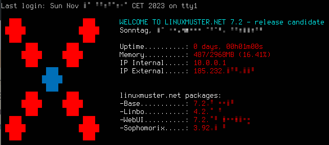

.. _upgrade-from-7.1-label:

=====================
Upgrade v7.1 auf v7.2
=====================

1. Bringe zuerst den lmn7.1 Server auf den aktuellsten Paketstand.

Führe dazu in der Konsole folgende Befehle aus:

.. code::

   sudo apt update
   sudo apt dist-upgrade

2. Aktualisiere danach das Betriebssystem auf dem Server von Ubuntu 18.04 LTS auf die Version Ubuntu 20.04 LTS. Nutze dazu den Befehl ``do-release-upgrade``.

Gib dazu auf der Server-Konsole ein:

.. code::

   linuxadmin@server:~$ sudo -i
   root@server:~$ do-release-upgrade

Nach der Überprüfung siehst Du, wieviele Pakete aktualisiert, neu installiert und gelöscht werden.
Bestätige den Vorgang zur Durchführung des Upgrades mit ``j``.

Während des Upgrades erhältst Du mehrere Nachfragen. 
Für einige Dienste (z.B. samba, ssh) wirst Du gefragt, ob die Konfigurationsdatei aktualisiert werden soll.

.. attention::

   Die Nachfrage zur Aktualisierung der Konfigurationsdateien für diese Dienste musst Du unbedingt mit ``N`` beantworten.
   Beispiele (keine Garantie auf Vollständigkeit) sind: ``/etc/security/limits.conf``, ``/etc/ntp.conf``, ``/etc/system/system.conf``, ``/etc/samba/smb.conf``, ``/etc/sshd/sshd_config``

Zudem müssen während oder nach der Installation einiger neuerer Bibliotheken einige Dienste neu gestartet werden. Diese werden Dir in einer Liste angezeigt. Bestätige deren Neustart mit ``OK``.

Danach wirst Du gefragt, ob Du die lokale Version bestimmter Dienste beibehalten möchtest. Beantworte dies jeweils mit ``Ja/OK``.

Nach der Aktualisierung der Pakete wirst Du gefragt, ob die alten Pakete entfernt werden sollen. Bestätige dies mit ``J``.

Danach wirst Du aufgefordert das System neu zu starten. Führe einen ``Reboot`` aus.

3. Aktualisiere danach das Betriebssystem auf dem Server von Ubuntu 20.04 LTS auf die nachfolgende Version Ubuntu 22.04 LTS. Nutze dazu den Befehl ``do-release-upgrade``.

Der weitere Ablauf ist identisch zu den unter 2.) beschriebenen Schritten.

4. Führe die erneute Konfiguration der lmn-Pakete aus. Rufe dazu folgenden Befehl auf:

.. code::

   linuxadmin@server:~$ sudo -i
   root@server:~$ dpkg-reconfigure sophomorix-samba linuxmuster-base7 linuxmuster-webui7

5. Aktiviere das lmn71-Repository wieder, indem Du die Datei ``/etc/apt/sources.list.d/lmn71.list``
editierst und dort das während des Upgrades automatisch eingefügte Kommentarzeichen ``#`` entfernst.

Zudem oder alternativ findest Du die Datei ``/etc/apt/sources.list.d/lmn71.list.distUpgrade``, in der das Repository der lmn 7.1 auskommentiert ist.

6. Füge danach das Repository der lmn72 wie folgt hinzu:

Importiere zuerst die Schlüsseldatei:

.. code::

   root@server:~$ sudo sh -c 'wget -qO- "https://deb.linuxmuster.net/pub.gpg" | gpg --dearmour -o /usr/share/keyrings/linuxmuster.net.gpg'

.. hint::

   Bei ``wget -qO-`` ist der Großbuchstabe O zu verwenden - n i c h t die Zahl 0. 

Füge danach das Linuxmuster 7.2 - Repository hinzu:

.. code::

   root@server:~$ sh -c 'echo "deb [arch=amd64 signed-by=/usr/share/keyrings/linuxmuster.net.gpg] https://deb.linuxmuster.net/ lmn72 main" > /etc/apt/sources.list.d/lmn72.list'

Aktualisiere nun die Paketquellen:

.. code::

   root@server:~$ apt update

7. Aktualisiere die installierten Pakete und führe anschließend ein Reboot durch:

.. attention::

   Die Nachfrage zur Aktualisierung der Konfigurationsdateien für Dienste musst du in diesem Schritt (im Gegensatz zur Systemaktualisierung in Schritt 2 und 3) mit ``I`` oder ``Y`` akzeptieren.
   Beispiele (keine Garantie auf Vollständigkeit) sind: ``/etc/default/linbo-torrent``

.. code:: 

   root@server:~$  apt dist-upgrade
   root@server:~$  reboot

8. Nach dem Neustart führe den Import der Geräte erneut aus:

.. code::

   sudo linuxmuster-import-devices

9. Starte nun die Clients neu. Du wirst zunächst noch die Version 4.0 von Linbo auf den Clients nach dem ersten Start sehen. Starte den Client ein zweites Mal und Linbo wird dann automatisch auf dem Client auf die Version 4.2 aktualisiert.

10. Synchronisiere das Betriebssystem und melde Dich danach mit einem Domänen-Benutzer an.

   
   Server-Infos nach dem Konsolen-Login
   
.. attention::

   Beim Upgrade von Ubuntu 18.04 über Ubuntu 20.04 zu 22.04 LTS werden die Einstellungen für CUPS zwar korrekt übernommen. Allerdings treten für einige Drucker Fehler auf. Es ist in diesen Fällen sinnvoll die Druckerinstallation erneut durchzuführen. Für viele HP-Drucker ist es hilfreich die Bibliothek ``hplip`` auf dem Server nachzuinstallieren - siehe zu den Druckern :ref:`configure-printers-label`.
   

