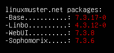

.. include:: /guided-inst.subst

.. _upgrade-from-7.3-label:

=====================
Upgrade v7.3 auf v7.4
=====================

.. attention::

   Vor dem Upgrade auf linuxmuster.net v7.4 solltest Du unbedingt Snapshots Deiner VMs anlegen (Server und Firewall).

Ablauf
------

1. Bringe zuerst den lmn7.3 Server auf den aktuellsten Paketstand. **Dieser Schritt ist zwingend erforderlich:** Das für die folgenden Schritte benötigte Skript ``linuxmuster-release-upgrade`` wird erst ab ``linuxmuster-base7`` Version 7.3.37 ausgeliefert und existiert auf älteren 7.3-Ständen noch nicht.

Führe dazu in der Konsole folgende Befehle aus:

.. code::

   sudo apt update
   sudo apt dist-upgrade

.. attention::

   Prüfe anschließend, ob ein Neustart erforderlich ist, und starte den Server in diesem Fall neu, bevor Du fortfährst:

   .. code::

      test -f /var/run/reboot-required && echo "Neustart erforderlich" && reboot

2. Falls Du OPNsense |reg| als Firewall einsetzt, aktualisiere diese zunächst auf eine Version >= 26.1.

   .. note::

      Dieser Sprung erfolgt je nach Ausgangsstand in mehreren Stufen (z. B. 25.1 -> 25.7 -> 26.1) mit jeweils einem Neustart dazwischen — der Hinweis auf die jeweils nächste Major-Version erscheint erst, wenn die aktuell laufende Serie ihr letztes Patchlevel erreicht hat. Prüfe daher nach jedem Zwischenschritt erneut auf verfügbare Updates, bis Version 26.1 erreicht ist.

      Führst Du das Update über das Konsolenmenü durch (Punkt **12) Update from console**), wird ein Major-Upgrade nicht mit ``y``, sondern durch Eintippen der Zielversionsnummer (z. B. ``25.7`` bzw. ``26.1``) bestätigt — ``y`` aktualisiert nur innerhalb der aktuell laufenden Serie.

3. Hast Du die OPNsense |reg| aktualisiert, werden Deine bisherigen Firewall-Regeln mitgenommen. Diese musst Du nun unbedingt auf das neue Format für Firewall-Regeln migrieren:

   a) Öffne in der OPNsense-Weboberfläche den Menüpunkt **Firewall** (den obersten Eintrag im Menü — nicht *Firewall → Rules*). Der Unterpunkt **Migration** erscheint dort nur, solange noch Legacy-Regeln oder Legacy-Outbound-NAT-Regeln vorhanden sind.
   b) Exportiere Deine bestehenden Regeln über **Export as CSV**.
   c) Importiere die CSV-Datei über **Import CSV** in die neuen Regeln.
   d) Klicke auf **Apply**, um die importierten Regeln zu übernehmen.
   e) Entferne abschließend die alten Regeln über **Remove all legacy rules**.

   .. attention::

      Prüfe vor dem Entfernen der Legacy-Regeln unbedingt, dass die neuen Regeln den von Dir benötigten Zugriff (insbesondere SSH- bzw. Konsolenzugriff) weiterhin erlauben — sonst kannst Du Dich von der Firewall aussperren.

   Eine ausführliche Beschreibung mit Screenshots findest Du hier: https://www.thomas-krenn.com/en/wiki/OPNsense_26.1_Firewall_Rule_Migration

4. Führe das Upgrade auf die linuxmuster.net v7.4 - wie nachstehend beschrieben - durch. Setzt Du zusätzlich einen separaten Fileserver ein, aktualisiere diesen im Anschluss ebenfalls, siehe c) Fileserver aktualisieren.

Upgrade
-------

Nachdem Du als Benutzer ``linuxadmin`` angemeldet bist, wechselst Du zum Benutzer root mit:

.. code::

   sudo -i

**a) Upgrade auf lmn74 durchführen**

Für das Upgrade von linuxmuster.net v7.3 auf die Version v7.4 findest Du ein Upgrade-Skript, das Ubuntu Server von 24.04 LTS auf 26.04 LTS aktualisiert, neue Paketquellen für linuxmuster.net einträgt und danach linuxmuster.net auf die Version 7.4 bringt.

Rufe das Skript wie folgt auf:

.. code::

   /usr/sbin/linuxmuster-release-upgrade

.. attention::

   Falls Du Dich via SSH auf dem Server anmeldest, stelle sicher, dass Du als user ``root`` eine tmux-Session startest, damit das Upgrade nicht die SSH-Verbindung unterbricht.

Das Upgrade dauert eine ganze Zeit. Du erhältst zu Beginn auf der Konsole den Hinweis, dass Du vor dem Upgrade einen Snapshot Deiner VM anlegen solltest. Zum Start des Upgrades musst Du ``YES`` eingeben und dies mit ENTER bestätigen.

Anschließend versucht das Skript, die Grub-Boot-Disk automatisch zu erkennen, und fragt danach zur Bestätigung:

.. code::

   ## Trying to auto-detect all grub boot disks: /dev/vda
   Input the grub boot disk to continue:

Übernimm hier in der Regel den vom Skript direkt darüber angezeigten, automatisch erkannten Wert (bei virtualisierten Servern z. B. ``/dev/vda``, bei anderer Hardware/Hypervisoren ggf. ``/dev/sda`` oder ``/dev/nvme0n1``). Prüfe im Zweifel vorher mit ``lsblk``, welches Gerät die Root-Partition ``/`` enthält.

.. note::

   Bis zur Veröffentlichung von Ubuntu 26.04.1 (voraussichtlich 06.08.2026) meldet das Skript an dieser Stelle zusätzlich ``Upgrade to 26.04 is available as development release!`` und wechselt automatisch in den Devel-Modus. Das ist in diesem Zeitraum erwartet und kein Fehler.

Danach startet das eigentliche Upgrade.

Prüfe während des Upgrades, ob Fehler ausgegeben werden. Im Nachgang kannst Du zudem in der mitgeschriebenen Log-Datei ggf. nach Fehlern suchen.

.. code::

   less /var/log/linuxmuster/linuxmuster-release-upgrade.log

**b) Firewall & Server neu starten** 

Starte nach dem Upgrade sowohl die Firewall als auch den Server neu.

Melde Dich am Server an, Du solltest den Hinweis auf linuxmuster.net 7.4 sehen:

.. todo::

   Screenshot erneuern

   linuxmuster.net v7.4

Prüfe nun, ob alle Dienste korrekt gestartet wurden.

.. code::

   sudo systemctl list-units --state=failed
   
Du siehst ggf. einen Hinweis auf `quotaon.service`, der sich allerdings nur auf die Root-Partition bezieht, für die keine Quota gesetzt werden kann. Dies entspricht dem erwarteten Verhalten.

**c) Fileserver aktualisieren**

Setzt Du einen separaten Fileserver ein, bringst Du diesen anschließend ebenfalls auf Ubuntu 26.04 LTS. Anders als beim Server gibt es dafür kein eigenes linuxmuster.net-Skript — führe stattdessen ein reguläres Ubuntu-Release-Upgrade durch.

Melde Dich dazu am Fileserver an und wechsle wie oben beschrieben zum Benutzer root:

.. code::

   sudo -i

.. code::

   apt update
   apt dist-upgrade
   do-release-upgrade

.. note::

   Bis zur Veröffentlichung von Ubuntu 26.04.1 (voraussichtlich 06.08.2026) musst Du dafür ggf. den Parameter ``-d`` ergänzen (``do-release-upgrade -d``), da 26.04 bis dahin nur als Entwicklungsversion angeboten wird.

Nach dem Upgrade ist der Fileserver auf demselben Samba-Stand wie der Server; ein separates ``linuxmuster-fileserver``-Paket für v7.4 wird dafür nicht benötigt.

Starte den Fileserver anschließend neu und prüfe die Dienste wie unter b) beschrieben.

