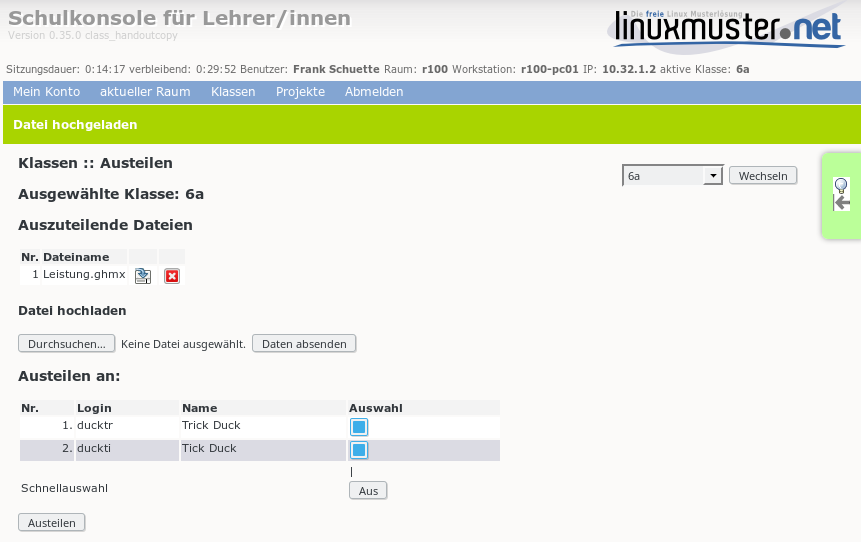
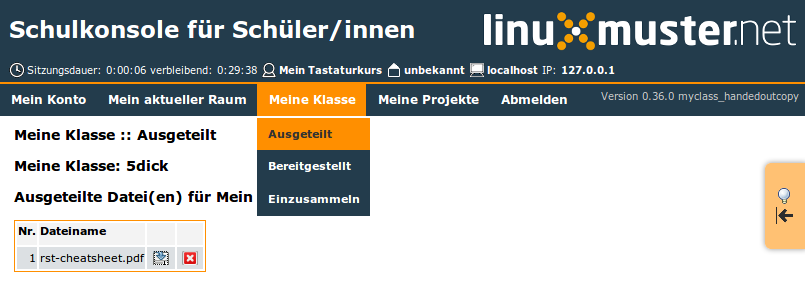
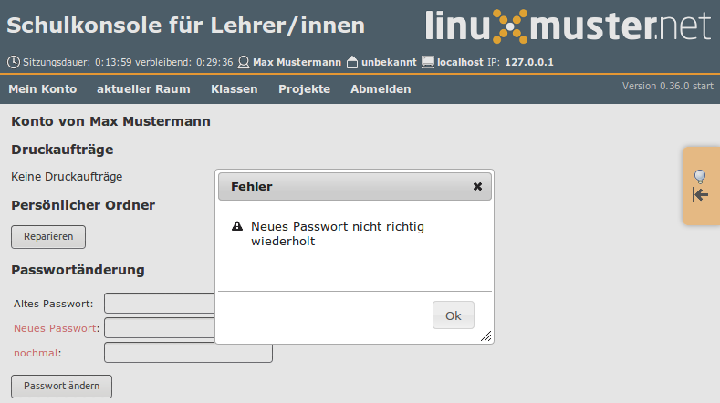
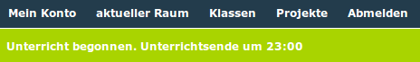
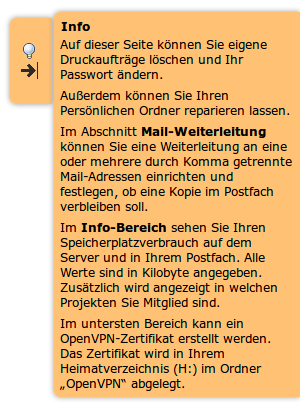

Neuerungen in der Schulkonsole
==============================

Die meisten Neuerungen gibt es für den Netzwerkbetreuer. Aber auch für die Lehrersicht und die Schülersicht gibt
es einige Neuerungen. Schließlich ist die Programmoberfläche insgesamt in Teilen überarbeitet worden.

Für den letzten Punkt wurde Javascript und jQuery verwendet. Daher ist es jetzt erforderlich, zumindest für
die Schulkonsole auf den Clients im Browser Javascript zu aktivieren.

Allgemein
---------
Das Paket **linuxmuster-schulkonsole-template** ist jetzt integriert und damit in Zukunft überflüssig. Es sollte deinstalliert 
werden.

Das Design vieler Tabellen wurde zur besseren Übersicht um **Zeilennummern** erweitert.

Die Rechtestruktur ist konfigurierbar geworden. Damit ist es z.B. möglich, Lehrern das Recht für die Abschaltung des Webfilters zu 
entziehen. Genaueres dazu ist zu finden unter `Technische Dokumentation der Schulkonsole <http://www.linuxmuster.net/wiki/entwicklung:schulkonsole:sk_neue_plugin_seite>`_.
Dort ist auch erklärt, wie die Menüstruktur durch z.B. Ausblendung oder Verschiebung von Menüpunkten lokalen Gegebenheiten angepasst werden kann.

Die Kodierung ist intern jetzt vollständig auf **utf8** umgestellt.

Netzwerkbetreuersicht
---------------------

Reparaturen
^^^^^^^^^^^
Es gibt einige Reparaturmöglichkeiten für die Home-Verzeichnisse und andere wichtige Systemverzeichnisse. Diese
finden sich im Menü **Reparaturen** (diese Seiten rufen *sophomorix-repair* auf).

Einstellungen zu Reparaturen
""""""""""""""""""""""""""""
Es können Programmnamen mit deren Konfigurationsverzeichnissen verknüpft werden. Diese können dann auch für
Reparaturen herangezogen werden.

Benutzerverwaltung
^^^^^^^^^^^^^^^^^^

Passwörter
^^^^^^^^^^
Es gibt unter *Einstellungen -> Schulkonsole* die Möglichkeit, die Passwortgüte überprüfen zu lassen. Damit werden zu einfache Passwörter der Benutzer abgelehnt.

Einstellungen
"""""""""""""
Auf der Einstellungsseite zur Benutzerverwaltung gibt es viele weitere Einstellmöglichkeiten. Die wichtigste ist
die Kodierung für die jeweiligen Dateien.

Private Mailadresse im LDAP
```````````````````````````

Private Mailadressen können im LDAP-Attribut **mail** verwaltet
werden. Dazu muss der Administrator die entsprechende Funktion wie in
:ref:`howto-use-mail-ldap-label` beschrieben, freischalten.


Historie
""""""""
Unter *Benutzer* gibt es den neuen Menüpunkt **Historie**, über den man gezielt Passwortlisten zu einem bestimmten Zeitpunkt angelegter Benutzer herunterladen kann.

Anlegen, Versetzen, Löschen
"""""""""""""""""""""""""""
In diesem Bereich wird jetzt die log-Datei für einen laufenden Prozess automatisch angezeigt. Das erlaubt eine
bessere laufende Kontrolle.

Plugins
^^^^^^^

Es ist möglich, Plugins für die Schulkonsole zu schreiben. Das Schreiben von Plugins ist auf der Seite
`Technische Doku der Schulkonsole <https://www.linuxmuster.net/wiki/entwicklung:schulkonsole:sk_neue_plugin_seite>`_ dokumentiert.

Momentan gibt des 2 Plugins.

Druckerquotierung (Pykota)
""""""""""""""""""""""""""

Das Plugin ermöglicht die Einrichtung und Einstellung der Quotierung über die Schulkonsole. Das Paket dazu heißt **linuxmuster-pk-schulkonsole**. Es ergänzt das Menü des Netzwerkbetreuers um einen Menüpunkt im Menü Einstellungen und ein Menü Druckquotas.

Backup mit MondoRescue
""""""""""""""""""""""

`MondoRescue <http://www.mondorescue.org>`_ ist ein schon recht altes zuverlässiges Backupprogramm. Das Plugin **linuxmuster-schulkonsole-backup** ergänzt das Menü des Netzwerkbetreuers um einen Menüpunkt im Menü Einstellunglen zur Konfiguration der Backups.

Einstellungen für Klassen und Projekte
^^^^^^^^^^^^^^^^^^^^^^^^^^^^^^^^^^^^^^
Für den Netzwerkbetreuer gibt es unter Einstellungen Menüpunkte für Klassen und Projekte. Dort können Standardeinstellungen festgelegt werden.

- Mailingliste gibt an, ob für die betreffende Gruppe eine Mailingliste angelegt wird.
- Mailalias gibt an, ob die Mitglieder der betreffenden Gruppe Mailalias-Einträge nach dem vorgegebenen Muster
  erhalten.
- WLAN gibt an, ob für die Mitglieder der betreffenden Gruppe das WLAN standardmäßig ein- oder ausgeschaltet
  ist.

Rechnerverwaltung
^^^^^^^^^^^^^^^^^

Hosts
"""""
- Die **hosts**-Tabelle kann nach verschiedenen Spalten aufsteigend bzw. absteigend sortiert werden. Damit ist es einfacher, z.B. freie IP-Adressen eines Raums herauszufinden.
- Die Datei **/etc/linuxmuster/workstations** kann auch Kommentare enthalten. Wird vor den Raumnamen ein Kommentarzeichen eingefügt, bleibt die Zeile erhalten wird aber deaktiviert. 
  Wird das Kommentarzeichen wieder entfernt, so wird die Zeile wieder aktiv.
- Bei einem *import_workstations*, also der Übernahme der Änderungen in das System wird die log-Datei angezeigt.

grub.cfg-Dateien
""""""""""""""""
In der Schulkonsole im Menü LINBO kann der Netzwerkbetreuer direkt grub-Startdateien einer Gruppe bearbeiten.

regpatch-Dateien
""""""""""""""""
Regpatch-Dateien können im Menü Linbo über den Eintrag Regpatch direkt bearbeitet werden.

start.conf
""""""""""
Es gibt mehrere Erweiterungen der start.conf-Datei, die zum Teil mit der Umstellung auf 
grub2 und der damit einhergehenden Unterstützung von UEFI-Rechnern zu tun hat.

- **efi** ist ein neuer Partitionstyp, der bei UEFI-Rechnern zum Starten benötigt wird.
- **Systemtyp** ist ein neues Feld, das den Rechnertyp (bios, bios64, efi32, efi64) angibt.
- **Label** ist ein neues Feld, in welchem man für jede Partition ein Label eintragen kann. Dieses kann
  z.B. zum mounten verwendet werden.

Linbo
^^^^^
Im Linbo-Menü gibt es einen neuen Menüpunkt *Linbo-Remote*. Dort können neue Aufgaben erstellt, laufende Aufgaben überwacht und geplante Aufgaben wieder entfernt werden.

Lehrersicht
-----------

Reparaturen
^^^^^^^^^^^
Auf den Seiten Klassen und Projekte gibt es jeweils den Unterpunkt zur Reparatur der *Persönlichen Ordner* der jeweiligen Mitglieder.

WLAN-Zugriff steuern
^^^^^^^^^^^^^^^^^^^^

.. image:: media/schulkonsole-wlan.png

In den Menüs für Klassen und Projekte ist ein Menüpunkt **Unterricht**, über den sich der WLAN-Zugriff für ausgewählte Benutzer von Projekten, Klassen zeitgesteuert ein- und ausschalten lässt.

Austeilen, Einsammeln, Bereitstellen
^^^^^^^^^^^^^^^^^^^^^^^^^^^^^^^^^^^^



An vielen Stellen, an denen man bisher auf die *Unterstrich*-Verzeichnisse zugreifen musste, hat man jetzt in der Schulkonsole Knöpfe zum Herunterladen, Hochladen und ggf. Entfernen. Das macht für Windows-Clients das Hangeln durch lange Pfade überflüssig.

Projekte
^^^^^^^^
Ein Projektadministrator kann Schülerpassworte direkt im Menü Projekte ähnlich zu Schülerpassworten in Klassen ändern/anzeigen.

Schülersicht
------------



Wegen des Austeilens, Einsammelns, Bereitstellens, sind neue Schülermenüs (Mein Raum, Meine Klasse, Mein Projekt) hinzugekommen.

Alle Benutzer
-------------

Passwörter
^^^^^^^^^^
Hat der Netzwerkbetreuer die Passwortüberprüfung aktiviert, so werden neue Passwörter auf ihre Qualität überprüft.

Reparaturen
^^^^^^^^^^^
Auf der Startseite befindet sich ein Punkt zur Reparatur des eigenen *Persönlichen Ordners*.

Mailweiterleitung
^^^^^^^^^^^^^^^^^
Unter *Horde* kann man eine Mailweiterleitungsadresse einrichten. Das ist umständlich. Diese Einrichtung kann jeder Benutzer jetzt auch auf der Startseite der Schulkonsole vornehmen. Dieser Punkt ist nur vorhanden, wenn der Server auch als Mailserver eingerichtet worden ist.

Alternative Mailadresse
^^^^^^^^^^^^^^^^^^^^^^^
Abhängig von den Einstellungen für Mail (siehe :ref:`howto-use-mail-ldap-label`) kann auf der Startseite jeder Benutzer eine
vom Standard abweichende Mailadresse einrichten, die im LDAP-Attribut **mail** gespeichert wird.


Oberfläche allgemein
--------------------

Menü
^^^^

.. image:: media/schulkonsole-menu.png

Das Menü ist jetzt ein 2-Ebenenmenü, das nicht mehr soviel Bildschirmplatz benötigt und intuitiver zu bedienen ist.

Dialoge
^^^^^^^



Fehlerdialoge werden jetzt modal und zentriert und damit auffälliger dargestellt.

Statusmeldungen
^^^^^^^^^^^^^^^



Statusmeldungen erscheinen auffälliger unterhalb des Menüs.

Schwebende Hilfe
^^^^^^^^^^^^^^^^



Die schwebende Hilfe blendet sich zeitgesteuert aus und es kommt dadurch nicht mehr zur Verdeckung von wichtigen Seitenelementen.

Verwaltung WLAN
---------------

Die Verwaltung des WLAN-Zugriffs erfolgt intern über ein spezielles
Projekt. Standardmäßig heißt das Projekt **p\_wifi**. Es wird
angelegt, falls es bei der Installation nicht existiert. Der
Projektname kann über die Schulkonsole des `administrator` unter Einstellungen geändert
werden.

.. Das WLAN-Projekt muss den *administrator* als Projektadmin haben und auf
   *nojoin* eingestellt sein. Das erledigt die Schulkonsole bei der
   Installation selbst, falls das WLAN-Projekt bereits existiert.
   Bis Version **0.36.0-1** musste das einmal manuell gemacht werden.

   ::

      sophomorix-project -p p_wifi --addadmins administrator --nojoin

Standardeinstellungen
^^^^^^^^^^^^^^^^^^^^^

Für die Standardeinstellungen zum **WLAN** gibt es die Datei 
**/etc/linuxmuster/wlan_defaults** mit dem Inhalt

::

	# wlan_defaults will be processed by /usr/sbin/linuxmuster-wlan-reset.
	# It defines the default wlan status for all users,classes and projects.
	#
	# Three columns have to be present:
	# Identify colum: u - user, g - class/project/unix group
	# user/class/project: user, class or project name
	# wlan status: on/off/-
	#
	# Place a "-" in wlan column, if you want the current
	# status not to be changed. 
	#
	# There has to be one user, class or project definition per line.
	# Note: the users, classes and projects are processed in the sequence 
	#       that is defined here.
	#
	# identity:user/class/project   wlan status
	#
	# Examples:
	#g:07a          off
	#g:11b          -
	#u:test         on
	#
	# next entries set the default values for users/classes/projects, 
	# which are not defined explicitly.
	g:default               off
	u:default               off
	g:teachers              on

Dort können beliebige Benutzer und Gruppen eingetragen werden. Dazu gibt es das Programm
**linuxmuster-wlan-reset** mit der Syntax

::


	linuxmuster-wlan-reset resets wlan access to defaults

	Options
	-h  / --help
	--kill  terminate group sessions

	users/groups to work on:
	--userlist=<user1,user2,user3,...> [--kill] list of users to be processed
	--grouplist=<group1,group2,group3,...> list of groups to be processed
	--all [--kill] process all users and groups from wlan_defaults

Es dient dazu, Einstellungen für einzelne Nutzer/Gruppen wieder auf die Standardeinstellungen
zurückzusetzen. Die Standardeinstellungen befinden sich in der oben beschriebenen Datei **wlan_defaults**.
Die Schulkonsole verwendet diese Datei bzw. das Programm, um Einstellungen vorzunehmen.

Wenn die Gruppe ``teachers`` mit Zugang zum WLAN ausgestattet wird,
dann ist es den Lehrern möglich über WLAN und der Schulkonsole während
des Unterrichts temporär Berechtigungen an Klassen oder Projekte zu
vergeben.
