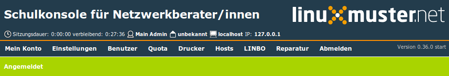

.. _schulekonsole-admin-label:

Schulkonsole nutzen
===================

Aufgerufen wird die *Schulkonsole* mittels `<https://server:242>`_ in
einem Webbrowser.

.. figure:: media/schulkonsole-login-admin.png
   :align: center
   :alt: Login der Schulkonsole als Administrator

Nach der Anmeldung als ``administrator`` findet man im Hauptmenü
folgende Einstellungsmöglichkeiten

Die Statusleiste unterhalb des Menüs zeigt über Farbe und Text an, ob
der letzte Befehl erfolgreich (grün) oder nicht erfolgreich (orange)
ausgeführt wurde.

.. toctree::
   :caption: Die Schulkonsole aus Sicht des Administrators
   :maxdepth: 1

   account
   settings
   user
   quota
   printer
   hosts
   linbo
   repair
   
