.. _add-user-accounts-label:

=======================================
 Benutzeraufnahme mit der Schulkonsole
=======================================

.. sectionauthor:: `@Tobias <https://ask.linuxmuster.net/u/Tobias>`_,
                   `@cweikl <https://ask.linuxmuster.net/u/cweikl>`_
		   

In einer Schule müssen meist mehrere hundert bis einige tausend Schüler als Benutzer angelegt werden. Die Schulkonsole (WebUI) erlaubt das Einlesen aller Schülerdaten aus einer Text-Datei, die z.B. aus dem Schulverwaltungsprogramm der Schule bezogen wurde. Anschließend werden Konten aller Schüler dieser Liste, die im System noch nicht vorhanden sind, angelegt, solche mit einer neuen Klasse versetzt und Konten nicht mehr aufgeführter Schüler schrittweise aus dem System entfernt.

In diesen Abschnitten wird beispielhaft ein Lehrer händisch angelegt und per Datei-Import einige Schüler aufgenommen. Melde dich dafür an der Schulkonsole als ``global-admin`` an.

Zeichenkodierung wählen
=======================

Die Zeichencodierung für die zu importierenden CSV-Benutzerdateien kann in der WebUI festgelegt werden. Der Standard ist eine Auto-Erkennung der Codierung festgelegt. Ist die Kodierung der Eingabedatei bekannt, so kann diese auch direkt vorgegeben werden.

Klicke dazu auf das Menü ``Einstellungen -->  Schuleinstellungen``.

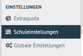

Klicke rechts auf die Reiterkarte ``Listenimport`` unterhalb von ``Zeichenkodierung`` ist im
Beispiel "UTF-8" erkannt worden.

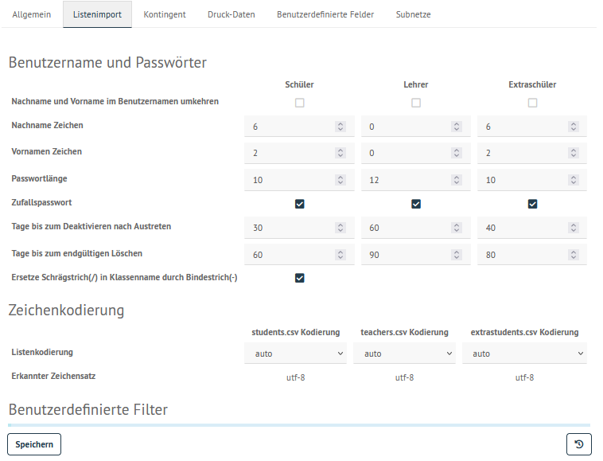

Klicke auf das Drop-down Menü für die Listenkodierung und wähle die gewünschte Kodierung aus.
Schließe die Eingabe mit "Speichern" ab.

Für den Listenimport gibt es drei verschiedene CSV-Dateien:

1. students.csv: Liste für den Schülerimport
2. teachers.csv: Liste für den Lehrerimport
3. extrastudents.csv: Liste für den Import von Benutzern für z.B. Fortbildungen, Kurse etc.

Diese CSV-Dateien folgen nachstehendem Aufbau:

.. code::

  Klasse;Nachname;Vornamen;Geburtsdatum;ID

Trennzeichen ist das Semikolon (;). Klasse ist nur für Schüler anzugeben. Die ID kann nachgestellt sein und stammt i.d.R. aus den Schulverwaltungsprogrammen. Auf diese Weise wird sichergestellt, dass für identische Benutzer immer nur ein Zugang angelegt wird.

Lehrer importieren
==================

Wähle das Menü ``Benutzerverwaltung --> Listenverwaltung``.

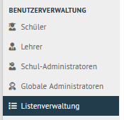

Wähle rechts oben die Reiterkarte ``Lehrer``.

Einzelnen Lehrer hinzufügen
---------------------------

Klicke auf den Button ``+ Lehrer hinzufügen``. Es wird eine leere Zeile hinzugefügt, die nun mit den angezeigten Daten zu füllen ist. 

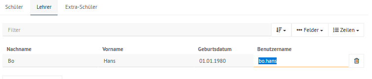

.. hint::

   Wie dargestellt führt der Benutzername bo.hans zu einem Importfehler ! Im Benutzernamen darf kein Punkt enthalten sein. VornameNachname oder nur nachname wären hingegen zulässige Benutzernamen.

Mit ``+ Lehrer hinzufügen`` können auf diese Art und Weise weitere Lehrer einzeln aufgenommen werden. Klicke nach dem Eintragen aller der Daten unten auf den Button ``Speichern & Prüfen``.

Es erscheint ein Fenster, in dem Du siehst, wie mit den angegebenen Benutzerdaten verfahren wird.

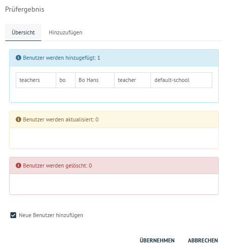

In o.g. Fenster ist zu sehen, dass ein neuer Lehrer hinzugefügt wird. Mit dem Button ``Übernehmen`` werden die dargestellten Aktionen ausgeführt (hinzufügen, aktualisieren, löschen).

Der Importdialog zeigt den Fortschritt an und meldet zurück, wenn die Aufnahme abgeschlossen wurde.
	 
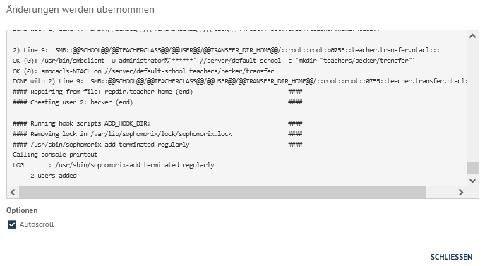

Bestätige dies mit dem Button ``Schliessen``.

Die neune oder geänderten Benutzer findest Du nun im Menü ``Benutzerverwaltung --> Lehrer``. Hier können deren Kontoinformationen abgerufen und z.B. Erstpasswörter (zurück-)gesetzt werden.

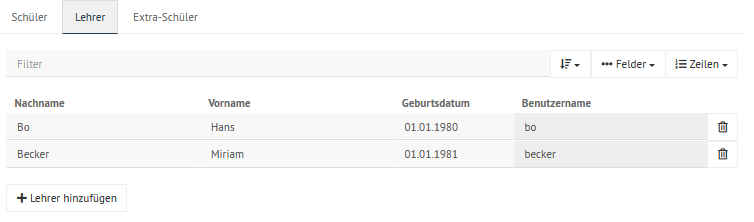

Schüler importieren
===================

Schüler können analog zu Lehrern einzeln hinzugefügt werden.

Alternativ können **alle** Schüler (alte wie neue) importiert werden. Wähle im Menü ``Benutzerverwaltung --> /Listenverwaltung --> Schüler`` (es erscheint
automatisch die Schülerliste).

Mit der Schaltfläche unterhalb der dargestellten Schüler ``CSV`` kannst Du verschiedene Möglichkeiten ansteuern, eine CSV-Datei zu erstellen, diese zu bearbeiten oder eine neue bereitzustellen.

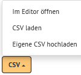

Eine zu importierende Datei sollte folgende Daten aufweisen:

.. code::

   Klassenbezeichnung;Nachname;Vorname;Geburtsdatum;ID (optional aus einem Schulverwaltungsprogramm)

Nachstehende Daten könnten lokal erstellt, als CSV-Datei mit der UTF-8 Codierung abgespeichert und danach mit o.g. Option ``Eigene CSV hochladen`` importiert werden.

.. code::

   10A;Testuser;Heinz;1.1.2006;1234
   13a;Musterfrau;Tanja;2.1.2003;1235
   5b;Hausmann;Hans;3.1.2016;1236

.. attention::

   Die Datei muss alle alten und neuen Schüler enthalten, sonst werden alle fehlenden Schüler zur Entfernung (Versetzung aus der Schule) vorgemerkt. Siehe auch :ref:`add-user-errorcorrection-label` unten. Die dateinamen sind ebenso eindeutig vorgegeben. Für Schüler ist die Datei students.csv zu nennen.

Mit der Option ``Eigene CSV hochladen`` kann eine so formatierte Datei nun hochgeladen werden. Die Schüler der zu importierenden Datei sind dann in der Listenverwaltung unter den Schülern zu sehen.

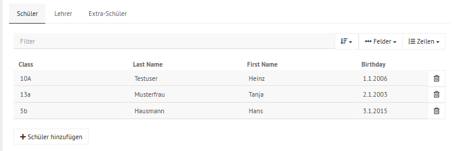

Mit ``Speichern`` werden eventuelle Konsistenzfehler überprüft. Die Schaltfläche ``SPEICHERN & PRÜFEN`` zeigt nun an, wieviele Schüler bei ``ÜBERNEHMEN`` ins System übernommen, versetzt (aktualisiert) oder gelöscht werden. 

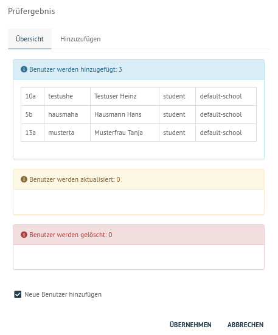

Mit Klick auf den Button ``Übernehmen``, werden die dargestellten Aktionen ausgeführt. Der abgeschlossene Import ist im Fenster zu sehene:

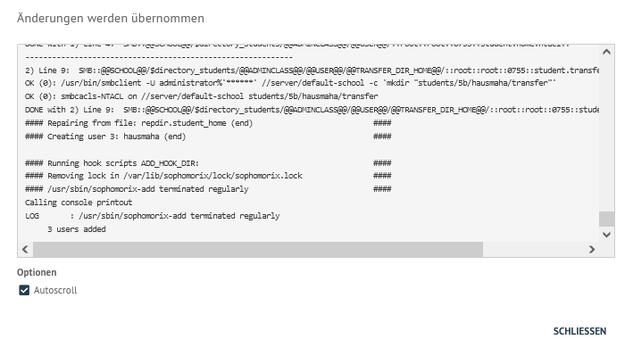

Ab der erfolgreichen Übernahme können die Schüler unter dem Menüpunkt ``Benutzerverwaltung --> Schüler`` gefunden und deren
Konten bearbeitet werden.

.. _add-user-errorcorrection-label:

Fehlerkorrektur
===============

Hat man einen fehlerhafte Daten in das System eingepflegt und hat sie noch nicht imporiert, lassen sich Schüler und Lehrerlisten aus einer
Sicherung zurückholen. Der Knopf für die Sicherung ist rechts unten in der Listenverwaltung.

Hast Du z.B. bei der zuvor importierten CSV-Datei die IDs vergessen, kannst Du diese in der CSV-Datei ergänzen, diese erneut importieren. Es werden dir dann die Änderungen angezeigt. In diesem Fall wird die uid auf die neu eingetragenen ID geändert.

.. figure:: media/add-user/add-user-12.png
   :align: center
   :alt: Menue: import users - changes

Unter Listenverwaltung hast Du bei den jeweiligen Benutzern (schüler, Lehrer, Extraschüler) unten rechts das Drop-down-Menü für die CSV-Dateien.

Klickst Du auf ``CSV --> Im Editor öffnen`` wird die students.csv auf dem Server geöffnet und Du kannst Änderungen vornehmen.

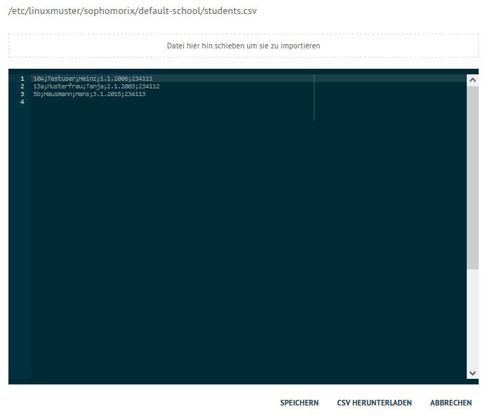

Eine ausführlichere Dokumentation zur Benutzerverwaltung findet sich im entsprechenden Abschnitt dieser Dokumentation.
