.. include:: ../guided-inst.subst

.. _setup-console-label:

==================
Setup im Terminal
==================

.. sectionauthor:: `@cweikl <https://ask.linuxmuster.net/u/cweikl>`_,
                   `@MachtDochNix <https://ask.linuxmuster.net/u/machtdochnix>`_

Melde Dich als Benutzer ``root`` mit dem Passwort ``Muster!`` auf dem Server an.

Für diese Anmeldung kannst Du die xterm.js Konsole von Proxmox verwenden, wenn Du unserer Anleitung gefolgt bist. Alternativ kannst Du Dich via ssh von einem anderen Rechner mit dem Server verbinden, wenn er sich im gleichen Netzwerksegment befindet.

Im Terminal wirst Du mit dem Erstbildschirm von linuxmuster.net v7.2 begrüßt.

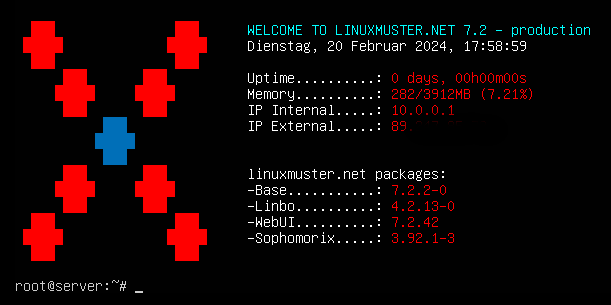
   
   Welcome to lmn.net

Das Setup wird über den Befehl ``linuxmuster-setup`` gestartet. 

Erfolgt der Aufruf direkt mittels ``linuxmuster-setup`` *müssen* mindestens folgende Setup-Parameter als Kommandozeilenparameter übergeben werden (in einer Zeile) - die angegebene Werte nach dem Gleichheitszeichen sind selbstverständlich nur Beispielwerte:

.. code:: console

   linuxmuster-setup --location="Bad Tuxhausen" --schoolname="Linus-Benedict-Gesamtschule" --country=de --state=SH

Weitere Parameter *können* auf der Kommandozeile angegeben werden. Werden aber auch in einem Dialogsystem abgefragt. Um alle Parameter zu sehen, verwende |...|

.. code::
  
   linuxmuster-setup --help

Die dazugehörende Ausgabe:

.. code::

   Usage: linuxmuster-setup [options]
   [options] may be:
   -n <hostname>,   --servername=<hostname>   : Set server hostname.
   -d <domainname>, --domainname=<domainname> : Set domainname.
   -r <dhcprange>,  --dhcprange=<dhcprange>   : Set dhcp range.
   -a <adminpw>,    --adminpw=<adminpw>       : Set admin password.
   -e <schoolname>, --schoolname=<schoolname> : Set school name.
   -l <location>,   --location=<location>     : Set school location.
   -z <country>,    --country=<country>       : Set school country.
   -v <state>,      --state=<state>           : Set school state.
   -c <file>,       --config=<file>           : path to ini file with setup values
   -u,              --unattended              : unattended mode, do not ask questions
   -s,              --skip-fw                 : skip firewall setup per ssh
   -h,              --help                    : print this help

Alternativ kannst Du eine Konfigurationsdatei mit dem Parameter ``--config`` übergeben.

Willst Du diese Möglichkeit nutzen, lege eine ``config.txt`` mittels des nächsten Befehls an:

.. code:: 

   echo -e "[setup] \nservername = \ndomainname = \ndhcprange = \nschoolname = \nlocation = \ncountry = \nstate = \nskipfw = False" > ~/config.txt
   
Diese Datei musst Du noch mit Deinen Angaben füllen. Hier beispielhaft mit dem Editor nano gezeigt

.. code:: console
	
   nano ~/config.txt

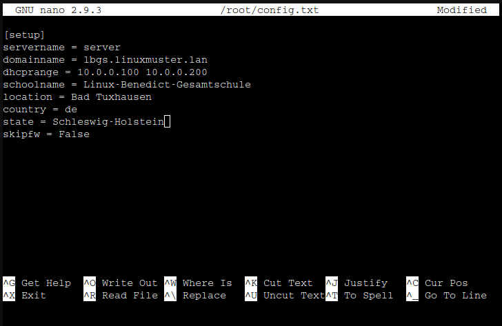
   
   Editor Nano: config.txt

Hast Du diese Textdatei mit deinen Einträgen gespeichert ``[Strg]+[X]`` --> ``[Y]`` --> ``[Enter]``, kannst Du das Setup mit folgendem Befehl aufrufen:

.. code::

   linuxmuster-setup --config /root/config.txt

Nach dessen Aufruf, erscheinen in der Konsole nach und nach nochmals relevante Parameter. Hattest Du diese bereits festgelegt, so siehst Du Deine Werte. Bei nicht festgelegten, siehst Du die standardmäßig vorbelegten Werte. Prüfe alle Parameter und passe deren Werte gegebenenfalls an. 

Klicke jeweils auf ``< OK >``, um zum nächsten Schritt zu gelangen.

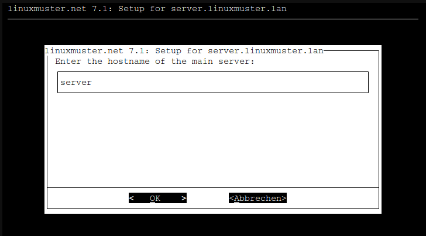
   
   Terminal Setup Hostname

Danach gelangst Du zur Angabe der sogenannten Domain. Beachte bei dessen Festlegung u.g. Hinweise zum FQDN.

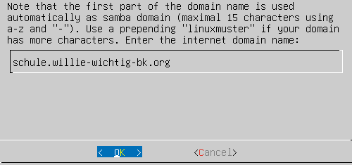
   
   Terminal Setup FQDN

.. hint::
  Der ``Domain name`` spielt eine besondere Rolle für das Setup.
  
  Besonders, wenn eine Adresse verwendet werden soll, die intern und extern identisch sein soll, sodass mit dem FQDN intern und extern gearbeitet wird. Um Dir das zu verdeutlichen, zeigen wir das an zwei Beispielen: 
 
   * **meineschule.de** 
   * **linuxmuster.lan**
    
   Die einzelnen Teile des Domainnamens werden durch einen einzelnen Punkt getrennt.
   
   Die beiden rechten Teile **de** beziehungsweise **lan**  stellen die sogenannte Top-Level-Domain (TLD) dar.
   
   Die TLD **lan** wird nicht extern verwendet, sondern ist nur für den internen Gebrauch sinnvoll.
   
   Die TLD **de** wird extern genutzt.
  
   Hat Deine Schule die de-Domain **meineschule.de** registriert, dann musst Du hier eine Subdomain angeben, da **meineschule** zugleich die sogenannten Samba-Domain darstellt. 
   
   Wie aufgezeigt wird aus dem ganz linken Teil die Samba-Domain gebildet. Für diese gibt es defininationsmäßig einige Einschränkungen:

   * Es dürfen maximal 15 Zeichen verwendet werden.

   * Es werden nur englische Kleinbuchstaben a bis z akzeptiert.

   **Richtig**: gshoenningen (12 Zeichen, keine Umlaute und Satzzeichen etc.)
  
   **Falsch**: GSO-Heinrich-Böll-Hönningen (26 Zeichen, Großbuchstaben, Umlaute, Bindestriche)

   Weitergehende Informationen findest du hier: https://wiki.samba.org/index.php/Active_Directory_Naming_FAQ

Bestätige Deine Eingabe mit ``< OK >``. 

Es erscheint der IP-Adressbereich, der für die Rechneraufnahme mit Linbo reserviert wird. In der Abb. ist dies der Bereich ``10.0.0.100`` bis ``10.0.0.200``.

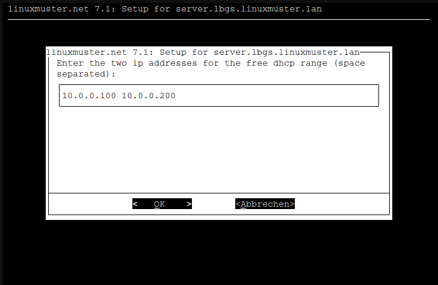
   
   Terminal Setup: DHCP Bereich festlegen

Wechsele mit ``< OK >`` zur nächsten Eingabemaske.

Hier setzt Du ein neues Administrations-Kennwort. Dieses wird zugleich das neue Kennwort aller administrativens Benutzer, so auch vom ``gobal-admin`` in der Schulkonsole.

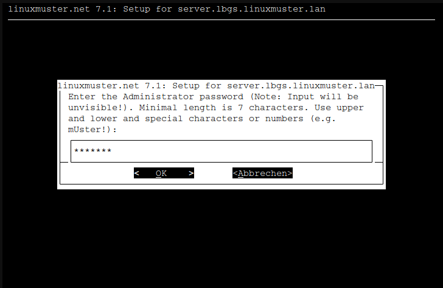
   
   Terminal Setup: Global-admin und root Kennwort festelegen

.. hint:: Passwortbeschränkungen: Valid characters are: a-z A-Z 0-9 ?!§+-@#%&*( )[ ]{ }

.. hint::

   * Das beim Setup eingegebene Admin-Passwort wird für folgende administrativen User gesetzt:
      * root auf dem Server
      * root auf der Firewall
      * global-admin (AD)
      * pgmadmin (AD)
      * linbo (/etc/rsyncd.secrets)
   * Es sollten die Passwörter der o.g. User nach dem Setup geändert werden, sodass jeder User ein eigenes Password hat.
   * Achte darauf, dass Dein Passwort den Komplexitätsanforderungen entspricht, die mit samba4 aktiviert sind: 
     Mind. 7 Zeichen, Groß- und Kleinbuchstaben, Ziffern und Sonderzeichen (zulässige Sonderzeichen wie oben genannt)
   * In der Datei ``/etc/linuxmuster/sophomorix/default/school/school.conf`` sind die Kennwortlängen für Schüler (Standard: 10 Zeichen) und Lehrer (12 Zeichen) angegeben.
   * Die Grundeinstellungen für Kennwörter in samba4 kannst Du Dir auf dem Server in der Konsole mit ``samba-tool domain passwordsettings show`` anzeigen lassen.

Gebe das Kennwort ein und klicke auf ``< OK >``.

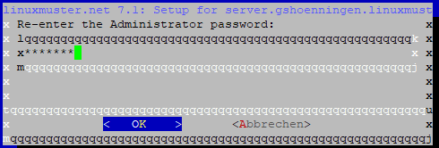
   
   Terminal Setup: Kennwort bestätigen

Bestätige dieses Kennwort und klicke auf ``< OK >``.

Danach wird das Setup gestartet. Es dauert einige Zeit, bis alle erforderlichen Dienste und die OPNsense eingerichtet wurden.

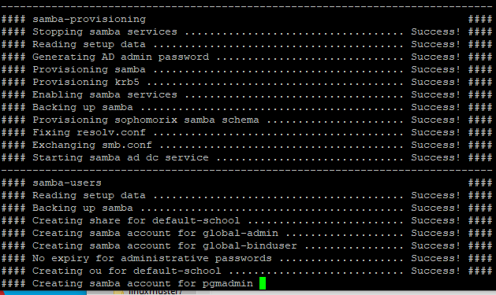
   
   Terminal Setup: Fortschritt des Setups

Nach Abschluss des Setups siehst Du im Terminal, dass das Setup beendet wurde.

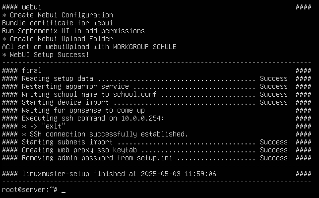
   
   Terminal Setup: Abschluss des Setups

Danach muss noch der Dienst für die WebUI/Schulkonsole oder der Server neu gestartet werden.

.. code::

   # systemctl restart linuxmuster-webui.service

alternativ

.. code::

   # reboot

Das erste Verfahren hat den Vorteil, dass Du nicht die Zeit des Neustarts abwarten, Dich erneut verbinden und anmelden musst.

.. hint::

   Starte nach dem erfolgreichen Setup ebenfalls die OPNsense |reg| neu.

Nach abgeschlossenem Setup und dem Neustart des Dienstes ``linuxmuster-webui`` bzw. eventuellen Neustart des Servers, kannst Du Dich mit einem PC via Browser an der Schulkonsole von linuxmuster.net v7.2 anmelden.  

Nachdem sich Dein Client eine IP-Adresse via DHCP aus dem Adressbereich für die Rechneraufnahme geholt hat, ist dieses aber nicht möglich. Dessen Adressen sind aus sicherheitstechnischen Erwägungen nur auf das allernötigste beschränkt.

Daher muss sich der Rechner in einem besonderen LAN-Bereich befinden, etwa mit der IPv4-Adresse 10.0.0.10/16. Diese IP-Adresse musst Du manuell in Deinem Admin-PC einrichten.

Anmeldung an der Schulkonsole als global-admin
==============================================

Öffne die URL ``https://10.0.0.1`` mit dem Admin-PC. Es wurde beim Setup ein self-signed certificate erstellt, sodass Du dieses beim erstmaligen Aufruf mit dem Browser akzeptieren musst.

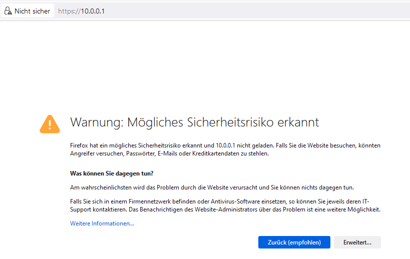
   
   SSL: Mögliches Sicherheitsrisiko - Erweitert

Der Browser zeigt Dir den Warnhinweis an. Klicke auf ``Erweitert ...``.

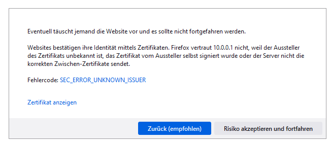
   
   SSL: Risiko akzeptieren und fortfahren

Es erscheint auf der gleichen Seite unten ein weiterer Eintrag. Bestätige diesen, indem Du den Button ``Risiko akzeptieren und fortfahren`` auswählst.

Danach kommst Du zur Anmeldeseite der WebUI/Schulkonsole. Melde Dich nun als Benutzer ``global-admin`` an und nutze das während des Setups festgelegte Kennwort.

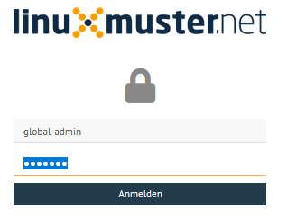
   
   Login global-admin

Nach erfolgreicher Anmeldung gelangst Du zur Hauptseite der Schulkonsole.

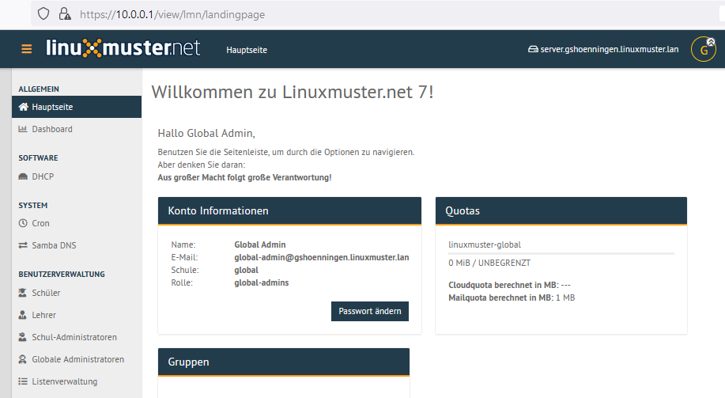
   
   Hauptseite der Schulkonsole

Berechtigungen der Log-Dateien anpassen
=======================================

Nach dem erfolgreichen Setup verbindest Du Dich via ssh auf den Server. 

Zum Abschluss sind noch die Dateiberechtigung für die linuxmuster Log-Dateien anzupassen.

Setze die Berechtigungen nun mit folgendem Befehl als Benutzer ``root``:

.. code::

  chmod 600 /var/log/linuxmuster/setup.*.log 

Lasse Dir den Inhalt des Verzeichnisses danach ausgeben und kontrollieren, ob Besitzer und Gruppe root sind und diese lesen und schreiben dürfen. 

.. code::

   ls -alh /var/log/linuxmuster/

Der Inhalt des Verzeichnisses sollte sich wie folgt darstellen:

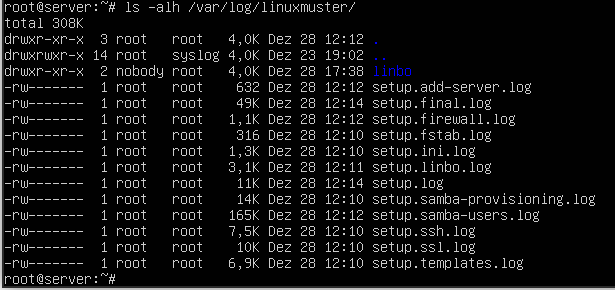
   
   Liste die Berechtigungen der Dateien auf

OPNsense |reg| Unbound DNS anpassen
====================================

Das linuxmuster-setup richtet in der OPNsense |reg| als voreingestellte DNS-Server diejnigen des DNS0.EU - Projekts ein. Dies sind europäische öffentliche DNS-Server, die darauf zielen, bösartige Domains zu blocken, Ende-zu-Ende Verschlüsselung zu gewährleisten und gefährdende Inhalte zu filtern (https://www.dns0.eu/de).

Nach der Installation muss im Unbound DNS-Resolver der OPNsense diese Voreinstellung ggf. noch aktiviert werden. Die DNS-Einstellungen der OPNsense kannst Du unter ``System -> Einstellungen -> Allgemein`` kontrollieren.

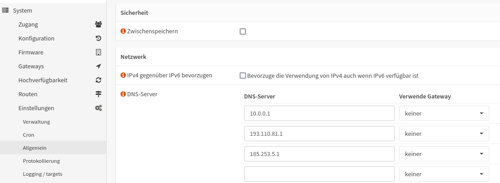
   
   DNS-Einträge

Zur Aktivierung gehe auf ``Dienste -> Unbound DNS -> Query Forwarding``.

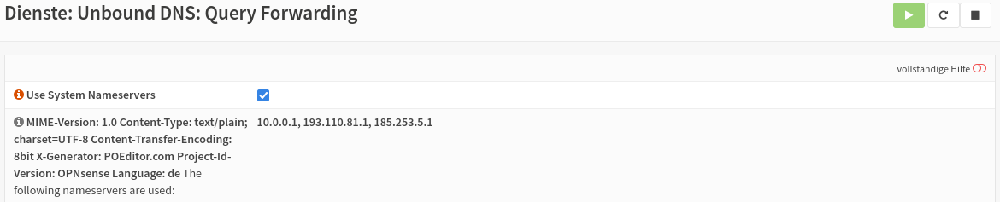
   
   Unbound-DNS: Query Forwarding

Setze den Haken für ``Use System Nameservers``, dort siehst Du dann die in obiger Abb. dargestellten DNS-Einträge. Klicke zur Aktivierung auf ``Anwenden``.

Mit sog. Overrides können im Unbound DNS genutzt werden, um die DNS-Ergebnisse in gewünschter Form anzupassen oder aber spezielle DNS Einträge bereitzustellen. Weitergehende Informationen findest Du hier: https://docs.opnsense.org/manual/unbound.html

   
Setze die Ersteinrichtung fort, indem Du :ref:`add-user-accounts-label` und :ref:`hardware-registration-label` aufrufst.

``Alternativ``: Willst Du eine Migration durchführen, geht es weiter mit: :ref:`migration-label`

