.. include:: /guided-inst.subst

.. _setup-console-label:

==================
Setup im Terminal
==================

.. sectionauthor:: `@cweikl <https://ask.linuxmuster.net/u/cweikl>`_,
                   `@MachtDochNix <https://ask.linuxmuster.net/u/machtdochnix>`_

Melde Dich als Benutzer ``linuxadmin`` mit dem Passwort ``Muster!`` auf dem linuxmuster.net Server AD/DC an.

Für diese Anmeldung kannst Du die xterm.js Konsole von Proxmox verwenden, wenn Du unserer Anleitung gefolgt bist. Alternativ kannst Du Dich via ssh von einem anderen Rechner mit dem Server verbinden, wenn er sich im gleichen Netzwerksegment befindet.

Im Terminal wirst Du mit dem Erstbildschirm von linuxmuster.net v7.4 begrüßt und es werden die installierten Paketversionen von linuxmuster.net angezeigt.

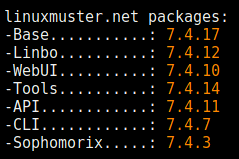
   
   Welcome to lmn.net
   
Wechsle im Terminal zum Benutzer root mit

.. code::

   sudo -i

Das Setup wird über den Befehl

.. code::

   linuxmuster-setup

gestartet.

Erfolgt der Aufruf direkt mittels ``linuxmuster-setup``, fragt das Setup verschiedene Parameter ab.

Bei nicht festgelegten, siehst Du die standardmäßig vorbelegten Werte. Prüfe alle Parameter und passe deren Werte gegebenenfalls an.

Klicke jeweils auf ``< OK >``, um zum nächsten Schritt zu gelangen.

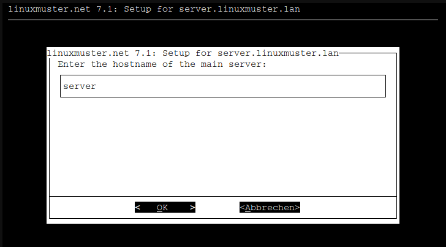
   
   Terminal Setup Hostname

Danach gelangst Du zur Angabe der sogenannten Domain. Beachte bei dessen Festlegung u.g. Hinweise zum FQDN.

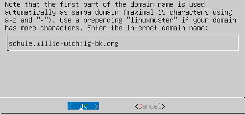
   
   Terminal Setup FQDN

.. hint::
  Der ``Domain name`` spielt eine besondere Rolle für das Setup.
  
  Besonders, wenn eine Adresse verwendet werden soll, die intern und extern identisch sein soll, sodass mit dem FQDN intern und extern gearbeitet wird. Um Dir das zu verdeutlichen, zeigen wir das an zwei Beispielen: 
 
   * **meineschule.de** 
   * **linuxmuster.lan**
    
   Die einzelnen Teile des Domainnamens werden durch einen einzelnen Punkt getrennt.
   
   Die beiden rechten Teile **de** beziehungsweise **lan**  stellen die sogenannte Top-Level-Domain (TLD) dar.
   
   Die TLD **lan** wird nicht extern verwendet, sondern ist nur für den internen Gebrauch sinnvoll.
   
   Die TLD **de** wird extern genutzt.
  
   Hat Deine Schule die de-Domain **meineschule.de** registriert, dann musst Du hier eine Subdomain angeben, da **meineschule** zugleich die sogenannten Samba-Domain darstellt. 
   
   Wie aufgezeigt wird aus dem ganz linken Teil die Samba-Domain gebildet. Für diese gibt es defininationsmäßig einige Einschränkungen:

   * Es dürfen maximal 15 Zeichen verwendet werden.

   * Es werden nur englische Kleinbuchstaben a bis z akzeptiert.

   **Richtig**: gshoenningen (12 Zeichen, keine Umlaute und Satzzeichen etc.)
  
   **Falsch**: GSO-Heinrich-Böll-Hönningen (26 Zeichen, Großbuchstaben, Umlaute, Bindestriche)

   Weitergehende Informationen findest du hier: https://wiki.samba.org/index.php/Active_Directory_Naming_FAQ

Bestätige Deine Eingabe mit ``< OK >``. 

Es erscheint der IP-Adressbereich, der für die Rechneraufnahme mit Linbo reserviert wird. In der Abb. ist dies der Bereich ``10.0.255.1`` bis ``10.0.255.254``.

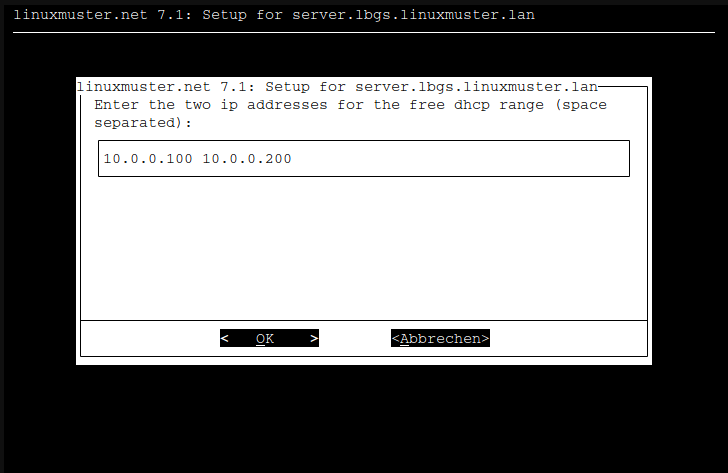
   
   Terminal Setup: DHCP Bereich festlegen

Wechsel mit ``< OK >`` zur nächsten Eingabemaske.

Hier setzt Du ein neues Administrations-Kennwort. Dieses wird zugleich das neue Kennwort aller administrativen Benutzer, so auch für den WebUI Benutzer ``gobal-admin``.

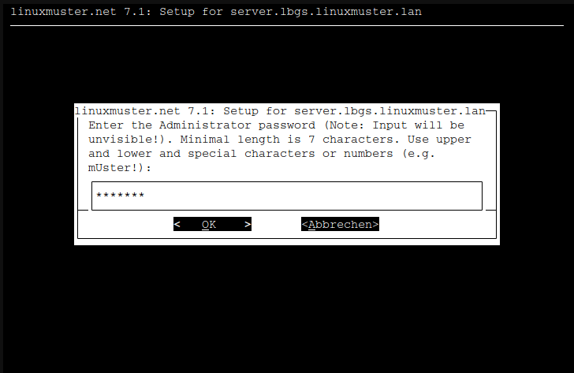
   
   Terminal Setup: Global-admin und root Kennwort festelegen

.. hint:: Passwortbeschränkungen: Valid characters are: a-z A-Z 0-9 ?!§+-@#%&*( )[ ]{ }

.. hint::

   * Das beim Setup eingegebene Admin-Passwort wird für folgende administrativen User gesetzt:
      * root auf dem Server
      * root auf der Firewall
      * global-admin (AD)
      * pgmadmin (AD)
      * linbo (/etc/rsyncd.secrets)
   * Es sollten die Passwörter der o.g. User nach dem Setup geändert werden, sodass jeder User ein eigenes Password hat.
   * Achte darauf, dass Dein Passwort den Komplexitätsanforderungen entspricht, die mit samba4 aktiviert sind: 
     Mind. 7 Zeichen, Groß- und Kleinbuchstaben, Ziffern und Sonderzeichen (zulässige Sonderzeichen wie oben genannt)
   * In der Datei ``/etc/linuxmuster/sophomorix/default/school/school.conf`` sind die Kennwortlängen für Schüler (Standard: 10 Zeichen) und Lehrer (12 Zeichen) angegeben.
   * Die Grundeinstellungen für Kennwörter in samba4 kannst Du Dir auf dem Server in der Konsole mit ``samba-tool domain passwordsettings show`` anzeigen lassen.

Gib das Kennwort ein und klicke auf ``< OK >``.

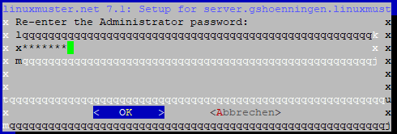
   
   Terminal Setup: Kennwort bestätigen

Bestätige dieses Kennwort und klicke auf ``< OK >``.

Danach wird das Setup gestartet. Es dauert einige Zeit, bis alle erforderlichen Dienste und die OPNsense eingerichtet wurden.

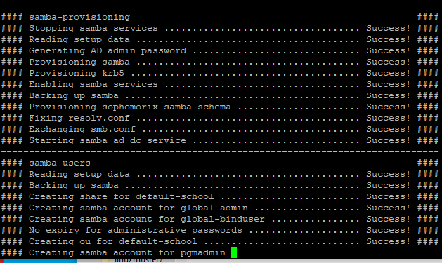
   
   Terminal Setup: Fortschritt des Setups

Nach Abschluss des Setups siehst Du im Terminal, dass das Setup beendet wurde.

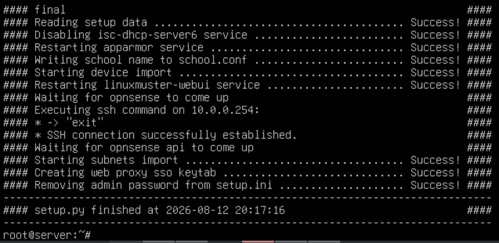
   
   Terminal Setup: Abschluss des Setups

Starte danach den Server neu, die OPNsense |reg| wurde bereits während des Setups neu gestartet.

.. code::

   root@server:~# reboot

Nach abgeschlossenem Setup und dem Neustart kannst Du Dich mit einem PC via Browser an der Schulkonsole von linuxmuster.net v7.4 anmelden.

Nachdem sich Dein Client eine IP-Adresse via DHCP aus dem Adressbereich für die Rechneraufnahme geholt hat, ist dieses aber nicht möglich. Dessen Adressen sind aus sicherheitstechnischen Erwägungen beschränkt.

Daher muss sich der Rechner in einem besonderen LAN-Bereich befinden - etwa mit der IPv4-Adresse 10.0.0.10/16. Diese IP-Adresse musst Du manuell in Deinem Admin-PC einrichten.

Anmeldung an der Schulkonsole als global-admin
==============================================

Öffne die URL ``https://10.0.0.1`` mit dem Admin-PC. Es wurde beim Setup ein self-signed certificate erstellt, sodass Du dieses beim erstmaligen Aufruf mit dem Browser akzeptieren musst.

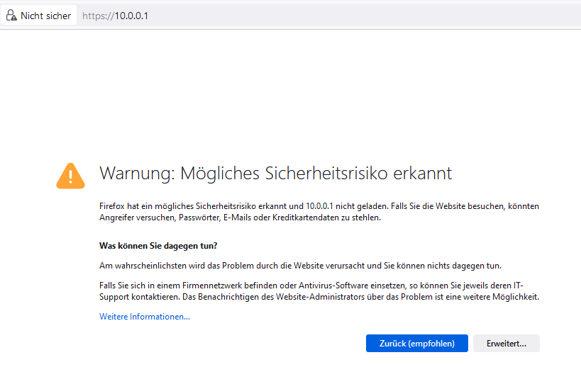
   
   SSL: Mögliches Sicherheitsrisiko - Erweitert

Der Browser zeigt Dir den Warnhinweis an. Klicke auf ``Erweitert ...``.

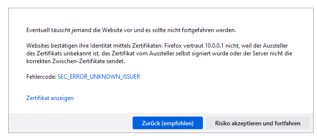
   
   SSL: Risiko akzeptieren und fortfahren

Es erscheint auf der gleichen Seite unten ein weiterer Eintrag. Bestätige diesen, indem Du den Button ``Risiko akzeptieren und fortfahren`` auswählst.

Danach kommst Du zur Anmeldeseite der WebUI. Melde Dich nun als Benutzer ``global-admin`` an und nutze das während des Setups festgelegte Kennwort.

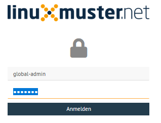
   
   Login global-admin

Nach erfolgreicher Anmeldung gelangst Du zur Hauptseite der Schulkonsole.

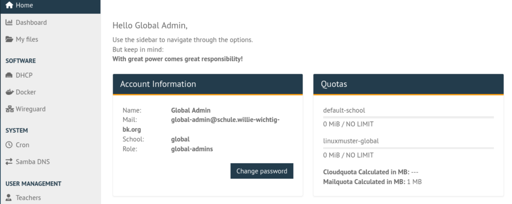
   
   Hauptseite der Schulkonsole

Log-Dateien prüfen
==================

Nach dem erfolgreichen Setup verbindest Du Dich via ssh auf den Server. 

Prüfe, ob in den Log-Dateien des Setups ggf. Fehler berichtet werden.

.. code::

   sudo apt install less
   sudo less /var/log/linuxmuster/setup.log | more

Sollten keine Fehler aufgetreten sein, kannst Du mit den Einrichtung des Fileservers fortfahren.
