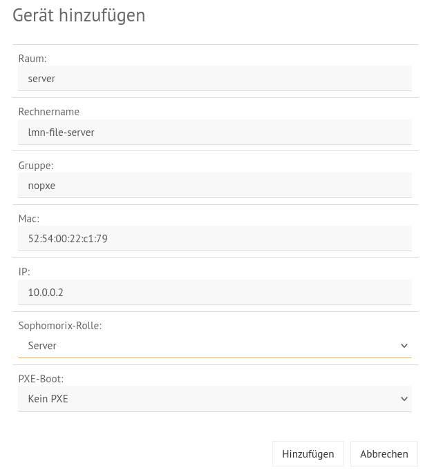
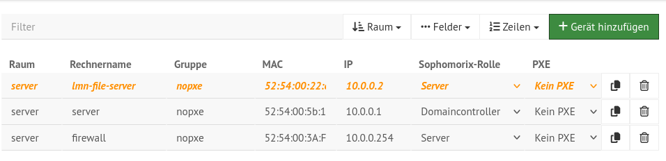
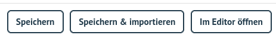
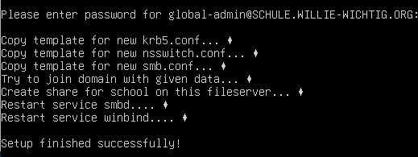

.. include:: /guided-inst.subst

.. _setup-file-server-label:

=================
Setup File-Server
=================

.. sectionauthor:: `@cweikl <https://ask.linuxmuster.net/u/cweikl>`_,
                

File-Server aufnehmen
=====================

Der File-Server muss zuerst als Gerät auf dem linuxmuster.net Server AD/DC als Gerät in die ``devices.csv`` aufgenommen werden.

``Variante A``

Melde Dich als Benutzer ``linuxadmin`` mit dem Passwort ``Muster!`` auf dem linuxmuster.net Server AD/DC an.

Für diese Anmeldung kannst Du die xterm.js Konsole von Proxmox verwenden, wenn Du unserer Anleitung gefolgt bist. Alternativ kannst Du Dich via ssh von einem anderen Rechner mit dem Server verbinden, wenn er sich im gleichen Netzwerksegment befindet.

Im Terminal wirst Du mit dem Erstbildschirm von linuxmuster.net v7.3 begrüßt und es werden die installierten Paketversionen von linuxmuster.net angezeigt.

.. figure:: media/newsetup/lmn-setup-terminal-01.png
   :align: center
   :alt: Terminal after login
   :width: 40%
   
   Welcome to lmn.net
   
Wechsel im Terminal zum Benutzer root mit

.. code::

   sudo -i

Rufe dort im Terminal die Datei auf und trage den File-Server mit seiner Funktion ``server`` ein:

.. code::

   # /etc/linuxmuster/sophomorix/default-school/devices.csv
   server;lmn-file-server;nopxe;52:24:11:4D:97:AB;10.0.0.101;;;;server;;0;;;;SETUP;

Speichere die Änderungen in der Datei.

Rufe danach im Terminal folgenden Befehl auf:

.. code::

   linuxmuster-import-devices
   
``Variante B``

Melde Dich in der WebUI als Benutzer ``global-admin`` an und wähle den Menüpunkt ``Geräte``.

.. figure:: media/newsetup/lmn-file-server-01.png
   :align: center
   :alt: Add File-Server
   :width: 40%
   
   WebUI: Rufe das Menü Geräte auf

Klicke auf Gerät hinzufügen und trage die Daten für Deinen File-Server ein.

   
   WebUI: Trage die Daten für den File-Server ein

Klicke auf ``Hinzufügen``. Deine Eintragungen werden Dir in der Liste noch farbig markiert angezeigt, da diese noch nicht importiert wurden.

   
   WebUI: Anzeige des neuen Eintrags in der Geräteliste
   
Übernehme nun die Eintragungen mit dem Button ``Speichern & Importieren``.

   
   WebUI: Übernehme den Eintrag mit Speichern & Importieren

Setup des File-Servers
======================

Melde Dich als Benutzer ``linuxadmin`` mit dem Passwort ``Muster!`` auf dem linuxmuster.net File-Server in der Konsole an.

Wechsel im Terminal zum Benutzer root mit

.. code::

   sudo -i

Rufe dort im Terminal das Setup-Programm für den File-Server auf:

.. code::

   linuxmuster-fileserver setup [-d DOMAIN] [-u USERNAME] [-p PASSWORD] [-s SCHOOL]
   
Das Setup benötigt folgende Optionen, die bei Aufruf anzugeben sind:

+-----------+---------------+-----------------+
| Parameter | Beschreibung  |   Vorgabewert   |
+===========+===============+=================+
|    -h     | Hilfeseite    |                 |
+-----------+---------------+-----------------+
|    -d     | Domäne des AD | linuxmuster.lan |
+-----------+---------------+-----------------+
|    -u     | Benutzername  | global-admin    |
|           | des Admins    |                 |
+-----------+---------------+-----------------+
|    -p     | Kennwort des  |                 |
|           | Admins        |                 |
+-----------+---------------+-----------------+
|    -s     | Schulname für | default-school  |
|           | die Freigaben |                 |
+-----------+---------------+-----------------+

Der vollständige Befehlsaufruf für das Setup lautet z.B. für die

a) Domain: schule.willie-wichtig.org (wie beim Setup des AD/DC angegeben)
b) Admin: global-admin
c) -p auslassen, dann wird das Kennwort interaktiv abgefragt
d) Schulname: wird -s ausgelassen, wird default-school genutzt

.. hint::

   Hast Du zuvor das Setup des linuxmuster.net AD/DC Server durchlaufen, dann nutzt Du dort den Share default-school - unabhängig davon, wie Du beim Setup Deine Schule genannt hast. Du must also für den File-Server daher diese angeben bzw. den Parameter -s weglassen.

.. code::

   linuxmuster-fileserver setup -d schule.willie-wichtig.org -u global-admin -s default-school

Wurde das Setup erfolgreich ausgeführt, siehst Du folgende Bestätigung:

   
   File-Server: Erolgreiches Setup
   
Auf dem File-Server findet sich nun das Verzeichnis:

.. code::

   /srv/samba/schools/default-school/

Freigaben übertragen
====================

1. Du musst nun die auf dem linuxmuster.net AD/DC Server vorhandenen Freigaben, auf den File-Server übertragen.
2. Danach aktualisierst Du die Freigaben.
3. Du lässt mit sophomorix die Berechtigungen im AD anpassen.
4. Auf dem File-Server passt Du die ACLs an.

Übertrage zuerst den ssh_key des Benutzer root vom linuxmuster.net AD/DC Server auf den File-Server. Bislang kannst Du Dich nur als Benutzer linuxadmin auf dem File-Server via ssh anmelden.

Gib daher auf dem AD in der Konsole folgenden Befehle ein:

.. code::

   root@server:~# ssh-copy-id -i .ssh/id_rsa.pub linuxadmin@10.0.0.2
   
Der Key wurde nun auf dem File-Server dem User linuxadmin in ``~.ssh/authorized_keys hinzugefügt``.

Öffne nun die Konsole auf dem AD und wechsel zum Benutzer root. 

Kopiere nun die Datei authorized_keys des Benutzers linuxadmin:

.. code::

   cp /home/linuxadmin/.ssh/authorized_keys /root/.ssh/
   
Teste nun, ob Du vom AD via SSH auf den File-Server gelangst. Dies sollte mit

.. code::

   ssh root@10.0.0.2
   
direkt erfolgen.

Danach installierst Du rsync jeweils auf dem ``AD/DC Server`` und auf dem ``File-Server`` mit

.. code::

   sudo apt install -y rsync
   
Jetzt kannst Du den Inhalt des Freigabeordners auf dem AD zum File-Server synchronisieren.

Hierzu gibst Du als Benutzer root auf dem AD folgenden Befehl ein:

.. code::

   rsync -av --delete -e ssh /srv/samba/schools/default-school/ root@10.0.0.2:/srv/samba/schools/default-school/
   
Als Ziel ist auf dem File-Server der Schulname anzugeben, wie Du diesen zuvor mit dem linuxmuster-filserver setup eingerichtet hattest.
   

Aktualisierung der Freigaben
============================

Melde Dich nun in der Konsole auf dem linuxmuster.net AD/DC Server an.

Wechsel im Terminal zum Benutzer root mit

.. code::

   sudo -i

Gib im Terminal zur Aktualisierung der Freigaben (Shares) folgende Befehle ein:

.. hint::

   Hast Du für den File-Server einen anderen Schulnamen als den Vorgabewert (default-school) angegeben, dann must Du diesen hier angeben.

.. code::

   SCHOOL=default-school
   FQDN=lmn-file-server.schule.willie-wichtig.org
   
   net conf addshare $SCHOOL /srv/samba/schools/$SCHOOL/
   net conf delparm $SCHOOL "guest ok"
   net conf delparm $SCHOOL "read only"
   net conf delparm $SCHOOL "path"
   net conf setparm $SCHOOL "msdfs root"  yes
   net conf setparm $SCHOOL "msdfs proxy"  //$FQDN/$SCHOOL
   net conf setparm $SCHOOL "hide unreadable"  yes

Abschluss
=========
   
Zum Abschluss der Integration führe noch folgenden Befehl auf dem linuxmuster.net AD/DC Server aus:

.. code::

   sophomorix-repair --all
   
Danach wechselst Du zur Konsole auf dem File-Server und gibst dort als Benutzer root folgenden Befehl ein:

.. code::

   linuxmuster-fix-acls default-school
   
Du musst dem Befehl den Schulnamen übergeben, wie Du diesen für den File-Server festgelegt hast. Hast Du keinen festgelegt, nutzt Du default-school.

Bei erfolgreicher Anwendung siehst Du diese Ausgabe:

.. figure:: media/newsetup/lmn-file-server-06.png
   :align: center
   :alt: fix acls
   :width: 100%
   
   File-Server: Setze die ACLs

   

