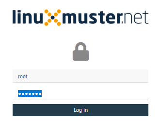
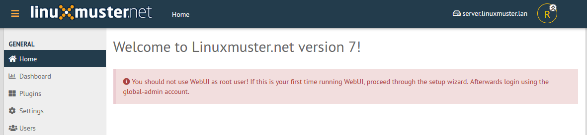
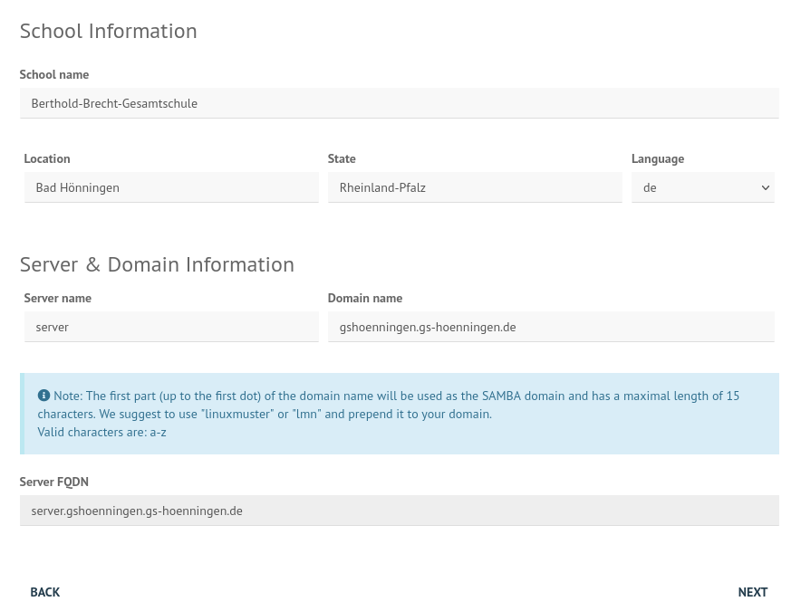
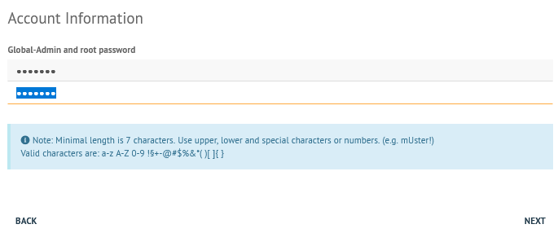
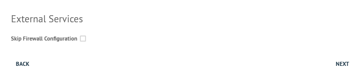
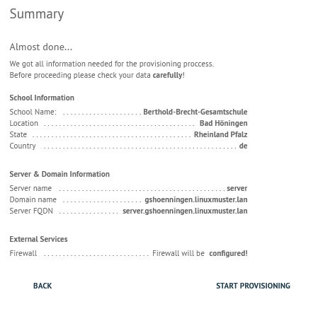
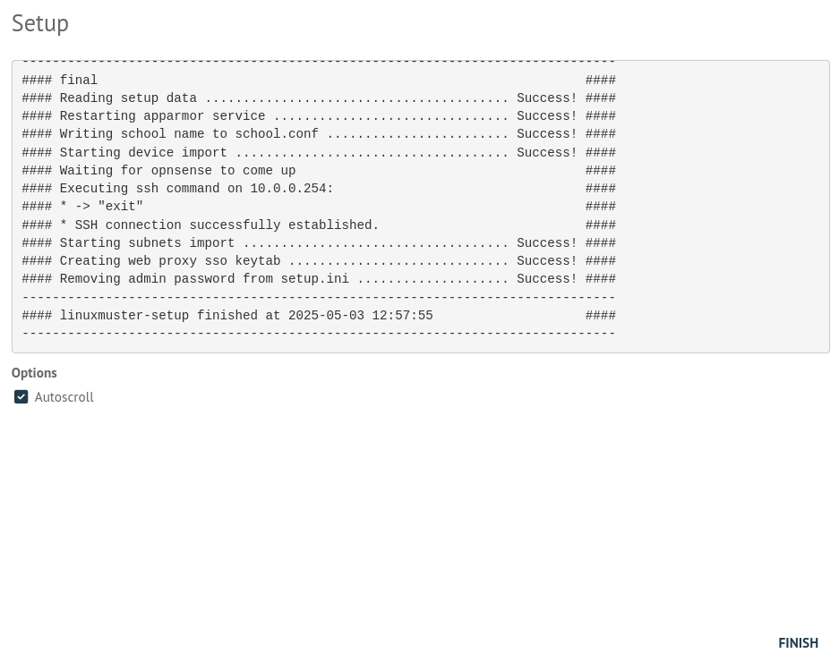
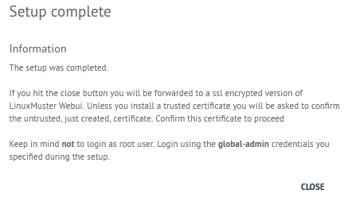

.. include:: ../guided-inst.subst

.. _setup-gui-label:

======================
Setup via Schulkonsole
======================

.. sectionauthor:: `@cweikl <https://ask.linuxmuster.net/u/cweikl>`_,
           `@MachtDochNix <https://ask.linuxmuster.net/u/machtdochnix>`_

Setup über die Schulkonsole
===========================

Die Weboberfläche (WebUI/Schulkonsole) erreicht man über einen Browser eines Gerätes (im folgenden Admin-PC genannt) im Servernetzwerk. Dafür konfiguriert man den Admin-PC mit der festen IP-Adresse ``10.0.0.10`` (entsprechend ``x.x.x.10`` in jeder anderen Netzwerkkonfiguration) der Netzwerkmaske ``255.255.0.0``, dem Gateway ``10.0.0.254`` und dem DNS-Eintrag ``10.0.0.1``.

Öffne auf dem Admin-PC mit einem Webbrowser die URL ``http://10.0.0.1``. Melde Dich hier einmalig mit dem Benutzer ``root`` und dem Passwort ``Muster!`` an.
    

   
   Anmeldung als Benutzer root 
    
.. hint::

   Achte darauf, dass vor dem Setup die Verbindung zur Schulkonsole via URL noch unverschlüsselt mit HTTP erfolgt.
   
Es erscheint der Hinweis, dass Du das Webinterface nicht als Benutzer root benutzen sollst, es sei denn, Du verwendest dieses das erste Mal.

   
   Willkommen bei linuxmuster.net

Bei einem unkonfiguriertem System wird direkt das Setup aufgerufen.

Es erscheint der Einrichtungsassistent. Hier musst Du zunächst die gewünschte Sprache auswählen. Zudem musst Du die GNU Lizenzbedingungen akzeptieren, indem Du bei ``I accept the licence terms`` einen Haken setzt.
    
.. figure:: media/newsetup/lmn-setup-gui-02.png
   :align: center
   :alt: WebUI Setup: Wizard - accept license
   :width: 80%
   
   Akzeptiere die Lizenzvereinbarung

Danach klickst Du auf ``Weiter``.

Im nächsten Dialog musst Du den Schulnamen, die Stadt, das Bundesland und das Landeskürzel eintragen bzw. auswählen.  Zudem trägst Du einen Hostnamen für den Server ein. Der ``Domainname`` spielt eine besondere Rolle, insbesondere, wenn eine Adresse verwendet werden soll, die intern und extern identisch sein soll, so dass mit dem FQDN intern und extern gearbeitet wird.

.. hint:: 

   ``schule.de`` oder ``linuxmuster.lan`` stellen den Domainnamen mit der sog. Top Level Domain (TLD) dar. Die TLD lan wird nicht extern verwendet, sondern ist nur für den internen Gebrauch sinnvoll. Die TLD de wird extern genutzt. Hat Deine Schule die De-Domain meineschule.de registriert, dann musst Du hier eine Subdomain angeben, die zugleich die sog. Samba-Domain darstellt. Für den Namen dieser Sub-/Samba-Domain gibt es Einschränkungen, die unbedingt beachtet werden müssen: Es werden nur englische Kleinbuchstaben a bis z akzeptiert. Sonst keinerlei Zeichen. Es dürfen zudem maximal 15 Zeichen verwendet werden. 

  **Richtig**: gshoenningen (12 Zeichen, keine Umlaute und Satzzeichen etc.), **Falsch**: GSO-Heinrich-Böll-Hönningen (26 Zeichen, Großbuchstaben, Umlaute, Bindestriche)

   
   Setup: Schulinformationen

Danach klickst Du auf ``Weiter/Next``.

Der nächste Dialog legt das Passwort des globalen Administrators ``global-admin`` und das von ``root`` fest. Die Einschränkungen zur Passwortsicherheit sind dem Hilfetext zu entnehmen.

   
   Kennwort für die Benutzer global-admin und root festlegen

.. important::

   Nach dem erfolgreichen Abschluss der Erstkonfiguration gilt für ``root`` das neu gesetzte Passwort.

.. hint::

   * Das beim Setup eingegebene Adminpasswort wird für folgende administrativen User gesetzt:
      * root auf dem Server
      * root auf der Firewall
      * global-admin (AD)
      * pgmadmin (AD)
      * linbo (/etc/rsyncd.secrets)
   * Es sollten die Passwörter der o.g. User nach dem Setup geändert werden, so dass jeder User ein eigenes Password hat.
   * Achte darauf, dass Dein Passwort den Komplexitätsanforderungen entspricht, die mit samba4 aktiviert sind: 
     Mind. 7 Zeichen, Groß- und Kleinbuchstaben, Ziffern und Sonderzeichen. Zulässige Sonderzeichen sind: a-z A-Z 0-9 ?!§+-@#%&*( )[ ]{ }
   * In der Datei ``/etc/linuxmuster/sophomorix/default/school/school.conf`` sind die Kennwortlängen für Schüler (Standard: 10 Zeichen) und Lehrer (12 Zeichen) angegeben.
   * Die Grundeinstellungen für Kennwörter in samba4 kannst Du Dir auf dem Server in der Konsole mit ``samba-tool domain passwordsettings show`` anzeigen lassen.

Danach klickst Du auf ``Weiter/Next``. 

Du erhälst die Rückfrage, ob die Firewall ggf. nicht konfiguriert werden soll. Sofern Du das System zusammen mit der OPNsense als Firewall **neu einrichtest**, setzt Du ``keinen Haken`` und klickst Du auf ``Weiter/Next``.

   
   Überspringe die Firewall Konfiguration

Es wird danach die Zusammenfassung der vorgenommenen Einstellungen in der Übersicht dargestellt. Du kannst die getroffenen Einstellungen auch noch prüfen lassen. Danach wird Dir wie in der Abb. die geprüfte Zusammenfassung angezeigt

   
   Zusammenfassung der Setup-Einstellungen

.. hint::

   Sollte die Installation anhalten oder fehlschlagen, sollte man alle
   Appliances auf den Zustand vor dem Setup zurücksetzen.

Starte nun die Installation, in dem Du auf ``Start Provisioning`` klickst.

Es erscheint ein Installationsfenster, in dem die verschiedenen Installationsschritte angezeigt werden. Dieser Vorgang dauert eine ganze Weile.
Ist die Installation abgeschlossen, gelangst Du zu folgendem Fenster:

   
   Setup-Fenster

Zum Abschluss siehst Du den Eintrag 

.. code::

   ### linuxmuster-setup finished at ... ###

Schliesse das Setup nun mit ``Finish`` ab. Es erscheint eine Statusmeldung, dass das Setup abgeschlossen ist und Du Dich danach mit dem Benutzer ``global-admin`` anmelden sollst.

   
   Abschluss des Setups

Bestätige dies mit ``Close``.

Rufe auf dem Server das Terminal auf und starte den Server neu:

.. code:: Bash

   sudo reboot

Anmeldung an der Schulkonsole
=============================

Es wurde beim Setup ein self-signed certificate erstellt, so dass Du dieses beim erstmaligen Aufruf mit dem Browser akzetieren musst.

.. figure:: media/newsetup/lmn-setup-gui-09.png
   :align: center
   :alt: WebUI: First ssl access
   :width: 80%
   
   SSL: Mögliches Sicherheitsrisiko - Erweitert

Der Browser zeigt Dir den Warnhinweis an. Klicke auf ``Erweitert...``.

.. figure:: media/newsetup/lmn-setup-gui-10.png
   :align: center
   :alt: WebUI: Accept certificate
   :width: 80%
   
   SSL: Risiko akzeptieren und fortfahren

Es erscheint auf der gleichen Seite unten ein weiterer Eintrag. Bestätige diesen, indem Du den Button ``Risiko akzeptieren und fortfahren`` auswählst.

Danach kommst Du zur Anmeldeseite der WebUI/Schulkonsole. Melde Dich nun als Benutzer ``global-admin`` an und nutze das während des Setups festgelegte Kennwort.

.. figure:: media/newsetup/lmn-setup-gui-11.png
   :align: center
   :alt: WebUI: Login global-admin
   :width: 50%
   
   Login als Benutzer global-admin

Nach erfolgreicher Anmeldung gelangst Du zur Hauptseite der Schulkonsole.

.. figure:: media/newsetup/lmn-setup-gui-12.png
   :align: center
   :alt: WebUI: Hauptseite
   :width: 80%
   
   Hauptseite der Schulkonsole

Berechtigungen der Log-Dateien anpassen
=======================================

Nach dem erfolgreichen Setup verbindest Du Dich via ssh auf den Server. 

Zum Abschluss sind noch die Dateiberechtigungen für die linuxmuster Log-Dateien anzupassen.

Setze die Berechtigungen nun mit folgendem Befehl als Benutzer ``root``:

.. code::

  chmod 600 /var/log/linuxmuster/setup.*.log 

Lasse Dir den Inhalt des Verzeichnisses danach ausgeben und kontrollieren, ob Besitzer und Gruppe ``root`` sind und der Benutzer ``root`` lesen und schreiben darf. 

.. code::

   ls -alh /var/log/linuxmuster/

Der Inhalt des Verzeichnisses sollte sich wie folgt darstellen:

.. figure:: media/newsetup/lmn-setup-permissions-log-files.png
   :align: center
   :alt: directory listing log files
   :width: 80%
   
   Liste den Inhalt des Verzeichnisses auf

OPNsense |reg| Unbound DNS anpassen
====================================

Das linuxmuster-setup richtet in der OPNsense |reg| als voreingestellte DNS-Server diejenigen des DNS0.EU - Projekts ein. Dies sind europäische öffentliche DNS-Server, die darauf zielen, bösartige Domains zu blocken, Ende-zu-Ende verschlüsselung zu gewährleisten und gefährdende Inhalte zu filtern (https://www.dns0.eu/de).

Nach der Installation muss im Unbound DNS-Resolver der OPNsense diese Voreinstellung noch aktiviert werden. Die DNS-Einstellungen der OPNsense kannst Du unter ``System -> Einstellungen -> Allgemein`` kontrollieren.

.. figure:: media/newsetup/opnsense-dns-eintragungen-01.png
   :align: center
   :alt: dns settings
   :width: 80%
   
   DNS-Einträge

Zur Aktivierung gehe auf ``Dienste -> Unbound DNS -> Query Forwarding``.

.. figure:: media/newsetup/opnsense-unbound-dns-resolver-settings.png
   :align: center
   :alt: dns settings
   :width: 80%
   
   Unbound-DNS: Query Forwarding

Setze den Haken für ``Use System Nameservers``, dort siehst Du dann die in obiger Abb. dargestellten DNS-Einträge. Klicke zur Aktivierung auf ``Anwenden``.

Mit sog. Overrides können im Unbound DNS genutzt werden, um die DNS-Ergebnisse in gewünschter Form anzupassen oder aber spezielle DNS Einträge bereitzustellen. Weitergehende Informationen findest Du hier: https://docs.opnsense.org/manual/unbound.html

Setze die Ersteinrichtung fort, indem Du 

:ref:`add-user-accounts-label` und :ref:`hardware-registration-label` aufrufst.

``Alternativ``: Wenn Du eine Migration durchführen willst, geht es weiter mit

:ref:`migration-label`
