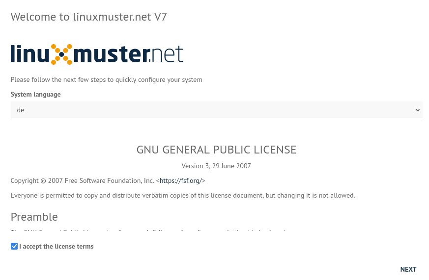

.. _setup-label:

===========
Setup v7.2
===========

.. sectionauthor:: `@cweikl <https://ask.linuxmuster.net/u/cweikl>`_,
                   `@MachtDochNix <https://ask.linuxmuster.net/u/machtdochnix>`_

.. attention::

   Alle linuxmuster 6.x Systeme können statt einer Neuinstallation über eine :ref:`migration-label` umgezogen werden, dennoch ist die Erstkonfiguration hier eine notwendige Voraussetzung.

   Alle linuxmuster 7.1 Systeme werden lediglich über ein :ref:`upgrade-from-7.1-label` auf linuxmuster v7.2 aktualisiert. Ein erneutes Setup ist dann nicht mehr erforderlich.
   
Es gibt 2 Möglichkeiten, die Erstkonfiguration durchzuführen: 

1. Setup mit der Schulkonsole
2. Setup im Terminal

Lies zunächst alle wichtigen Hinweise des Setup Kapitels und mache dann entweder auf der Schulkonsole (grafisch / GUI) oder im Terminal weiter.

Wichtige Hinweise
=================

* Nach Abschluss dieses Setups sind die (AD-)Domäne und andere Details des Netzwerks permanent festgelegt und nur durch eine erneute Neuinstallation änderbar.

  Es ist daher wichtig, zu diesem Zeitpunkt ein **Snapshot/Backup von Server und Firewall** anzufertigen.

  Sollte es beim Setup Fehler geben, oder Einstellungen nochmals geändert werden müssen, sind die virtuellen Maschinen auf den Stand des Snapshots zurückzusetzen und das Setup muss erneut aufgerufen werden.

* Beim Domänennamen ist zu beachten:

  - nutze immer eine echte externe Domain, die auf Deine Organisation registriert ist -> z.B. ``meineschule.de``
  - für das Setup von linuxmuster benötigst Du nun eine Subdomain, die vom AD DNS-Server authoritativ intern aufgelöst wird, aber niemals von extern.
  - der AD DNS-Server arbeitet immer nur für diese eine Subdomain und die darunter liegenden Namensräume autoritativ.
  - alle internen Clients müssen den AD DNS-Server als DNS-Server nutzen.
  - diese Subdomain darf nicht nicht länger als 15 Zeichen sein (NetBIOS-Name) und keine Satzzeichen enthalten.
  - der Fully Qualified Domain Name (FQDN) darf nicht länger als 64 Byte sein.
  - nutze niemals nicht registrierte Domains wie z.B. .local -> meineschule.local 

* Beim Setup von linuxmuster gibst Du also einen Domänennamen nach folgendem Schema an:
  
  hostname.subdomain=NetBIOS-Name.domain.tld
  ein funktionierendes Beispiel wäre: server01ad.linuxmuster.meineschule.de
    
  * server01ad -> hostname
  * linuxmuster -> subdomain
  * domain -> meineschule
  * de -> tld

* Es wird also eine extern auflösbare, registrierte Domain genutzt und bei der Einrichtung des Servers wird eine eigene interne Subdomain als AD-Domäne angegeben.

  Zum Beispiel ``linuxmuster.meineschule.de`` -> linuxmuster als Subdomain zur Domain ``meineschule.de``.
  
  Der erste Part ``linuxmuster`` wird in diesem Beispiel dann als SAMBA-Domäne verwendet.
  
  Der volle Name(FQDN) des Servers ist dann ``server.linuxmuster.meineschule.de``.
  
.. hint::

  Daraus folgt wie in einem reinen MS-Netzwerk, dass der linuxmuster.net-Server immer den Service DNS für die Vertrauensstellung liefern muss, denn er übernimmt die Rolle des Domänencontrollers für die Active Domane. In unserer Beschreibung als SAMBA-Domäne bezeichnet. 

* Alle Hosts, die im Setup konfiguriert werden, müssen bereits laufen (OPNsense und Server) und sie müssen sich im internen LAN gegenseitig erreichen.

* v6.x Systeme, die mithilfe der Migration auf linuxmuster.net 7.2 migriert werden, können dabei für eine neue (oder die alte) Domäne konfiguriert werden.

Anpassung des Netzbereichs
==========================

Die Standardkonfiguration sieht vor, dass Geräte im Netzbereich ``10.0.0.0/16`` sind.

v6.x Systeme, die mithilfe der Migration auf linuxmuster.net 7.2 migriert werden, sollten den bisher verwendeten Netzbereich beibehalten.

.. hint::

   Die erforderlichen Anpassungen der Netzkonfiguration - sofern diese von dem Standard abweichen sollen - sind vor der Ausführung der Erstkonfiguration durchzuführen. Zur Durchführung der Anpassungen folge bitte dem Kapitel :ref:`modify-net-label`.

Auswahl der Setup-Variante
===========================

Server-Konsole
--------------

.. figure:: media/newsetup/lmn-setup-terminal-03.png
     :align: center 
     :width: 80%
     :alt: Screenshot Server Console 
     :target: setup-console.html

     Hier geht es zum :ref:`setup-console-label`

WEB UI
------

(formerly known as Schulkonsole) 

     Hier geht es zum :ref:`setup-gui-label`

