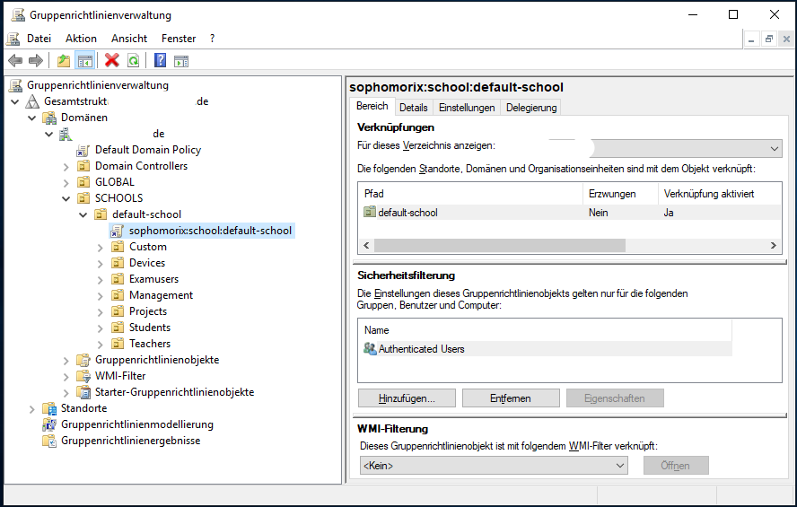
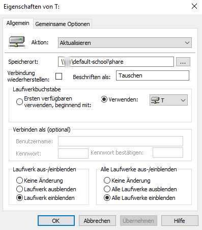

Nutzung der Remote Server Administration Tools zum Anpassen der GPO
===================================================================

.. sectionauthor:: `@michael_kohls <https://ask.linuxmuster.net/u/michael_kohls>`_

Das Anpassen der vom SAMBA-Server bereitgestellten GPO erfolgt von einem Windows-PC aus.

.. _install-RSAT-label:

Installation der RSAT (Remote Server Administration Tools)
----------------------------------------------------------
Zur Verwaltung des Active Directory (AD) benötigt man die Microsoft Remote Server Administration Tools (RSAT). Diese werden von Microsoft bereitgestellt. (Home-Versionen von Windows werden nicht unterstützt!)

Für Windows10-Versionen vor 1809 müssen diese noch als separtes Installationspaket heruntergeladen werden: https://www.microsoft.com/en-us/download/details.aspx?id=45520

Ab Version 1809 sind die RSAT ein optionales Feature. Die Installation erfolgt über ``Start`` -> ``Apps und Features`` -> ``optionale Features`` -> ``Feature hinzufügen`` -> ``RSAT: Group Policy Management Tools``.

Verwendung der Gruppenrichtlinienverwaltung
-------------------------------------------
Falls noch nicht geschehen, melde Dich mit einem Domänenbenutzerkonto, welches zur Gruppe der Administratoren gehört, am Computer an. Zum Beispiel als global-admin. Starte die Gruppenrichtlinienverwaltung durch Eingabe von ``gpmc.mmc``. Bei Windows ab Version 1809 starte die App Gruppenrichtlinienverwaltung.

   
Mittels Rechtsklick auf ``sophomorix:school:default-school`` und ``Bearbeiten`` öffnet sich der Gruppenrichtlinienverwaltungs-Editor:

.. image:: media/02-gruppenrichtlinienverwaltungs-editor.png
  :alt: GPMC
   :align: center
   
.. hint::
  Sollte die Standard-GPO "sophomorix:school:default-school" nicht vorhanden sein, dann kann diese auf dem Server erzeugt werden durch Eingabe von: ``sophomorix-school --gpo-create default-school``.

Im Gruppenrichtlinienverwaltungs-Editor können nun Anpassungen der GPO vorgenommen werden:

Beispiel für Änderung der Laufwerksbeschriftung
-----------------------------------------------

Die Netzlaufwerke unter Windows werden mit Ausnahme des Homelaufwerks per GPO eingebunden. Wenn z.B. die Beschriftung deutsch statt englisch sein soll oder der Laufwerkbuchstabe geändert werden soll kann das unter ``Benutzerkonfiguration`` -> ``Einstellungen`` -> ``Laufwerkszuordnungen`` geändert werden:

   
