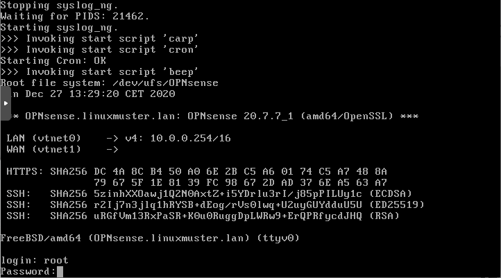

.. include:: /guided-inst.subst

.. _hard_drive_size_opnsense_vm-label:

====================================================
Aktualisieren der Festplattengrößen der OPNSense®-VM
====================================================

.. sectionauthor:: `@toheine <https://ask.linuxmuster.net/u/toheine>`_,
                   `@MachtDochNix <https://ask.linuxmuster.net/u/MachtDochNix>`_,
                   `@cweikl <https://ask.linuxmuster.net/u/cweikl>`_

.. hint::

   Diesen Abschnitt musst du nur ausführen, sofern du in deinem Hypervisor die HDD-Größe der OPNSense® bereits vergrößert hast. Ansonsten kannst du bei der Einrichtung mit dem Kapitel ``Netzbereich anpassen`` fortfahren.
   
..
   ==================== ======================
   Netzbereich anpassen |follow_me2modify-net|
   ==================== ======================

============================== ==========================
Proxmox - Netzbereich anpassen |follow_me2proxmox-backhd|
XCP-ng  - Netzbereich anpassen |follow_me2xcp-ng-backhd|
KVM     - Netzbereich anpassen |follow_me2kvm-backhd|
============================== ==========================

   
Überblick
---------
OPNSense® basiert auf FreeBSD, sodass die Erweiterung der Festplattengröße von dem Vorgehen der
Server-VM abweicht. 

Die Erweiterung der Festplattengröße folgt folgendem Ablauf:

1. Starten der VM.
2. Prüfen, ob die neue HDD-Größe an die VM durchgereicht wurde.
3. Partitionsgrößen prüfen.
4. Festplatte ad0 anpassen.
5. Partition ad0s1 anpassen.
6. Änderungen anwenden.
7. Tests durchführen.
8. Reboot

Gleich bleibt, dass zu Beginn ein Snapshot erstellt werden sollte und die 
Virtuelle Disk im Hypervisor wie beschrieben vergrößert sein muss.

4.1 Starten der VM 
------------------

Starten der VM und öffnen einer Konsole für diese ist wie zuvor beschrieben erfolgt.

Anmeldung als `root` mit dem bekannten Passwort. 
     
.. figure:: media/hard-drive-size-opnsense-vm_02_start-opnsense-console.png
   :align: center
   :alt: open OPNSense® shell

Öffnen einer Shell mit der Taste `8`. 
 
 
4.2 HDD-Größe prüfen 
--------------------

Prüfen, ob die neue HDD-Größe an die VM durchgereicht wurde.

Nach der Vergrößerung der virtuellen Platte und dem Systemstart wird überprüft, ob die
Änderung vom System erkannt wird.

.. code::

  gpart show

Ausgabe des Befehls liefert:  

.. code::

  root@OPNsense:~ # gpart show
  =>       63  104857537  da0  MBR  (50G)
           63   20964762    1  freebsd  [active]  (10G)
     20964825   83892775       - free -  (40G)

  =>       0  20964762  da0s1  BSD  (10G)
           0        16         - free -  (8.0K)
          16  20964746      1  freebsd-ufs  (10G)
          
          
.. attention::

   Unter XCP-ng kann die Bezeichnung der Festplatte abweichen. Hier wird in der OPNSense-VM für die 1. HDD die Bezeichnung ``ada0`` verwendet.
   Die 1. Partition wird dann mit ``ada0s1`` bezeichnet. Die Angaben sind daher dann entsprechend anzupassen.

4.3 Partitionsgrößen prüfen
---------------------------

.. code::

   df -h 
   
Die Ausgabe zeigt dir an, dass derzeit nur der bisher verwendete Platz zu Verfügung steht:

.. code::
  
  root@OPNsense:~ # df -h
  Filesystem           Size    Used   Avail Capacity  Mounted on
  /dev/ufs/OPNsense    9.7G    1.8G    7.1G    20%    /
  devfs                1.0K    1.0K      0B   100%    /dev
  devfs                1.0K    1.0K      0B   100%    /var/dhcpd/dev
  devfs                1.0K    1.0K      0B   100%    /var/unbound/dev

Es ist zu erkennen, dass die Platte `da0` nur 10 GByte nutzt. Aus 4.2. wurde ersichtlich das weitere 40 GByte zur Verfügung stehen.

4.4 Festplate da0/ada0 anpassen
-------------------------------

.. code::

  root@OPNsense:~ # growfs /dev/ufs/OPNsense

Ausgabe des Befehls:

.. code::

   growfs: requested size 10GB is not larger than the current filesystem size 10GB

4.5 Partition da0s1/ada0s1 anpassen
-----------------------------------

.. code::

   growfs /dev/da0s1

Ausgabe des Befehls:

.. code::

   growfs: superblock not recognized 

4.6 Änderungen anwenden
-----------------------

.. code::

   service growfs onestart

.. figure:: media/hard-drive-size-opnsense-vm_03_output-service-growfs-onestart.png
    :align: center
    :alt: Output from service growfs onestart

4.7 Tests durchführen
---------------------

Mittels `df -h`, `gpart show` und `gpart status` kannst du überprüfen, ob die von dir gewünschte Größenänderung erfolgreich übernommen wurden.

.. code::

   root@OPNsense:~ # df -h
   Filesystem         Size    Used   Avail Capacity  Mounted on
   /dev/gpt/rootfs     48G    1.8G     43G     4%    /
   devfs              1.0K    1.0K      0B   100%    /dev
   devfs              1.0K    1.0K      0B   100%    /var/dhcpd/dev
   devfs              1.0K    1.0K      0B   100%    /var/unbound/dev

.. code::

   root@OPNsense:~ # gpart show
   =>      63  104857537  da0  MBR  (50G)
           63  104857537    1  freebsd  [active]  (50G)
  
   =>       0  104857537  da0s1  BSD  (50G)
            0         16         - free -  (8.0K)
           16  104857521      1  freebsd-ufs  (50G)

.. code::

   root@OPNsense:~ # gpart status
     Name  Status  Components
    da0s1      OK  da0
   da0s1a      OK  da0s1

4.8 Reboot
----------

Führe nun einen Reboot der VM aus.

Weiterführende Erklärungen zu FreeBSD zu diesem Thema findest du hier: 

https://www.digitalocean.com/community/questions/freebsd-growfs-operation-not-permitted-aka-enlarge-your-partition

Weiter geht es mit der Anpassung des Netzwerkes. 

============================== ==========================
Proxmox - Netzbereich anpassen |follow_me2proxmox-backhd|
XCP-ng  - Netzbereich anpassen |follow_me2xcp-ng-backhd|
KVM     - Netzbereich anpassen |follow_me2kvm-backhd|
============================== ==========================

