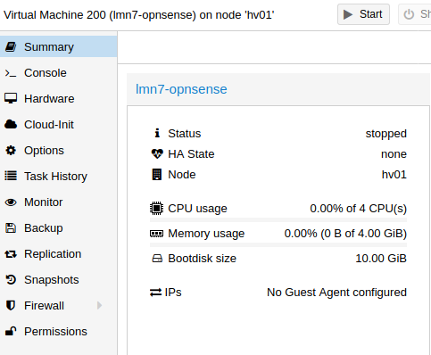
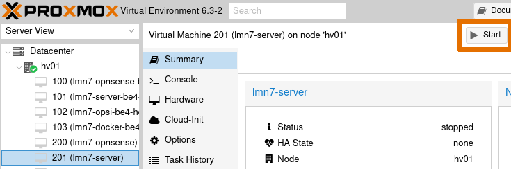

.. include:: ../../guided-inst.subst

.. _hard_drive_size_proxmox-label:

===================================
Vorbereiten der Proxmox Festplatten
===================================

1. Snapshots der VMs anfertigen
-------------------------------

.. sectionauthor:: `@toheine <https://ask.linuxmuster.net/u/toheine>`_,
                   `@MachtDochNix <https://ask.linuxmuster.net/u/MachtDochNix>`_,
                   `@cweikl <https://ask.linuxmuster.net/u/cweikl>`_

Am Beispiel der OPNsense®-VM werden die Anpassungen nachstehend erläutert.

Wähle als Erstes die VM aus, die geklont werden soll.

.. figure:: media/hdd-preparation-on-proxmox_0_1_vm-overview.png
   :align: center
   :alt: Snapshot Schritt 1.1

Unter ``More`` findest Du den Button zum Starten des Klon-Vorganges

.. figure:: media/hdd-preparation-on-proxmox_0_2_vm-overview.png
   :align: center
   :alt: Snapshot Schritt 1.2

In dem sich öffnen Fenster siehst Du welche VM geklont werden wird und deren neuer ID.

Im Feld `Name` kannst Du einen eigenen angeben, ansonsten wird einer nach dem Muster "Copy of VM ..." verwendet.

.. figure:: media/hdd-preparation-on-proxmox_0_3_vm-overview.png
   :align: center
   :alt: Snapshot Schritt 1.3

Der Klon-Vorgang wird mit `Clone` gestartet.

Das wird sichtbar daran, dass die VM mit der neuen ID in der linken Übersicht mit einem Schloss erscheint.

.. figure:: media/hdd-preparation-on-proxmox_0_4_vm-overview.png
  :align: center
  :alt: Snapshot Schritt 1.4

Das Schloss zeigt an, dass das Kopieren der VM gestartet ist. Dieses siehst Du auch in den `Tasks` am unteren Bildschirmrand.

.. figure:: media/hdd-preparation-on-proxmox_0_5_vm-overview.png
   :align: center
   :alt: Snapshot Schritt 1.5

Dort erkennst Du, wann der Vorgang abgeschlossen ist.

.. figure:: media/hdd-preparation-on-proxmox_0_6_vm-overview.png
   :align: center
   :alt: Snapshot Schritt 1.6

Bei der neuen VM ist das Schloss verschwunden und der Name wird in der Übersicht der VMs angezeigt.

.. figure:: media/hdd-preparation-on-proxmox_0_7_vm-overview.png
   :align: center
   :alt: Snapshot Schritt 1.7

.. hint:: Diesen Ablauf musst Du für alle Virtuellen Maschinen, deren Festplatte Du vergrößern möchtest, wiederholen.

2. Vorbereiten der PROXMOX Festplatten
--------------------------------------

Ausgangssituation:

Die OPNsense®-VM wurde mit dem Namen `lmn7-opnsense` und der `VM-ID: 200` angelegt. In der Übersicht erkennst Du, dass derzeit
eine Festplatte mit einer Größe von 10 GiB eingerichtet wurde. 
Für den Einsatz in einem Produktivserver einer Schule dürfte dies zu klein sein. Die Festplattengröße kannst Du nun wie folgt anpassen:

1. Wähle links im Menü die gewünschte VM aus und dann in der Spalte daneben (Kontextmenü der VM) den Eintrag `Hardware` aus.

2. Rechts werden nun die Hardware-Komponenten der VM aufgelistet. Markiere den Eintrag `Hard disk`.

.. figure:: media/hdd-preparation-on-proxmox_2_vm-select-hdd.png
   :align: center
   :alt: Schritt 2.2

3. Klicke danach auf den Button `Resize Disk`, um die Festplatte der VM zu vergrößern.

.. hint:: 

   Auf diesem Wege ist nur eine Vergrößerung des Plattenplatzes möglich, eine Verkleinerung hingegen nicht!

4. Es erscheint ein neues Fenster, in dem Du angeben must, um wieviel GiB Du die Festplatte vergrößern willst. 

.. figure:: media/hdd-preparation-on-proxmox_3_vm-hdd-resize.png
   :align: center
   :alt: Schritt 2.3

5. In dem Beispiel sind 10 GByte gegeben, um auf 50 GByte zu kommen, trägst Du nun 40 GByte ein. Danach siehst Du folgenden Eintrag:

.. figure:: media/hdd-preparation-on-proxmox_4_vm-hdd-status.png
   :align: center
   :alt: Schritt 2.4

.. hint:: Für die anderen VMs werden die Festplatten in gleicher Weise vergrößert. 

   Bei der Server-VM ist zu beachten, dass diese über zwei Festplatten verfügt. Die kleine Festplatte weist zu Beginn 25 GByte die größere 100 GByte auf. Beide sind zu vergrößern.
  
   Hierbei ist auf eine ausreichende Größe zu achten, da auf dem Server neben den Nutzer- und Klassendaten auch die von Linbo gespeicherten Festplattenabbilder der Clients abgelegt werden. Siehe Einleitung dieses Abschnittes: :ref:`adjusting_hard_drive_size-label` 

3. Schritt: HDD-Größen der Virtuellen Maschinen anpassen
--------------------------------------------------------

Nachdem im Virtualisierungs-Host die HDD der VM vergrößert wurde, muss die tatsächlich genutzte Größe angepasst werden.

3.1 Virtuelle Maschinen starten
^^^^^^^^^^^^^^^^^^^^^^^^^^^^^^^^

Wähle links im Menü die gewünschte VM aus. Exemplarisch ist der Start der Server-VM dargestellt. 

Nach der Auswahl betätgist Du den Button `Start`.

Wiederhole dieses Vorgehen für alle VMs deren Festplatten Du angepasst hast.

3.2 Vergrößern der Server Festplatten
^^^^^^^^^^^^^^^^^^^^^^^^^^^^^^^^^^^^^

In der gestarteten VM musst Du nun den Festplattenplatz anpassen.
Folge hierzu der Beschreibung mit nachstehendem Link.
