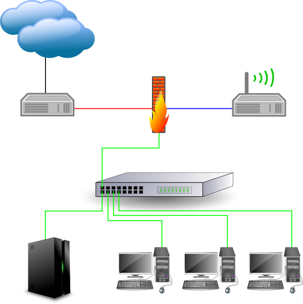

.. |br| raw:: html

   <br />

.. _preface-preparations-label:

Vorwort und Vorbereitungen
==========================
Die linuxmuster.net 6.2 wird als Zwei-Server-Lösung (IPFire-Firewall und linuxmuster.net-Server) betrieben. Sie beginnen zunächst mit der Installation der IPFire-Firewall und fahren dann nach einer Vorkonfiguration der Firewall mit der Installation des linuxmuster.net-Servers fort.


Checkliste
----------
Nutzen Sie die :download:`Checkliste  <./media/preamble/checklist/checklist.pdf>`, um alle während der Installation gemachten Einstellungen festzuhalten. Es handelt sich um ein PDF-Formular, Sie können es also auch am PC ausfüllen. Halten Sie diese Checkliste bereit, wenn Sie den Telefon-Support in Anspruch nehmen wollen.

Download der Software
---------------------
Laden Sie sich zunächst die benötigte Software herunter, beachten Sie dabei die Versionshinweise sorgfältig.

IPFire
``````

.. warning::

   Obsolet

Laden Sie das Iso-Image (
`IPFire Version 2.19 - Core Update 103 (x86_64) <http://downloads.ipfire.org/releases/ipfire-2.x/2.19-core103/ipfire-2.19.x86_64-full-core103.iso>`_ ) herunter und brennen es auf eine CD.

  .. warning::
   Neuere Version des IPFire wurden noch nicht auf Kompatibilität getestet. Es wird dringend empfohlen nur getestete Versionen des IPFire einzusetzen.

Um sicher zu stellen, dass die Datei richtig heruntergeladen wurde, können Sie die SHA1-Summe prüfen. Auf der Konsole eines Linuxbetriebsystems steht z.B. der Befehl ``sha1sum`` zur Verfügung:

.. code-block:: console

   sha1sum ipfire-2.19.x86_64-full-core103.iso

Als Ausgabe erhält man die Prüfsumme, z.B.

.. code-block:: console

   1b92a278709ddc0542dd0f8514693ec073a963c5  ipfire-2.19.x86_64-full-core103.iso

Dies so erhaltene Prüfsumme muss mit der auf der `Download-Seite <http://downloads.ipfire.org/release/ipfire-2.19-core103>`_ angegebenen übereinstimmen.

Ubuntu & Docker Server
``````````````````````
Lade das aktuelle Iso-Image ( `Ubuntu 16.04.3 LTS 64-bit PC (AMD64) server install CD <http://releases.ubuntu.com/xenial/ubuntu-16.04.3-server-amd64.iso>`_ ) herunter und brenne es auf eine CD.

Um sicher zu stellen, dass die Datei richtig heruntergeladen wurde, kannst du die SHA1-Summe prüfen. Auf der Konsole eines Linuxbetriebsystems steht z.B. der Befehl ``sha256sum`` zur Verfügung:

.. code-block:: console

   sha256sum ubuntu-16.04.3-server-amd64.iso

Als Ausgabe erhält man die Prüfsumme, z.B.

.. code-block:: console

   a06cd926f5855d4f21fb4bc9978a35312f815fbda0d0ef7fdc846861f4fc4600  ubuntu-16.04.3-server-amd64.iso

Dies so erhalten Prüfsumme muss mit von Ubuntu zur Verfügung gestellten `Summe <http://releases.ubuntu.com/xenial/SHA256SUMS>`_  übereinstimmen.


Hinweise zur Netzwerkstruktur
-----------------------------

IP-Bereiche
```````````
Die linuxmuster.net-Lösung kann mit unterschiedlichen IP-Bereiche arbeiten. Jede Zeile der folgenden Tabelle stellt eine Möglichkeit dar.

+---------+-------------------+-----------------+------------+--------------+
| Auswahl | Beginn IP-Bereich | Ende IP-Bereich | Server-IP  | IPFire-IP    |
+=========+===================+=================+============+==============+
| 16-31   | 10.16.0.0         | 10.31.255.255   | 10.16.1.1  | 10.16.1.254  |
+---------+-------------------+-----------------+------------+--------------+
| 32-47   | 10.32.0.0         | 10.47.255.255   | 10.32.1.1  | 10.32.1.254  |
+---------+-------------------+-----------------+------------+--------------+
| ...     | ...               | ...             | ...        | ...          |
+---------+-------------------+-----------------+------------+--------------+
| 224-239 | 10.224.0.0        | 10.239.255.255  | 10.224.1.1 | 10.224.1.254 |
+---------+-------------------+-----------------+------------+--------------+

Bei der Installation entscheiden Sie sich für einen der Bereiche. Liegen keine besonderen Anforderungen (z.B. Testbetrieb von linuxmuster.net in einem weiteren produktiv laufenden linuxmuster.net-System) vor, wird empfohlen den Bereich 16-31 zu verwenden.  |br| Dies hat auch den Vorteil, dass alle im vorliegenden Dokument enthaltenen Screenshots bei einer Installation mit diesem Bereich gemacht wurden.

Netzwerknamen der Firewall-Lösung IPFire
````````````````````````````````````````
Linuxmuster.net ordnet den unterschiedlichen Netzwerken Farben zu:

*  Das interne Netzwerk wird GRÜNES Netzwerk genannt.
*  Das externe Netzwerk wird ROTES Netzwerk genannt, es ist über einen Router mit dem Internet verbunden.
*  Optional kann z.B. für WLAN-Accesspoints ein weiteres Netzwerk aufgebaut werden (BLAU), für welches andere Zugangsberechtigungen als denen im grünen Netzwerk gelten.
*  Ebenso optional kann eine sog. demilitarisierte Zone (DMZ) als zusätzliches Netzwerk (ORANGE) aufgebaut werden.



   Schematischer Aufbau eines Computernetzes mit linuxmuster.net.

Hinweise für Profis
```````````````````
Die linuxmuster.net-Lösung unterstützt auch komplexere Netzwerkstrukturen mit

* subnetting
* VLANS
* Bonding

Siehe dazu auch :doc:`Netzsegmentierung mit linuxmuster.net <../network/subnetting-basics/index/>`
