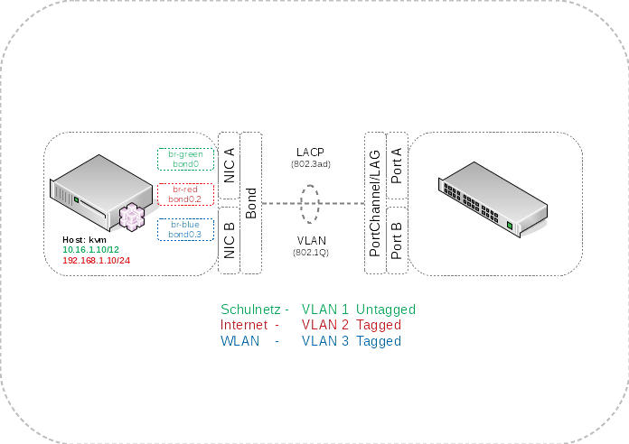

Weiterführende Dokumentation
============================

Vorlage der Netzwerkzeichnungen
-------------------------------

Bei Interesse kannst Du die Netzwerk-Skizzen zur eigenen Bearbeitung :download:`hier<install-on-kvm.odg>` als LibreOffice Draw herunterladen.

kvm: Link Aggregation und VLANs
-------------------------------

In der folgenden Beschreibung werden die beiden Netzwerkkarten des KVM-Servers zu einer logischen Netzwerkkarte (Bond) mit Hilfe des LACP Protokolls zusammengefasst. Dies bietet Redundanz im Falle des Ausfalls einer Netzwerkkarte oder Netzverbindung sowie eine Verbesserung der Bandbreite auf 2x1 GBit/s. Des Weiteren werden die drei Netze Schulnetz, Internet und WLAN auf VLANs verteilt. 

**Konfiguration des KVM-Servers**

Auf dem KVM-Server wird die Interfaces-Konfigurationsdatei ``/etc/network/interfaces`` angepasst. Für das WLAN-Netz kommt ein weiteres Bridge-Interface dazu.

.. code-block:: console

	# Bond Interfaces

	# VLAN 1 Schulnetz
	auto bond0
	iface bond0 inet manual
		bond-mode 4
		bond-miimon 100
		bond-slaves enp5s0f0 enp5s0f1

	# VLAN 2 Internet
	auto bond0.2
	iface bond0.2 inet manual
		vlan_raw-device bond0

	# VLAN 3 WLAN
	auto bond0.3
	iface bond0.3 inet manual
		vlan_raw-device bond0

	# Hardware

	# Interface A
	auto enp5s0f0
	iface enp5s0f0 inet manual
		bond-master bond0

	# Interface B
	auto enp5s0f1
	iface enp5s0f1 inet manual
		bond-master bond0

	# Interfaces fuer die VMs

	# VM Interaces Rot
	auto br-red
	iface br-red inet static
		address 192.168.1.10
		netmask 255.255.255.0
		gateway 192.168.1.1
		bridge_ports bond0.2
		bridge_stp off
		dns-nameservers 192.168.1.1

	# VM Interfaces Gruen
	auto br-green
	iface br-green inet static
		address 10.16.1.10
		netmask 255.240.0.0
		bridge_ports bond0
		bridge_stp off

	# VM Interfaces Blau
	auto br-blue
	iface br-blue inet manual
		bridge_ports bond0.3
		bridge_stp off

..

Mit Hilfe von *cat /proc/net/bonding/bond0* kannst Du Dir den Status des Bond-Interfaces anschauen.

.. code-block:: console

	root@kvm:~# cat /proc/net/bonding/bond0 
	Ethernet Channel Bonding Driver: v3.7.1 (April 27, 2011)

	Bonding Mode: IEEE 802.3ad Dynamic link aggregation
	Transmit Hash Policy: layer2 (0)
	MII Status: up
	MII Polling Interval (ms): 100
	Up Delay (ms): 0
	Down Delay (ms): 0

	802.3ad info
	LACP rate: slow
	Min links: 0
	Aggregator selection policy (ad_select): stable
	System priority: 65535
	System MAC address: 00:15:17:18:1a:1d
	Active Aggregator Info:
		Aggregator ID: 2
		Number of ports: 2
		Actor Key: 9
		Partner Key: 1
		Partner Mac Address: 00:19:06:e8:75:80

	Slave Interface: enp5s0f1
	MII Status: up
	Speed: 1000 Mbps
	Duplex: full
	Link Failure Count: 0
	Permanent HW addr: 00:15:17:18:1a:1d
	Slave queue ID: 0
	Aggregator ID: 2
	Actor Churn State: none
	Partner Churn State: none
	Actor Churned Count: 0
	Partner Churned Count: 0
	details actor lacp pdu:
	    system priority: 65535
	    system mac address: 00:15:17:18:1a:1d
	    port key: 9
	    port priority: 255
	    port number: 1
	    port state: 61
	details partner lacp pdu:
	    system priority: 32768
	    system mac address: 00:19:06:e8:75:80
	    oper key: 1
	    port priority: 32768
	    port number: 259
	    port state: 61

	Slave Interface: enp5s0f0
	MII Status: up
	Speed: 1000 Mbps
	Duplex: full
	Link Failure Count: 0
	Permanent HW addr: 00:15:17:18:1a:1c
	Slave queue ID: 0
	Aggregator ID: 2
	Actor Churn State: none
	Partner Churn State: none
	Actor Churned Count: 0
	Partner Churned Count: 0
	details actor lacp pdu:
	    system priority: 65535
	    system mac address: 00:15:17:18:1a:1d
	    port key: 9
	    port priority: 255
	    port number: 2
	    port state: 61
	details partner lacp pdu:
	    system priority: 32768
	    system mac address: 00:19:06:e8:75:80
	    oper key: 1
	    port priority: 32768
	    port number: 258
	    port state: 61

..

**Konfiguration am Beispiel eines Cisco Switches**

Auf dem Switch werden 2 Ports und ein logisches Interface (EtherChannel/LAG) benötigt.

.. code-block:: console

	interface Port-channel1
	 description KVM-Server
	 switchport trunk encapsulation dot1q
	 switchport mode trunk
	 switchport nonegotiate
	 spanning-tree portfast trunk
	 spanning-tree bpdufilter enable

	interface GigabitEthernet0/1
	 description KVM-Server
	 switchport trunk encapsulation dot1q
	 switchport mode trunk
	 switchport nonegotiate
	 no cdp enable
	 channel-group 1 mode active
	 spanning-tree portfast trunk
	 spanning-tree bpdufilter enable

	interface GigabitEthernet0/2
	 description KVM-Server
	 switchport trunk encapsulation dot1q
	 switchport mode trunk
	 switchport nonegotiate
	 no cdp enable
	 channel-group 1 mode active
	 spanning-tree portfast trunk
	 spanning-tree bpdufilter enable

..

Der Status der Verbindung kann mit Hilfe des Befehls *show etherchannel summary* ausgegeben werden.

.. code-block:: console

	#show etherchannel summary 
	Flags:  D - down        P - bundled in port-channel
	        I - stand-alone s - suspended
	        H - Hot-standby (LACP only)
	        R - Layer3      S - Layer2
	        U - in use      f - failed to allocate aggregator

	        M - not in use, minimum links not met
	        u - unsuitable for bundling
	        w - waiting to be aggregated
	        d - default port

	Number of channel-groups in use: 1
	Number of aggregators:           1

	Group  Port-channel  Protocol    Ports
	------+-------------+-----------+-----------------------------------------------
	1      Po1(SU)         LACP      Gi0/1(P)    Gi0/2(P)    

..

.. raw:: html

	

	<iframe width="696" height="392" src="https://www.youtube.com/embed/XdiOdbGAGDQ?rel=0" frameborder="0" allow="autoplay; encrypted-media" allowfullscreen></iframe>
	
