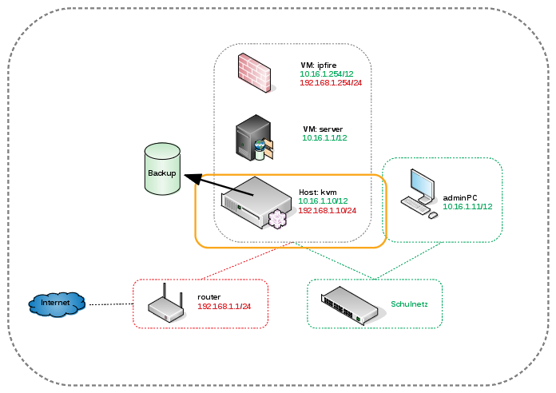

Backup und Restore
==================

Als Erstes kümmern wir uns um ein Notfall-Backup des KVM-Servers selbst. Dieses sollte immer dann erstellt/erneuert werden, wenn es größere Veränderungen am Server gegeben hat. Also genau jetzt! ;-)

In unserem Beispiel ist die Backup-Platte direkt am Server angeschlossen. Für die Praxis ist sicherlich eine externe USB3 HDD zu empfehlen, die direkt an den KVM-Server angeschlossen wird.

Notfallbackup des KVM-Servers
-----------------------------

Das Backup wird mit Hilfe von `CloneZilla <http://clonezilla.org/>`_ erstellt. Hier nutzen wir die Funktionalität, ganze Platten in ein Image zu schreiben. Das ISO-Image wird auf einen USB-Stick geschrieben, der auch als Bootmedium genutzt wird (z.B. mittels :ref:`dd<preface-usb-stick-label>` ). 

.. raw:: html

	

	<iframe width="696" height="392" src="https://www.youtube.com/embed/r3R525eHhV4?rel=0" frameborder="0" allow="autoplay; encrypted-media" allowfullscreen></iframe>
	

..

Im nächsten Schritt bereiten wir die Backup-HDD vor, indem wir diese Partitionieren und Formatieren.

.. hint::
	**ACHTUNG** Dabei gehen alle vorhandenen Daten auf der Platte verloren!

.. code-block:: console

	Partitionieren
	# fdisk /dev/sdX

	Formatieren
	# mkfs.ext4 /dev/sdX1

.. raw:: html

	

	<iframe width="696" height="392" src="https://www.youtube.com/embed/01VfI0YrBkE?rel=0" frameborder="0" allow="autoplay; encrypted-media" allowfullscreen></iframe>
	

..

Alle Vorbeitungen sind getroffen und das Backup kann erstellt werden.

.. hint::
	Der Screencast erstellt das Backup noch ohne die *ipfire* und *server* VM-LVMs. Sind Diese vorhanden, dauert der ganze Vorgang natürlich entsprechend länger.

.. raw:: html

	

	<iframe width="696" height="392" src="https://www.youtube.com/embed/nPQSm1O4yd8?rel=0" frameborder="0" allow="autoplay; encrypted-media" allowfullscreen></iframe>
	

..

Notfallrestore des KVM-Servers
------------------------------

Im Falle eines Totalverlustes des KVM-Servers kann Dieser einfach neu installiert werden. Schneller geht es aber mit dem gerade erstellten Backup. Dieses wird die komplette HDD inklusive Bootsektor und LVM wiederherstellen.

.. hint::
	**ACHTUNG** Dabei gehen alle vorhandenen Daten auf der Platte verloren!

.. raw:: html
	
	

	<iframe width="696" height="392" src="https://www.youtube.com/embed/JViy8qV14UA?rel=0" frameborder="0" allow="autoplay; encrypted-media" allowfullscreen></iframe>
	

.. 