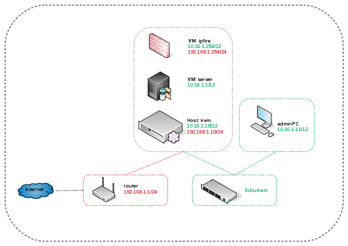

Installation mit KVM
====================

In diesem Dokument findest Du "Schritt für Schritt" Anleitungen zum Installieren der linuxmuster.net-Musterlösung in der Version 6.2 auf Basis von KVM unter Ubuntu Server 16.04.3 LTS. 

Im folgenden Bild eine schematische Darstellung der einfachsten Form der Implementierung der Musterlösung:

Nach der Installation gemäß dieser Anleitung erhälst Du eine einsatzbereite Umgebung bestehend aus

* einem Administrationsrechner (adminPC),
* einem Virtualisierungshost (kvm),
* einer Firewall (ipfire) und 
* eines Servers (server).

.. hint:: 
	Als Voraussetzung wird ein Router benötigt, der in unserem Beispiel das private Netz 192.168.1.0/24 zur Verfügung stellt und der selbst die IP-Adresse 192.168.1.1/24 besitzt. Des Weiteren ist es hilfreich, wenn er einen dynamischen DHCP-Bereich für die Installation zur Verfügung stellt.

Inhalt:

.. toctree::
   :maxdepth: 2

   install
   backuprestore
