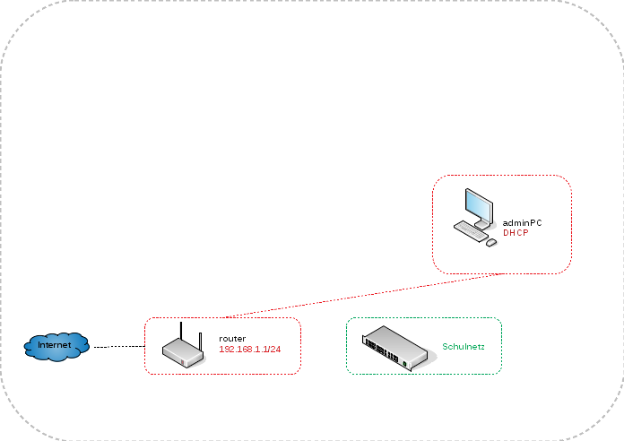
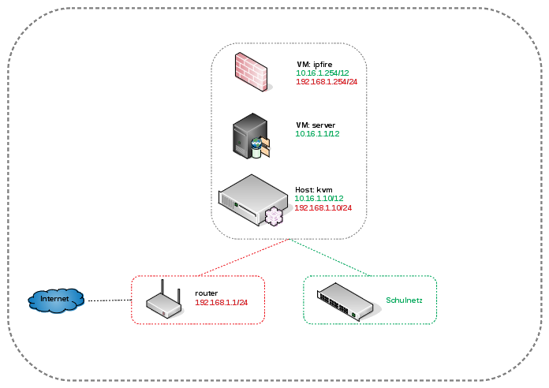
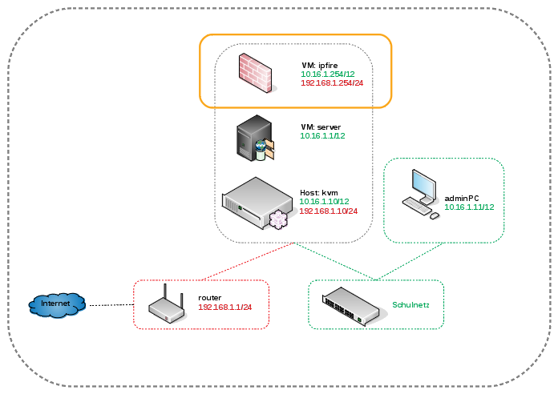
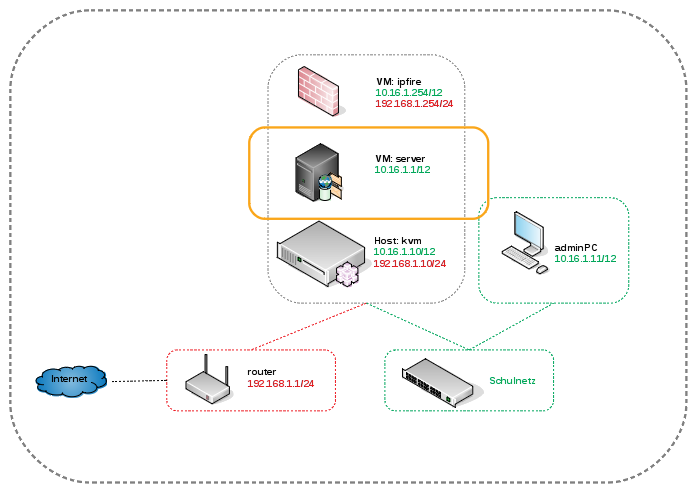

Installation
============

adminPC: Installation 
---------------------

.. hint:: 
	Der *adminPC* soll zur Administration des KVM-Servers dienen. Der Vorteil dieser Variante liegt vor allen Dingen darin, dass der Virtualisierungsserver so schlank wie möglich gehalten werden kann.

Die Hardware sollte folgende Mindestmerkmale aufweisen:

* DualCore CPU
* 1GB RAM
* 20GB HDD

Als Betriebssystem wird *Lubuntu* in der Version 16.04 LTS verwendet. Es kann auf der `Lubuntu <http://lubuntu.net/>`_ Seite heruntergeladen werden.  

.. raw:: html

	

	<iframe width="696" height="392" src="https://www.youtube.com/embed/hHrpioJ0lvk" frameborder="0" allow="autoplay; encrypted-media" allowfullscreen></iframe>
	

..

adminPC: Installation der Updates
---------------------------------

Nach der Erstinstallation ist es sinnvoll, das System erst einmal auf den aktuellen Stand zu bringen. Auf der Console wird dies mit folgenden Befehlen durchgeführt:

.. code-block:: console

	# sudo apt-get update
	# sudo apt-get upgrade
	# sudo apt-get dist-upgrade
	# sudo apt-get autoremove
	# sudo apt-get autoclean

.. raw:: html

	

	<iframe width="696" height="392" src="https://www.youtube.com/embed/zxLkNzFparA?rel=0" frameborder="0" allow="autoplay; encrypted-media" allowfullscreen></iframe>
	

..

adminPC: Deaktivierung von IPv6
-------------------------------

Um sich später keine Gedanken um Netzwerksicherheit machen zu müssen, sollte IPv6 global deaktiviert werden.

.. code-block:: console

	/etc/default/grub
	GRUB_CMDLINE_LINUX_DEFAULT="ipv6.disable=1"

.. raw:: html

	

	<iframe width="696" height="392" src="https://www.youtube.com/embed/Wbf4s0mdqM8?rel=0" frameborder="0" allow="autoplay; encrypted-media" allowfullscreen></iframe>
	

..

kvm: Installation des KVM-Servers
---------------------------------

.. hint::
	Der *kvm* Server bildet das Grundgerüst für die Firewall *ipfire* und den Schulserver *server*. Da KVM im Gegensatz zu Xen oder VMWare auf die Virtualisierungsfunktionen der CPU angewiesen ist, müssen diese natürlich vorhanden sein.

Die folgende Anleitung beschreibt die *einfachste* Implementierung ohne Dinge wie VLANs, Teaming oder Raids. Diese Themen werden in zusätzlichen Anleitungen betrachtet. 

* :ref:`Anleitung Netzwerksegmentierung <preface-networksegmentation-label>` 

Folgende Hardware sollte der Server mindestens zur Verfügung stellen:

* CPU mit 4 Kernen
* 16GB RAM
* 1TB HDD plus zweite HDD für ein Backup
* 2x 1GBit/s Netzwerkkarten

Als Betriebssystem wird *Ubuntu Server* in der Version 16.04 LTS verwendet. Es kann `hier <https://www.ubuntu.com/download/server>`_ heruntergeladen werden.  

.. _preface-usb-stick-label:

kvm Tipp: Erstellen eines USB-Sticks
-------------------------------------

Hilfreiche Befehle sind (Vorsicht - mit dd werden vorhandene Daten unwiderruflich zerstört):

.. code-block:: console

	Löschen des MBRs des USB-Sticks
	# sudo dd if=/dev/zero of=/dev/sdX bs=1M count=10

	Kopieren des ISOs auf den Stick
	# sudo dd if=<Name des ISOs> | sudo pv -s <Groesse des ISOs> | sudo dd of=/dev/sdX bs=1M && sync

Natürlich können auch alle anderen gängigen Tools zur Erstellung genutzt werden. 

.. raw:: html

	

	<iframe width="696" height="392" src="https://www.youtube.com/embed/7NIoQpSSVQw?rel=0" frameborder="0" allow="autoplay; encrypted-media" allowfullscreen></iframe>
	

..

kvm: Installation
-----------------

.. hint::
	Bei der Installation sind folgende Merkmale zu berücksichtigen:

		* Auswahl des HWE Kernels
		* Einrichtung eines LVMs auf der HDD mit 25GB für das Betriebssystem
		* Auswahl der Pakete *Virtual Machine host* und *OpenSSH server*

	Des Weiteren ist es sinnvoll, die erste Netzwerkkarte des Servers an den Internet-Router anzuschließen, um eventuell notwendige Pakete (Sprachpakete) während der Installation zu installieren.	

.. raw:: html

	

	<iframe width="696" height="392" src="https://www.youtube.com/embed/ZL0e07nJI_w?rel=0" frameborder="0" allow="autoplay; encrypted-media" allowfullscreen></iframe>
	

..
 
kvm: Netzwerkkonfiguration des KVM-Servers
------------------------------------------

In diesem Schritt erfolgt die Anbindung des KVM-Servers an das Schulnetz und an das Internet sowohl für den KVM-Server selbst, als auch für die virtuellen Maschinen. Die Implementierung erfolgt mit Hilfe von Bridges.

**Herausfinden der Namen der Netzwerkkarten**

.. code-block:: console

	# dmesg | grep eth

**Anpassen der Netzwerkkonfiguration**

.. code-block:: console

	/etc/network/interfaces

	# Internet Interface
	auto <Internet Interface>
	iface <Internet Interface> inet manual

	auto br-red
	iface br-red inet static
	address 192.168.1.10
	netmask 255.255.255.0
	gateway 192.168.1.1
	bridge_ports <Internet Interface>
	bridge_stp off
	dns-nameservers 192.168.1.1
	
	# Schulnetz Interface
	auto <Schulnetz Interface>
	iface <Schulnetz Interface> inet manual

	auto br-green
	iface br-green inet static
	address 10.16.1.10
	netmask 255.240.0.0
	bridge_ports <Schulnetz Interface>
	bridge_stp off

.. raw:: html

	

	<iframe width="696" height="392" src="https://www.youtube.com/embed/efja1qQ_wfw?rel=0" frameborder="0" allow="autoplay; encrypted-media" allowfullscreen></iframe>
	

..

kvm: Installation der Updates
-----------------------------

Nach der Erstinstallation ist es sinnvoll, das System erst einmal auf den aktuellen Stand zu bringen. Auf der Console wird dies mit folgenden Befehlen durchgeführt:

.. code-block:: console

	# sudo apt-get update
	# sudo apt-get upgrade
	# sudo apt-get dist-upgrade
	# sudo apt-get autoremove
	# sudo apt-get autoclean

.. raw:: html

	

	<iframe width="696" height="392" src="https://www.youtube.com/embed/DgMkFhBbrlY?rel=0" frameborder="0" allow="autoplay; encrypted-media" allowfullscreen></iframe>
	

..

kvm: Einrichten des SSH-Zugangs auf Zertifikatsbasis
----------------------------------------------------

Die Remote-Administration des KVM-Servers soll per SSH und Zertifikaten erfolgen. Als Benutzer wird root verwendet.

**Setzen des Rootpassworts und Aktivierung des SSH-Zugangs für root**

.. code-block:: console

	# sudo passwd

	/etc/ssh/sshd_config
	
	PermitRootLogin yes

**Erstellen von SSH-Zertifikaten auf dem AdminPC und Kopieren auf den KVM-Server**

.. code-block:: console

	# ssh-keygen

	# ssh-copy-id root@192.168.1.10

**Deaktivierung des SSH-Zugangs für root per Passwort**

.. code-block:: console

	/etc/ssh/sshd_config
	
        PermitRootLogin prohibit-password

**Löschen des lmadmin Users auf dem KVM-Server**

.. code-block:: console

	# userdel -r lmadmin

.. raw:: html

	

	<iframe width="696" height="392" src="https://www.youtube.com/embed/AUGVGgqRkU0?rel=0" frameborder="0" allow="autoplay; encrypted-media" allowfullscreen></iframe>
	

..

kvm: Einrichten der Zeit-Synchronisation
----------------------------------------

Immer eine gute Sache ist es, z.B. in Logfiles die korrekte Zeit zu finden. Aus diesem Grund erfolgt die Konfiguration eines NTP-Clients.

.. code-block:: console

	Installieren von ntpdate
	# apt-get install ntpdate

	Einmaliges Stellen der Uhrzeit
	# ntpdate 0.de.pool.ntp.org

	Installieren des NTP-Daemons
	# apt-get install ntp

	Anzeigen der Zeitsynchronisation
	# ntpq -p

.. raw:: html

	

	<iframe width="696" height="392" src="https://www.youtube.com/embed/tHqFTfS99xo?rel=0" frameborder="0" allow="autoplay; encrypted-media" allowfullscreen></iframe>
	

..

adminPC: Installation des Virt-Managers
----------------------------------------

In diesem Schritt erfolgt die Installation des Virt-Managers, um die virtuellen Maschinen auf dem KVM-Server zu verwalten.

.. code-block:: console

	Suchen des Paketes
	# apt-cache search virt-manager

	Installieren des Paketes
	# apt-get install virt-manager

.. raw:: html

   	

	<iframe width="696" height="392" src="https://www.youtube.com/embed/tYqksSGla7Y?rel=0" frameborder="0" allow="autoplay; encrypted-media" allowfullscreen></iframe>
	

..

kvm: Konfigurieren der Virt-Manager-Verbindung im Schulnetz
-----------------------------------------------------------

In diesem Schritt erfolgt nach der Installation der *Virt-Managers* die Konfiguration

* der Anbindung des adminPCs an das Schulnetz und
* die Einrichtung der *KVM-Server* Verbindung.

.. raw:: html

	

	<iframe width="696" height="392" src="https://www.youtube.com/embed/GHTihR3GffI?rel=0" frameborder="0" allow="autoplay; encrypted-media" allowfullscreen></iframe>
	

..

kvm: Anpassen des Namens der Virt-Manager-Verbindung 
----------------------------------------------------

.. raw:: html

	

	<iframe width="696" height="392" src="https://www.youtube.com/embed/zEsV2P9JOCk?rel=0" frameborder="0" allow="autoplay; encrypted-media" allowfullscreen></iframe>	
	

..

kvm: Einrichtung des LVM-Storage-Pools
--------------------------------------

In diesem Schritt erfolgt die Einrichtung des Speicherplatzes der virtuellen HDDs. Die Nutzung eines LVM-Storages stellt dabei die performanteste Möglichkeit dar.

.. hint:: 
	Leider ist es nicht möglich, direkt über den *Virt-Manager* Snapshots zu erstellen, wie z.B. bei Nutzung von qcow2 HDDs. Diese werden jedoch nicht verwendet, da es einen erheblichen Geschwindigkeitsnachteil gibt. LVM bietet aber selbst eine Snapshotfunktionalität, die Du später beim Backup der VMs nutzen kannst.

.. raw:: html

	

	<iframe width="696" height="392" src="https://www.youtube.com/embed/N-K-WkuH7ss?rel=0" frameborder="0" allow="autoplay; encrypted-media" allowfullscreen></iframe>
	

kvm: Deaktivierung von IPv6
---------------------------

Um sich später keine Gedanken um Netzwerksicherheit machen zu müssen, sollte IPv6 global deaktiviert werden.

.. code-block:: console

	/etc/default/grub
	GRUB_CMDLINE_LINUX_DEFAULT="ipv6.disable=1"

.. raw:: html

	

	<iframe width="696" height="392" src="https://www.youtube.com/embed/SQuVytwtFc0?rel=0" frameborder="0" allow="autoplay; encrypted-media" allowfullscreen></iframe>
	

..

kvm: Einstellen der Swappiness
------------------------------

Der Swap-Speicher soll nur im Notfall verwendet werden. Dazu wird die *swappiness* auf 0 gestellt.

.. code-block:: console
	
	Sofort auf der Konsole
	# sysctl vm.swappiness=0

	/etc/sysctl.conf
	vm.swappiness = 0

.. raw:: html

	

	<iframe width="696" height="392" src="https://www.youtube.com/embed/PaVDFQCUNIM?rel=0" frameborder="0" allow="autoplay; encrypted-media" allowfullscreen></iframe>
	

..

adminPC: Erstellung eines ssh-Aliases zum KVM-Server
----------------------------------------------------

.. code-block:: console
	
	.bash_aliases
	alias kvm="ssh root@10.16.1.10

	# source bash.aliases

.. raw:: html

	

	<iframe width="696" height="392" src="https://www.youtube.com/embed/W3U5EOu23vw?rel=0" frameborder="0" allow="autoplay; encrypted-media" allowfullscreen></iframe>
	

..

ipfire: Installation der VM
---------------------------

.. hint::
	In diesem Schritt folgt die Installation der Firewall dieser :ref:`Anleitung <install-configure-firewall-label>` und diesen :ref:`Voraussetzungen <preface-preparations-label>`.

Die Installation der Firewall erfolgt in folgenden Schritten:

* Download des ISOs der Installation,
* Anlegen und Konfigurieren der VM und
* Installation der VM.

Die VM verfügt über folgende Parameter:

* 2 CPUs,
* 3GB RAM,
* 50GB HDD,
* 3 NICs.

.. raw:: html

	

	<iframe width="697" height="392" src="https://www.youtube.com/embed/Agaypj2PUsI?rel=0" frameborder="0" allow="autoplay; encrypted-media" allowfullscreen></iframe>
	

..

ipfire: Grundkonfiguration des IPFire
--------------------------------------

In diesem Schritt werden die Voraussetzungen geschaffen, um den eigentlichen Schulserver zu installieren:

* SSH Zugang mittels Zertifikaten,
* Transparenter Proxy für die IP-Adresse (10.16.1.1) des Schuservers.

.. raw:: html

	

	<iframe width="696" height="392" src="https://www.youtube.com/embed/42R5WGUpvrU?rel=0" frameborder="0" allow="autoplay; encrypted-media" allowfullscreen></iframe>
	

server: Installation des Servers
--------------------------------

.. hint::
	In diesem Schritt folgt die Installation der Firewall dieser :ref:`Anleitung <server-install-label>` und diesen :ref:`Voraussetzungen <preface-preparations-label>`.

server: Download des Ubuntu 12.04.5 ISOs
----------------------------------------

Der Download des ISOs erfolgt auf dem KVM-Server im Verzeichnis analog zum ISO der Firewall unter ``/var/lib/libvirt/images``.

.. raw:: html

	

	<iframe width="696" height="392" src="https://www.youtube.com/embed/-ZuMFRMGoy0?rel=0" frameborder="0" allow="autoplay; encrypted-media" allowfullscreen></iframe>
	

..

server: Erstellen, Konfigurieren und Installieren der VM des Servers
--------------------------------------------------------------------

In diesem Schritt erfolgt die Erstellung, Konfiguration und Installation des Ubuntu-Systems des Schulservers. Die VM verfügt dabei über folgende Parameter:

* 2 CPUs,
* 8GB RAM,
* HDDs für / (50GB), swap (2GB), /home (500GB) und /var (500GB),
* 1 NIC.

.. hint::
	Die Grössen der virtuellen HDDs sind natürlich auf die eigenen Erfordernisse anzupassen.

.. raw:: html

	

	<iframe width="696" height="392" src="https://www.youtube.com/embed/4Ld6KL1Tt_U?rel=0" frameborder="0" allow="autoplay; encrypted-media" allowfullscreen></iframe>
	

..

server: Installieren aller verfügbaren Updates nach der Installation des Servers
--------------------------------------------------------------------------------

Die Installation der Updates erfolgt mit den üblichen Befehlen:

.. code-block:: console

	# apt-get update
	# apt-get upgrade
	# apt-get dist-upgrade
	# apt-get autoremove
	# apt-get clean

.. hint::

	Falls beim *apt-get update* Fehlermeldungen erscheinen: *Fehlschlag beim Holen ...*, so hilft es, den Inhalt des Verzeichnisses ``/var/lib/apt/lists`` zu löschen und den Befehl erneut auszuführen.

.. raw:: html

	

	<iframe width="696" height="392" src="https://www.youtube.com/embed/2WHzgtVcYjE?rel=0" frameborder="0" allow="autoplay; encrypted-media" allowfullscreen></iframe>
	

..

server: Grundkonfiguration des Servers
--------------------------------------

Im letzten Schritt vor der eigentlichen Installation werden folgende Schritte durchgeführt:

* Setzen des Root-Passwortes und Löschen des *lmadmin* Accountes,
* Setzen der *vm.swappiness auf 0*,
* Deaktivierung von IPv6 und Setzen des Text-Modes beim Booten.

.. raw:: html

	

	<iframe width="696" height="392" src="https://www.youtube.com/embed/oX6SpWdmrq4?rel=0" frameborder="0" allow="autoplay; encrypted-media" allowfullscreen></iframe>
	

..

server: Installation des linuxmuster-base Paketes
-------------------------------------------------

Die Installation erfolgt mittels:

.. code-block:: console

	# apt-get install linuxmuster-base

.. raw:: html

	

	<iframe width="696" height="392" src="https://www.youtube.com/embed/eWKi2cDo_7c?rel=0" frameborder="0" allow="autoplay; encrypted-media" allowfullscreen></iframe>
	

..

server: Start der LinuxMuster-Erstkonfiguration
-----------------------------------------------

Endlich ist das Ziel der Vorbereitungen erreicht und mittels

.. code-block:: console

	# linuxmuster-setup --first

kann die eigentliche Konfiguration des Servers gestartet werden. Zu Beachten ist hierbei, dass ein Neustart der Firewall erfolgen muss.

.. hint::
	Nach dem Start der Installation mittels *linuxmuster-setup --first* wird im Screencast mit *Alt+F2* kurz auf das zweite Terminal des Servers gewechselt um die Konnektivität zum *ipfire* zu testen.

.. raw:: html

	

	<iframe width="696" height="392" src="https://www.youtube.com/embed/vGcskDUPQP4?rel=0" frameborder="0" allow="autoplay; encrypted-media" allowfullscreen></iframe>
	

..

server Tipp: Schaffung einer einheitlichen Netzwerkzeit mit der Firewall als Quelle
-----------------------------------------------------------------------------------

.. hint::
	Dieser Schritt ist optional. Aus der Sicht des Schreibers ist es jedoch sinnvoll, pro Netzwerk eine Zeitquelle zu definieren, an der sich Alle orientieren.

Die Firewall holt sich die Zeit aus dem Internet und verteilt sie im Schulnetz. So ist sichergestellt, dass auch bei Ausfall des Internets alle Geräte die selbe Zeit sprechen.

.. raw:: html

	

	<iframe width="696" height="392" src="https://www.youtube.com/embed/Em9paXezO9Q?rel=0" frameborder="0" allow="autoplay; encrypted-media" allowfullscreen></iframe>
	

..

adminPC: Zulassen des Zugriffs auf den Server
----------------------------------------------

Nach der Installation des Schulservers ist der Zugriff auf ihn komplett gesperrt. Ein Eintrag in die ``/etc/linuxmuster/workstations`` ist erforderlich. Die einfachste Möglichkeit, diese Datei zu bearbeiten, ist die Schulkonsole. Um auf Diese Zugriff zu erhalten, muss temporär die Firewall deaktiviert werden.

.. code-block:: console

	Firewall stoppen/starten
	# linuxmuster-base stop/start

Zugriff auf die Schulkonsole über https://server:242

.. raw:: html

	

	<iframe width="696" height="392" src="https://www.youtube.com/embed/rMK0bYrmvno?rel=0" frameborder="0" allow="autoplay; encrypted-media" allowfullscreen></iframe>
	

..

adminPC Tipp: Anpassen der Zeitquelle
-------------------------------------

Als Zeitquelle des adminPCs soll auch die Firewall dienen.

.. raw:: html

	

	<iframe width="696" height="392" src="https://www.youtube.com/embed/QNz3WNwMzYg?rel=0" frameborder="0" allow="autoplay; encrypted-media" allowfullscreen></iframe>
	

..

adminPC: Erstellen eines ssh-Aliases zum Server
-----------------------------------------------

.. raw:: html

	

	<iframe width="696" height="392" src="https://www.youtube.com/embed/lnOlyK9h8QI?rel=0" frameborder="0" allow="autoplay; encrypted-media" allowfullscreen></iframe>
	

..

kvm: Aktivieren des Autostarts der VMs
--------------------------------------

Damit die VMs zukünftig bei einem Neustart des KVM-Servers nicht immer von Hand gestartet werden müssen, ist es sinnvoll den Autostart zu aktivieren.

.. raw:: html

	

	<iframe width="696" height="392" src="https://www.youtube.com/embed/osTrXaVFRK4?rel=0" frameborder="0" allow="autoplay; encrypted-media" allowfullscreen></iframe>
	

..

Damit ist die Erstinstallation aller Komponenten mittels KVM geschafft.