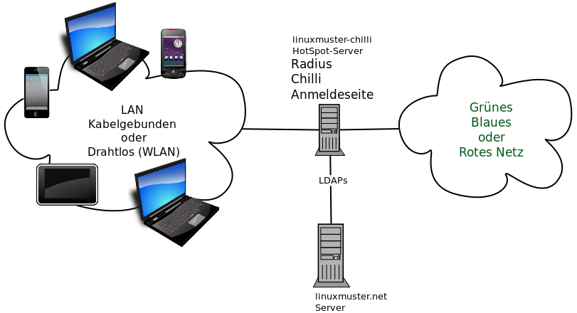

(v6.2) linuxmuster-chilli: Ein Captive Portal für linuxmuster.net
=================================================================

*linuxmuster-chilli* ist ein vorbereitetes Paket, das zur Installation
auf einem **Ubuntu Server 12.04 32bit** gedacht ist und aus diesem ein
sogenanntes "Captive Portal" (bei WLAN manchmal auch Hot-Spot genannt)
macht, welches eine Anmeldung von mitgebrachten Geräten wie Laptops,
Smartphones, Tablets u.ä. gegen den LDAP Server der linuxmuster.net
Umgebung ermöglicht.

Die Zugriffssteuerung liegt in den Händen des Netzwerkberaters und der
Lehrer. Die Entscheidung, ob ein Benutzer das Netzwerk nutzen kann oder
nicht, wird dabei über die Zugehörigkeit in LDAP Gruppen gesteuert. So
können Zugänge fein gesteuert über Projektgruppen in der Schulkonsole
vergeben werden.

.. toctree::
   :maxdepth: 1
   :caption: Installation und Einrichtung von linuxmuster-chilli

   chillispot-preparation
   chillispot-installation
   chillispot-configuration

Weitere Ergänzungen finden Sie im Anwenderwiki ->
`Coovachilli <https://linuxmuster.net/wiki/anwenderwiki:wlan:coovachilli>`__.

