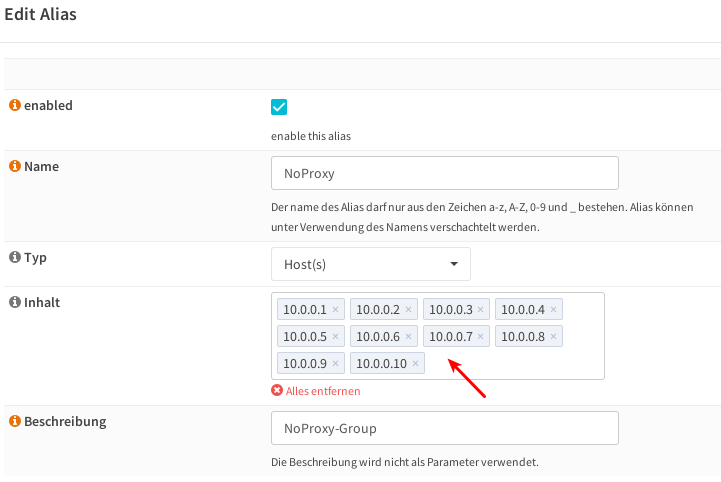

============================
 Zugriffsrechte im Netzwerk
============================

.. sectionauthor:: `@Thomas <https://ask.linuxmuster.net/u/Thomas>`_,
		   `@Tobias <https://ask.linuxmuster.net/u/Tobias>`_,
		   `@michael_kohls <https://ask.linuxmuster.net/u/michael_kohls>`_

Zugriff über einen Proxy
========================

Standardmäßig sollen die Benutzer der Schulgeräte nur dann Zugriff auf
das Internet bekommen, wenn sie sich ausweisen können
("authentication"). Dies geschieht über einen Webproxy, der in der
Firewall läuft und der wiederum auf den Schulgeräten als Proxy
eingetragen sein muss.

.. hint::

	Der Proxy muss als FQDN angegeben werden! Z.B. ``firewall.linuxmuster.lan``, Port: ``3128``

Single-Sign-On am Proxy
=======================

Eine Einmalanmeldung ("Single-Sign-On" oder kurz SSO) ist eine moderne
Methode die Eingabe eines Passwortes auf ein einziges Mal zu
reduzieren. Bei Schulgeräten ist das meist der Anmeldevorgang am
Gerät. Danach meldet der Client dem Webproxy, wer hier angemeldet ist
und kann so den Internetzugriff erfragen.

linuxmuster.net verwendet hier standardmäßig das
Kerberos-Ticketsystem. Dieses SSO-Verfahren ist auf der Firewall
OPNsense® aktiviert und muss auf den Arbeitsplatzrechnern eingerichtet
werden.

Zugriff ohne Proxy
==================

In manchen Fällen will man Geräten zeitweilig oder permanent den
Zugriff auf das Internet geben.

Es gibt eine nicht aktivierte Regel "Allow entire LAN" die bei
Aktivierung aus dem LAN für alle Geräte uneingeschränkten Zugriff
erlaubt.

Darüberhinaus ist unter ``Firewall | Aliase`` ein "NoProxy"-Alias
angelegt, der die ersten zehn IP-Adressen des LAN-Netzwerks und
diejenigen der Server enthält. Für die Adressen dieses Aliases ist
eine aktive Regel "Allow NoProxy-Group" angelegt, die unbeschränkten
Zugriff auf das Internet erlaubt. Eine IP-Adresse aus diesem Pool kann
z.B. für einen Admin-PC oder für einen Masterclient verwendet werden.

Entfernen nicht benötigter IP
=============================

Während der Installation wurde das "NoProxy"-Alias automatisch mit den IP-Adressen ``10.0.0.1 - 10.0.0.10`` bzw. bei ``do-it-like-babo`` mit den IP-Adressen ``10.16.1.1 - 10.16.1.3`` und ``10.16.0.1 - 10.16.0.10`` angelegt. Normalerweise werden nicht alle für den Server, die Dockerhosts und evtl. Admin-PC benötigt.

Als letzter Schritt vor dem Installationsende empfiehlt es sich, alle nicht dauerhaft benötigten IP-Adressen aus dem "NoProxy"-Alias zu entfernen. Hintergrund: Der Internetzugriff wird grundsätzlich über den Proxy geregelt. Gibt es unbenutzte IP-Adressen im "NoProxy"-Alias könnten diese unbefugt verwendet werden, um permanenten und ungefilterten Internetzugang zu erlangen.
