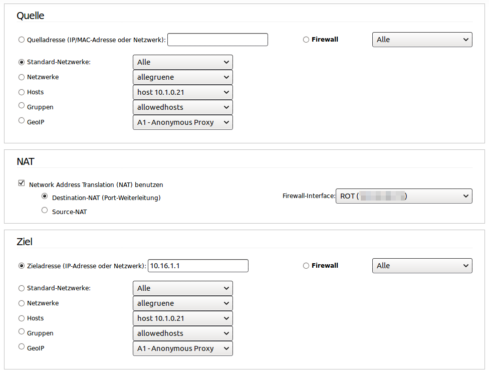
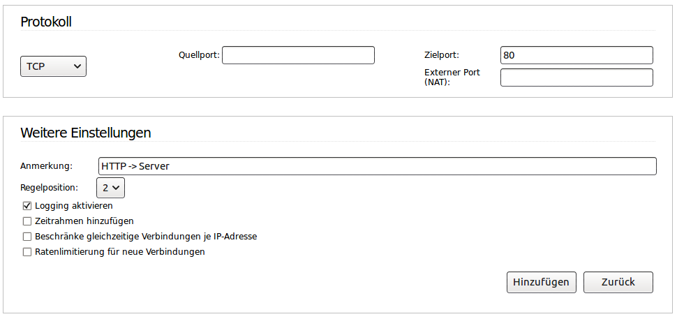
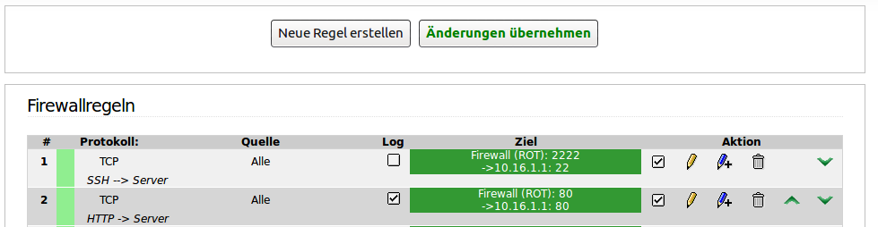

.. Installationsleitfaden documentation master file, created by
   sphinx-quickstart on Sat Nov  7 15:29:20 2015.
   You can adapt this file completely to your liking, but it should at least
   contain the root `toctree` directive.

============================================
 letsencrypt für linuxmuster.net einrichten
============================================

.. sectionauthor:: `@ironiemix <https://ask.linuxmuster.net/u/ironiemix>`_

Das Paket *linuxmuster-dehydrated* stellt eine Möglichkeit dar, einen
linuxmuster.net Server auf einfache Weise mit einem LetsEncrypt
SSL-Zertifikat zu versorgen. Es ist ab linxumuster 6.1 (babo) aus den
Repositorien installierbar.

Das vorliegende Dokument erläutert die Einrichtung von
*linuxmuster-dehydrated* auf dem linuxmuster.net Server. Das Paket
kann natürlich auch auf einem anderen Server, z.B. auf einem Server
der als Reverse Proxy oder Firewall für andere Dienste funktioniert,
installiert werden.

*linuxmuster-dehydrated* basiert auf dem Projekt `dehydrated von Lukas
Schauer <https://github.com/lukas2511/dehydrated>`_

Vorbereitung auf dem IPFire
===========================

Voraussetzung für die Verwendung von linuxmuster-dehydrated ist, dass
der linuxmuster-Server aus dem Internet unter dem Servernamen (FQDN),
für den das Zertifikat erstellt werden soll, auf Port 80 erreichbar
ist.

Melden Sie sich am IPFire an, kopieren Sie die Zeile, die `SSH ->
Server` (meist Zeile 1) und passen Sie das Protokoll auf 80 an:

Schließen Sie die Änderung ab, in dem Sie auf `Änderungen übernehmen`
klicken.
	   

Installation auf dem Server
===========================

Das Paket installiert ein Shellskript in ``/usr/sbin``, erweitert die
Apache-Konfiguration um die notwendige Einstellung, damit die
ACME-Challenges abgeschlossen werden können, richtet einen täglichen
Cronjob ein, der die Gültigkeit des Zertifikats prüft und
gegebenenfalls das Zertifikat automatisch erneuert, bevor es abläuft,
kopiert das Zertifikat (mit Backup) an die richtige Stelle auf dem
Server und startet die Services für www, ldap und imap/pop neu.

Paketinstallation
-----------------

Installieren Sie das Paket mit den Befehlen 

.. code-block:: console
    
   # apt-get update
   # apt-get install linuxmuster-dehydrated

Konfiguration anpassen
----------------------

Editieren Sie im Verzeichnis ``/etc/linuxmuster-dehydrated`` die
Dateien ``config`` sowie ``domains.txt``

In der Datei ``config`` tragen Sie eine gültige Mailadresse ein und
entfernen das Kommentarzeichen

.. code:: bash

   # E-mail to use during the registration (default: <unset>)
   CONTACT_EMAIL=webmaster@ihre-domain.de

In der Datei ``domains.txt`` tragen Sie den Hostnamen ein, unter dem
der linuxmuster.net Server vom Internet aus auf Port 80 erreichbar
ist:

.. code:: bash

   # Hier muss der Servername eingetragen werden,
   # unter dem  der linuxmuster.net Server aus
   # dem Internet unter Port 80 erreichbar ist.
    
   server.ihre-domain.de

Bei Letsencrypt anmelden
------------------------

Führen Sie den Befehl 

.. code-block:: console
    
   # linuxmuster-dehydrated --register --accept-terms

aus. Damit werden die Nutzungsbedingungen von LetsEncrypt akzeptiert
und ein Account erstellt, der für den Bezug der Zertifikate verwendet
wird.

Die Ausgabe auf der Konsole sieht in etwa so aus:

.. code-block:: console

   17:38/0 august /etc/linuxmuster-dehydrated # linuxmuster-dehydrated --register --accept-terms
   # INFO: Using main config file /etc/linuxmuster-dehydrated/config
   + Generating account key...
   + Registering account key with ACME server..... 

Anschließend sollte es außerdem ein Verzeichnis
``/etc/linuxmuster-dehydrated/accounts`` geben:

.. code-block:: console

   # ls /etc/linuxmuster-dehydrated/accounts
   aHR0xxxxxxxxxxxxxYwMS5hcGkubGV0c2VuY3J5cHQub3JnL2YYYYYYYYYYYYY

Zertifikat anfordern
--------------------

Führen Sie den Befehl 

.. code-block:: console

   # linuxmuster-dehydrated --cron

aus. Die erfolgreiche Ausgabe auf der Konsole sollte etwa so aussehen:

.. code-block:: console

   # linuxmuster-dehydrated --cron
   # INFO: Using main config file /etc/linuxmuster-dehydrated/config
   Processing server.ihre-domain.de
    + Signing domains...
    + Generating private key...
    + Generating signing request...
    + Requesting challenge for server.ihre-domain.de...
    + Hook: Nothing to do...
    + Responding to challenge for server.ihre-domain.de...
    + Hook: Nothing to do...
    + Challenge is valid!
    + Requesting certificate...
    + Checking certificate...
    + Done!
    + Creating fullchain.pem...
    + Hook: Restarting Apache...
    * Reloading web server config apache2 [OK]                                                                              
    + Done!
    + Hook: Nothing to do...

Das Zertifikat befindet sich jetzt im Verzeichnis
``/etc/linuxmuster-dehydrated/certs/<servername>/``:

.. code-block:: console

   # ls /etc/linuxmuster-dehydrated/certs/server.ihre-domain.de/
   cert-1486226502.csr  cert-1486226528.csr  cert.csr  chain-1486226528.pem  fullchain-1486226528.pem  privkey-1486226502.pem  privkey.pem
   cert-1486226502.pem  cert-1486226528.pem  cert.pem  chain.pem             fullchain.pem             privkey-1486226528.pem

Darüberhinaus wurde das Zertifikat inklusive der Zertifikatskette an
die wichtige Stelle ``/etc/ssl/private/server.pem`` kopiert. Der
Webdienst, der LDAP-Dienst und der IMAP- und Pop3-Dienst wurden neu
gestartet und verwenden ab sofort das neue Zertifikat.

..
  Einstellungen in der apache-Konfiguration
  ~~~~~~~~~~~~~~~~~~~~~~~~~~~~~~~~~~~~~~~~~
  
  Im Abschnitt der Apache-Konfiguration, in dem der SSL VHost konfiguriert ist, muss nun die folgende Zertifikatskette eingetragen werden. 
  Bei linuxmuster.net befindet sich diese Konfiguration für gewöhnlich in der Datei ``/etc/apache2/sites-enabled/000-default``.
  
  .. code:: bash
  
      SSLEngine On
  
      # <servername> anpassen!
      SSLCertificateFile     /etc/linuxmuster-dehydrated/certs/<servername>/cert.pem
      SSLCertificateKeyFile  /etc/linuxmuster-dehydrated/certs/<servername>/privkey.pem
      SSLCertificateChainFile    /etc/linuxmuster-dehydrated/certs/<servername>/chain.pem
      SSLCACertificateFile    /etc/linuxmuster-dehydrated/certs/<servername>/fullchain.pem
  
      # Diese Einstellungen sind optional, aber empfehlenswert
      SSLProtocol             all -SSLv2 -SSLv3
      SSLHonorCipherOrder     on
      SSLCipherSuite          ECDHE-RSA-AES128-GCM-SHA256:ECDHE-ECDSA-AES128-GCM-SHA256:ECDHE-RSA-AES256-GCM-SHA384:ECDHE-ECDSA-AES256-GCM-SHA384:DHE-RSA-AES128-GCM-SHA256:DHE-DSS-AES128-GCM-SHA256:kEDH+AESGCM:ECDHE-RSA-AES128-SHA256:ECDHE-ECDSA-AES128-SHA256:ECDHE-RSA-AES128-SHA:ECDHE-ECDSA-AES128-SHA:ECDHE-RSA-AES256-SHA384:ECDHE-ECDSA-AES256-SHA384:ECDHE-RSA-AES256-SHA:ECDHE-ECDSA-AES256-SHA:DHE-RSA-AES128-SHA256:DHE-RSA-AES128-SHA:DHE-DSS-AES128-SHA256:DHE-RSA-AES256-SHA256:DHE-DSS-AES256-SHA:DHE-RSA-AES256-SHA:AES128-GCM-SHA256:AES256-GCM-SHA384:AES128-SHA256:AES256-SHA256:AES128-SHA:AES256-SHA:AES:CAMELLIA:DES-CBC3-SHA:!aNULL:!eNULL:!EXPORT:!DES:!RC4:!MD5:!PSK:!aECDH:!EDH-DSS-DES-CBC3-SHA:!EDH-RSA-DES-CBC3-SHA:!KRB5-DES-CBC3-SHA
  
  
  Anschließend kann man den apache-Webserver neu starten ``/etc/init.d/apache2 restart``. Nun sollte das LetsEncrypt Zertifikat funktional seinen Dienst verrichten.

Technische Informationen
========================

LetsEncrypt verwendet das Verfahren "Automatic Certificate Management
Environment (ACME)" um zu überprüfen, ob derjenige, der ein Zertifikat
für eine Domain/einen Host anfordert diesen auch tatsächlich kontrolliert.

"dehydrated" ist eine Implementation dieses Verfahrens in einem bash-Skript, derzeit kann ACME mit
dehydrated ausschließlich mit http auf Port 80 abgewickelt werden (siehe
auch https://github.com/lukas2511/dehydrated/issues/271).

Aus diesem Grund muss der Server zwingend aus dem Internet auf Port 80
erreichbar sein. Auch alle vorgelagerten Instanzen, z.B. Belwue,
müssen den Zugriff auf Port 80 gestatten.

Das bedeutet jedoch nicht, dass der linuxmuster.net Server seine weiteren Dienste 
über http anbieten muss. Eine Möglichkeit, alle Dienste des Servers ausschließlich 
per https anzubieten ist, eine permanente Weiterleitung in der für Port 80 zuständigen 
Sektion der site-Konfiguration einzurichten:

.. code:: bash

    <VirtualHost *:80>
        ServerAdmin webmaster@localhost

        DocumentRoot /var/www/

        # IMMER Umleitung auf SSL
        Redirect permanent / https://name.ihre-domain.de/

        ErrorLog /var/log/apache2/error.log
        CustomLog /var/log/apache2/access.log combined
        ServerSignature On
        # Possible values include: debug, info, notice, warn, error, crit,
        # alert, emerg.
        LogLevel warn
    </VirtualHost>

	  
