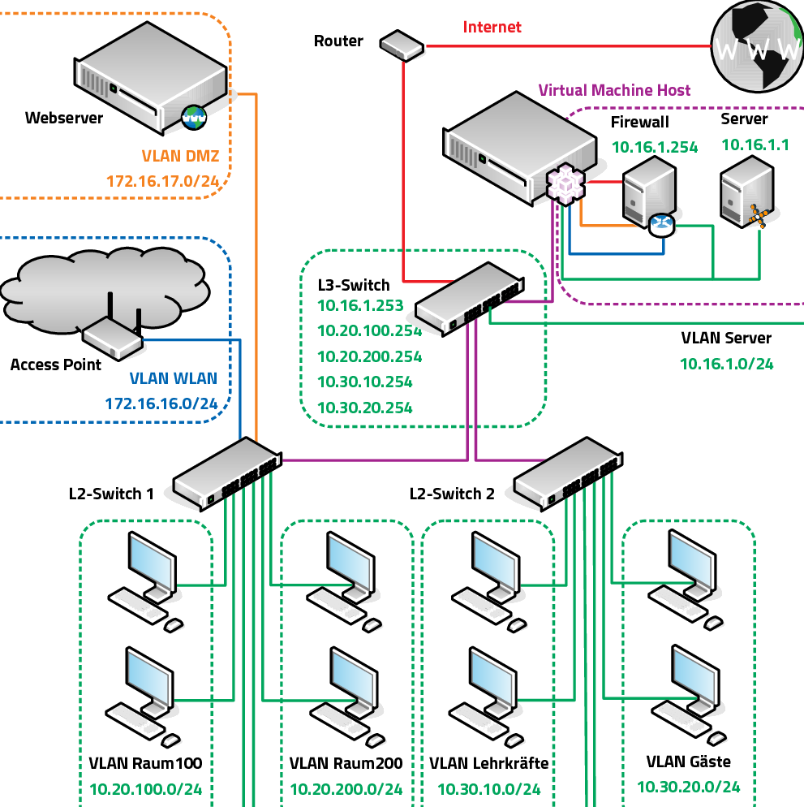
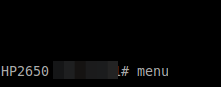
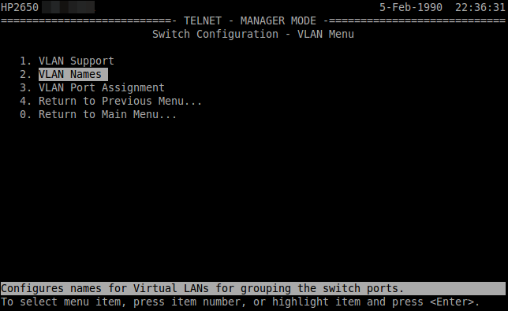

.. _subnetting-basics-label:

=====================
Netzwerksegmentierung
=====================

.. sectionauthor:: `@cweikl <https://ask.linuxmuster.net/u/cweikl>`_, 
                   `@MachtDochNix (pics) <https://ask.linuxmuster.net/u/MachtDochNix>`_

Vorbemerkungen
==============

Aus datenschutzrechtichen Überlegungen ist ein schulisches Netzwerk in drei Bereiche mit unterschiedlichen Absicherungen und Berechtigungsstufen zur Verarbeitung und Speicherung von personenbezogenen Daten zu unterteilen: 

* Verwaltungsnetz (Veraltungsprogramme, dienstliche Beurteilungen etc.)
* Lehrernetz (Stundenplan, Kompetenzen, Noten, etc.)
* pädagogisches Netz (keine Verarbeitung personenbezogener Daten)

Wesentliches Ziel bei der Gestaltung der schulischen Netzinfrastruktur ist es, diese unterschiedlichen personenbezogenen Daten besonders zu schützen. Dabei ist sicherzustellen, dass nur diejenigen Personen auf solche personenbezogene Daten zugreifen können, die zur Erfüllung ihrer dienstlichen Aufgaben unbedingt erforderlich sind.

Es muss sichergestellt werden, dass ein **Zugriff auf das Lehrernetz und Verwaltungsnetz vom pädagogischen Netz aus wirksam verhindert** wird. Der Einsatz von VLANs und die Nutzung virtueller Maschinen wird hierzu explizit zugelassen. 

Im **pädagogischen Schulnetz dürfen grundsätzlich keine personenbezogenen Daten von Schülern** verarbeitet und gespeichert werden, außer Name und Klassenzugehörigkeit des Schülers sowie die hierzu erforderlichen technischen Daten, die direkt für die Unterrichtsgestaltung erforderlich sind. Insbesondere dürfen grundsätzlich keinerlei personenbezogene Daten zu Verhalten oder Leistung (Bewertungen, Beurteilungen) eines Schülers verarbeitet werden. Insgesamt dürfen in diesem Netz nur die zur Aufgabenerfüllung unbedingt erforderlichen Daten verarbeitet werden. 

In dieser Dokumentation geht es im Folgenden **ausschließlich um den Betrieb des pädagogischen Netzes**.

Es wird empfohlen, das pädagogische Netz wiederum in mindestens drei Bereiche / Subnetze zu unterteilen: 

* Lehrernetz
* Schülernetz
* Servernetz

Sollte z.B. WLAN zum Einsatz kommen oder sollen weitere Anforderungen erfüllt werden, so werden weitere Subnetze empfohlen.

Diese Dokumentation greift den Fall einer **Unterteilung des pädagogischen Netzes in sieben Subnetze** auf. Eine Erweiterung/Anpassung um weitere Subnetzbereiche, ist später analog zu dem in dieser Dokumentation beschriebenen Vorgehen möglich. Die Umsetzung der Segmentierung 
erfordert managebare L2- und L3-Switche, die VLANs verwalten können. Hierzu können Switche beliebiger Hersteller genutzt werden.

Die Konfigurationsschritte für den L3-Switch werden anhand eines Cisco SG300-300-28 und einem Cisco Catalyst (3750) L3-Switch dargstellt. Für die Konfiguration der L2-Switche werden die Schritte anhand eines HP2650 sowie eines Cisco Catalyst 2960 verdeutlicht. Bei dem Einsatz anderer
Switche sind die dargestellten Konfigurationsschritte entsprechend anzupassen.

Geplante Netzwerkstruktur
=========================

Bei dem Standard-Setup des linuxmuster.net Servers (v7) wird das Netz ``10.0.0.0/16`` zur Einrichtung vorgesehen. Eine Unterteilung kann bereits in der Form erfolgen, dass im 2. Oktett weitere Netzsegemente genutzt werden. 

Beispiel:

* Servernetz, Netzwerkadressen 10.0.0.0/16
* Lehrernetz, Netzwerkadressen 10.1.0.0/16
* Schülernetz, Netzwerkadressen 10.2.0.0/16

Es wäre so eine Einteilung der Rechner eines Raumes im dritten Oktett problemlos möglich, z.B. alle Rechner in Raum 107 sind im Schülernetz und haben Adressen aus dem Bereich 10.2.107.x, alle Rechner des Lehrerzimmers sind im Lehrernetz und haben Adressen aus dem Bereich 10.1.120.x. Die Unterscheidung der Räume bleibt also im 3. Oktett, die Unterscheidung der Subnetze findet im 2. Oktett statt.

Sollen weitere Segmente gebildet werden, die z.B. jeden Raum als eigenes Segment (VLAN) abbilden, so bietet es sich an, kleinere Segmente zu bilden.

Nachstehend soll daher das **Vorgehen zur Vorbereitung einer Segmentierung mit kleineren IP-Netzen** dokumentiert werden. Es sollen nachstehende ``sieben Segmente`` gebildet werden: 

+--------------+----------------------------------------------+-----------------------------+
| VLAN Name    | Verwendung                                   |  Netzwerkadressen           |
+==============+==============================================+=============================+
| ``Internet`` | alle Server an der WAN - Schnittstelle       | IP-Netz der Firewall WAN    |
+--------------+----------------------------------------------+-----------------------------+
| ``Server``   | alle Server/-VMs im LAN                      | 10.0.0.0/24                 |
+--------------+----------------------------------------------+-----------------------------+
| ``WLAN-LuL`` | ein WLAN-Netz für Lehrerinnen und Lehrer     | 10.3.0.0/24                 |
+--------------+----------------------------------------------+-----------------------------+
| ``WLAN-SuS`` | ein WLAN-Netz für Schülerinnen und Schüler   | 10.4.0.0/24                 |
+--------------+----------------------------------------------+-----------------------------+
| ``Lehrer``   | Zugriff mit Lehrer PCs, Laptops              | 10.1.0.0/24                 | 
+--------------+----------------------------------------------+-----------------------------+
| ``Raum100``  | Zugriff mit Schulungsgeräten im Raum 100     | 10.2.100.0/24               |
+--------------+----------------------------------------------+-----------------------------+
| ``Raum200``  | Zugriff mit Schulungsgeräten im Raum 200     | 10.2.200.0/24               |
+--------------+----------------------------------------------+-----------------------------+

Für die Unterteilung sind auf **allen** Switches entsprechende VLANs in gleicher Weise einzurichten. Die Verbindungen zwischen den Switches werden als Trunks (bzw. Tagged-Ports) definiert, die über Gerätegrenzen hinweg die Daten den VLANs zuordnen. Die Ports auf den Switches sind jeweils den gewünschten VLANs zuzuordnen (port-basierte VLANs), so dass die an den Ports angeschlossenen Geräte ihre Daten in das zugeordnete VLAN schicken.

Der L3-Switch erhält in jedem VLAN die letzte nutzbare IP-Adresse -
also z.B. für das ``VLAN Lehrer`` die IP `10.1.0.254`, außer dort,
wo die Firewall im jeweiligen Subnetz bereits diese IP-Adresse nutzt.

VLAN IDs und Gateway-IPs
------------------------

In dieser Dokumentation werden folgende VLAN-IDs und Gateway-IPs verwendet: 

+-------------------+---------+------------------------------------------------------------+
| VLAN Name         | VLAN ID | Gateway-IP  (+ Firewall-IP )                               |
+===================+=========+============================================================+
| ``VLAN Internet`` |     5   | IP aus dem Netz der Firewall an der Schnittstelle WAN [1]_ |
+-------------------+---------+------------------------------------------------------------+
| ``VLAN Server``   |    10   |  10.0.0.253 (Firewall: 10.0.0.254)                         |
+-------------------+---------+------------------------------------------------------------+
| ``VLAN WLAN LuL`` | 	 20   |  10.3.0.253 (Firewall: 10.3.0.254)                         |
+-------------------+---------+------------------------------------------------------------+
| ``VLAN WLAn SuS`` |    30   |  10.4.0.253 (Firewall: 10.4.0.254)                         |
+-------------------+---------+------------------------------------------------------------+
| ``VLAN Lehrer``   |    40   |  10.1.0.254                                                |
+-------------------+---------+------------------------------------------------------------+
| ``VLAN Raum100``  |   100   |  10.2.100.254                                              |
+-------------------+---------+------------------------------------------------------------+
| ``VLAN Raum200``  |   200   |  10.2.200.254                                              |
+-------------------+---------+------------------------------------------------------------+

.. [1] z.B. GW-IP: 192.168.10.14/28 + FW-IP: 192.168.10.2/28 und IP des DSL-Routers: 192.168.10.1/28

Damit DHCP-Anfragen der Clients aus dem internen Netz an den Server 10.0.0.1 weitergeleitet werden, muss auf dem L3-Switch ein DHCP-Relay-Agent konfiguriert werden. Entsprechende Hinweise finden sich dann bei der Konfiguration des L3-Switches. 

.. image:: media/02_vlan_infrastructure_presets.png
   :alt: Struktur: Segmentiertes Netz
   :align: center

.. hint::
 
   Grafik ist der neuen Netzstruktur noch anzupassen.

In der Abbildung wird die Verbindung zwischen beiden Switches sowie zwischen dem L3-Switch und dem VM-Server lila als Trunk (Cisco) bzw. Tagged-Port (HP) gekennzeichnet. Dies bedeutet, dass der Uplink zwischen den Switches so zu konfigurieren ist, dass die VLAN-Tags weitergereicht werden. An dem L2-Switch werden die Ports dann jeweils den erforderlichen VLANs zugeordnet (port-basierte VLANs). 

Für einen VM-Server bedeutet dies, dass der Datenverkehr aller VLANs hierin weitergeleitet wird und dann die Daten gemäß ihrem VLAN-Tag der jeweiligen VM zugeordnet werden.

.. hint::
 
   Grafik ist der neuen Netzstruktur noch anzupassen.

Verfügt der VM-Server über mehrere Netzwerkschnittstellen wie in der Abbildung dargestellt, so sollten diese gebündelt werden (je nach Hersteller werden hierfür die Begriffe NIC Bonding, LinkAggregation, Etherchannel) verwendet, um den Datendurchsatz zu verbessern. Dies kann ebenfalls für die Verbindung zwischen den Switches (Uplinks) genutzt werden. In dieser Dokumentation soll die LinkAggregation am Beispiel des L3-Switches verdeutlicht werden. Es werden für 8 Ethernetschnittstellen vier Link-Aggregation Ports bestehend aus jeweils zwei Ethernetschnittstellen gebildet, die dann entsprechend konfiguriert werden.

Vorbereitungen
==============

Netzanpassung VMs
-----------------

Auf den virtuellen Maschinen (Server, Docker-Host, OPSI und ggf. XOA) sind zunächst die Adressen für das Servernetz mithilfe des Befehls ``linuxmuster-prepare`` auf die gewünschte Struktur anzupassen. 

.. hint::

   siehe zur ausführlichen Darstellung von linuxmuster-prepare :ref:`modify-net-label`

Als Bsp. zur Nutzung des Konsolenbefehls pro virtueller Maschine wird nachstehend die Anpassung des Servers erklärt:

.. code::
  
   lmn7-appliance -p server -n 10.0.0.1/24 -d meineschule.de -f 10.0.0.254

Richtet das Server-Profil wie folgt ein:
 - Hostname server,
 - IP/Bitmask 10.0.0.1/24,
 - Domänenname meineschule.de,
 - Gateway/DNS 10.0.0.254

Wurde dies für alle verwendeten VMs durchgeführt, ist zu prüfen, ob die VMs im Servernetz sich untereinander erreichen können.

Vom Server aus ist die Erreichbarkeit der Firewall, des Docker-Hosts, der OPSI VM und ggf. der XOA-VM zu prüfen.

.. code::

   ping 10.0.0.254
   ping 10.0.0.2
   ping 10.0.0.3
   ping 10.0.0.4

Sofern erfolgreich Antwortpakete zu sehen sind, kann mit dem nächsten Schritt die Einrichtung fortgesetzt werden.

Weitere Subnetze definieren
---------------------------

Weitere Subnetze ergänzt man nach dem Setup in der Datei ``/etc/linuxmuster/subnets.csv``.

Für o.g. Netzstruktur müsste die Datei folgende Eintragungen aufweisen:

.. code::

   # Network/Prefix;Router-IP (last available IP);1. Range-IP;Last-Range-IP;SETUP-Flag
   # Servernetz;VLAN-GW nicht FW IP
   10.0.0.0/24;10.0.0.253;;;SETUP
   # add your subnets below
   # Lehrernetz
   10.1.0.0/24;10.1.0.254;10.1.0.1;10.1.0.253;SETUP
   # Schuelernetz Raum 101
   10.2.101.0/24;10.2.101.254;10.2.101.1;10.2.102.253;SETUP
   # Schuelernetz Raum 202
   10.2.202.0/24;10.2.202.254;10.2.202.1;10.2.202.253;SETUP
   # WLAN-Lehrer
   10.3.0.0/24;10.3.0.254;10.3.0.1;10.3.0.253;SETUP
   # WLAN-Schueler
   10.4.0.0/24;10.4.0.254;10.4.0.1;10.4.0.253;SETUP

**Hinweise**:

* Im zweiten Feld der Zeile steht die IP-Adresse des Subnetz-Gateways, die auf dem Layer-3-Switch für das entsprechende VLAN-Interface konfiguriert werden muss (s.u.).

* Optional können im dritten und vierten Feld Anfangs- und Endadressen für eine freie DHCP-Range angegeben werden.

* Wichtig ist darüberhinaus, dass auf dem Switch für das Servernetz ebenfalls ein VLAN-Interface mit einer IP-Adresse aus dem Subnetz (z.B. 10.0.0.253) als Gateway eingerichtet werden muss.

* Diese IP muss anstatt der Firewall-IP als Router-IP in die Servernetz-Zeile in subnets.csv eingetragen werden.

Subnetze importieren
--------------------

Die geänderte Subnetz-Konfiguration wird mit dem Befehl ``linuxmuster-import-subnets`` übernommen.
Dabei werden die Subnetze in die DHCP-Server-Konfiguration eingetragen. Außerdem richtet das Skript statische Routen 
in die Subnetze über die definierten Gateway-Adressen auf Server-, Firewall-, Opsi- und Docker-VMs ein. 

**Firewall-Beispiel**

.. image:: media/04_fw_static_routes.png
   :alt: Firewall: Routes for subnets
   :align: center

Auf der Firewall werden zusätzlich ausgehende NAT-Regeln für jedes Subnetz angelegt:

.. image:: media/05_fw_nat_rules.png
   :alt: Firewall: NAT rules
   :align: center

und das LAN-Gateway angepasst. 

.. image:: media/06_fw_lan_gateway.png
   :alt: Firewall: LAN Gateway
   :align: center

Konfiguration des L3-Switches
=============================

Konfigurationsschritte auf dem Layer-3-Switch:

   * VLANs für jedes Subnetz definieren
   * VLANs Ports zuordnen
   * DHCP-Relaying einrichten (damit DHCP-Broadcasts in alle Subnetze geroutet werden)
   * UDP-Relaying einrichten (damit WOL über Subnetzgrenzen hinweg funktionier)
   * Access Listen definieren (Zugriffe in Subnetze werden unterbunden mit Ausnahme des Servernetzes, das aus allen Subnetzen heraus erreicht werden muss)

Einspielen der vordefinierten Konfiguration
-------------------------------------------

.. hint::

  Die Firmware des Cisco L3 Switch SG300-28 ist vorab auf die aktuellste Version (hier: 1.4.8.6) zu aktualisieren.
  Für die Aktualisierung ist wesentlich, welche aktuelle FW-Version und welche Boot Version genutzt werden. Bei älteren Versionen
  ist eine Aktualisierung nur über Zwischenschritte möglich. So muss z.B. von FW 1.1.2.0 via 1.3.7.18 via 1.4.75 via 1.4.11.2 aktualisiert 
  werden. Um die die Boot Version zu aktualisieren, ist via TFTP schrittweise die jeweilige rfb-Datei des FW-Images hochzuladen und danach ist 
  das Gerät jeweils erneut zu starten. Hier der Lnk zur aktuellen Firmware - FW_
  
  .. _FW: https://software.cisco.com/download/home/283019617/type/282463181/release/1.4.11.02

Die Version der Firmware sowie die Boot Version lassen sich unter ``Status und Statistics`` im Untermenü ``System Summary`` anzeigen. Wie in nachstehender Abbildung:

.. image:: media/sg300/001_system_summary_sg300-28.png
   :alt: 
   :align: center

Für den L3-Switch Cisco SG300-28 steht die vorbereitete Konfigurationsdatei zur Verfügung, die die Konfiguration auf dem L3-Switch so einspielt, wie diese in dieser Dokumentation beschrieben wird. 

**Download**

* :download:`Konfiguration für v7 mit Server-IP 10.0.0.1/24 <./media/configs/linuxmuster-ip-segmentation-sg300-28-l3.txt>`.

Upload der Konfiguration: Schritt für Schritt
---------------------------------------------

.. hint::

   Im Auslieferungszustand kann auf den Cisco Switch mit der IP 192.168.1.254/24 zugegriffen werden. Diese IP wird in 
   dieser Konfiguration dem VLAN 1 (Management) zugewiesen, so dass nach Einspielen der Konfiguration und dem Reboot 
   weiterhin mit dieser Adresse die Konfiguration angepasst werden kann.

.. image:: media/sg300/002_sg300_login.png
   :alt: 
   :align: center

Melden Sie sich als Benutzer ``cisco`` mit dem Kennwort ``cisco`` (Voreinstellungen) an.

.. image:: media/sg300/003_sg300_change_pw.png
   :alt: 
   :align: center

Danach erfolgt der Wechsel in das Menü ``Administration --> User Accounts``. 
Dort ist der betreffende Benutzer auszuwählen mit dem Menüpunkt ``Edit`` ist das Kennwort des Benutzers neu zu setzen. Die neueren Firmware-Versionen gebe neine Kennwort-Komplexität vor.

.. image:: media/sg300/004_sg300_system_settings_l3.png
   :alt: 
   :align: center

Im Menü ``Administration --> System Settings`` ist der Name für den Switch zu vergeben und 
der System-Modus ist auf L3 zu ändern. Die Änderungen sind dann mit ``Apply`` zu übernehmen.

.. image:: media/sg300/005_sg300_copy_config.png
   :alt: 
   :align: center

Dies erfolgt im Menü ``Administration --> File Management --> Download/BackupConfig``. 
Die hochzuladende Datei ist als sog. ``Startup configuration file`` hochzuladen. Mit ``Durchsuchen`` ist die heruntergeladende Konfigurationsdatei anzugeben.

Ist der Upload erfolgreich verlaufen, so muss der Switch neu gestartet werden, um die Konfiguration anzuwenden.

.. image:: media/sg300/006_sg300_reboot.png
   :alt: 
   :align: center

Der Neustart ist über das Menü ``Administration --> File Management --> Reboot`` durchzuführen.

Nach dem Neustart melden Sie sich erneut an dem L3-Switch an und kontrollieren nochmals die Switch-Ports. Hierbei ist zwischen Access-Ports (port-basierte VLANs) und Trunk-Ports zu unterscheiden.

.. hint::

   In der bereitgestellten Konfigurationsdatei ist der Login cisco mit dem Kennwort cisco für die weitere Konfiguration vorhanden - dies gilt ebenfalls für die IP 192.168.1.254/24 des Switches. Bei Verbindung via Port GE24 kann so eine Verbindung zur weiteren Anpassung der Konfiguration hergestellt werden.

Allgemeine Hinweise zur Konfiguration der Switch-Ports
------------------------------------------------------

Für jeden Switchport muss festgelegt werden, ob das VLAN mit der VLAN-ID x ausgeschlossen, getaggt akzeptiert oder Datenpakete, die mit der VLAN-ID x getaggt sind, ungetaggt weitergeleitet werden.

* ``Ausgeschlossen``:	Datenpakete, die mit der VLAN-ID x getaggt sind, werden verworfen.
* ``Getaggt``:		Datenpakete, die mit der VLAN-ID x getaggt sind, werden weitergeleitet.
* ``Ungetaggt``:	Von Datenpaketen, die mit der VLAN-ID x getaggt sind, wird die VLAN-ID entfernt und zum Client weitergeleitet. Die meisten Clients können mit getaggten Datenpaketen nichts anfangen.
* ``PVID``:		Bei einem Port, der mit der PVID x markiert ist, werden alle ungetaggten Datenpakete des Clients mit der VLAN-ID x getaggt.

Anwendung auf das Ausgangsbeispiel
----------------------------------

Nachstehende Ausführungen, dienen dazu, die eingespielte Konfiguration zu prüfen oder ggf. Anpassungen für abweichend eingesetzte Hadrware zu erstellen.

.. important::

   Abb. fehlt, die die Nutzung der Ports zu den Uplinks darstellt

Definition der Link Aggregation Ports
-------------------------------------

* ``LAG1``: Ports 1,2,13,14 -> Verbindung zu VMs / Servern
* ``LAG2``: Ports 3,4,15,16 -> Verbindung zu VMs / Servern
* ``LAG3``: Ports 25-28     -> Uplink/Trunk zu L2-Switches

.. image:: media/sg300/007_sg300_link_aggregation_mgmt.png
   :alt: 
   :align: center

.. image:: media/sg300/008_sg300_link_aggregation_settings.png
   :alt: 
   :align: center

Definition der Access Ports (port-based VLAN)
---------------------------------------------

* ``Port 7``: Port wird dem VLAN 5 (Internet VLAN) zugeordnet (untagged / PVID 5).
* ``Port 19``: Port wird dem VLAN 5 (Internet VLAN) zugeordnet (untagged / PVID 5).

Werden auf dem Switch weitere Ports z.B. für Testzwecke im Server VLAN benötigt, so sind diese unter ``VLAN Management --> Interface Settings`` als Access-Ports und unter ``Port-to-VLAn`` dem korrekten VLAN zuzordnen. Nachstehende Abbildungen stellen die Zuordnung zu VLAN 1 dar. 

.. image:: media/sg300/009_sg300_access_ports_part1.png
   :alt: 
   :align: center

.. image:: media/sg300/010_sg300_access_ports_part2.png
   :alt: 
   :align: center

Definition / Zuordnung der VLANs
--------------------------------

* ``LAG1 (Port 1,2,13,14)``: Der Hypervisor ist über vier Netzwerkkabel mit Port 1,2,13,14 des Switches verbunden. Auf der Seite des Hypervisor sind ebenfalls vier Ports durch LinkAggregation definiert. LAG1 ist getaggtes Mitglied der VLANs 5,10,20,30,40,100,200.
* ``LAG2 (Port 3,4,15,16)``: Der zweite Hypervisor ist über vier Netzwerkkabel mit Port 1,2,13,14 des Switches verbunden. Auf der Seite des Hypervisor sind ebenfalls vier Ports durch LinkAggregation definiert. LAG1 ist getaggtes Mitglied der VLANs 5,10,20,30,40,100,200.
* ``LAG3 (Port 25 - 28)``: Uplink zu anderen L2-Switches via vier Ports. Auf den L2-Switches sind ebenfalls vier Ports durch LinkAggregation definiert. LA32 ist getaggtes Mitglied der VLANs 5, 10,20,30,40,100,200.
* ``Port 7,19``: Ports werden dem VLAN 5 (Internet VLAN) zugeordnet (untagged / PVID 5).

.. image:: media/sg300/011_sg300_ports_vlan_membership_overview_part1.png
   :alt: 
   :align: center

.. image:: media/sg300/012_sg300_ports_vlan_membership_overview_part2.png
   :alt: 
   :align: center

.. image:: media/sg300/013_sg300_vlan_settings.png
   :alt: 
   :align: center

.. image:: media/sg300/014_sg300_vlan_interface_settings.png
   :alt: 
   :align: center

.. image:: media/sg300/015_sg300_vlan_interface_IP_settings.png
   :alt: 
   :align: center

.. image:: media/sg300/016_sg300_vlan_interface_settings_part2.png
   :alt: 
   :align: center

Access Listen definieren
------------------------

.. hint::

   Der Cisco L3-Switch kann nur eingehenden Datenverkehr filtern. Dies ist relevant für die Definition und Anwendung   
   der Listen für die Zugriffssteuerung (ACLs).
   **Achtung**: Die hier vorgestellten ACLs führen dazu, dass bsp. PCs aus zwei verschiednen Klassenräumen sich untereinander via 
   ping nicht mehr erreichen können. Wenn dies gewünscht ist, müsste in den ACEs eine weitere Regel erstellt werden, die Daten
   Zulassen --> 10.(subnet).0 mit Netmask 0.0.0.255 - also z.B. 10.16.1.0 0.0.0.255. Diese Regel muss die niedrigste Priorität 
   erhalten.

**ACL: Lehrkraefte und Klassenraeume**

Es sind Zwei ACL anzulegen: Lehrkraefte und Klassenraume. Dies erfolgt im Menü unter: Zugriffssteuerung --> IPv4 basierte ACL --> Hinzufügen --> <Name der ACL>

**ACEs hinzufügen**

Für die zuvor genannten ACLs sind jetzt sog. Entries (Einträge) anzulegen.
Hierfür wählen Sie im Menü:  Zugriffssteuerung --> IPv4 basiertes ACE --> <Name der ACL aus Liste auswählen - hier Lehrkraefte> --> Hinzufügen

.. image:: media/sg300/017_sg300_access_control_ipv4_based_acl.png
   :alt: 
   :align: center

Sie geben dann folgende Werte an:

*    Priorität: 20
*    Aktion: Zulassen (permit)
*    Protokoll: Beliebig (IP) (any)
*    Quell-IP-Adresse: Beliebig (any)
*    Ziel-IP-Adresse: Benutzerdefiniert (user defined)
*    Wert der Ziel-IP-Adresse: 10.16.1.0 (Servernetz-IP)
*    Ziel-IP-Platzhaltermaske: 0.0.0.255 (invertierte Netzmaske)

Danach legen sie eine zweite ACE für die ACL Lehrkraefte an. Im Ergebnis sollten Sie für die Lehrkraefte dann nachstehenden Einträge haben:

.. image:: media/sg300/018_sg300_ipv4_based_ace_lehrer.png
   :alt: 
   :align: center

Danach legen Sie ACEs für die ACL Klassenraeume an. Danach sollten Sie nachstehende Einträge haben:

.. image:: media/sg300/019_sg300_ipv4_based_ace_klassenraeume.png
   :alt: 
   :align: center

Schliesslich müssen die definierten ACLs noch an die VLANs gebunden werden, damit diese korrekt angewendet werden.
Die Zuordnung sollte für das hier gewählte Beispiel wie folgt aussehen:

.. image:: media/sg300/020_sg300_acl_binding.png
   :alt: 
   :align: center

Die Einstellungen für das DHCP-Relaying sollten wie folgt aussehen:

.. image:: media/sg300/021_sg300_dhcp_relaying.png
   :alt: 
   :align: center

Hierdurch wird sichergestellt, dass DHCP-Anfragen aus den genannten VLANs auch beim linuxmuster.net Server ankommen und bedient werden können.

Um Wake-on-LAN über Subnetze hinweg nutzen, so muss ein sog. UDP-Relaying eingerichtet werden. Hierdruch können dann z.B. Clients via ``linbo-remote`` aufgeweckt werden.

.. image:: media/sg300/022_sg300_UDP_relay.png
   :alt: 
   :align: center

Nachdem Sie alle Einstellungen kontrolliert und ggf. angepasst haben, speichern Sie die aktuelle Konfiguration. Dies erledigen Sie bei dem Cisco-Switch dadruch, dass Sie die Konfiguration aus dem RAM (running-config) auf die NVRAM-Konfiguration kopieren (startup-config).

Weitere L2-Switches mit VLANs anbinden
======================================

In Vorbereitung auf das Subnetting sind auf allen Switches im Netzwerk (in allen Gebäuden)
die VLANs mit den IDs ``5``, ``10``, ``20``, ``30``, ``40``, ``100``, und ``200`` anzulegen, damit später
die Portkonfiguration aller Switches angepasst werden kann.

In der hier dargestellten Konfiguration des L3-Switches gibt es drei LAG-Ports. Ein LAG-Port (25-28) ist dazu gedacht, eine Anbindung zu weiteren L2-Switches zu ermöglichen, die ebenfalls für die Nutzung der VLANs zu konfigurieren sind. Dieser LAG-Port ist als Trunk konfiguriert. 

Wesentlich ist, dass alle VLANs, die auf dem L3-Switch eingerichtet wurden, ebenfalls auf allen L2-Switches erstellt werden. Danach muss eine LinkAggregation mit vier Ports erstellt werden, die die Anbindung zum LAG-Port des L3-Switches zur Verfügung stellt. Dieser LAG-Port auf dem L2-Switch ist dann als Trunk zu definieren, der alle VLANs (5,10,20,40,100,200) tagged.

Danach werden die einzelnen Ports auf den jeweiligen L2-Switches als untagged Ports einem der gewünschten VLANs zugeordnet (port-based VLANs). Die Clients sind dann entsprechend auf den gewünschten VLAN-Port anzuschliessen.

Ist es ein Switch in einem PC-Raum, so ist der Uplink als LinkAggregation und Trunk mit den o.g. getaggten VLANs zu definieren. Alle anderen Ports sind dann z.B. als Access Ports zu definieren, die dem VLAN 100 (Raum 100) zugeordnet sind, so dass alle angeschlossenen PCs in diesem VLAN sind.

.. hint::

   Es sollten alle Switch Konfigurationen, VLANs und Port-Belegungen sehr genau pro Switch dokumentiert sein. Hierzu ist 
   es hilfreich in jedem Verteilerschrank eine entsprechende Dokumentation zu hinterlegen. Als Hilfestellung zur 
   Erstellung dieser Dokumentation kann folgende Datei dienen:

   :download:`Einfache Dokumentation mit Calc  <./media/filedownload/einfache_vlandoku_mit_calc.zip>`.

Vorbereitung der Switches im Netzwerk
=====================================

Das genaue Vorgehen kann hier nicht umfassend dokumentiert werden, da es auch von Art und Hersteller der Switche abhängt. 

Exemplarisch erfolgt die Darstellung zur Einrichtung der VLANS auf L2-Switches anhand des Modells Hewlett Packard HP 2650. Für andere Modelle sind die Konfigurationsschritte entsprechend anzupassen.

Hewlett Packard HP2650
----------------------

Einige HP-Switches haben eine textbasierte "Menükonsole", hier geht man prinzipiell folgendermaßen vor:

* Mit telnet/ssh auf die Switchkonsole verbinden 
* Das Konfigurationsmenü öffnen
* Nach  ``Switch-Konfiguration``, ``VLAN Menu``, ``VLAN Names`` wechseln und
  dort die VLans mit den IDs ``5``, ``10``, ``20``, ``30``, ``40``, ``100``, und ``200`` anlegen.

.. important::

   Bilder sind noch anzupassen !!

.. image:: media/hp2650-02.png
   :alt: VLANs HP2650
   :align: center

.. image:: media/hp2650-03.png
   :alt: VLANs HP2650
   :align: center

Als VLAN Name ist auf allen Switches ein identischer Name - also z.B. VLAN Server, VLAN WLAN, VLAN DMZ, VLAN Lehrer,
VLAN Gaeste, VLAN Raum100, VLAN Raum200 - für das jeweilige VLAN anzugeben.

.. important::

   Es ist immer das Protokoll 802.1q für die Definition der VLANs anzuwenden. 
   Dies ist ein genormtes Netzwerkprotokoll, das es ermöglicht, sog. tagged VLANs zu definieren.

  
Geräte den Subnetzen zuweisen
=============================

In der Datei ``/etc/linuxmuster/sophomorix/default-school/devices.csv`` sind alle Geräte eingetragen.
Gemäß der neuen Netzstruktur sind die IP-Adressen entsprechend anzupassen.
Für die Geräte 

.. :fixme::

.. code::

   #Raum;Hostname;Linbo-Klasse;MAC-Adresse;IP-Adresse;;;;Arte des Geraetes;;
   r100;r100-pc01;win10-efi;00:50:56:3E:A5:7C;10.0.100.1;;;;computer;;2

**via GUI ?**

Testen der neuen Netzstruktur
=============================

.. :fixme::

   Still to be written

