.. _subnetting-advanced-label:

=====================
Netzwerksegmentierung
=====================

.. sectionauthor:: `@cweikl <https://ask.linuxmuster.net/u/cweikl>`_, 
                   `@MachtDochNix (pics) <https://ask.linuxmuster.net/u/MachtDochNix>`_

Vorbemerkungen
==============

Aus datenschutzrechtichen Überlegungen ist ein schulisches Netzwerk in drei Bereiche mit unterschiedlichen Absicherungen und Berechtigungsstufen zur Verarbeitung und Speicherung von personenbezogenen Daten zu unterteilen:

* Verwaltungsnetz (Veraltungsprogramme, dienstliche Beurteilungen etc.)
* Lehrernetz (Stundenplan, Kompetenzen, Noten, etc.)
* pädagogisches Netz (keine Verarbeitung personenbezogener Daten)

Wesentliches Ziel bei der Gestaltung der schulischen Netzinfrastruktur ist es, diese unterschiedlichen personenbezogenen Daten besonders zu schützen. Dabei ist sicherzustellen, dass nur diejenigen Personen auf solche personenbezogene Daten zugreifen können, die zur Erfüllung ihrer dienstlichen Aufgaben unbedingt erforderlich sind.

Es muss sichergestellt werden, dass ein **Zugriff auf das Lehrernetz und Verwaltungsnetz vom pädagogischen Netz aus wirksam verhindert** wird. Der Einsatz von VLANs und die Nutzung virtueller Maschinen wird hierzu explizit zugelassen. 

Im **pädagogischen Schulnetz dürfen grundsätzlich keine personenbezogenen Daten von Schülern** verarbeitet und gespeichert werden, außer Name und Klassenzugehörigkeit des Schülers sowie die hierzu erforderlichen technischen Daten, die direkt für die Unterrichtsgestaltung erforderlich sind. Insbesondere dürfen grundsätzlich keinerlei personenbezogene Daten zu Verhalten oder Leistung (Bewertungen, Beurteilungen) eines Schülers verarbeitet werden. Insgesamt dürfen in diesem Netz nur die zur Aufgabenerfüllung unbedingt erforderlichen Daten verarbeitet werden. 

In dieser Dokumentation geht es im Folgenden **ausschließlich um den Betrieb des pädagogischen Netzes**.

Es wird empfohlen, das **pädagogische Netz** wiederum in mindestens drei Bereiche / Subnetze zu unterteilen: 

* Lehrernetz
* Schülernetz
* Servernetz

.. hint::
 
   Das Lehrernetz im pädagogischen Netz besitzt aufgrund von Firewallregeln keine eingehenden Verbindungen vom Schülernetz aus. Es 
   besteht aufgrund des Zugangsschutzes ein Sonderstatus. Ein Verarbeitung von **personenbezogenen Daten** in diesem Segment darf 
   im pädagogischen Netz **nicht erfolgen!**

Sollte z.B. WLAN zum Einsatz kommen oder sollen weitere Anforderungen erfüllt werden, so werden weitere Subnetze empfohlen.

Diese Dokumentation greift den Fall einer **Unterteilung des pädagogischen Netzes in sieben Subnetze** auf. Eine Erweiterung/Anpassung um weitere Subnetzbereiche, ist später analog zu dem in dieser Dokumentation beschriebenen Vorgehen möglich. Die Umsetzung der Segmentierung 
erfordert managebare L2- und L3-Switche, die VLANs verwalten können. Hierzu können Switche beliebiger Hersteller genutzt werden.

Die Konfigurationsschritte für den L3-Switch werden anhand eines ``Cisco SG300-300-28`` besipielhaft dargstellt. Für die Konfiguration der L2-Switche werden die Schritte anhand eines ``Cisco SF200-24`` exemplarisch verdeutlicht. Bei dem Einsatz anderer Switche sind die dargestellten Konfigurationsschritte entsprechend anzupassen.

Am Ende des Kapitels findest Du weitere Konfigurationen für andere L3-Switche, die Du zur Anpassung auf Dein Netzszenario nutzen kannst.

Geplante Netzwerkstruktur
=========================

Bei dem Standard-Setup des linuxmuster.net Servers (v7.1) wird das Netz ``10.0.0.0/16`` zur Einrichtung vorgesehen. Eine Unterteilung kann bereits in der Form erfolgen, dass im 2. Oktett weitere Netzsegemente genutzt werden. 

Beispiel:

* Servernetz, Netzwerkadressen 10.0.0.0/16
* Lehrernetz, Netzwerkadressen 10.1.0.0/16
* Schülernetz, Netzwerkadressen 10.2.0.0/16

Es wäre so eine Einteilung der Rechner eines Raumes im dritten Oktett problemlos möglich, z.B. alle Rechner in Raum 107 sind im Schülernetz und haben Adressen aus dem Bereich 10.2.107.x, alle Rechner des Lehrerzimmers sind im Lehrernetz und haben Adressen aus dem Bereich 10.1.120.x. Die Unterscheidung der Räume erfolgt so im 3. Oktett, die Unterscheidung der Subnetze im 2. Oktett.

Sollen weitere Segmente gebildet werden, die z.B. jeden Raum als eigenes Segment (VLAN) abbilden, so bietet es sich an, kleinere Segmente zu bilden.

Nachstehend soll daher das **Vorgehen zur Vorbereitung einer Segmentierung mit kleineren IP-Netzen** dokumentiert werden. Es sollen nachstehende ``sieben Segmente`` gebildet werden: 

+--------------+----------------------------------------------+-----------------------------+
| VLAN Name    | Verwendung                                   |  Netzwerkadressen           |
+==============+==============================================+=============================+
| ``Internet`` | alle Server an der WAN - Schnittstelle       | IP-Netz der Firewall WAN    |
+--------------+----------------------------------------------+-----------------------------+
| ``Server``   | alle Server/-VMs im LAN                      | 10.0.0.0/24                 |
+--------------+----------------------------------------------+-----------------------------+
| ``WLAN-LuL`` | ein WLAN-Netz für Lehrerinnen und Lehrer     | 10.3.0.0/24                 |
+--------------+----------------------------------------------+-----------------------------+
| ``WLAN-SuS`` | ein WLAN-Netz für Schülerinnen und Schüler   | 10.4.0.0/24                 |
+--------------+----------------------------------------------+-----------------------------+
| ``Lehrer``   | Zugriff mit Lehrer PCs, Laptops              | 10.1.0.0/24                 | 
+--------------+----------------------------------------------+-----------------------------+
| ``Raum100``  | Zugriff mit Schulungsgeräten im Raum 100     | 10.2.100.0/24               |
+--------------+----------------------------------------------+-----------------------------+
| ``Raum200``  | Zugriff mit Schulungsgeräten im Raum 200     | 10.2.200.0/24               |
+--------------+----------------------------------------------+-----------------------------+

Für die Unterteilung sind auf **allen** Switches entsprechende VLANs in gleicher Weise einzurichten. Die Verbindungen zwischen den Switches werden als Trunks (bzw. Tagged-Ports) definiert, die über Gerätegrenzen hinweg die Daten der VLANs weiterleiten. Die Ports auf den Switches sind i.d.R. als untagged ports zu konfigurieren und den gewünschten VLANs zuzuordnen (port-basierte VLANs), so dass die an den Ports angeschlossenen Geräte ihre Daten in das zugeordnete VLAN schicken.

Der L3-Switch erhält in jedem VLAN die letzte nutzbare IP-Adresse - also z.B. für das ``VLAN Lehrer`` die IP `10.1.0.254`, außer in den VLANs, in denen die Firewall im jeweiligen Subnetz bereits diese IP-Adresse nutzt.

VLAN IDs und Gateway-IPs
------------------------

In dieser Dokumentation werden folgende VLAN-IDs und Gateway-IPs verwendet: 

+-------------------+---------+------------------------------------------------------------+
| VLAN Name         | VLAN ID | Gateway-IP  (+ Firewall-IP )                               |
+===================+=========+============================================================+
| ``VLAN Internet`` |     5   | IP aus dem Netz der Firewall an der Schnittstelle WAN      |
+-------------------+---------+------------------------------------------------------------+
| ``VLAN Server``   |    10   |  10.0.0.253 (Firewall: 10.0.0.254)                         |
+-------------------+---------+------------------------------------------------------------+
| ``VLAN WLAN LuL`` | 	 20   |  10.3.0.253 (Firewall: 10.3.0.254)                         |
+-------------------+---------+------------------------------------------------------------+
| ``VLAN WLAn SuS`` |    30   |  10.4.0.253 (Firewall: 10.4.0.254)                         |
+-------------------+---------+------------------------------------------------------------+
| ``VLAN Lehrer``   |    40   |  10.1.0.254                                                |
+-------------------+---------+------------------------------------------------------------+
| ``VLAN Raum100``  |   100   |  10.2.100.254                                              |
+-------------------+---------+------------------------------------------------------------+
| ``VLAN Raum200``  |   200   |  10.2.200.254                                              |
+-------------------+---------+------------------------------------------------------------+

.. hint::
   Das VLAN 3 wird auf den Switchen zusätzlich eingerichtet und als Management VLAN für die Netzkomponenten genutzt.
   Das Default VLAN 1 wird hingegen deaktiviert. In diesem VLAN 3 wird das Netz 192.168.1.0/24 genutzt. Der L3-Switch
   erhält die Adresse 192.168.1.254/24, der L2-Switch die Adresse 192.168.1.250/24.

Damit DHCP-Anfragen der Clients aus dem internen Netz an den Server 10.0.0.1 weitergeleitet werden, muss auf dem L3-Switch ein 
DHCP-Relay-Agent konfiguriert werden. Entsprechende Hinweise finden sich hierzu bei der Dokumentation zur Konfiguration des L3-Switches. 

**Geplante Netzsegmentierung**

.. image:: media/01_v7_vlan_infrastructure_virtual.png
   :alt: Struktur: Segmentiertes Netz
   :align: center

In der Abbildung wird die Verbindung zwischen dem L3-Switch, dem VM-Host (Hypervisor) und zwei weiteren L2-Switchen dargestellt. 
Die Verbindungen zwischen dem L3-Switch und dem VM-Host sowie zwischen dem L3-Switch und den beiden L2-Switchen sind **lila als Trunk** (Cisco) bzw. tagged port (HP) gekennzeichnet. Dies bedeutet, dass die Uplinks zwischen den Switchen bzw. zwischen Switch und Hypervisor so zu konfigurieren sind, dass diese als Trunks arbeiten und o.g. VLANs als ``allowed VLANs`` aufweisen, so dass die Daten der VLANs über diese Verbindungen weitergereicht werden. An den L2-Switchen werden die benötigten Ports z.B. für die Computer in einem Fachraum als 
**untagged ports** definiert und dem jeweiligen VLAN zugeordnet (z.B. für Raum 200 dem VLAN 200). 

Verfügt der VM-Server über mehrere Netzwerkschnittstellen, so sollten diese gebündelt werden (je nach Hersteller werden hierfür die Begriffe NIC Bonding, LinkAggregation, Etherchannel verwendet), um den Datendurchsatz zu verbessern. Zudem können so die VMs recht flexibel den einzelnen VLANs zugeordnet werden. Die Bündelung von Ports kann ebenfalls für die Verbindung zwischen den Switchen (Uplinks) genutzt werden. In dieser Dokumentation soll die LinkAggregation am Beispiel des L3-Switch verdeutlicht werden. Es werden für 12 Ethernet-Schnittstellen drei Link-Aggregation Ports bestehend aus jeweils vier Ethernet-Schnittstellen gebildet, die dann entsprechend konfiguriert werden.

Überblick zum Vorgehen
======================

Nachstehende Auflistung gibt einen Überblick zu den erforderlichen Schritten zur Umsetzung der o.g. Netzsegmentierung bei einer neu zu installierenden linuxmuster v7.1. 

1) L3-Switch und L2-Switche gemäß nachstehender Anleitung konfigurieren und testen.

2) Hypervisor: LACP-Bonds und VLAN Bridges konfigurieren.

3) VMs importieren.

4) Netzwerkkarten (NICs) der importierten VMs den korrekten VLAN Bridges zuordnen, ggf. weitere NICs hinzufügen und diese den korrekten VLAN Bridges zuordnen.

5) OPNsense®-VM starten und nach dem Login die Netzwerkkarten korrekt zuordnen (MAC-Adressen und VLAN Bridges helfen dabei die richtige Bezeichnung zu identiizieren). 

6) OPSense VM: Korrekte IPs den NICs zuordnen (LAN: 10.0.0.254/24, WAN: DHCPv4, OPT1: 10.3.0.254/24, OPT2: 10.4.0.254/24, kein Upstream Gateway eintragen)

7) Update OPNsense®, danach Reboot.

8) lmn7 Server: NIC - VLAN Brdige für VLAN 10 zuordnen, VM starten, danach ``apt update && apt dist-upgrade``, reboot.

9) lmn7 Server: Adressbereich anpassen: ``linuxmuster-prepare -s -u -p server -n 10.0.0.1/24 -f 10.0.0.254``

10) wie unter 9) identisches Vorgehen für Opsi- und Docker-VM - Achtung: abweichende IPs und Profile

11) Zugriff vom Server zur Firewall, zu OPSI und Docker via SSH sicherstellen. Danach alle VMs herunterfahren.

12) Den Konfigurationsstand der vier VMs mithilfe von Snapshots sichern. Danach alle vier VMs starten.

13) linuxmuster-setup auf dem Server ausführen - muss erfolgreich durchlaufen, alle VMs werden neu gestartet.

14) Erreichbarkeit der VMs und Internet-Zugriff testen, danach wieder Snapshots erstellen.

15) In der Datei ``subnets.csv`` die Netzsegmentierung eintragen und speichern.

16) Die Segmentierung mithilfe des Befehls ``linuxmuster-import-subnets`` übernehmen.

17) Kontrolle der Eintragungen in der Datei ``/etc/netplan/01-netcfg.yaml`` (siehe Eintragungen später bei der detaillierten Beschreibung).

18) Tests zur Erreichbarkeit der VMs.

19) ``devices.csv``: Weitere Computer aus den verschiedenen Netzsegmenten eintragen und mit ``linuxmuster-import-devices`` übernehmen.

20) PCs, die in der devices.csv definiert wurden, an die entsprechenden Ports anschliessen und prüfen, ob diese eine IP aus dem gewünschten Bereich erhalten. Erreichbarkeit des Servers, der Firewall und des Internets von den Clients aus testen.

Konfiguration des L3-Switches
=============================

Konfigurationsschritte auf dem Layer-3-Switch:

   * VLANs für jedes Subnetz definieren
   * VLANs den Ports zuordnen
   * DHCP-Relaying einrichten (damit DHCP-Broadcasts in alle Subnetze geroutet werden)
   * UDP-Relaying einrichten (damit WOL über Subnetzgrenzen hinweg funktioniert)
   * Access Listen definieren (Zugriffe in Subnetze werden unterbunden mit Ausnahme des Servernetzes, das aus allen Subnetzen heraus erreicht werden muss)

Einspielen der vordefinierten Konfiguration
-------------------------------------------

.. hint::

  Die Firmware des Cisco L3 Switch SG300-28 ist vorab auf die aktuellste Version (hier: 1.4.8.6) zu aktualisieren.
  Für die Aktualisierung ist wesentlich, welche aktuelle FW-Version und welche Boot Version genutzt werden. Bei älteren Versionen
  ist eine Aktualisierung nur über Zwischenschritte möglich. So muss z.B. von FW 1.1.2.0 via 1.3.7.18 via 1.4.75 via 1.4.11.2 aktualisiert 
  werden. Um die die Boot Version zu aktualisieren, ist via TFTP schrittweise die jeweilige rfb-Datei des FW-Images hochzuladen und danach ist 
  das Gerät jeweils erneut zu starten. Hier der Link zur aktuellen Firmware - FW_
  
  .. _FW: https://software.cisco.com/download/home/283019617/type/282463181/release/1.4.11.02

Die Version der Firmware sowie die Boot Version lassen sich unter ``Status und Statistics`` im Untermenü ``System Summary`` anzeigen. Wie in nachstehender Abbildung:

.. image:: media/sg300/001_system_summary_sg300-28.png
   :alt: 
   :align: center

Für den L3-Switch Cisco SG300-28 steht die vorbereitete Konfigurationsdatei zur Verfügung, die die Konfiguration auf dem L3-Switch so einspielt, wie diese in dieser Dokumentation beschrieben wird. 

**Download**

* :download:`Konfiguration für v7.1 mit Server-IP 10.0.0.1/24 <./media/configs/linuxmuster-ip-segmentation-sg300-28-l3.txt>`.

Upload der Konfiguration: Schritt für Schritt
---------------------------------------------

.. hint::

   Im Auslieferungszustand kann auf den Cisco Switch mit der IP 192.168.1.254/24 zugegriffen werden. Diese IP wird in 
   dieser Konfiguration dem VLAN 3 (Management) zugewiesen, so dass nach Einspielen der Konfiguration und dem Reboot 
   weiterhin mit dieser Adresse die Konfiguration über den access port 24 angepasst werden kann.

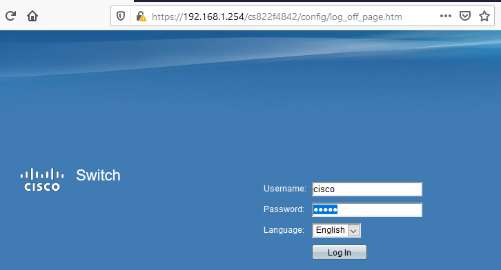

Meldest Du Dich als Benutzer ``cisco`` mit dem Kennwort ``cisco`` (Voreinstellungen) an.

.. image:: media/sg300/003_sg300_change_pw.png
   :alt: 
   :align: center

Danach erfolgt der Wechsel in das Menü ``Administration --> User Accounts``. 
Dort ist der betreffende Benutzer auszuwählen, mit dem Menüpunkt ``Edit`` ist das Kennwort des Benutzers neu zu setzen. Die neueren Firmware-Versionen geben eine Kennwort-Komplexität vor.

.. image:: media/sg300/004_sg300_system_settings_l3.png
   :alt: 
   :align: center

Im Menü ``Administration --> System Settings`` ist der Name für den Switch zu vergeben und 
der System-Modus ist auf L3 zu ändern. Die Änderungen sind dann mit ``Apply`` zu übernehmen.

.. image:: media/sg300/005_sg300_copy_config.png
   :alt: 
   :align: center

Dies erfolgt im Menü ``Administration --> File Management --> Download/BackupConfig``. 
Die hochzuladende Datei ist als sog. ``Startup configuration file`` hochzuladen. Mit ``Durchsuchen`` ist die heruntergeladende Konfigurationsdatei anzugeben.

Ist der Upload erfolgreich verlaufen, so muss der Switch neu gestartet werden, um die Konfiguration anzuwenden.

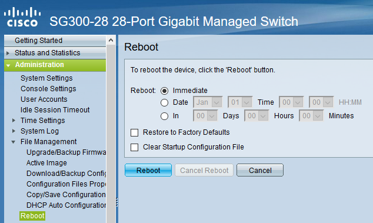

Der Neustart ist über das Menü ``Administration --> File Management --> Reboot`` durchzuführen.

Nach dem Neustart meldest Du Dich erneut an dem L3-Switch an und kontrollieren nochmals die Switch-Ports. Hierbei ist zwischen Access-Ports (port-basierte VLANs) und Trunk-Ports zu unterscheiden.

.. hint::

   In der bereitgestellten Konfigurationsdatei ist der Login cisco mit dem Kennwort cisco für die weitere Konfiguration vorhanden - dies gilt ebenfalls für die IP 192.168.1.254/24 des Switches. Bei Verbindung via Port GE24 kann so eine Verbindung zur weiteren Anpassung der Konfiguration hergestellt werden.

Allgemeine Hinweise zur Konfiguration der Switch-Ports
------------------------------------------------------

Für jeden Switchport muss festgelegt werden, in welchem (VLAN-)Modus dieser arbeitet (Access, Trunk, allgemein u.a.) und welche Mitgliedschaft diese im VLAN X aufweist (verboten, aktuell ausgschlossen, Mitglied tagged oder untagged). Bei der Mitgliedschaft werden die Daten mit oder ohne Tag weitergeleitet. Je nach Fall kann es also sein, dass ein Tag hinzugefügt oder gelöscht wird.

* ``ausgeschlossen``:	Datenpakete, die mit der VLAN-ID x getaggt sind, werden verworfen.
* ``tagged``:		Datenpakete, die mit der VLAN-ID x getaggt sind, werden weitergeleitet.
* ``untagged``:	        Von Datenpaketen, die mit der VLAN-ID x getaggt sind, wird die VLAN-ID entfernt und zum Client weitergeleitet. Die meisten Clients können mit getaggten Datenpaketen nichts anfangen.
* ``PVID``:		Bei einem Port, der mit der PVID x markiert ist, werden alle ungetaggten Datenpakete des Clients mit der VLAN-ID x getaggt.

Anwendung auf das Ausgangsbeispiel
----------------------------------

Nachstehende Ausführungen, dienen dazu, die eingespielte Konfiguration zu prüfen oder ggf. Anpassungen für abweichend eingesetzte Hadrware zu erstellen.

Definition der Link Aggregation Ports
-------------------------------------

* ``LAG1``: Ports 1,2,13,14 -> Verbindung zu VMs / Servern
* ``LAG2``: Ports 3,4,15,16 -> Verbindung zu VMs / Servern
* ``LAG3``: Ports 25-28     -> Uplink/Trunk zu L2-Switches

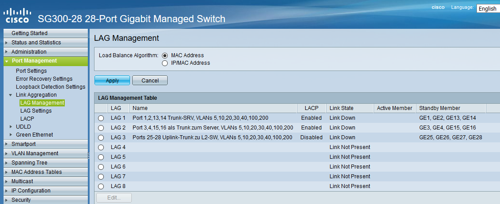

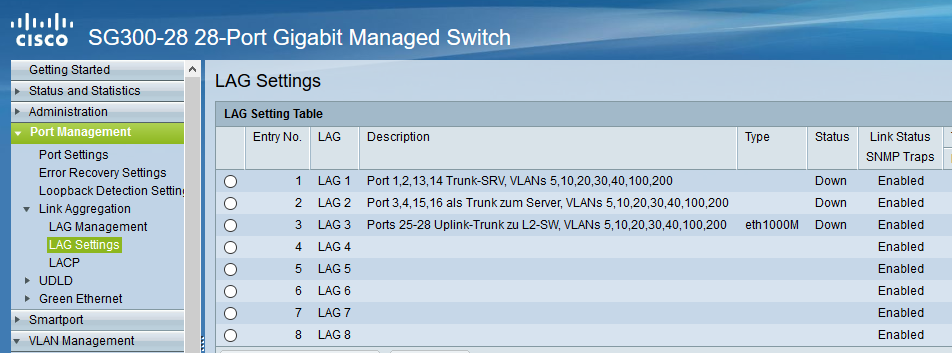

Definition der Access Ports (port-based VLAN)
---------------------------------------------

* ``Port 7``: Port wird dem VLAN 5 (Internet VLAN) zugeordnet (untagged / PVID 5).
* ``Port 19``: Port wird dem VLAN 5 (Internet VLAN) zugeordnet (untagged / PVID 5).
* ``Port 24``: Port wird dem VLAN 3 (Management VLAN) zugeordnet (untagged / PVID 3).

Werden auf dem Switch weitere Ports z.B. für Testzwecke im Server VLAN benötigt, so sind diese unter ``VLAN Management --> Interface Settings`` als Access-Ports und unter ``Port-to-VLAN`` dem korrekten VLAN zuzordnen. Nachstehende Abbildungen stellen die Zuordnung zu VLAN 1 dar. 

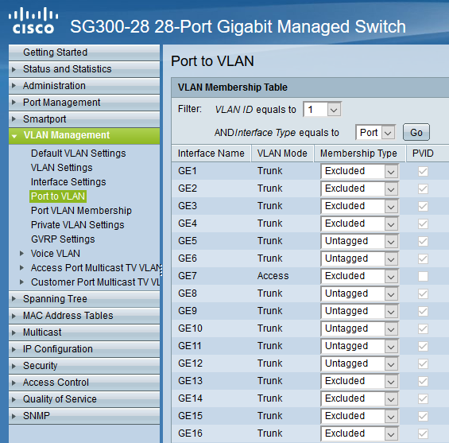

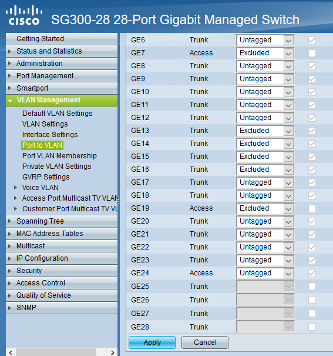

Definition / Zuordnung der VLANs
--------------------------------

* ``LAG1 (Port 1,2,13,14)``: Der Hypervisor ist über vier Netzwerkkabel mit Port 1,2,13,14 des Switches verbunden. Auf der Seite des Hypervisor sind ebenfalls vier Ports durch LinkAggregation definiert. LAG1 ist getaggtes Mitglied der VLANs 3,5,10,20,30,40,100,200.
* ``LAG2 (Port 3,4,15,16)``: Der zweite Hypervisor ist über vier Netzwerkkabel mit Port 3,4,15,16 des Switches verbunden. Auf der Seite des Hypervisor sind ebenfalls vier Ports durch LinkAggregation definiert. LAG1 ist getaggtes Mitglied der VLANs 3,5,10,20,30,40,100,200.
* ``LAG3 (Port 25 - 28)``: Uplink zu anderen L2-Switches via vier Ports. Auf den L2-Switches sind ebenfalls vier Ports durch LinkAggregation definiert. LA32 ist getaggtes Mitglied der VLANs 3,5,10,20,30,40,100,200.
* ``Port 7,19``: Ports werden dem VLAN 5 (Internet VLAN) zugeordnet (untagged / PVID 5).
* ``Port 24``: Port wird dem VLAN 3 (Management VLAN) zugeordnet (untagged / PVID 3).

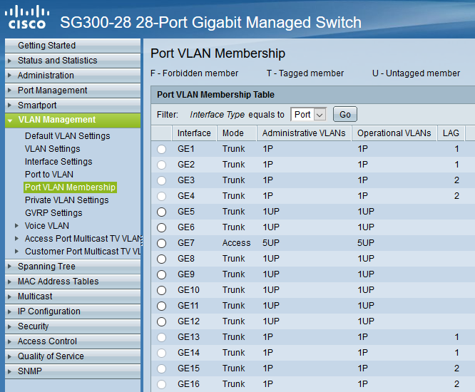

.. image:: media/sg300/012_sg300_ports_vlan_membership_overview_part2.png
   :alt: 
   :align: center

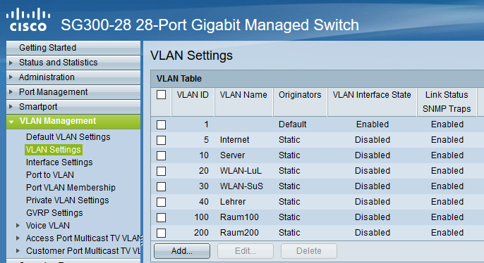

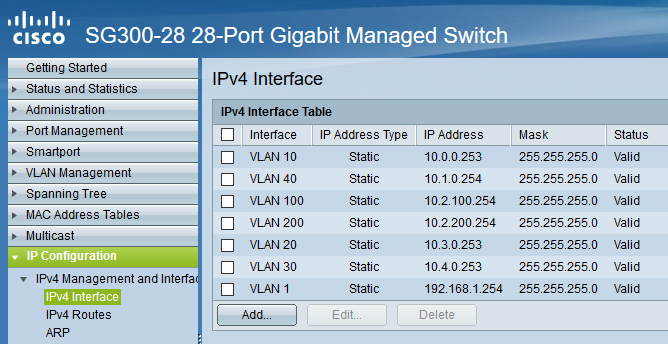

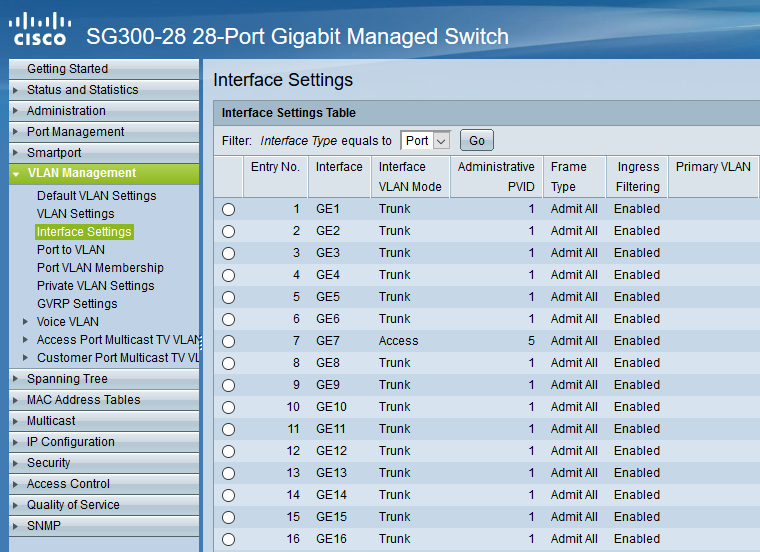

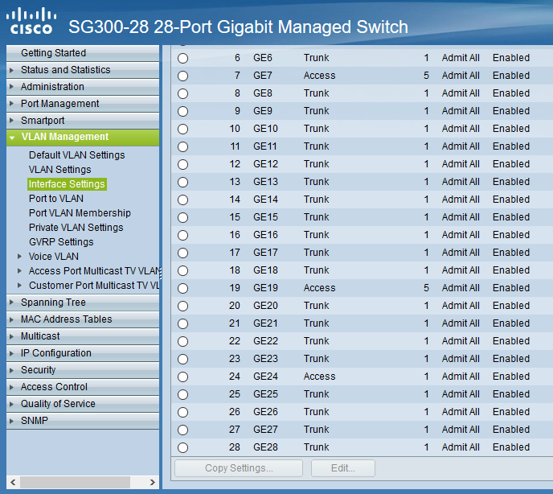

Access Listen definieren
------------------------

.. hint::

   Der Cisco L3-Switch kann nur eingehenden Datenverkehr filtern. Dies ist relevant für die Definition und Anwendung   
   der Listen für die Zugriffssteuerung (ACLs).
   **Achtung**: Die hier vorgestellten ACLs führen dazu, dass bsp. PCs aus zwei verschiednen Klassenräumen sich untereinander via 
   ping nicht mehr erreichen können. Wenn dies gewünscht ist, müsste in den ACEs eine weitere Regel erstellt werden, die Daten
   Zulassen --> 10.(subnet).0 mit Netmask 0.0.0.255 - also z.B. 10.16.1.0 0.0.0.255. Diese Regel muss die niedrigste Priorität 
   erhalten.

**ACL: Lehrkraefte und Klassenraeume**

Es sind Zwei ACL anzulegen: Lehrkraefte und Klassenraume. Dies erfolgt im Menü unter: Zugriffssteuerung --> IPv4 basierte ACL --> Hinzufügen --> <Name der ACL>

**ACEs hinzufügen**

Für die zuvor genannten ACLs sind jetzt sog. Entries (Einträge) anzulegen.
Hierfür wählst Du im Menü:  Zugriffssteuerung --> IPv4 basiertes ACE --> <Name der ACL aus Liste auswählen - hier Lehrkraefte> --> Hinzufügen

.. image:: media/sg300/017_sg300_access_control_ipv4_based_acl.png
   :alt: ACLs
   :align: center

Du gibst dann folgende Werte an:

*    Priorität: 20
*    Aktion: Zulassen (permit)
*    Protokoll: Beliebig (IP) (any)
*    Quell-IP-Adresse: Beliebig (any)
*    Ziel-IP-Adresse: Benutzerdefiniert (user defined)
*    Wert der Ziel-IP-Adresse: 10.16.1.0 (Servernetz-IP)
*    Ziel-IP-Platzhaltermaske: 0.0.0.255 (invertierte Netzmaske)

Danach legst Du eine zweite ACE für die ACL Lehrkraefte an. Im Ergebnis solltest Du für die Lehrkraefte dann nachstehenden Einträge haben:

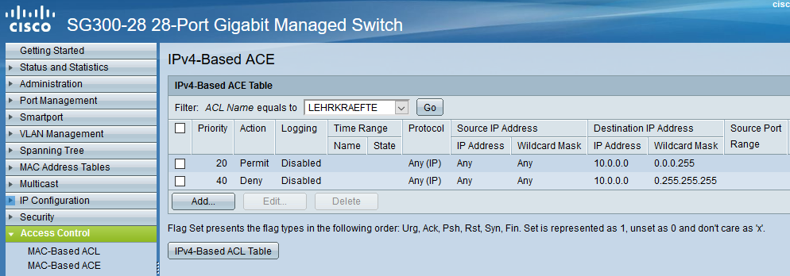

Danach lest Du ACEs für die ``ACL Klassenraeume`` an. Danach solltest Du nachstehende Einträge haben:

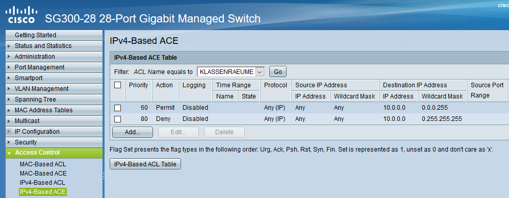

Schliesslich müssen die definierten ACLs noch an die VLANs gebunden werden, damit diese korrekt angewendet werden.
Die Zuordnung sollte für das hier gewählte Beispiel wie folgt aussehen:

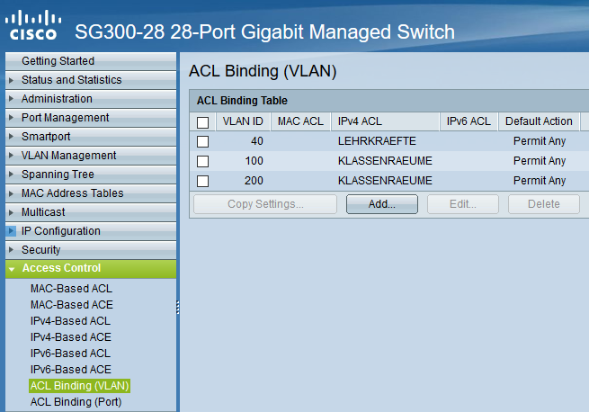

DHCP-Relay konfigurieren
------------------------

Die Einstellungen für das DHCP-Relaying sollten wie folgt aussehen:

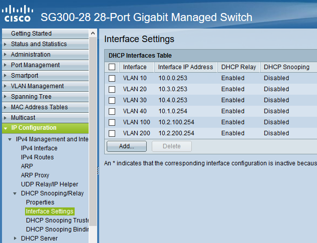

Hierdurch wird sichergestellt, dass DHCP-Anfragen aus den genannten VLANs auch beim linuxmuster.net Server ankommen und bedient werden können.

Um Wake-on-LAN über Subnetze hinweg zu nutzen, muss ein sog. UDP-Relaying eingerichtet werden. Hierdruch können dann z.B. Clients via ``linbo-remote`` aufgeweckt werden.

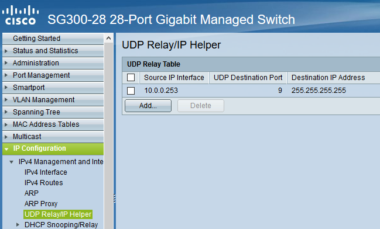

Für das DHCP-Relaying/Snooping muss zudem die Option 82 aktiviert werden.

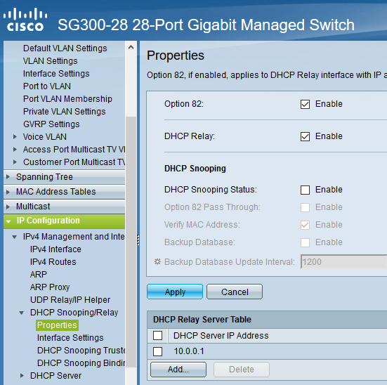

Abschliessend trägst Du noch die VLANs ein, die für das DHCP Relay aktiv sein sollen. 

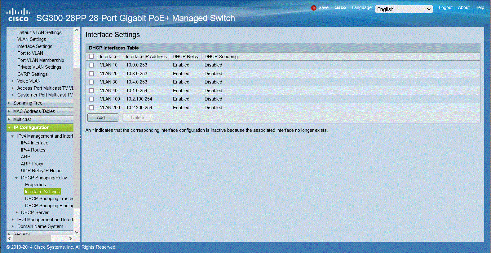

Nachdem Du alle Einstellungen kontrolliert und ggf. angepasst haben, speicherst Du die aktuelle Konfiguration. Dies erledigst Du bei dem Cisco-Switch dadurch, dass Du die Konfiguration aus dem RAM (running-config) auf die NVRAM-Konfiguration kopierst (startup-config).

Weitere L2-Switches mit VLANs anbinden
======================================

In Vorbereitung auf das Subnetting sind auf allen Switches im Netzwerk (in allen Gebäuden)
die VLANs mit den IDs ``3``, ``5``, ``10``, ``20``, ``30``, ``40``, ``100``, und ``200`` anzulegen, damit später
die Portkonfiguration aller Switches angepasst werden kann.

In der hier dargestellten Konfiguration des L3-Switches gibt es drei LAG-Ports. Ein LAG-Port (25-28) ist dazu gedacht, eine Anbindung zu weiteren L2-Switches zu ermöglichen, die ebenfalls für die Nutzung der VLANs zu konfigurieren sind. Dieser LAG-Port ist als Trunk konfiguriert. 

Wesentlich ist, dass alle VLANs, die auf dem L3-Switch eingerichtet wurden, ebenfalls auf allen L2-Switches erstellt werden. Danach muss eine LinkAggregation mit vier Ports erstellt werden, die die Anbindung zum LAG-Port des L3-Switches zur Verfügung stellt. Dieser LAG-Port auf dem L2-Switch ist dann als Trunk zu definieren, der alle VLANs (3,5,10,20,40,100,200) tagged.

Danach werden die einzelnen Ports auf den jeweiligen L2-Switches als untagged ports einem der gewünschten VLANs zugeordnet (port-based VLANs). Die Clients sind dann entsprechend auf den gewünschten VLAN-Port anzuschliessen.

Ist ein Switch in einem PC-Raum, so ist der Uplink als LinkAggregation und Trunk mit den o.g. tagged VLANs zu definieren. Alle anderen Ports sind dann z.B. als access ports zu definieren, die dem VLAN 100 (Raum 100) zugeordnet sind, so dass alle angeschlossenen PCs in diesem VLAN sind.

.. hint::

   Es sollten alle Switch Konfigurationen, VLANs und Port-Belegungen sehr genau pro Switch dokumentiert sein. Hierzu ist 
   es hilfreich in jedem Verteilerschrank eine entsprechende Dokumentation zu hinterlegen. Als Hilfestellung zur 
   Erstellung dieser Dokumentation kann folgende Datei dienen:

   :download:`Einfache Dokumentation mit Calc  <./media/filedownload/einfache_vlandoku_mit_calc.zip>`.

Vorbereitung der Switches im Netzwerk
=====================================

Das genaue Vorgehen kann hier nicht umfassend dokumentiert werden, da es auch von Art und Hersteller der Switche abhängt. 

Exemplarisch erfolgt die Darstellung zur Einrichtung der VLANS auf L2-Switches anhand des Modells Cisco SF200-24. Für andere Modelle sind die Konfigurationsschritte entsprechend anzupassen.

SF200-24 Startup-Config
-----------------------

Für das hier dokumentierte Netzwerkszenario wurde ein Switch des o.g. Models für Raum 200 vorkonfiguriert, um das Vorgehen zur Konfiguration der L2-Switche besser darstellen zu können. Die Konfiguration wird zur schnelleren Umsetzung des Szenarios unten bereitgestellt.

   :download:`Startup-config-SF200-24-L2-Raum200 <./media/configs/linuxmuster-ip-segmentation-startup-config-sf200-24-l2.txt>`.

.. hint::

   Die Firmware des Cisco L2-Switches ist vorab auf die aktuellste Version (hier: 1.4.11.2) zu aktualisieren. Ist eine ältere FW-Version noch installiert, so kann es erforderlich sein, die Aktualisierung in Etappen vorzunehmen (z.B. 1.1.2.0 -> 1.3.7.18 -> 1.4.7.5 -> 1.4.11.2). Um die Boot Version zu aktualisieren, ist die RTB-Datei desFW-Images via TFTP auf den Switch zu laden und dieses jeweils neu zu starten. Im Auslieferungszustand ist der Switch via IP 192.168.1.254/24 erreichbar. Login ist im Auslieferungszustand cisco mit dem Kennwort cisco.

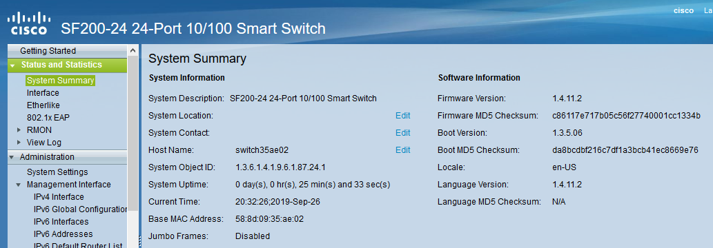

Die heruntergeladene Konfigurationsdatei ist nun auf den Switch zu laden und dieser ist dann neu zu starten.

.. hint::

   Im Auslieferungszustand kann auf den Switch mit der IP 192.168.1.254/24 zugegriffen werden. Benutzer und Kennwort sind ``cisco``.

Im Menü ``Administration --> File Management --> Download/Backup Config`` ist zu Konfigurationsdatei mit ``Durchsuchen`` auszuwählen. Als Ziel ist ``Startup Configuration file`` anzugeben.

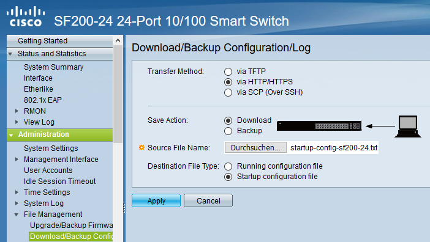

Der erfolgreiche Upload der Konfigurationsdatei wird im Fenster bestätigt.

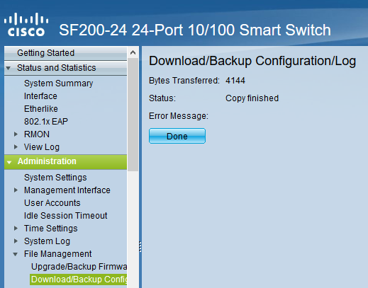

Danach ist der Switch neu zu starten (siehe Hinweise wie bei Cisco L3-Switch).
Nach dem Neustart sind nachstehende Hinweise zur weiteren Konfiguration des Switches zu beachten.

.. hint::
   Der Switch weist im VLAN 3 (access port 24) die IP 192.168.1.250/24 auf. Benutzer ist ``cisco`` und PW ist ``cisco``. Die ``Ports 25 & 26`` wurden als ``LACP-Bond`` konfiguriert. Dieser arbeitet als Trunk und tagged die Pakete für die VLANs ``3,5,10,20,30,40,100,200``. In dem dokumentierten Szenario sind die Ports 25&26 des L3-Switches mit den Ports 25 & 26 des L2-Switches zu verbinden.

Durch den Import der Konfigurationsdatei sind bereits alle Konfigurationseinstellungen für den Switch eingetragen, der als Raum-Switch für Raum 200 (VLAN 200) für einen PC-Raum dienen soll.

Nachstehend dargestellte Konfigurationsschritte visualisieren die jeweiligen Einstellungen, die so auch manuell eingestellt werden können.

Zunächst sind die VLANs mit identischen IDs und Bezeichnungen auf allen L2 - Switchen analog zum L3-Switch anzulegen.

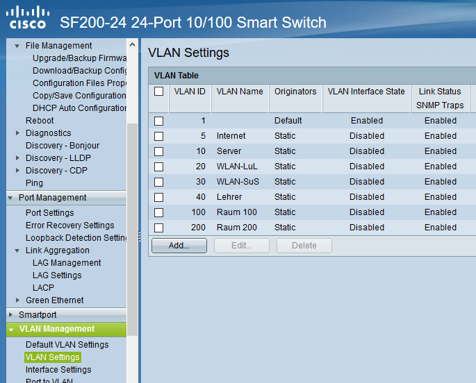

Danach ist der LACP-Bond bestehend aus den Ports 25 & 26 zu definieren.

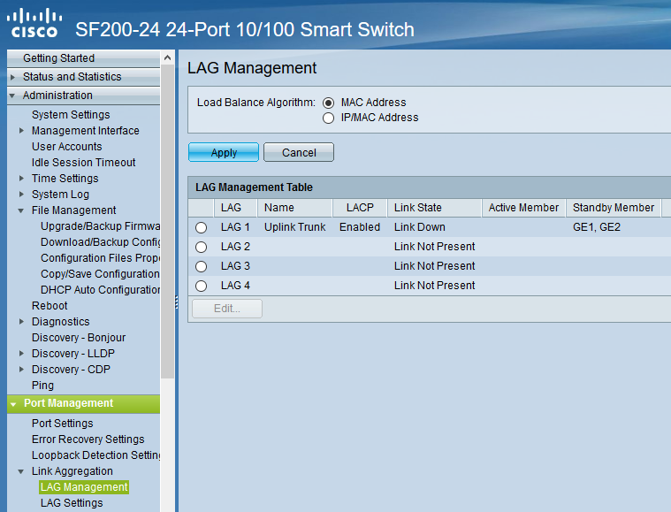

Die Nutzung der jeweiligen Ports wird in der Beschreibung pro Port dokumentiert. 

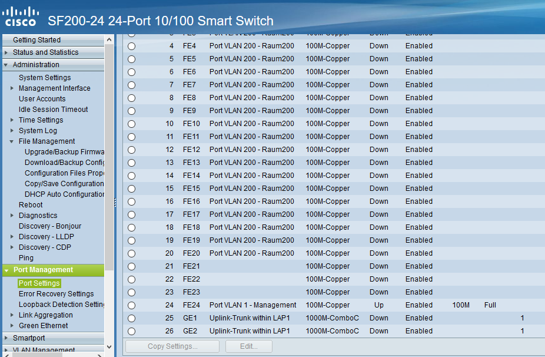

Die VLAN - Nutzung der Ports (Access, Trunk) ist festzulegen.

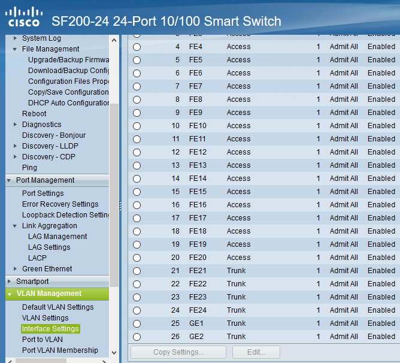

Die Ports sind den VLANs zuzuordnen in denen diese arbeiten sollen. So soll der Switch die Ports 1-20 als Access Ports im VLAN 200 nutzen.

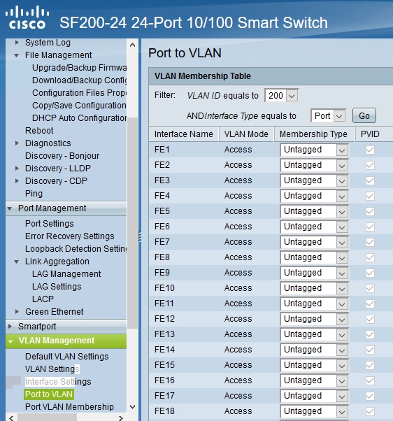

Die Darstellung der Zuordnung kann pro VLAN kontrolliert werden. Hier als Beispiel die Darstellung für das VLAN 5.

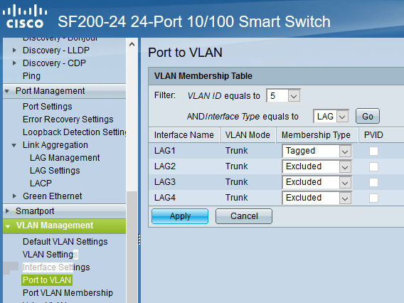

Die Zuordnung der Ports zu den VLANs inkl. Darstellung deren Funtkion ist im Menü ``VLAN Management --> Port VLAN Membership`` dargestellt.

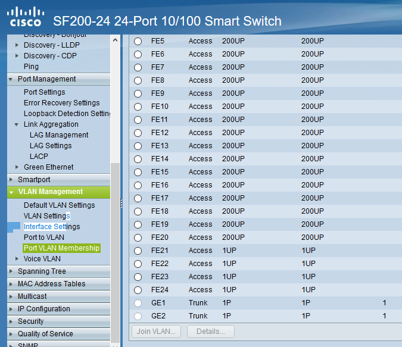

Sind alle Ports wie gewünscht konfiguriert, ist die Konfiguration zu speichern (Kopie der running-config auf die startup-config), eine Sicherungskopie anzulegen und abschliessend ist der Switch neu zu starten.

.. important::

   Es ist immer das Protokoll 802.1q für die Definition der VLANs anzuwenden. 
   Dies ist ein genormtes Netzwerkprotokoll, das es ermöglicht, sog. tagged VLANs zu definieren.

Netzkonfiguration VM-Host
=========================

Bonds erstellen
---------------

Stehen auf dem VM-Host mehrere Netzwerkkarten zur Verfügung, so bietet es sich an, diese als Bonds (Link Aggregation) zu bündeln.
Auf dem Hypervisor sind dann zudem VLAN Bridges anzulegen.

In dem hier dokumentierten Netzszenario werden vier Netzwerkkarten zu einem Bond zusammengefasst und dann die VLANs eingerichtet. 
Dies Abbildung der VLANs erfolgt auf dem Hypervisor mithilfe von VLAN Bridges. Eine Netzwerkkarte, die an ein VLAN Bridge angeschlossen wird, erhält den jeweiligen VLAN-TAG.

Auf diese Weise können VMs flexibel den VLANs zugeordnet werden.

Nachstehend wird die Konfiguration des Hypervisors in der Übersicht mithilfe von ``Proxmox v6`` dargestellt. Für andere Hypervisor müssen die Einstellungen entsprechend angepasst werden.

Übersicht der VM-Host Netzwerkkonfiguration
-------------------------------------------

Nachstehende Abb. zeigt die Netzwerkeinstellungen des Proxmox-Hosts in der Übersicht:   

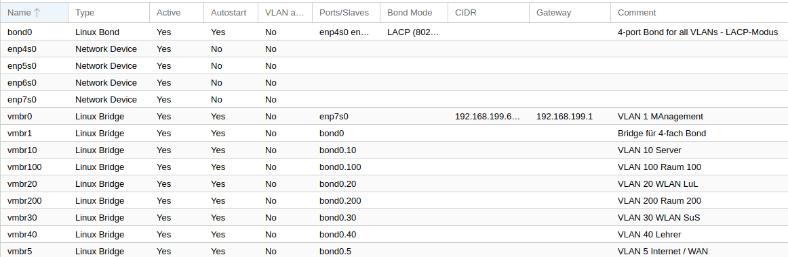

Diese Konfiguration können entweder durch Eintragungen in der Proxmox-GUI erfolgen, oder durch Ergänzung der Datei ``/etc/network/interfaces`` 

.. code::

   auto lo
   iface lo inet loopback
  
   iface enp7s0 inet manual

   iface enp4s0 inet manual

   iface enp5s0 inet manual

   iface enp6s0 inet manual

   auto bond0
   iface bond0 inet manual
         bond-slaves enp4s0 enp5s0 enp6s0
         bond-miimon 100
         bond-mode 802.3ad
         bond-xmit-hash-policy layer2+3
   # 3-port Bond for all VLANs - LACP-Modus

   auto vmbr0
   iface vmbr0 inet static
         address 192.168.1.10 # Managment IP Proxmox
         netmask 255.255.255.0
         gateway 192.168.1.254
         bridge-ports enp7s0
         bridge-stp off
         bridge-fd 0
         bridge_maxage 0
         brdige_ageing 0
         bridge_maxwait 0
  #Bridge für 3-fach Bond

  auto vmbr5
  iface vmbr5 inet manual
         bridge-ports bond0.5
         bridge-stp off
         bridge-fd 0
         bridge_maxage 0
         brdige_ageing 0
         bridge_maxwait 0
  #VLAN 5 Internet / WAN
 
  auto vmbr10
  iface vmbr10 inet manual
         bridge-ports bond0.10
         bridge-stp off
         bridge-fd 0
         bridge_maxage 0
         brdige_ageing 0
         bridge_maxwait 0
  #VLAN 10 Servernetz

  auto vmbr20
  iface vmbr20 inet manual
         bridge-ports bond0.20
         bridge-stp off
         bridge-fd 0
         bridge_maxage 0
         brdige_ageing 0
         bridge_maxwait 0
  #VLAN 20 WLAN LuL

  auto vmbr30
  iface vmbr30 inet manual
         bridge-ports bond0.30
         bridge-stp off
         bridge-fd 0
         bridge_maxage 0
         brdige_ageing 0
         bridge_maxwait 0
  #VLAN 30 WLAN SuS

  auto vmbr40
  iface vmbr40 inet manual
         bridge-ports bond0.40
         bridge-stp off
         bridge-fd 0
         bridge_maxage 0
         brdige_ageing 0
         bridge_maxwait 0
  #VLAN 40 Lehrernetz

  auto vmbr100
  iface vmbr100 inet manual
         bridge-ports bond0.100
         bridge-stp off
         bridge-fd 0
         bridge_maxage 0
         brdige_ageing 0
         bridge_maxwait 0
  #VLAN 100 Raum 100

  auto vmbr200
  iface vmbr200 inet manual
         bridge-ports bond0.200
         bridge-stp off
         bridge-fd 0
         bridge_maxage 0
         brdige_ageing 0
         bridge_maxwait 0
  #VLAN 200 Raum 200

Nach einem Neustart sind die VLAN Bridges nutzbar.

Nach dem Import der VMs sind nun deren Netzwerkkarten den richtigen VLAN Bridges zuzuordnen. Dies muss für alle VMs erfolgen.

Die Anpassung sieht unter Proxmox für OPSense wie folgt aus:

.. image:: media/03_vm_opnsense_vlans_nics.png
   :alt: Proxmox OPNsense® NICS VLAN Bridges
   :align: right

Netzanpassung VMs
=================

Zunächst sind in der OPNsense®-VM die Netzwerkkarten korrekt den VLAN Bridges des Hypervisors zuzuordnen. Danach sind den Netzwerkkarten die korrekten IPs (FW: 10.0.0.254/24, OPT1: 10.3.0.254/24, OPT2: 10.4.0.0.0/24, WAN: DHCPv4) zuzuordnen. Danach ist die VM neu zu starten. 

Die virtuellen Maschinen (Server, Docker-Host, OPSI und ggf. XOA) sind mithilfe des Befehls ``linuxmuster-prepare`` auf die gewünschte Struktur anzupassen, so dass diese die korrekten Adressen aus dem Servernetz zugewiesen bekommen. 

.. hint::

   siehe zur ausführlichen Darstellung von linuxmuster-prepare :ref:`modify-net-label`

Als Bsp. zur Nutzung des Konsolenbefehls pro virtueller Maschine wird nachstehend die Anpassung des Servers erklärt:

.. code::
  
   linuxmuster-prepare -p server -n 10.0.0.1/24 -d meineschule.de -f 10.0.0.254
   linuxmuster-prepare -p opsi -n 10.0.0.2/24 -d meineschule.de -f 10.0.0.254
   linuxmuster-prepare -p docker -n 10.0.0.3/24 -d meineschule.de -f 10.0.0.254

Richtet das Server-Profil wie folgt ein (übersetzt für die erste Code-Zeile):
 - Profil/Hostname server,
 - IP/Bitmask 10.0.0.1/24,
 - Domänenname meineschule.de,
 - Gateway/DNS 10.0.0.254

Wurde dies für alle verwendeten VMs durchgeführt, ist zu prüfen, ob die VMs im Servernetz sich untereinander erreichen können.

Vom Server aus ist die Erreichbarkeit der Firewall, der Docker-, der OPSI- und ggf. der XOA-VM zu prüfen.

.. code::

   ping 10.0.0.254
   ping 10.0.0.2
   ping 10.0.0.3
   ping 10.0.0.4

Sofern erfolgreich Antwortpakete zu sehen sind, kann mit dem nächsten Schritt die Einrichtung fortgesetzt werden.

Weitere Subnetze definieren
---------------------------

Weitere Subnetze ergänzt man nach dem Setup in der Datei ``/etc/linuxmuster/subnets.csv``.

Für o.g. Netzstruktur müsste die Datei folgende Eintragungen aufweisen:

.. code::

   # Network/Prefix;Router-IP (last available IP);1. Range-IP;Last-Range-IP;SETUP-Flag
   # Servernetz;VLAN-GW nicht FW IP
   10.0.0.0/24;10.0.0.253;10.0.0.100;10.0.0.200;SETUP
   # add your subnets below
   # Lehrernetz
   10.1.0.0/24;10.1.0.254;10.1.0.1;10.1.0.253;SETUP
   # Schuelernetz Raum 100
   10.2.100.0/24;10.2.100.254;10.2.100.1;10.2.100.253;SETUP
   # Schuelernetz Raum 200
   10.2.200.0/24;10.2.200.254;10.2.200.1;10.2.200.253;SETUP
   # WLAN-Lehrer
   10.3.0.0/24;10.3.0.253;10.3.0.1;10.3.0.252;SETUP
   # WLAN-Schueler
   10.4.0.0/24;10.4.0.253;10.4.0.1;10.4.0.252;SETUP

**Hinweise**:

* Im zweiten Feld der Zeile steht die IP-Adresse des Subnetz-Gateways, die auf dem Layer-3-Switch für das entsprechende VLAN-Interface konfiguriert werden muss (s.o. - bereits auf dem L3-Swich erfolgt).

* Optional können im dritten und vierten Feld Anfangs- und Endadressen für eine freie DHCP-Range angegeben werden.

* Wichtig ist darüberhinaus, dass auf dem Switch für das Servernetz ebenfalls ein VLAN-Interface mit einer IP-Adresse aus dem Subnetz (z.B. 10.0.0.253) als Gateway eingerichtet werden muss.

* Diese IP muss anstatt der Firewall-IP als Router-IP in die Servernetz-Zeile in subnets.csv eingetragen werden.

Subnetze importieren
--------------------

Die geänderte Subnetz-Konfiguration wird mit dem Befehl ``linuxmuster-import-subnets`` übernommen.
Dabei werden die Subnetze in die DHCP-Server-Konfiguration eingetragen. Außerdem richtet das Skript statische Routen 
in die Subnetze über die definierten Gateway-Adressen auf Server-, Firewall-, Opsi- und Docker-VMs ein. 

**Firewall-Beispiel**

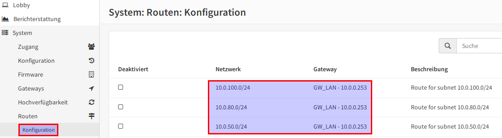

Auf der Firewall werden zusätzlich ausgehende NAT-Regeln für jedes Subnetz angelegt:

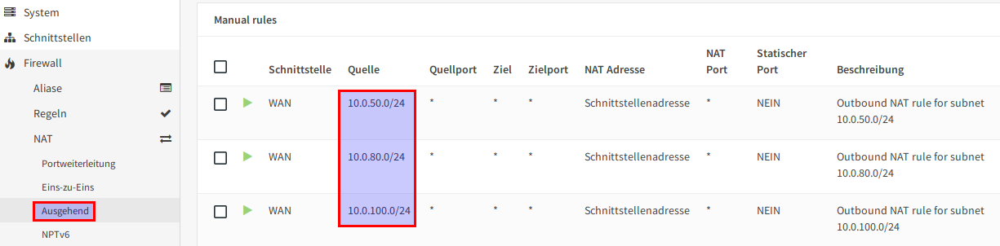

und das LAN-Gateway angepasst. 

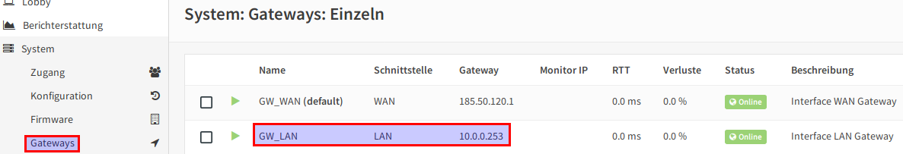

netplan auf VMs prüfen
----------------------

Der Import ändert die Netzwerkeintragungen der VMs. Nach einem Neustart der VMs ist für den Server-, OPSI- und Docker-VM zu prüfen, 
ob die Eintragungen in der Datei ``/etc/netplan/01-netcfg.yaml`` den nachstehenden Eintragungen entsprechen:

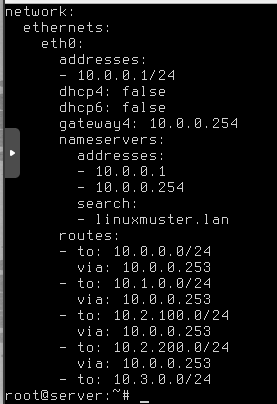

Wichtig ist, dass die Routen zu den jeweileigen Netzen via IP 10.0.0.253 (IP des VLAN 10 auf dem L3-Switch) geleitet werden. Das Standard-Gateway bleibt hingegen die Firewall 10.0.0.254.

Sollten hier Abweichungen festgestellt werden, so sind diese so anzupassen, dass die diese den o.g. Eintragungen entsprechen. Die Änderungen werden dann mit dem Befehl ``netplan apply`` angewendet.

Es sollte nun die Erreichbarkeit der Server im Servernetz und der Zugrff der Server-VMs auf das Internet getestet werden. Sollte dies funktionieren, so können nun die Geräte eingetragen werden.
  
Geräte den Subnetzen zuweisen
=============================

Auf dem linuxmuster.net Server sind in der Datei ``/etc/linuxmuster/sophomorix/default-school/devices.csv`` alle Geräte eingetragen.
Gemäß der neuen Netzstruktur sind die IP-Adressen entsprechend anzupassen und danach mit dem Import-Befehl zu übernehmen.

Nachstehende Eintragungen sollen verdeutlichen, wie Geräte den VLANs dieses hier dokumentierten Netzszenarios zugeordnet werden:

.. code::

   #Raum;Hostname;Linbo-Klasse;MAC-Adresse;IP-Adresse;;;;Arte des Geraetes;;
   # Servernetz;
   server;server;nopxe;aa:bb:cc:dd:ee:11;10.0.0.1;;;;server;;0;;;;SETUP;
   server;firewall;nopxe;11:11:11:22:22:22;10.0.0.254;;;;server;;0;;;;SETUP;
   server;opsi;nopxe;33:22:11:AA:BB:CC;10.0.0.2;;;;server;;0;;;;SETUP;   
   server;docker;nopxe;D2:31:22:11:A1:22:33;10.0.0.3;;;;server;;0;;;;SETUP;
   #Raum R200
   r200;r200-pc01;win10-efi;00:50:56:3E:A5:7A;10.2.200.1;;;;computer;;2
   r200;r200-pc02;win10-efi;00:50:56:3E:A5:7B;10.2.200.2;;;;computer;;2
   r200;r200-pc03;win10-efi;00:50:56:3E:A5:7C;10.2.200.13;;;computer;;2
   r200;r200-pc04;win10-efi;00:50:56:3E:A5:7D;10.2.200.1;4;;computer;;2
   # PC im VLAN der Lehrer, PCs stehen im Raum L001
   l001;l001-pc01;ubu18;01:60:66:3F:A6:1A;10.1.0.1;;;;computer;;2
   l001;l001-pc02;ubu18;01:60:66:3F:A6:1B;10.1.0.2;;;;computer;;2
   l001;l001-pc03;ubu18;01:60:66:3F:A6:1C;10.1.0.3;;;;computer;;2

Die Anpassungen in der Datei sind nun zu speichern. Danach sind die so angepassten Geräte abschliessend mithilfe des nachstehenden 
Befehls in das System zu übernehmen:

.. code::

   linuxmuster-import-devices

Die Clients in Raum 200 und im Lehrernetz sind dann anzuschliessen. Diese Clients müssen o.g. IPs erhalten. Ist dies der Fall, kann ein Linbo-Image erstellt und weitere Tests (Anmeldung, Zugriff auf den Server, Internet-Zugriff etc.) ausgeführt werden.

Erhält ein Client die korrekte IP so ist dies unter Linbo wie folgt zu erkennen:

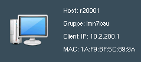

Testen der neuen Netzstruktur
=============================

Grundsätzlich gilt, dass die einzelnen konfigurierten Netzbereiche unmittelbar zu testen sind. 
Wurde der L3-Switch und der Hypervisor mit den VMs konfiguriert und wurde die geignete Verkabelung hergestellt, so ist zunächst zu testen,
ob sich alle VMs im Servernetz untereinander erreichen und ob diese Internet-Zugriff haben.

Die durchzuführenden Tests sind in folgende Bereiche zu unterteilen:

- Verbindung VMs untereinander via L3-Switch (Servernetz)
- Verbindung zwischen den Switchen über das Management VLAN - in diesem Beispiel VLAN 1
- Verbindung von Endgeräten eines VLANs auf L2-Switch1 / L2-Switch2 zum linuxmuster.net Server und Verbindung zum Internet
- Verbindung von Endgeräten von L2-Switch1 via L3 Switch zu Endgeräten des identischen VLANs auf L2-Switch2
- Linbo-Start der Clients in einem Fachraum. Prüfen, ob den Geräten eine IP über die Netzgrenzen hinweg - wie in der devices.csv angegeben - erfolgreich zugewiesen wird.
- vom Server aus sind WOL-Pakete an einen Client zu senden, um diesen aufzuwecken und mit Linbo zu synchronisieren.

Download L3-Configs
===================

Nachstehend werden Dir einige Konfigurationsdateien für L3-Switche angeboten, die Du an Dein Netzszenario anpassen kannst.

Für den L3-Switch Cisco SG300-28 steht die vorbereitete Konfigurationsdatei zur Verfügung, die die Konfiguration auf dem L3-Switch so einspielt, wie diese in dieser Dokumentation beschrieben wird.

+--------------+--------------------------+-----------------------------------------------------------------------------------------+
| Hersteller   | L3 - Switch Modell       |  Download                                                                               |
+==============+==========================+=========================================================================================+
| Cisco        | SG-300-28                |:download:`Config SG300-28 <./media/configs/linuxmuster-ip-segmentation-sg300-28-l3.txt>`|
+--------------+--------------------------+-----------------------------------------------------------------------------------------+
| Cisco        | 3750G  (IOS 12.2)        |:download:`Config 3750G <./media/configs/linuxmuster-ip-segmentation-3750g-l3.txt>`      |
+--------------+--------------------------+-----------------------------------------------------------------------------------------+
| D-Link       | DGS-1510-28x             |``Config DGS1510-28x still missing``                                                     |
+--------------+--------------------------+-----------------------------------------------------------------------------------------+

.. hint::

   Die Liste wird schrittweise erweitert. D-Link fehlt noch.
