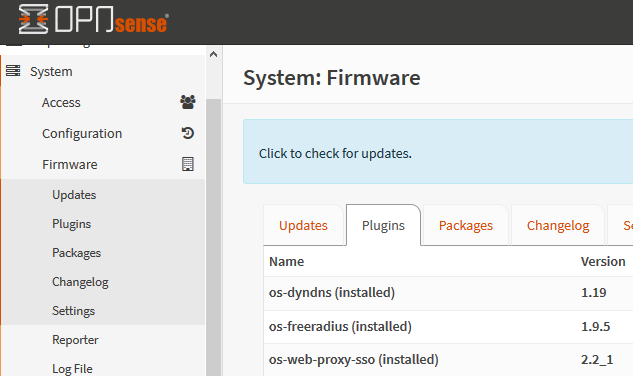
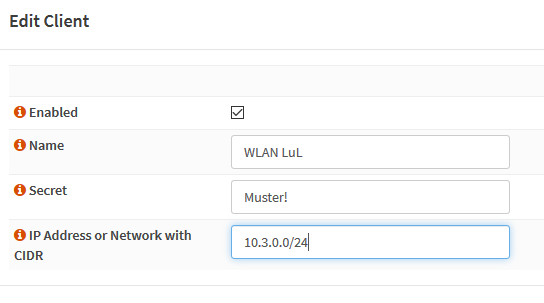
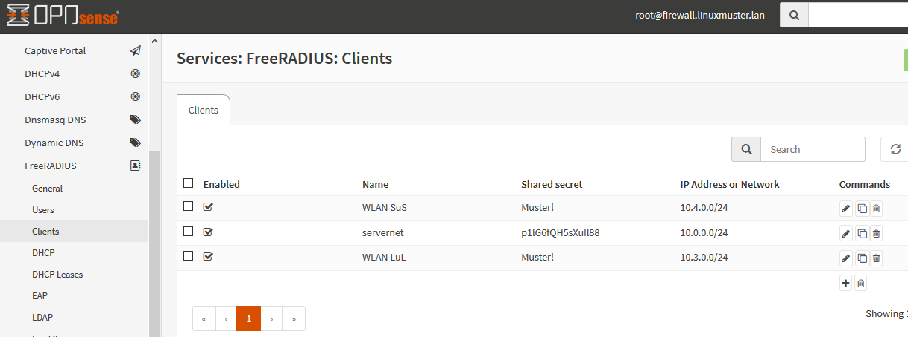
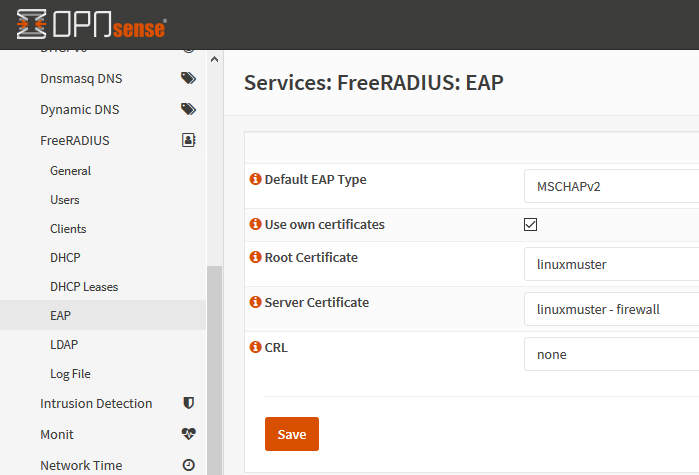
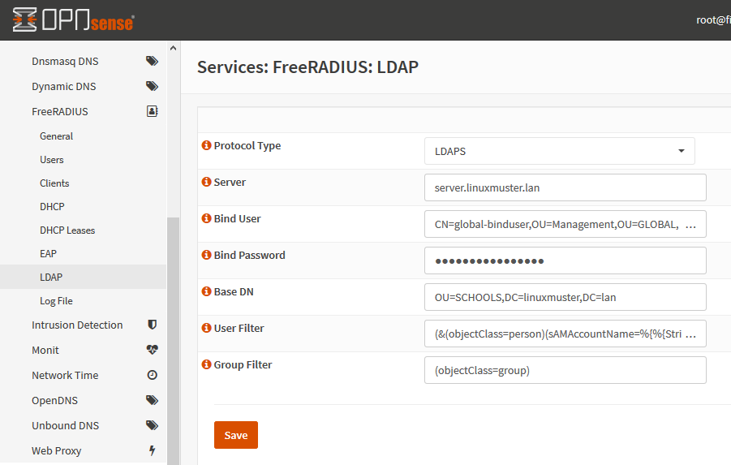
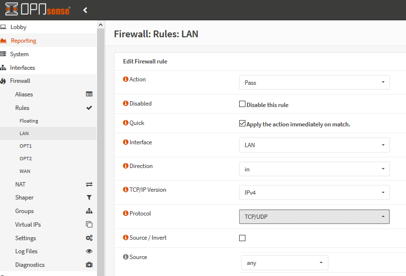
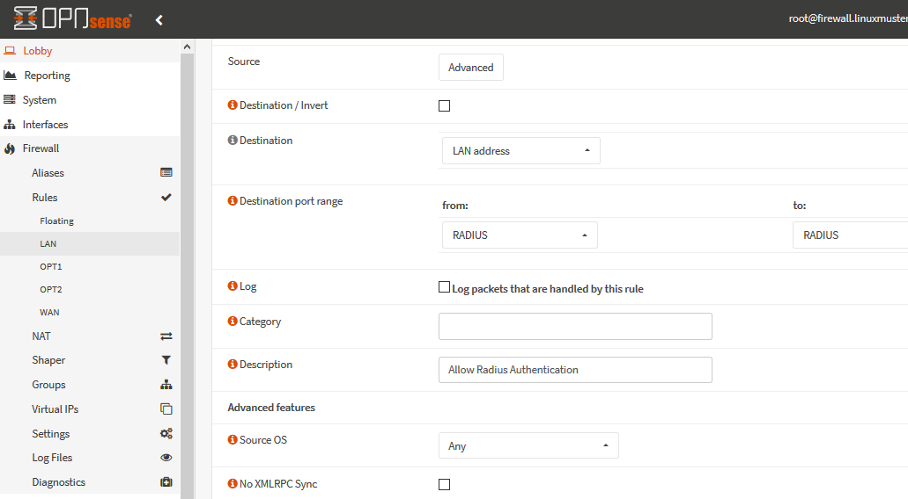
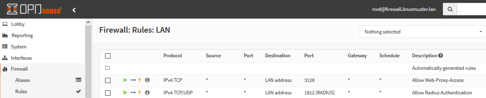

.. _linuxmuster-freeradius-label:

===========================
Netzwerkzugriff über Radius
===========================

.. sectionauthor:: `@cweikl <https://ask.linuxmuster.net/u/cweikl>`_,
                   `@thomas <https://ask.linuxmuster.net/u/thomas>`_,
                   `@foer <https://ask.linuxmuster.net/u/foer>`_
  

RADIUS (Remote Authentification Dial-In User Service) ist ein Client-Server Protokoll, 
das zur Authentifizierng, Autorisierung und für das Accounting (Triple A) von Benutzern in 
einem Netzwerk dient.

Der RADIUS-Server dient als zentraler Authentifizierungsserver, an den sich verschiedene
IT-Dienste für die Authentifizierung wenden können. RADIUS bietet sich an, um in grossen 
Netzen sicherzustellen, dass ausschliesslich berechtigte Nutzer Zugriff haben. Der Zugriff 
kann zudem auch auf bestimmte Endgeräte beschränkt werden. Um die Authentifizierungs-Daten
zu übertragen wird oftmals das Protokoll EAP (Extensible Authentification Protocol) genutzt.

Viele Geräte und Anwendungen, wie z.B. Access Points, Captive Portals oder Wireless 
Controller, bieten neben einer einfachen Benutzerauthentifizierung auch eine Überprüfung 
mit Hilfe eines RADIUS-Servers an (WPA-Enterprise, 802.1X). Werden die Geräte so konfiguriert,
dass diese zur Authentifizierung den RADIUS-Server nutzen, so kann sichergestellt werden,
das nur brechtigte Benutzer Zugriff auf z.B. das WLAN haben.

FreeRADIUS: Einsatz lmn
=======================

FreeRadius ist ein Open-Source RADIUS-Server, der in der linuxmuster.net v7 zum Einsatz kommt.
Dieser RADIUS-Server kann auf der Firewall (OPNSense), auf dem lmn-Server oder auf dem Docker-Host
installiert, als Dienst aktiviert und so konfiguriert, dass die Benutzerauthentifizierung 
anhand der Daten im ActiveDirectory (AD) des linuxmuster.net  Servers erfolgt, die vom 
RADIUS-Server via LDAP abgefragt werden.

FreeRADIUS auf der OPNSense einrichten & testen
===============================================

Erweiterung OPNSense
--------------------

Auf aktuellen lmn-Systemen (linuxmuster-base >= 7.0.41) ist der RADIUS-Dienst für das LAN auf der 
Firewall OPNSense bereits automatisch eingerichtet. Sollte ein aktuelles System zum Einsatz kommen,
so sind beim Einsatz der Netzsegmentierung lediglich weitere Subnetze zu berücksichtigen, indem 
sog. Clients in FreeRADIUS definiert werden.

Nachfolgende Schritte dokumentieren, die manuelle Einrichtung des RADIUS-Dienstes.

Zunächst ist die Erweiterung (plugin) **os-freeradius** auf der OPNSense zu installieren. Diese ist unter 
``System -> Firmware-> Plugins`` zu installieren. Ist diese nicht in der Liste der Erweiterungen zu sehen,
so ist mithilfe der Schaltfläche ``+`` die Erweiterung zu installieren.

Nach der Installation ist die Seite neu zu laden. Danach gibt es unter ``Dienste -> FreeRADIUS`` die
Möglichkeit, Einstellungen vorzunehmen. Wie in nachstehender Abb. gezeigt, ist der Dienst zu aktivieren 
und LDAP zu aktivieren.

.. image:: media/02-service-freeradius-general-config.png
   :alt: FreeRADIUS: Allgemein
   :align: center

Clients definieren
------------------

Für jeden Netzbereich, aus dem auf den RADIUS-Dienst zugegriffen werden soll, muss ein sog. Client
angelegt werden. Die entsprechende Konfiguration erfolgt unter ``Dienste -> FreeRADIUS -> Clients``.
Mithilfe der Schaltfläche ``+`` werden weitere Einträge hinzugefügt.

Der Name und das Kennwort sind frei wählbar. Der Netzbereich ist in CIDR-Notation anzugeben.
Für eines der Netze gemöß der Netzsegementierung wäre z.B. 10.3.0.0/24 anzugeben.

Für jedes zu nutzendes Subnetz ist hier ein entsprechender Client-Eintrag anzulegen. Die Einträge 
werden abschliessend mithilfe der Schaltfläche ``Anwenden`` bestätigt.

EAP konfigurieren
-----------------

Für die Übertragung der Authentifizierungsanfragen ist noch das zu nutzende Verfahren einzustellen.
Hier sind unter ``Dienste -> FreeRADIUS -> EAP`` folgende Angaben einzutragen:

LDAP einrichten
---------------

Der FreeRADIUS Dienst soll mithilfe des EAP-Verfahrens die Anfragen an das Active Directory des 
lmn-Servers via LDAP schicken. Hierzu sind in der RADIUS-Konfiguration entsprechende Einstellungen
vorzunehmen.

Dazu muss man die Basis DN (BaseDN) wissen, die man auf dem Server in der Datei ``/var/lib/linuxmuster/setup.ini`` 
nachschauen kann. Das Passwort des Bind-Users holt man aus ``/etc/linuxmuster/.secret/global-binduser``. 
Ist das System mit der Standarddomäne linuxmuster.lan aufgesetzt, lauten die entsprechenden Einträge wie folgt:

.. code::

   Protokolltyp    LDAPS
   Server          server.linuxmuster.lan
   Bindungsnutzer  CN=global-binduser,OU=Management,OU=GLOBAL,DC=linuxmuster,DC=lan
   Bind Passwort   ****************
   Basis DN        OU=SCHOOLS,DC=linuxmuster,DC=lan
   Benutzerfilter  (&(objectClass=person)(sAMAccountName=%{%{Stripped-User-Name}:-%{User-Name}})(memberOf=CN=wifi*))
   Gruppenfilter   (objectClass=group)

Im Benutzerfilter wird sichergestellt, dass der Benutzer Mitglied der Gruppe ``wifi`` ist.

**LDAP Konfiguration**

Firewallregeln anlegen
----------------------

Schliesslich sind noch Firewallregeln zu definieren, die den Zugriff auf den RADIUS-Port 1812 aus dem LAN oder ggf.
aus anderen Netzbereichen heraus erlauben. Hierzu sind unter ``Firewall -> LAN -> Rules -> LAN`` folgende 
Einstellungen vorzunehmen:

Nach Abschluss der RADIUS-Konfiguration kann diese nun getestet werden.

Testen der RADIUS-Konfiguration
-------------------------------

Auf dem lmn-Server ist das Paket ``freeradius-utils`` zu installieren. Dies kann mit folgendem Befehl erfolgen:

.. code::

   apt install freeradius-utils

Es kann auf dem lmn-Server mithilfe des Tools ``radclient`` nun getestet werden, ob die Authentifizierung 
funktioniert. Hierzu muss ein Benutzer mit seinem Kennwort angegeben werden, der der Gruppe ``wifi`` 
angehört - also z.B. ein Lehrer.

.. code::

   echo "User-Name=zell,User-Password=Muster!" | radclient -x -P udp -s 10.0.0.254:1812 auth "$(cat /etc/linuxmuster/.secret/radiussecret)"  

Anstelle des Befehls zum Auslesen des RADIUS-Secrets kann dieses auch direkt zwichen die Hochkommata eingefügt werden.

Kann der Benutzer sich erfolgreich via RADIUS authentifizieren, ist eine Rückmeldung wie nachstehende Ausgabe zu sehen:

.. code::

    Sent Access-Request Id 229 from 0.0.0.0:57233 to 10.0.0.254:1812 length 44
    User-Name = "zell"
    User-Password = "Muster!"
    Cleartext-Password = "Muster!"
    Received Access-Accept Id 229 from 10.0.0.254:1812 to 0.0.0.0:0 length 20
    Packet summary:
    Accepted      : 1
    Rejected      : 0
    Lost          : 0
    Passed filter : 1
    Failed filter : 0

Nimmt man nun den Benutzer aus der Gruppe ``wifi``, so sollte die Authentifizierung fehlschlagen.

.. code::

   sophomorix-managementgroup --nowifi zell

Bei einem erneuten test mit o.g. Befehl mithilfe des radclient sollte dann eine Fehlermeldung erscheinen:

.. code::
  
   echo "User-Name=zell,User-Password=Muster!" | radclient -x -P udp -s 10.0.0.254:1812 auth "Muster!"
   Sent Access-Request Id 10 from 0.0.0.0:34707 to 10.0.0.254:1812 length 44
   User-Name = "zell"
   User-Password = "Muster!"
   Cleartext-Password = "Muster!"
   Received Access-Reject Id 10 from 10.0.0.254:1812 to 0.0.0.0:0 length 20
   (0) -: Expected Access-Accept got Access-Reject
   Packet summary:
   Accepted      : 0
   Rejected      : 1
   Lost          : 0
   Passed filter : 0
   Failed filter : 1

Verlaufen diese Testes erfolgreich, so ist der RADIUS - Dienst in lmn vollständig eingerichtet.
Die APs, WLAN-Controller oder Captive Portal Lösungen sind nun so zu konfigurieren, dass diese 
den FreeRadius der lmn nutzen.

FreeRADIUS auf dem lmn-Server einrichten & testen
=================================================

Freeradius installieren und aktivieren
--------------------------------------

.. code::

   #apt install freeradius
   #systemctl enable freeradius.service

ntlm_auth in samba erlauben
---------------------------

In der Datei ``/etc/samba/smb.conf`` ist folgende Zeile einzufügen:

.. code::

   ntlm auth = yes

Danach muss der samba-ad-dc Dienst neu gestartet werden:

.. code::

   #systemctl restart samba-ad-dc.service

Radius konfigurieren
--------------------

Dem Freeradius-Dient muss Zugriff auf ``winbind`` gegeben werden:

.. code::

   #usermod -a -G winbindd_priv freerad
   #chown root:winbindd_priv /var/lib/samba/winbindd_privileged/

In dem Verzeichnis ``/etc/freeradius/3.0/sites-enabled`` in die Dateien 
``default`` und ``inner-tunnel`` ganz am Anfang unter authenticate ist
ntlm_auth einzufügen.

.. code::

      authenticate {
          ntlm_auth
          # ab hier geht es weiter

Die Datei ``/etc/freeradius/3.0/mods-enabled/mschap`` sind im Abschnitt
mschap zwei Teilen zu ergänten:

.. code::

      mschap {
              use_mppe = yes
              with_ntdomain_hack = yes
              # hier geht es weiter

Anpassen des Abschnitts ``ntlm_auth`` weiter unten. Zuerst das Kommentarzeichen # entfernen, dann 
die Zeile folgendermaßen anpassen:

.. code::

    # eine Zeile
    ntlm_auth = "/usr/bin/ntlm_auth --request-nt-key --domain=DOMÄNE --require-membership-of=DOMÄNE\wifi --username=%{%{Stripped-User-Name}:-%{%{User-Name}:-None}} --challenge=%{%{mschap:Challenge}:-00} --nt-response=%{%{mschap:NT-Response}:-00}"

Dabei muss ``DOMÄNE`` durch den eigenen Domänennamen (Samba-Domäne) ersetzt werden. 
Die Option ``–require-membership-of=…`` lässt nur Mitglieder der Gruppe wifi zu. 
So funktioniert die WLAN-Steuerung über die WebUI.

Danach ist die Datei ``/etc/freeradius/3.0/mods-enabled/ntlm_auth`` noch anzupassen. Zuerst ist das Kommentarzeichen # zu 
entfernen. Danach ist die Zeile wie folgt anzupassen:

.. code::

    exec ntlm_auth {
    wait = yes
    # eine Zeile
    program = "/usr/bin/ntlm_auth --request-nt-key --domain=DOMÄNE --require-membership-of=DOMÄNE\wifi --username=%{mschap:User-Name} --password=%{User-Password}"
    }

Dabei muss ``DOMÄNE`` durch den eigenen Domänennamen (Samba-Domäne) ersetzt werden.

In der Datei ``/etc/freeradius/3.0/users`` ist ganz oben nachstehende Zeile einzufügen.

.. code::

    DEFAULT     Auth-Type = ntlm_auth

Nun ist der Freeradius-Dienst neuzustarten:

.. code::

    #systemctl restart freeradius.service

.. note::
   
   Das Defaultverhalten der lmn7 ist, dass ein neu angelegter ``User`` immer in der Gruppe ``wifi`` ist, 
   d.h. auch alle Schüler dürfen zunächst in das WLAN 

Die Steuerung der Gruppenzugehörigkeit kann auf der Konsole wie folgt gesetzt werden:

.. code::

   #sophomorix-managementgroup --nowifi/--wifi user1,user2,...

Um alle Schüler aus der Gruppe wifi zu nehmen, läßt man sich alle User des Systems auflisten und schreibt diese in eine Datei.
Dies kann wie folgt erledigt werden:

.. code::

   #samba-tool user list > user.txt

Jetzt entfernt man alle User aus der Liste, die immer ins Wlan dürfen sollen. Danach baut man die Liste zu einer Kommazeile um mit:

.. code::

   #less user |  tr '\n' ',' > usermitkomma.txt

Die Datei kann jetzt an den o.g. Sophomorix-Befehl übergeben werden:

.. code::

   #sophomorix-managementgroup --nowifi $(less usermitkomma.txt)

Firewallregeln anpassen
-----------------------

Auf dem lmn-Server ist in der Datei ``/etc/linuxmuster/allowed_ports`` der Radiusport ``1812`` einzutragen:

.. code::

    udp domain,netbios-ns,netbios-dgm,9000:9100,1812

Danach ist der lmn-Server neu zu starten.

Auf der Firewall OPNSense muss je nach eigenen Voraussetzungen dafür gesorgt werden, dass die AP’s aus dem 
Wlan-Netz den Server auf dem Port 1812 via udp erreichen können. Es ist darauf zu achten, dass die IP des Servers
den eigenen Netzvorgaben entspricht (also z.B. 10.0.0.1/16 oder /24 oder 10.16.1.1/16 oder /24)

Die Regel auf der OPNSense hierzu könnten, wie nachstehend abgebildet, eingetragen werden.

Jetzt sollte die Authentifizierung per WPA2-Enterprise funktionieren, sofern der Testuser in der Gruppe wifi ist. 
Ein Zertifikat ist nicht erforderlich.

Sollte das nicht funktionieren, hält man den Freeradius-Dienst an und startet ihn im Debugmodus.

.. code::

   # service freeradius stop
   # service freeradius debug

Jetzt sieht man alle Vorgänge während man sich versucht, mit einem Device zu verbinden.

APs im Freeradius eintragen
---------------------------

Die APs müssen im Freeradius noch in der Datei ``/etc/freeradius/3.0/clients.conf`` 
eingetragen werden. Dies erfolgt wie in nachstehendem Schema dargestellt:

.. code::

   client server {
   ipaddr = 10.0.0.1
   secret = GeHeim
   }

   client opnsense {
   ipaddr = 10.0.0.254
   secret = GeHeim
   }

   client uni fi {
   ipaddr = 10.0.0.10
   secret = GeHeim
   }

Um den APs feste IPs zuzuweisen, sollten diese auf dem lmn-Server in der Datei 
``/etc/linuxmuster/sophomorix/default-school/devices.csv``. 

Je nachdem, ob in jedem (Sub)-netz die APs angeschlossen werden, ist die zuvor dargestellte Firewall-Regel
anzupassen. Der Radius-Port in der OPNSense müsste dann z.B. von Subnetz A (blau) zu Subnetz B 
(grün Servernetz) geöffnet werden, damit alle APs Zugriff auf den Radius-Diensterhalten. 

 

 

 

