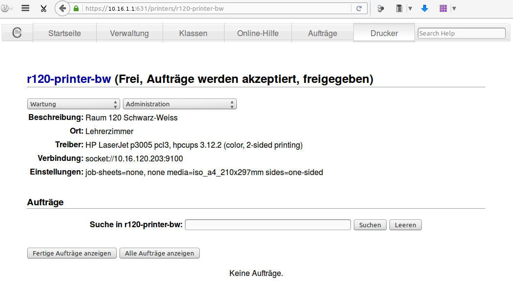
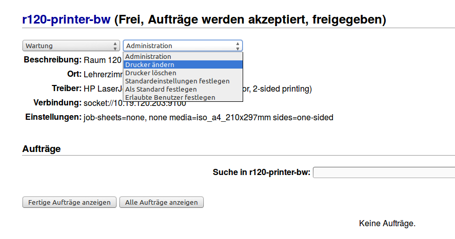
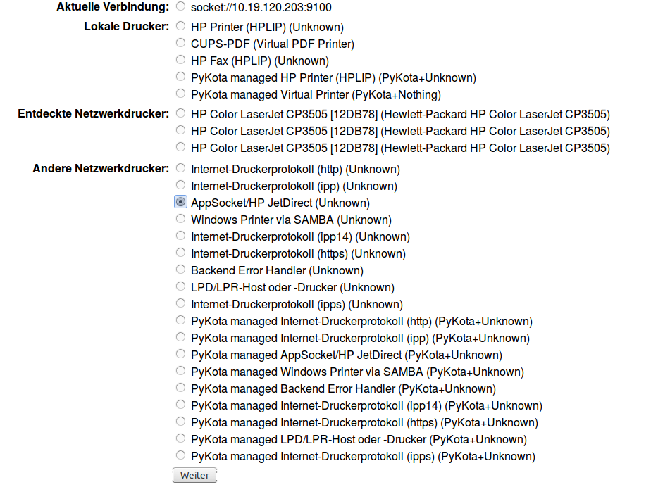
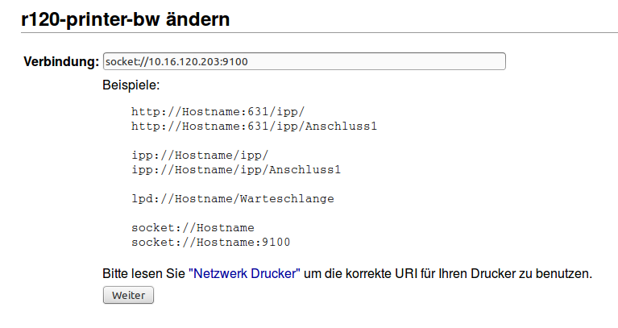
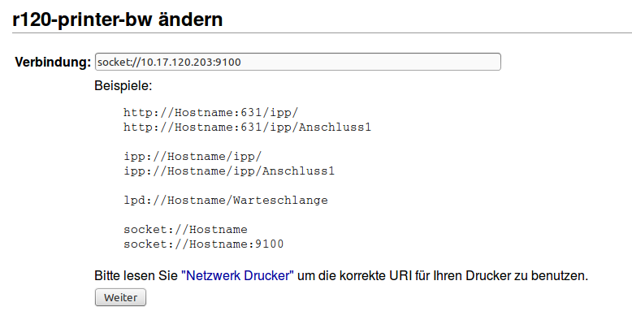

Vorbereitung der workstations-Datei
===================================

Zunächst bearbeitet man die Workstations-Datei derart, dass alle Rechner, die
später in den jeweiligen Netzen sein sollen, Adressen aus dem jeweiligen VLAN erhalten. 
So müssen z.B. für Raum 100 die PCs eine IP aus dem Netz ``10.20.100.x``
erhalten (VLAN ID 100).

Dabei ist es unerheblich, ob die Veränderungen im Serverterminal oder in der
Schulkonsole vorgenommen werden.

Ausgangszustand
---------------

Die Rechner sind raumweise einsortiert. Die Workstations-Datei soll nun so umstrukturiert werden, dass später

* alle Rechner in Raum r100 und r200 IPs aus den Subnetzen der beiden Räume VLAN100 und VLAN200 erhalten
* alle anderen Rechner sollen IPs aus dem Subnetz VLAN Lehrer erhalten

.. code::
   
   #Raum;Rechnername;Imageklasse;Mac-Adresse;IP-Adresse;Subnetzmaske;;;;;
   r100;r100-ws01;qgm;C4:34:6B:7E:71:10;10.16.100.1;255.240.0.0;1;1;1;1;1
   r100;r100-ws02;qgm;64:51:06:38:B6:6F;10.16.100.2;255.240.0.0;1;1;1;1;1
   r100;r100-printer-color;printer;00:1E:0B:12:DB:78;10.16.100.101;255.240.0.0;1;1;1;1;0
   r200;r200-printer-bw;printer;00:18:FE:A3:A8:60;10.16.200.201;255.240.0.0;1;1;1;1;0
   r200;r200-ws01;qgm;64:51:06:38:B6:64;10.16.200.1;255.240.0.0;1;1;1;1;1
   r116a;r116a-ws01;sozpaed;88:AE:1D:EF:E3:3B;10.16.6.1;255.240.0.0;1;1;1;1;0
   nwt100;r110-ws01;qgm;64:51:06:43:D2:62;10.16.100.1;255.240.0.0;1;1;1;1;1
   nwt100;r110-ws02;qgm;64:51:06:43:D3:21;10.16.100.2;255.240.0.0;1;1;1;1;1
   rhm;rhm-ws01;qgm;64:51:06:38:B7:AC;10.19.111.1;255.240.0.0;1;1;1;1;1

Endzustand
----------

Alle Rechner die später im Lehrernetz sein sollen, haben nun Adressen der Form ``10.30.10.x``,
alle Rechner die später im VLAN Raum100 sein sollen haben Adressen der Form ``10.20.100.x``. 
Eventuell noch bestehende Netzmasken im sechsten Feld sind nicht mehr erforderlich. Dies wird durch die später folgende Umstellung des linuxmuster.net Servers auf Subnetting geregelt.

Nun übernimmt man die Änderungen durch den Befehl ``import_workstations`` oder entsprechend in der Schulkonsole.

Nach dem nächsten Rechnerstart erhalten die geänderten Rechner die neuen IP-Adressen.

.. code::
   #Raum;Rechnername;Imageklasse;Mac-Adresse;IP-Adresse;Subnetzmaske;;;;;
   r100;r100-ws01;qgm;C4:34:6B:7E:71:10;10.20.100.1;;1;1;1;1;1
   r100;r100-ws02;qgm;64:51:06:38:B6:6F;10.20.100.2;;1;1;1;1;1
   r100;r100-printer-color;printer;00:1E:0B:12:DB:78;10.20.100.101;;1;1;1;1;0
   r200;r200-printer-bw;printer;00:18:FE:A3:A8:60;10.20.200.201;;1;1;1;1;0
   r200;r200-ws01;qgm;64:51:06:38:B6:64;10.20.200.1;;1;1;1;1;1
   r116a;r116a-ws01;sozpaed;88:AE:1D:EF:E3:3B;10.30.10.1;;1;1;1;1;0
   nwt100;r110-ws01;qgm;64:51:06:43:D2:62;10.30.10.2;;1;1;1;1;1
   nwt100;r110-ws02;qgm;64:51:06:43:D3:21;10.30.10.3;;1;1;1;1;1
   rhm;rhm-ws01;qgm;64:51:06:38:B7:AC;10.30.10.4;;1;1;1;1;1

Geänderte Drucker auf dem Server anpassen
-----------------------------------------

Hat man bei der Neustrukturierung IP-Adressen von Druckern geändert, die in
CUPS auf dem Server als Netzwerkdrucker eingerichtet sind, muss man dort die
neue IP-Adresse anpassen, da diese Änderungen durch den erneuten Import der
Arbeitsstationen nicht übernommen werden.

Am Beispiel des Druckers ``r120-printer-bw`` wird das Vorgehen kurz dargestellt.

Dazu öffnet man die CUPS Seite auf dem Server und bearbeitet den betreffenden
Drucker - man sieht, die ursprüngliche IP-Adresse ``10.16.120.203``.

.. important::

   Bilder sind anzupassen !! 
 

Zunächst wählt man im Administrationsmenü ``Drucker ändern``.

Jetzt wählt man die bisherige Anschlussart, im Beispiel ``AppSocket/HP
JetDirect``, im nächsten Bildschirm werden dann die bisherigen Einstellungen angezeigt.

In diesem Fall, wie zu sehen ``socket://10.16.120.203:9100``. 

Jetzt ändert man die IP-Adresse auf den neuen Wert und lässt den Rest unverändert.

Im weiteren Änderungsverlauf werden jeweils die bisherigen Einstellungen
angezeigt, die man stets übernimmt. Um die Änderungen abzuschliessen, muss man 
am Ende das ``root``-Passwort angeben.

Auf diese Weise müssen alle zuvor geänderten Drucker auf Ihre neue IP-Adresse
angepasst werden. 

