Konfiguration des L3-Switches
=============================

Einspielen der vordefinierten Konfiguration
-------------------------------------------

.. hint::

  Die Firmware des Cisco L3 Switch SG300-10 ist vorab auf die Version 1.4.8.6 zu aktualisieren.
  FW_ `Hier der Link für die Firmware`__: 
  
  .. _FW: https://software.cisco.com/download/release.html?mdfid=283019611&softwareid=282463181&release=1.4.8.06 

  __ FW_

Für den L3-Switch Cisco SG300 stehen vorbereitete Konfigurationsdateien zur
Verfügung, die die Konfiguration auf dem Switch so einspielen, wie diese in dieser Dokumentation beschrieben wird. Es werden also 8-Ports zu vier Link Aggregation Ports - jeweils bestehend aus zwei Ports - erstellt. Zudem werden alle Ports als Access Ports oder Trunks definiert und die weitergeleiteten / getaggten VLANs hierfür definiert. DHCP Einstellungen und ARP Einstellungen werden ebenso definiert.

Je nachdem für welches Subnetz der Server von linuxmuster.net konfiguriert wurde, ist die passende Konfigurationsdatei zu wählen:

* :download:`Konfiguration für Server-IP 10.16.1.1  <./media/configs/linuxmuster-subnet-10.16.txt>`.
* :download:`Konfiguration für Server-IP 10.32.1.1  <./media/configs/linuxmuster-subnet-10.32.txt>`.
* :download:`Konfiguration für Server-IP 10.48.1.1  <./media/configs/linuxmuster-subnet-10.48.txt>`.
* :download:`Konfiguration für Server-IP 10.64.1.1  <./media/configs/linuxmuster-subnet-10.64.txt>`.

Upload der Konfiguration: Schritt für Schritt
---------------------------------------------

.. hint::

   Im Auslieferungszustand kann auf den Cisco Switch mit der IP 192.168.1.254/24 zugegriffen werden. Diese IP wird in 
   dieser Konfiguration dem VLAN 1 (Management) zugewiesen, so dass nach Einspielen der Konfiguration und dem Reboot 
   weiterhin mit der Adresse die Konfiguration angepasst werden kann.

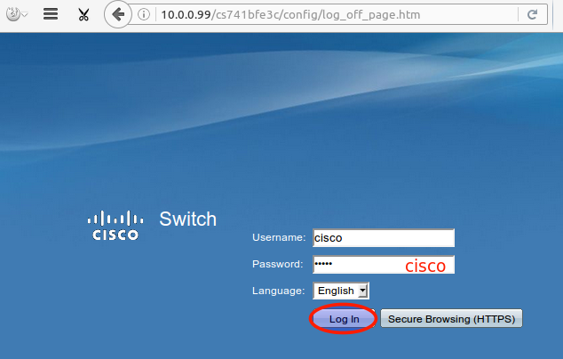

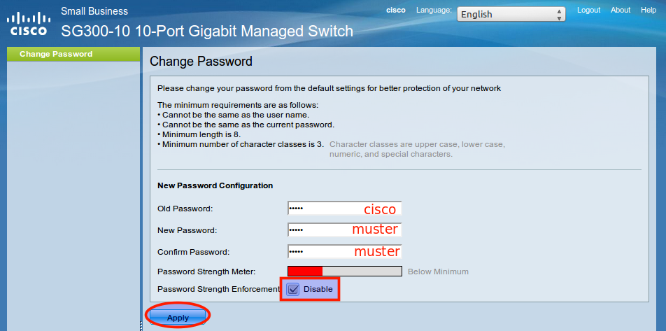

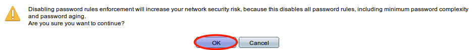

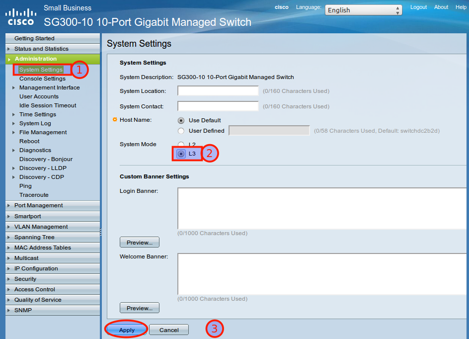

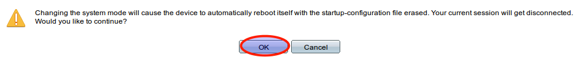

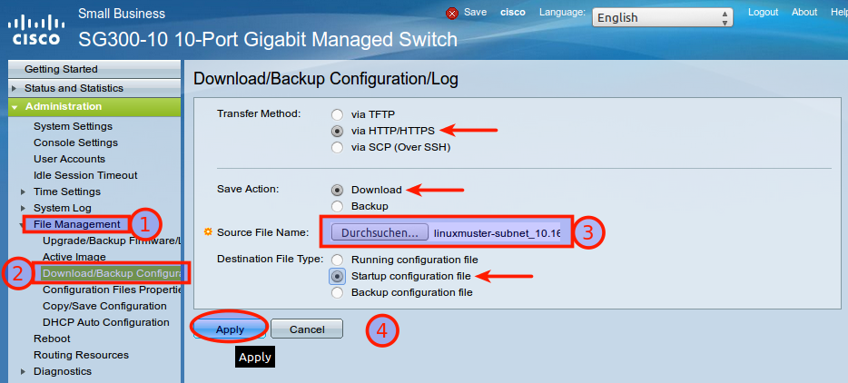

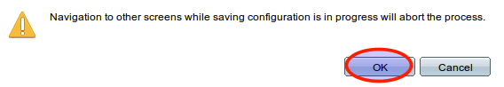

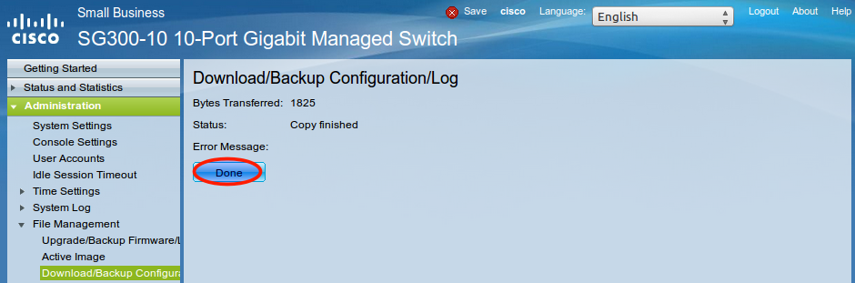

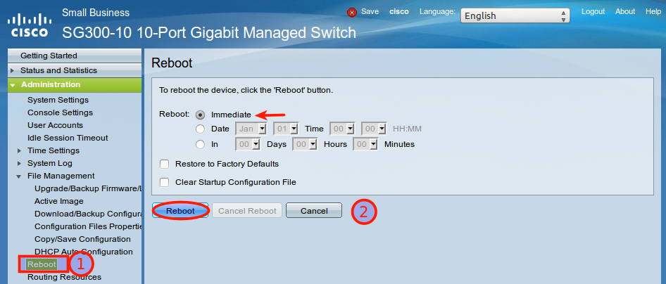

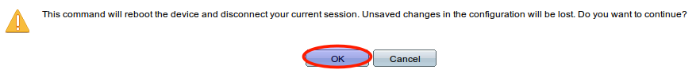

Nach dem Neustart melden Sie sich erneut an dem L3-Switch an und kontrollieren nochmals die Switch-Ports. Hierbei ist zwischen Access-Ports (port-basierte VLANs) und Trunk-Ports zu unterscheiden.

Allgemeine Hinweise zur Konfiguration der Switch-Ports
------------------------------------------------------

Für jeden Switchport muss festgelegt werden, ob das VLAN mit der VLAN-ID x ausgeschlossen, getaggt akzeptiert oder Datenpakete, die mit der VLAN-ID x getaggt sind, ungetaggt weitergeleitet werden.

* ``Ausgeschlossen``:	Datenpakete, die mit der VLAN-ID x getaggt sind, werden verworfen.
* ``Getaggt``:		Datenpakete, die mit der VLAN-ID x getaggt sind, werden weitergeleitet.
* ``Ungetaggt``:	Von Datenpaketen, die mit der VLAN-ID x getaggt sind, wird die VLAN-ID entfernt und zum Client weitergeleitet. Die meisten Clients können mit getaggten Datenpaketen nichts anfangen.
* ``PVID``:		Bei einem Port, der mit der PVID x markiert ist, werden alle ungetaggten Datenpakete des Clients mit der VLAN-ID x getaggt.

Anwendung auf das Ausgangsbeispiel
----------------------------------

Nachstehende Ausführungen, dienen dazu, die eingespielte Konfiguration zu prüfen oder ggf. Anpassungen für abweichend eingesetzte Hadrware zu erstellen.

.. important::

   Abb. fehlt, die die Nutzung der Ports zu den Uplinks darstellt

Definition der Link Aggregation Ports
-------------------------------------

* ``LAG1``: Ports 1 & 2 -> Verbindung zu VMs / Servern
* ``LAG2``: Ports 3 & 4 -> Uplink zu L2-Switch
* ``LAG3``: Ports 5 & 6 -> Uplink zu L2-Switch
* ``LAG4``: Ports 9 & 10 -> Uplink zu L2-Switch

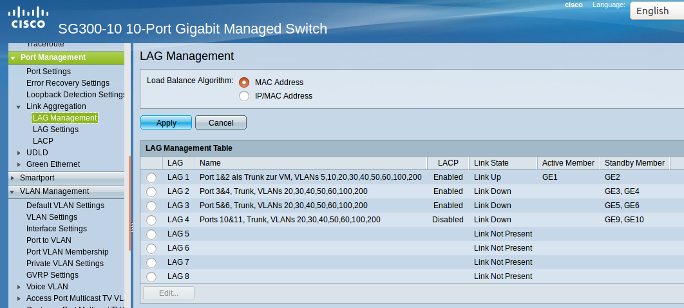

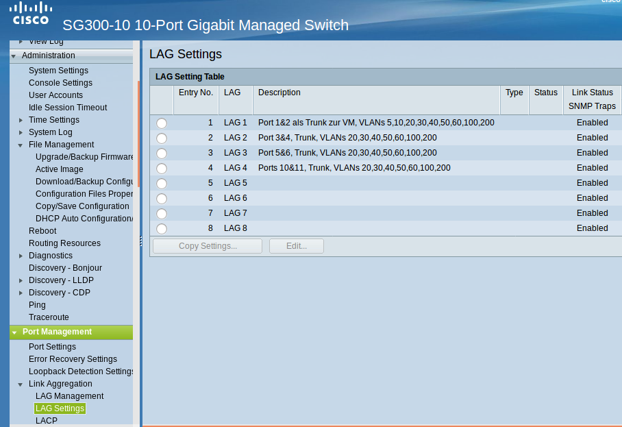

Definition der Access Ports (port-based VLAN)
---------------------------------------------

* ``Port 7``: Port wird dem VLAN 10 (Server VLAN) zugeordnet (untagged / PVID 10).
* ``Port 8``: Port wird dem VLAN 5 (Internet VLAN) zugeordnet (untagged / PVID 5).

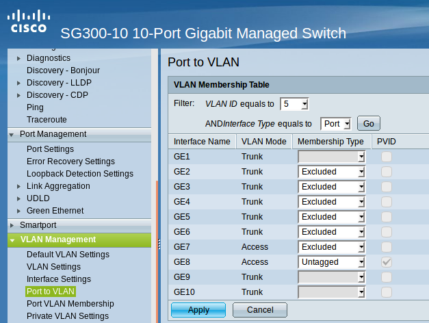

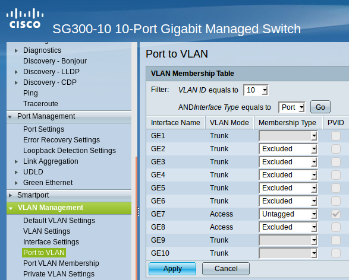

Definition / Zuordnung der VLANs
--------------------------------

* ``LAG1 (Port 1 & 2)``: Der Hypervisor ist über zwei Netzwerkkabel mit Port 1 & 2 des Switches verbunden. Auf der Seite des Hypervisor sind ebenfalls zwei Ports durch LinkAggregation definiert. LAG1 ist getaggtes Mitglied der VLANs 5, 10,20,30,40,50,100,200.
* ``LAG2 (Port 3 & 4)``: Ein anderern L2-Switch ist über zwei Netzwerkkabel mit Port 3 & 4 des Switches verbunden. Auf dem L2-Switch sind ebenfalls zwei Ports durch LinkAggregation definiert. LAG2 ist getaggtes Mitglied der VLANs 5, 10,20,30,40,50,100,200.
* ``LAG3 (Port 5 & 6)``: Ein anderern L2-Switch ist über zwei Netzwerkkabel mit Port 5 & 6 des Switches verbunden. Auf dem L2-Switch sind ebenfalls zwei Ports durch LinkAggregation definiert. LAG2 ist getaggtes Mitglied der VLANs 5, 10,20,30,40,50,100,200.
* ``Port 7``: Port wird dem VLAN 10 (Server VLAN) zugeordnet (untagged / PVID 10).
* ``Port 8``: Port wird dem VLAN 5 (Internet VLAN) zugeordnet (untagged / PVID 5).
* ``LAG4 (Port 9 & 10)``: Ein anderern L2-Switch ist über zwei Netzwerkkabel mit Port 9 & 10 des Switches verbunden. Auf dem L2-Switch sind ebenfalls zwei Ports durch LinkAggregation definiert. LAG2 ist getaggtes Mitglied der VLANs 5, 10,20,30,40,50,100,200.

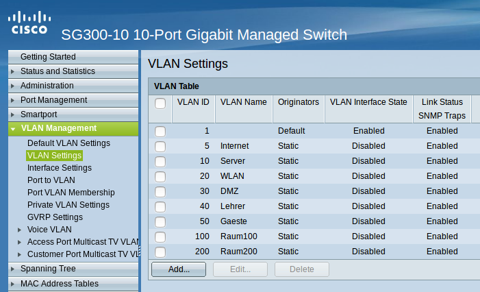

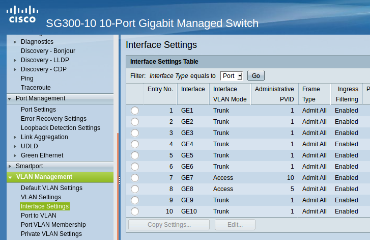

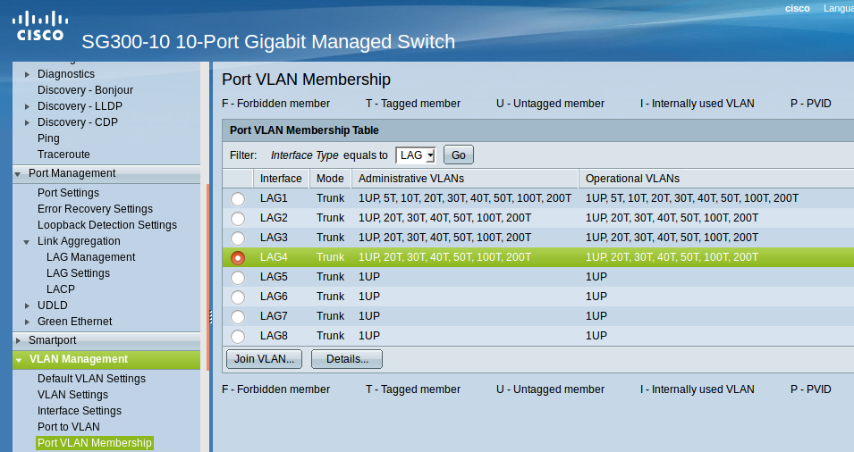

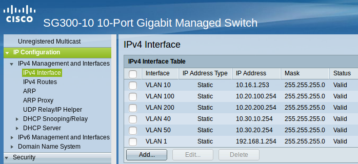

Für die VLANs sollten schliesslich folgende statischen Routen definiert sein:

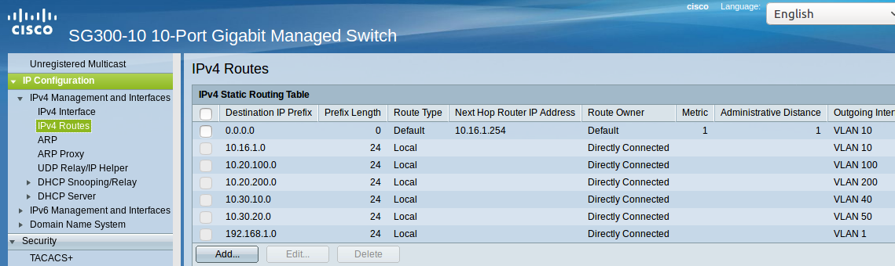

Access Listen definieren
------------------------

.. hint::

   Der Cisco L3-Switch kann nur eingehenden Datenverkehr filtern. Dies ist relevant für die Definition und Anwendung   
   der Listen für die Zugriffssteuerung (ACLs).
   **Achtung**: Die hier vorgestellten ACLs führen dazu, dass bsp. PCs aus zwei verschiednen Klassenräumen sich untereinander via 
   ping nicht mehr erreichen können. Wenn dies gewünscht ist, müsste in den ACEs eine weitere Regel erstellt werden, die Daten
   Zulassen --> 10.(subnet).0 mit Netmask 0.0.0.255 - also z.B. 10.16.1.0 0.0.0.255. Diese Regel muss die niedrigste Priorität 
   erhalten.

**ACL: Lehrkraefte und Klassenraeume**

Es sind Zwei ACL anzulegen: Lehrkraefte und Klassenraume. Dies erfolgt im Menü unter: Zugriffssteuerung --> IPv4 basierte ACL --> Hinzufügen --> <Name der ACL>

**ACEs hinzufügen**

Für die zuvor genannten ACLs sind jetzt sog. Entries (Einträge) anzulegen.
Hierfür wählen Sie im Menü:  Zugriffssteuerung --> IPv4 basiertes ACE --> <Name der ACL aus Liste auswählen - hier Lehrkraefte> --> Hinzufügen

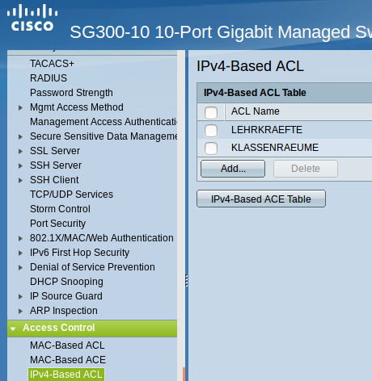

Sie geben dann folgende Werte an:

*    Priorität: 20
*    Aktion: Zulassen (permit)
*    Protokoll: Beliebig (IP) (any)
*    Quell-IP-Adresse: Beliebig (any)
*    Ziel-IP-Adresse: Benutzerdefiniert (user defined)
*    Wert der Ziel-IP-Adresse: 10.16.1.0 (Servernetz-IP)
*    Ziel-IP-Platzhaltermaske: 0.0.0.255 (invertierte Netzmaske)

Danach legen sie eine zweite ACE für die ACL Lehrkraefte an. Im Ergebnis sollten Sie für die Lehrkraefte dann nachstehenden Einträge haben:

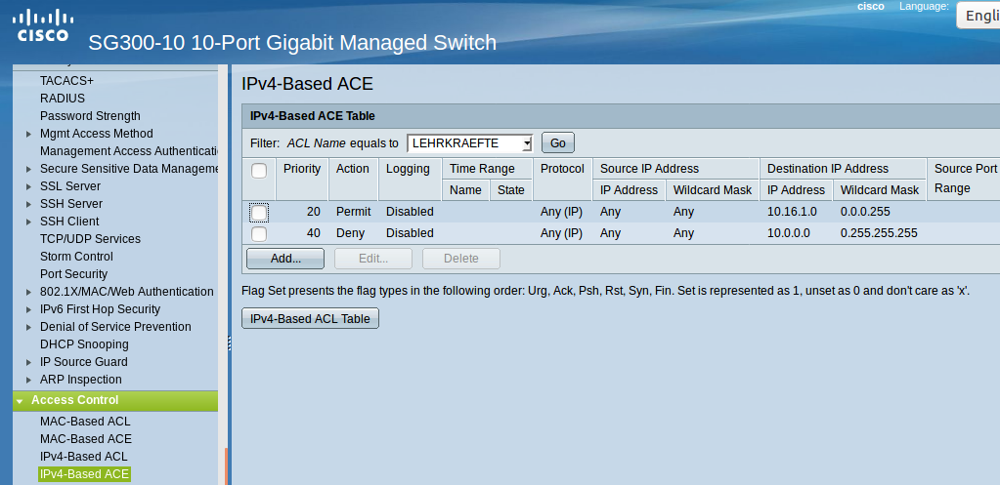

Danach legen Sie ACEs für die ACL Klassenraeume an. Danach sollten Sie nachstehende Einträge haben:

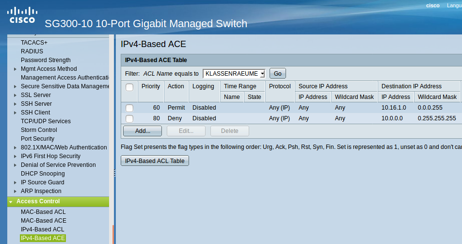

Schliesslich müssen die definierten ACLs noch an die VLANs gebunden werden, damit diese korrekt angewendet werden.
Die Zuordnung sollte für das hier gewählte Beispiel wie folgt aussehen:

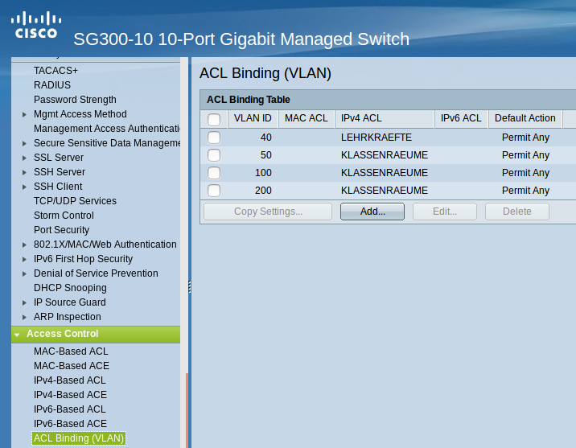

Die Einstellungen für das DHCP-Relaying sollten wie folgt aussehen:

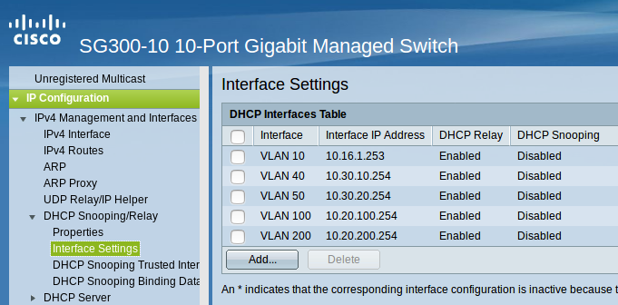

Hierdurch wird sichergestellt, dass DHCp-Anfragen aus den genannten VLANs auch beim linuxmuster.net Server ankommen und bedient werden können.

Um Wake-on-LAN über Subnetze hinweg nutzen, so muss ein sog. UDP-Relaying eingerichtet werden. Hierdruch können dann z.B. Clients via ``linbo-remote`` aufgeweckt werden.

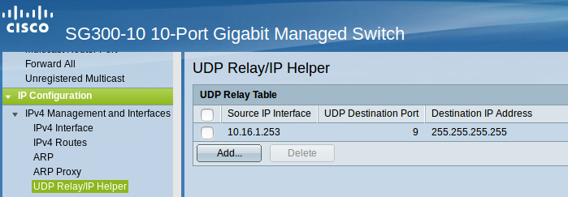

Nachdem Sie alle Einstellungen kontrolliert und ggf. angepasst haben, speichern Sie die aktuelle Konfiguration. Dies erledigen Sie bei dem Cisco-Switch dadruch, dass Sie die Konfiguration aus dem RAM (running-config) auf die NVRAM-Konfiguration kopieren (startup-config).

