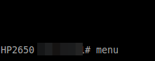
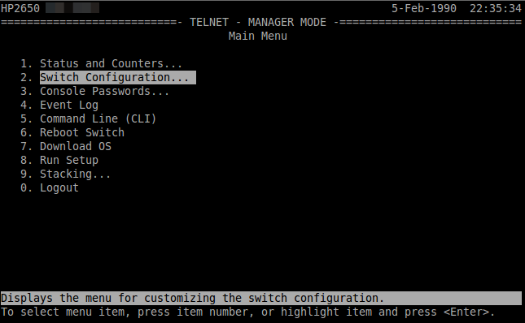
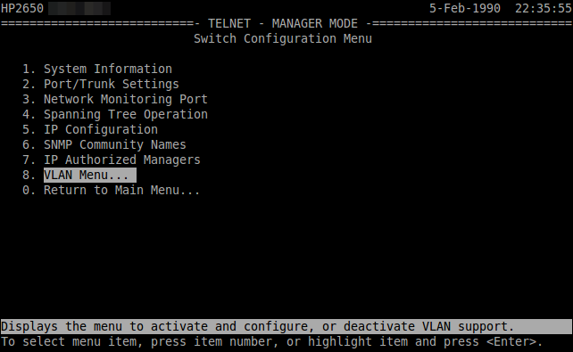
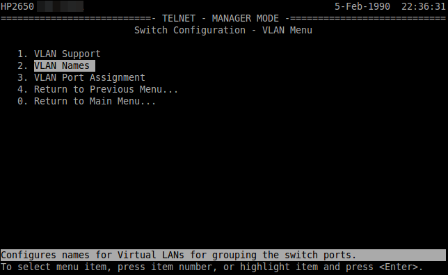

Vorbereitung der Switches im Netzwerk
=====================================

In Vorbereitung auf das Subnetting sind auf allen Switches im Netzwerk (in allen Gebäuden)
die VLANs mit den IDs ``10``, ``20``, ``30``, ``40``, ``50``, ``100``, und ``200`` anzulegen, damit später
die Portkonfiguration aller Switches angepasst werden kann.

Das genaue Vorgehen kann hier nicht umfassend dokumentiert werden, da es auch von Art und Hersteller der Switche abhängt. 

Exemplarisch erfolgt die Darstellung zur Einrichtung der VLANS auf L2-Switches anhand des Modells Hewlett Packard HP 2650. Für andere Modelle sind die Konfigurationsschritte entsprechend anzupassen.

Hewlett Packard HP2650
----------------------

Einige HP-Switches haben eine textbasierte "Menükonsole", hier geht man prinzipiell folgendermaßen vor:

* Mit telnet/ssh auf die Switchkonsole verbinden 
* Das Konfigurationsmenü öffnen
* Nach  ``Switch-Konfiguration``, ``VLAN Menu``, ``VLAN Names`` wechseln und
  dort die VLans mit den IDs ``10``, ``20``, ``30``, ``40``, ``50``, ``100``, und ``200`` anlegen.

.. important::

   Bilder sind noch anzupassen !!

Als VLAN Name ist auf allen Switches ein identischer Name - also z.B. VLAN Server, VLAN WLAN, VLAN DMZ, VLAN Lehrer,
VLAN Gaeste, VLAN Raum100, VLAN Raum200 - für das jeweilige VLAN anzugeben.

.. important::

   Es ist immer das Protokoll 802.1q für die Definition der VLANs anzuwenden. 
   Dies ist ein genormtes Netzwerkprotokoll, das es ermöglicht, sog. tagged VLANs zu definieren.

