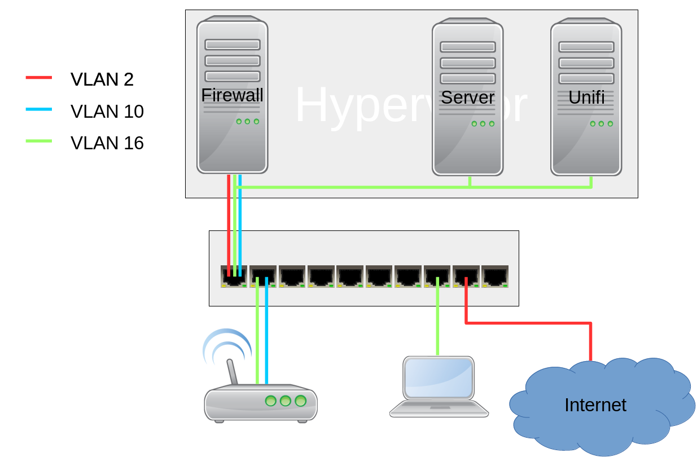
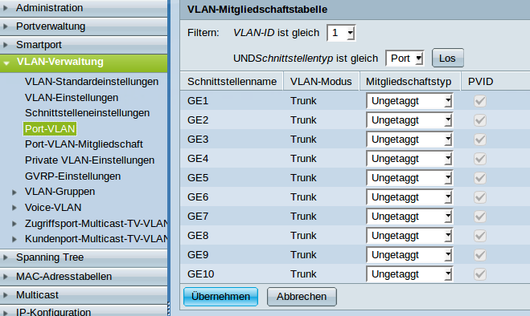
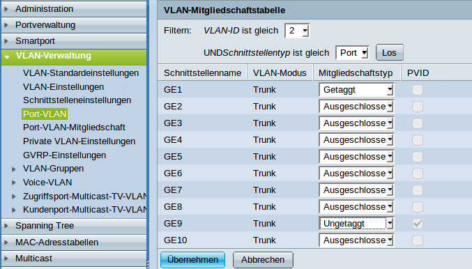
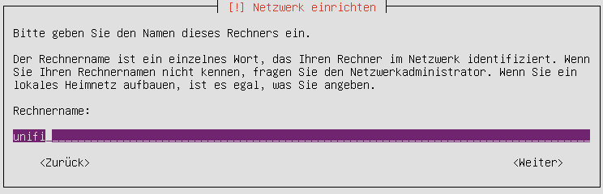
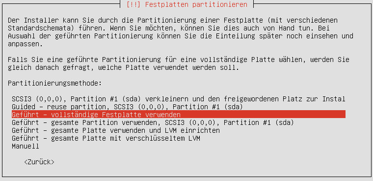
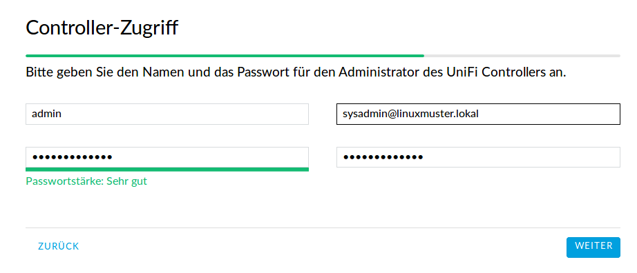
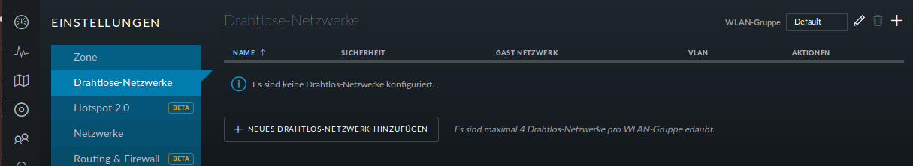
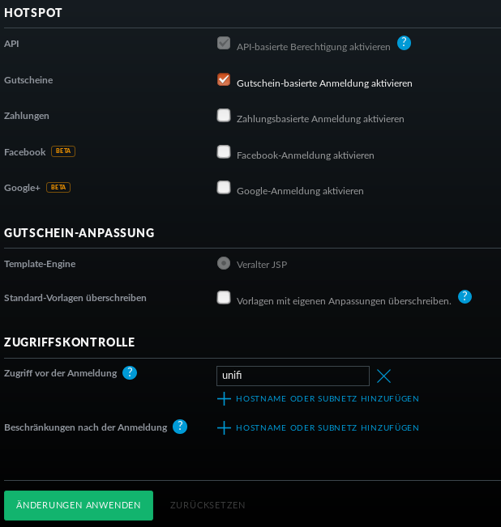
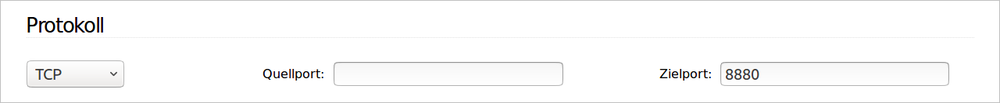

============================
 Eine WLAN-Lösung mit Unifi
============================

Eine WLAN-Lösung für Schulen sollte mindestens zwei WLAN-Netze aufspannen. 

- Das Lehrernetz für schuleigene Geräte, wie Beamer, Laptops oder Chromecasts, und für private Geräte der Lehrer, die auf Beamer und Chromecasts zugreifen wollen.
- Das Schülernetz für Schüler.

In der hier vorgestellten Lösung kommen Accesspoints von Unifi und der kostenlose Unifi-Controller zum Einsatz. 

Die Geräte im Lehrernetz werden in die Datei `/etc/linuxmuster/workstations` aufgenommen. Das Lehrernetz ist ein Teil des Schulnetzes. Damit können sich beispielsweise Benutzer mit einem Schullaptop per WLAN wie gewohnt anmelden und auf ihre Daten zugreifen.

Im Schülernetz müssen sich die Benutzer für das WLAN mit ihrem Benutzernamen und Kennwort anmelden. Über die Schulkonsole kann einem Schüler oder einer Gruppe von Schülern das WLAN freigeschaltet oder gesperrt werden. Eine Verwaltung der Benutzergeräte durch den Netzwerkberater entfällt. 

Die Netztopologie
=================

Sollen 2 WLANs über einen Accesspoint (AP) ausgestrahlt werden, muss mindestens ein Netzwerk ein getaggtes VLAN sein.

Im Beispiel ist der Hypervisor (z.B. Proxmox) mit einem Netzwerkkabel mit dem Switch verbunden. 

Die virtuellen Maschinen sollten somit nicht direkt mit der Netzwerkkarte des Hypervisors verbunden sein. Es muss noch zusätzlich die VLAN-ID angegeben werden.

Im Beispiel werden die Datenpakete des Unifi-Controllers mit der Nummer 16 gekennzeichnet. Man sagt getaggt.

.. figure:: media/vlannetzwerkkarte.png
   :alt: VLAN-Netzwerkkarte

Der Switch
==========

In der hier vorgestellten Lösung wird ein Cisco SG300-10 Switch verwandt. Die Überlegungen lassen sich aber leicht auf andere Switches übertragen.

Grundsätzliches
---------------

Bei vielen Switches ist es unmöglich, sich komplett auszusperren. Der SG300 hat die Konfigurationsspeicher `Ausgeführte Konfiguration` und `Startkonfiguration`. 

In die `Ausgeführte Konfiguration` werden alle Einstellungen gespeichert, die Sie vornehmen. Bei einem Neustart wird als erstes die `Startkonfiguration` in die `Ausgeführte Konfiguration` kopiert und dann die `Ausgeführte Konfiguration` ausgeführt.

Wenn Sie sich also mit einer Einstellung ausgeschlossen haben, starten Sie den Switch einfach neu und Sie haben den zuletzt in die `Startkonfiguration` gespeicherten Stand.

Sobald Sie eine Einstellung vorgenommen haben, die Sie nicht aussperrt, sehen Sie oben neben dem Benutzernamen einen Link zum Speichern der `Aktuellen Konfiguration` in die `Startkonfiguration`.

.. figure:: media/ciscospeichern.png
   :alt: Konfiguartion speichern

VLANs anlegen
-------------

Das VLAN für den Internetzugang hat die VLAN-ID 2, das Schüler-WLAN die VLAN-ID 10 und das Schulnetz die VLAN-ID 16.

.. figure:: media/vlaneinstellungen.png
   :alt: VLAN-Einstellungen

Wählen Sie VLAN-Verwaltung -> VLAN-Einstellungen und klicken auf `Hinzufügen`.

Es öffnet sich ein Dialogfenster, mit dem Sie die VLANs hinzufügen können.

.. figure:: media/vlanadd.png
   :alt: VLAN-Hinzufügen

Fügen Sie die VLANs wie im Bild hinzu.

.. figure:: media/vlans.png
   :alt: VLAN-Übersicht

Sobald alle VLANs hinzugefügt sind, schließen Sie das Fenster. Die VLANs sollten jetzt aufgeführt sein.

Jetzt wäre ein guter Zeitpunkt, um die `Ausgeführte Konfiguartion` zu speichern.

Ausgeschlossen, Getaggt, Ungetaggt und PVID
-------------------------------------------

Für jeden Switchport und für jedes VLAN muss festgelegt werden, ob das VLAN mit der VLAN-ID x ausgeschlossen, getaggt akzeptiert oder Datenpakete, die mit der VLAN-ID x getaggt sind, ungetaggt weitergeleitet werden.

Ausgeschlossen: 
   Datenpakete, die mit der VLAN-ID x getaggt sind, werden verworfen.

Getaggt: 
   Datenpakete, die mit der VLAN-ID x getaggt sind, werden weitergeleitet.

Ungetaggt: 
   Von Datenpaketen, die mit der VLAN-ID x getaggt sind, wird die VLAN-ID entfernt und zum Client weitergeleitet. Die meisten Clients können mit getaggten Datenpaketen nichts anfangen.

PVID: 
   Bie einem Port, der mit der PVID x markiert ist, werden alle ungetaggten Datenpakete des Clients mit der VLAN-ID x getaggt.

Den Ports die VLANs zuweisen
----------------------------

Port 1:  
  Der Hypervisor ist über ein Netzwerkkabel mit Port 1 des Switches 
  verbunden. Der Port 1 ist getaggtes Mitglied der VLANs 2, 10 und 16.

Port 2-5: 
  Die APs sind im Schulnetz und werden über ein ungetaggtes VLAN
  verwaltet. VLAN 16 ist ungetaggt und PVID ist 16.

  Zusätzlich soll das Schüler-WLAN vom AP ausgestrahlt werden. Um es vom Schulnetz zu trennen, muss es getaggt am AP ankommen. VLAN 10 ist getaggt.

Port 7-8: 
  Die Clients sind nur im Schulnetz und arbeiten mit ungetaggten Datenpaketen. VLAN 16 ist ungetaggt und PVID ist 16.

Port 9:
  Auch der Router arbeitet mit ungetaggten Datenpaketen. VLAN 2 ist ungetaggt und PVID ist 2.

Port 10: 
  Über diesen Port wird der Switch gemanaged. Er ist das einzige Mitglied des Standard VLAN 1. Damit ist der Switch weder über das WLAN noch über das Schulnetz managebar.

Schritt für Schritt
-------------------

Wählen Sie VLAN-Verwaltung -> Port-VLAN.

In der Grundeinstellung ist für jeden Port VLAN 1 ungetaggt und PVID 1 eingestellt.

Da der Switch nur über den Port 1 verwaltet wird, verbieten Sie den Ports 1 bis 9 die Mitgliedschaft zu VLAN 1 und bestätigen anschließend mit `Übernehmen`. Man beachte, dass dabei PVID 1 automatisch gelöscht wird.

Nun wählen Sie die VLAN-ID 2 und klicken auf `Los`.

Für Port 1 wählen Sie getaggt und für Port 9 Ungetaggt. Dabei wird PVID automatisch selektiert.

Jetzt ist VLAN 10 an der Reihe.

.. figure:: media/portvlan03.png
   :alt: VLAN10

Für die Ports 1 bis 5 wählen Sie getaggt.

Und schließlich noch VLAN 16.

.. figure:: media/portvlan04.png
   :alt: VLAN16

Da die APs und die Clients im Schulnetz sind, sind die Ports 2 bis 8 ungetaggt und PVID ist gesetzt.

Über `VLAN-Verwaltung` -> `Port-VLAN-Mitgliedschaft` erhält man eine Zusammenfassung.

.. figure:: media/portvlan05.png
   :alt: Zusammenfassung

Jetzt wäre ein guter Zeitpunkt zum Speichern der Konfiguration.

Der Unifi-Kontroller
====================

Die Installation
================

Hardwareanforderungen
---------------------

- 3 GB RAM
- Eine Netzwerkkarte im Schulnetz (VLAN 16)
- 10 GB Festplatte (bei mir im Schulbetrieb sind 3,3 GB vom 40 GB belegt).

Die Grundinstallation
---------------------

Bevor die Installation begonnen werden kann, muss ein Ubuntu-Server 16.04 64-Bit auf dem späteren Unifi-Kontroller installiert werden.

Schritt für Schritt
-------------------

Starten Sie vom Installationsmedium und wählen Sie die Sprache.

.. figure:: media/u01.png
   :alt: Sprachenauswahl

Wählen Sie `Ubuntu Server installieren`.

Bestätigen Sie die Installation in der gewählten Sprache.

Ist der Rechner bereits in `/etc/linuxmuster/workstations`, so ist der Rechnername bereits in der Eingabemaske eingetragen.

Wählen Sie einen Benutzer, seinen Benutzernamen und das Passwort.

Verschlüsseln Sie Ihren persönlichen Ordner **nicht**!

.. figure:: media/u03.png
   :alt: Home verschlüsseln

Wählen Sie `vollständige Festplatte verwenden` und bestätigen Sie die Partitionierung.

Es ist zu empfehlen, `keine automatischen Aktualisierungen` zu wählen, da Sie dann nicht von unerwarteten Aktualisierungen überrascht werden.

.. figure:: media/u05.png
   :alt: Keine Updates

An Software gibt es nichts Besonderes zu wählen.

.. figure:: media/u06.png
   :alt: Softwareauswahl

Beenden Sie die Installation und starten Sie den Rechner neu.

Die Installation der Unifi-Pakete
---------------------------------

Der Rechner muss upgedatet, die Paketquellen müssen ergänzt und das Unifi-Paket installiert werden.

Schritt für Schritt
-------------------

Die englische Anleitung von Unifi finden Sie `hier <https://help.ubnt.com/hc/en-us/articles/220066768-UniFi-How-to-Install-Update-via-APT-on-Debian-or-Ubuntu>`_.

Melden Sie sich an.

öffnen Sie eine root-shell mit `sudo -i`

Updaten Sie den Rechner mit

::

  apt-get update
  apt-get dist-upgrade

Editieren Sie die Datei `/etc/apt/sources.list` und fügen Sie die folgende Zeile hinzu:

::

  deb http://www.ubnt.com/downloads/unifi/debian stable ubiquiti

Fügen Sie den GPG-key hinzu:

::

  apt-key adv --keyserver hkp://keyserver.ubuntu.com:80 --recv 06E85760C0A52C50

Nochmal updaten, unifi installieren und neu starten:

::

  sudo apt-get update
  sudo apt-get install unifi
  reboot

Die Grundkonfiguration
======================

Hier werden die Standardsprache sowie der Adminaccount gewählt und es können die APs aufgenommen werden.

Schritt für Schritt
-------------------

Öffnen Sie von einem Rechner im Schulnetz mit einem Browser `<https://unifi:8443>`_ (falls der Unificontroller in der Datei `workstations` unifi heißt).

Da der Unifi-Kontroller mit einem selbstzertifizierten Zertifikat arbeitet, werden Sie eine Zertifikatswarnung erhalten. 

.. figure:: media/u07.png
   :alt: Sprachenauswahl

Wählen Sie Germany als Land und klicken Sie auf `weiter`.

.. figure:: media/u08.png
   :alt: Geräteauswahl

Wählen Sie die Geräte aus, die Sie mit dem Unifi-Kontroller managen wollen (also alle) und klicken auf `WEITER`.

.. figure:: media/u09.png
   :alt: SSID einrichten

An dieser Stelle überspringen Sie die Einrichtung eines WLANs. Das wird später ausführlich beschrieben.

An dieser Stelle wird ein Administrator-Zugang angelegt.

.. figure:: media/u11.png
   :alt: Cloud

Überspringen Sie auch diesen Schritt.

.. figure:: media/u12.png
   :alt: Bestätigung

Bestätigen Sie schließlich Ihre Einstellungen.

Einrichtung des Lehrer-WLANs
============================

Im Lehrer-WLAN sind alle schuleigenen Geräte und die Geräte der Lehrer. 

So könnte beispielsweise ein Lehrer mit seinem Smartphone eine Aufgabe abfotografieren und zum Beamer schicken. Oder er könnte einen Film per Smartphone direkt über einen Beamer abspielen.

.. attention:: All diese Geräte müssen in die Datei `workstations` aufgenommen sein.

.. hint:: Schülergeräte haben in diesem Netzwerk nichts zu suchen. Denn Schüler sollen nicht in der Lage sein, Filmchen per Handy zu starten.

Schritt für Schritt
-------------------

Öffnen Sie von einem Rechner im Schulnetz den Unifi-Kontroller `<https://unifi:8443>`_ und melden Sie sich an. 

.. figure:: media/u13.png
   :alt: Einstellungen

Klicken Sie unten links auf `Einstellungen`. Gehen Sie auf `drahtlose Netzwerke` .

Es ist bereits eine WLAN-Gruppe `Default` eingerichtet. Die wird Ihnen für den Betrieb in einer Schule ausreichen.

Wie erwartet sind noch keine drahtlosen Netzwerke eingerichtet. Für Ihr erstes WLAN klicken Sie auf `NEUES DRAHTLOSES NETZWERK HINZUFÜGEN`.

.. figure:: media/u15.png
   :alt: Netzwerke hinzufügen

Geben Sie dem Lehrernetz einen Namen (z.B. Lehrer).

Wählen Sie die Verschlüsselung `WPA Personal` und ein Passwort.

Wählen sie **nicht** Gastrichtlinie. Im Schulnetz wollen Sie keine Gäste!

Wenn Sie möchten, verbergen Sie die SSID. Was Schüler nicht sehen, macht sie nicht neugierig.

Speichern Sie die Einstellungen.

Das Lehrernetz ist nun eingerichtet und wird auf alle APs ausgerollt.

Einrichtung des Schüler-WLANs
=============================

Im Schüler-WLAN sind die Geräte der Schüler. Es liegt im blauen Netz des IPFire. Der Netzwerk-Schlüssel des Schüler-WLANs basiert auf ihrem Benutzernamen und ihrem Kennwort.

Schritt für Schritt
-------------------

Installieren Sie auf dem linuxmuster.net-Server das Paket linuxmuster-freeradius. Siehe :ref:`linuxmuster-freeradius-label`

Melden Sie sich am Unifi-Kontroller an `<https://unifi:8443>`_.

Gehen Sie zu `Einstellungen` -> `Profile` -> `NEUES RADIUS-PROFIL ERSTELLEN`.

.. figure:: media/u17.png
   :alt: Radiusprofil

Geben Sie dem neuen Radius-Profil einen Namen.

Tragen Sie bei `Radius-Authentifikationsserver` die IP-Adresse des linuxmuster.net-Servers und das Passwort für die APs ein.

Speichern Sie die Einstellungen.

Gehen Sie zu `Einstellungen` -> `Drahtlose-Netzwerke` -> `NEUES DRAHTLOSES NETZWERK HINZUFÜGEN`.

.. figure:: media/u16.png
   :alt: Schülernetz

Geben Sie dem Schüler-WLAN einen Namen.

Sicherheit ist `WPA Enterprise`.

Wählen Sie das vorher definierte Radius-Profil.

Da das blaue Netz des IPFire als getaggtes VLAN mit der VLAN-ID 10 zu den APs kommt, setzen Sie ein Häkchen bei VLAN und geben die VLAN-ID 10 ein.

Speichern Sie die Enstellungen.

Das Schüler-WLAN wird jetzt an die APs ausgerollt.

Gast-WLAN mit Gutschein / Voucher
==================================

Unifi unterstützt auch WLAN-Gutscheine (WLAN-Voucher).

.. figure:: media/voucher01.png
   :alt: Voucherbeispiel

Bei einem WLAN-Gutschein meldet man sich, wie in einigen Hotels, an einem unverschlüsselten Gästenetz an und wird auf eine Anmeldeseite umgeleitet. Dort gibt man einen Gutschein-Code ein.

Der Unifi-Controller unterstützt zwei Arten von Gutscheinen:

Einmaliger Gebrauch:
   Der Gutschein-Code ist nur für ein Gerät gültig. Nach der Anmeldung kann man mit seinem Gerät so lange ins Internet, bis der Gutschein abgelaufen ist. Das Gerät kann sich in dieser Zeit unbegrenzt mit dem Gäste-WLAN neu verbinden.

Mehrmaliger Gebrauch:
   Der Gutschein-Code ist für beliebig viele Geräte gültig. Sobald sich das erste Gerät mit dem Gutschein-Code angemeldet hat, beginnt die Gültigkeit des Gutscheins abzulaufen. Solche Gutscheine eignen sich beispielsweise für VHS-Kurse, die keine Accounts im Schulnetz haben.

Schritt für Schritt
-------------------

Melden Sie sich an und gehen Sie auf `Einstellungen` -> `Gastkontrolle`.

.. figure:: media/voucher02.png
   :alt: Gastrichtlinien

Im Bereich Gastrichtlinien setzen Sie ein Häkchen bei `Gastzugang aktivieren`.

Bei `Authentifizierung` wählen Sie `Hotspot`. 

Hat `HTTPS-Umleitung aktivieren` ein Häkchen, so werden Clients auch dann umgeleitet, wenn Sie auf HTTPS-Seiten surfen. Leider erhält man dann eine Zertifikatswarnung, da der Unifi-Kontroller mit einem selbstsignierten Zertifikat arbeitet. Allerdings leiten viele Betriebsysteme von selbst auf das Gastportal um.

.. figure:: media/voucher03.png
   :alt: Portal-Anpassung

In der Portal-Anpassung wählen Sie die Template-Engine AngularJS und fügen die Sprache Deutsch hinzu.

Den Rest der Einstellungen können Sie so lassen.

Unter `HOTSPOT` setzen Sie ein Häkchen bei Gutscheine.

In der `Zugriffskontrolle` müssen Sie den Zugriff auf den Unifi-Kontroller noch vor der Anmeldung erlauben, da man sonst nicht auf die Anmeldeseite kommt.

Gehen Sie auf `ÄNDERUNGEN ANWENDEN`. Damit werden die Änderungen gespeichert und auf die APs ausgerollt.

Firewall-Regeln für den IPFire
------------------------------

Damit die Clients überhaupt auf den Unifi-Kontroller zugreifen können, muss eine neue Firewallregel für den IPFire angelegt werden:

Schritt für Schritt
-------------------

Öffnen Sie den IPFire `<https://ipfire:444>`_ und melden Sie sich an.

Gehen Sie auf `Firewall`->`Firewallregeln`.

Wahlen Sie `Neue Regel erstellen`.

.. figure:: media/ipf03.png
   :alt: IPFire-Regel

Machen Sie die folgenden Eingaben:

Quelle:
   Standard-Netzwerk: BLAU

Ziel:
   Zieladresse: `IP-Adresse des Unifi-Kontrollers`

Protokoll:
   Alle

Weitere Einstellungen:
   Setzen Sie einen Haken bei `Regel aktivieren`.

Speichern Sie die Regel mit `Hinzufügen` und vergessen Sie nicht, die Änderungen zu übernehmen.

Bemerkung
---------

Statt alle Protokolle zu erlauben, reicht es, die Zielports 8880 und 8443 freizugeben. Dazu müssen Sie für jeden Port eine Regel definieren.

.. figure:: media/ipf02.png
   :alt: Port 8443
 

WLAN-Gutscheine / Voucher erstellen
===================================

Jetzt müssen die Gutscheine noch erzeugt und ausgedruckt werden.

Schritt für Schritt
-------------------

Gehen Sie auf `<https://unifi:8443/manage/hotspot>`_ und melden Sie sich an. 

.. figure:: media/voucher05.png
   :alt: Voucherbeispiel

Gehen Sie auf `GUTSCHEINE`->`GUTSCHEIN ERSTELLEN`.

.. figure:: media/voucher06.png
   :alt: Voucherbeispiel

Füllen Sie die Felder des Dialogfensters aus und speichern Sie Ihre Eingabe.

.. figure:: media/voucher07.png
   :alt: Voucherbeispiel

In dieser Ansicht sehen Sie alle gültigen Gutscheine. 

Sie haben die Möglichkeit, einzelne Gutscheine, alle nicht benutzten Gutscheine oder alle Gutscheine, die an einem bestimmten Zeitpunkt erstellt wurden, zu drucken.

Hier können Sie auch Gutscheine löschen.

