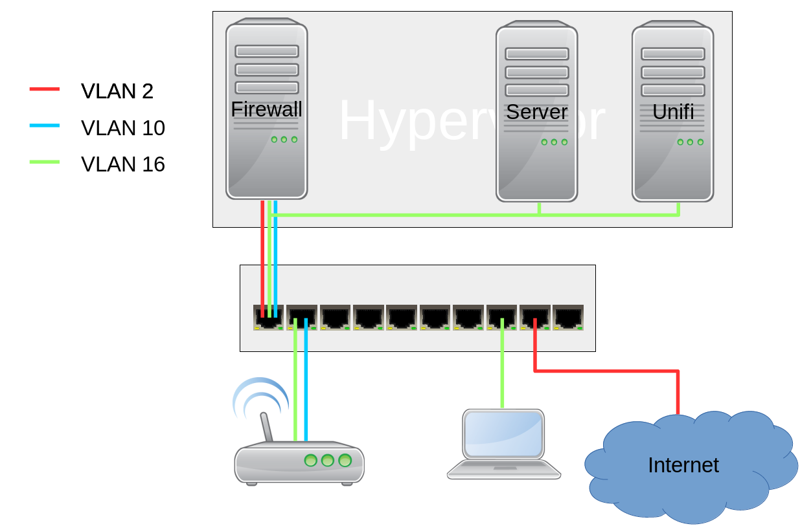
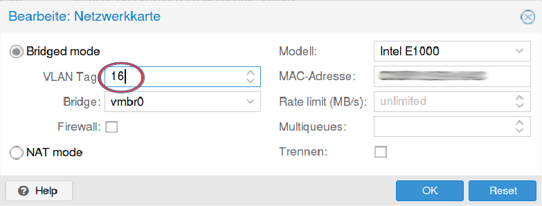

Die Netztopologie
=================

Sollen 2 WLANs über einen Accesspoint (AP) ausgestrahlt werden, muss mindestens ein Netzwerk ein getaggtes VLAN sein.

Im Beispiel ist der Hypervisor (z.B. Proxmox) mit einem Netzwerkkabel mit dem Switch verbunden. 

Die virtuellen Maschinen sollten somit nicht direkt mit der Netzwerkkarte des Hypervisors verbunden sein. Es muss noch zusätzlich die VLAN-ID angegeben werden.

Im Beispiel werden die Datenpakete des Unifi-Controllers mit der Nummer 16 gekennzeichnet. Man sagt getaggt.

